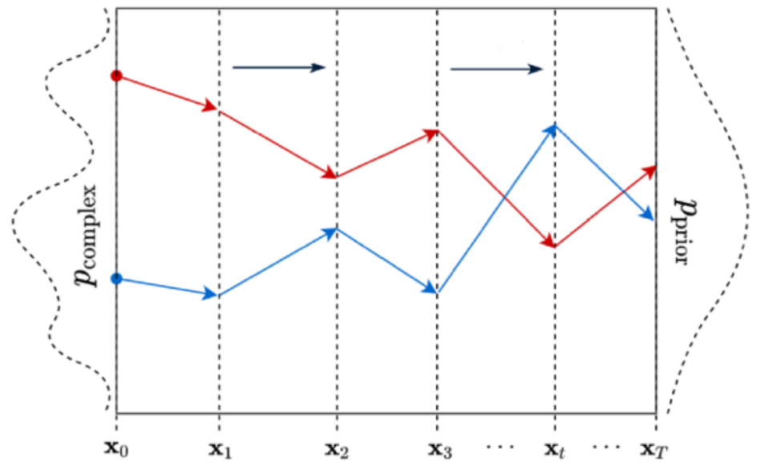
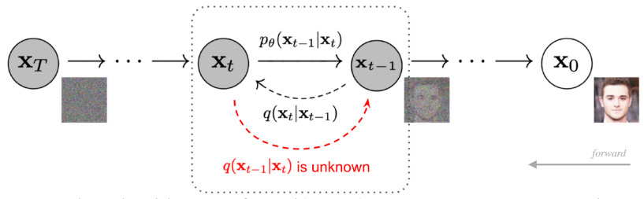
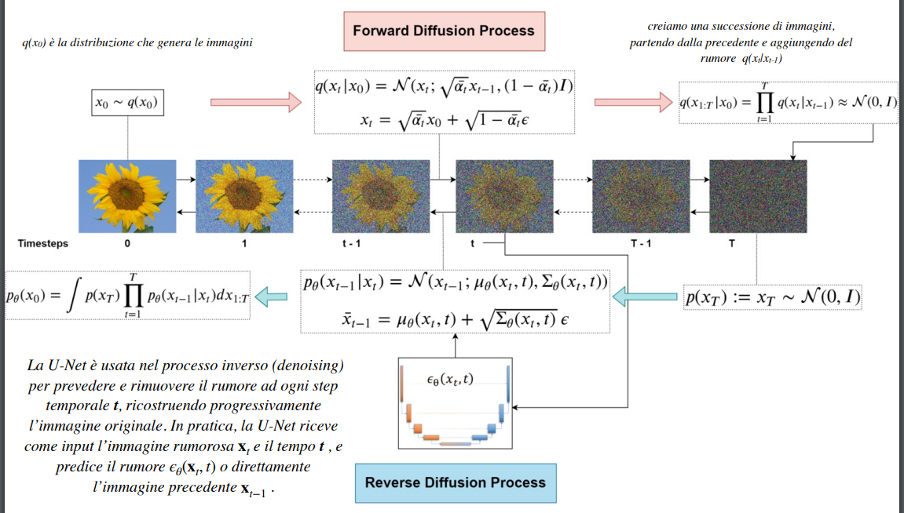

# 10 Dicembre

Tags: Diffusion Models, Forward Diffusion, Reverse Diffusion
.: No

## Diffusion Models

I `diffusion-models` generano nuovi dati invertendo il processo di diffusione che ha causato la perdita di informazione dovuta al rumore. In sostanza è una classe di modelli generativi probabilistici che trasformano il rumore in un campione di dati rappresentativo.

Questi modelli hanno ottenuto prestazioni superiori rispetto alle `GAN`, in sostanza convertono una distribuzione in una target, perciò lo stato in un certo step dipende unicamente dallo stato nello step precedente.

Vengono rappresentati con processi stocastici simili alle catene di Markov, che iterativamente convertono una distribuzione in un’altra.

Si possono generare nuove istanze in 2 modi:

- `incondizionato`: il modello converte il rumore in un qualsiasi campione di dati rappresentativo casuale. Il processo di generazione non è controllato o guidato e il modello può generare un’immagine di qualsiasi natura.
- `condizionato`: sono fornite informazioni aggiuntive tramite testo o etichette di classe che guidano la generazione.

L’obiettivo è definire un `forward-diffusion-process` (anche un `reverse-diffusion-process`) che converte qualsiasi distribuzione complessa di dati in una distribuzione semplice e trattabile, per poi stimare una inversione di tale processo che definisce la distribuzione del modello generativo cercato. L’idea è quindi di rimuovere gradualmente il rumore dall’immagine, cioè capire come è stato aggiunto in modo da poterlo rimuovere.

## Forward Diffusion

A partire da un dataset di training, lentamente e iterativamente si aggiunge rumore alle istanze, in modo da allontanarle dal sottospazio di appartenenza. Alla fine del processo le immagini saranno del tutto irriconoscibili, la distribuzione dei dati è completamente trasformata in una distribuzione nota; in sostanza ogni immagine sarà mappata in un sottospazio esterno al sottospazio iniziale ma con una distribuzione più semplice da campionare e rappresentare.

In questa immagine viene mostrato che si sta modificando la distribuzione più volte.

Si può decidere a piacimento il numero di step, quanto rumore aggiungere, che tipo di rumore e la distribuzione dei parametri del rumore.

## Reverse Diffusion

Una volta che si ottiene la distribuzione desiderata, si parte dallo spazio target per capire come tornare al sottospazio dei dati di origine. Si fa notare che ci sono infiniti modi per farlo ma solo una piccola parte riporterà al sottospazio corretto.

Si ripetono piccoli passi, come quelli compiuti per il `FDK` per modificare la `probability-density-function`, cioè si utilizza un modello basato su reti neurali per stimare i parametri del `PDF` del processo forward.

## Formalizzazione dei diffusion models

- `forward-diffusion-kernel` $q(x_t|x_{t-1})$: definisce la `probability-density-function` di un’immagine al passo $t$ del forward diffusion $x_t$ data l’immagine $x_{t-1}$. In sostanza sarebbe la funzione di transizione per passare dalla densità di probabilità di $x_{t-1}$ alla densità di probabilità di $x_t$.
- `reverse-diffusion-kernel` $p_{\Theta}(x_t|x_{t-1})$: rappresenta la densità di probabilità di $x_{t-1}$ data $x_t$, parametrizzata su $\Theta$, cioè i parametri della distribuzione per ritornare per gli step inversi. Questa funzione è stimata da una rete neurale durante il training.

---

## Forward Diffusion formalizzazione

$$
q(x_1,...,x_T|x_0)=\prod_{t=1}^{T}q(x_t|x_{t-1})
\\

$$

La distribuzione $q$ è definita come catena di `Markov`. La `PDF` del forward process è il prodotto delle singole distribuzioni a partire dal primo step $t=1$ fino a $T$.

$$
q(x_t|x_{t-1})=\mathcal{N}(x_t;\sqrt{1-\beta_t}\cdot x_{t-1},\beta_t\cdot I)
$$

Dove una singola distribuzione è definita in questo modo. Tutte le immagini rumorose intermedie sono chiamate latenti. La dimensione degli spazi latenti è la stessa dell’immagine originale.

Di seguito sono spiegati alcuni termini che vengono utilizzati con $\beta$ e $I$:

$$
\mu=\sqrt{1-\beta_t}\cdot x_{t-1}
$$

L’immagine al passo $t$ è campionata da una distribuzione normale con parametri $\mu$, cioè media dipendente dai valori dell’immagine al passo precedente che si presume noti

$$
\sigma^2=\beta_t\cdot I
$$

La $I$ rappresenta la matrice di identità e $\beta_t\cdot I$ è la matrice di covarianza cioè la distribuzione del rumore nelle diverse parti dell’immagine è indipendente l’una dall’altra.

- Il `tasso di diffusione` $\beta$ è stimato impiegando un `variance-scheduler` che determina quanto rumore aggiungere, questo è un valore compreso tra 0 e 1 e garantisce che $x_T$ sarà basato su una gaussiana isotropa.

$$
x_t=\sqrt{1-\beta_t}\cdot x_{t-1}+\sqrt{\beta_t}\cdot \epsilon
$$

Ad ogni step per ottenere una immagine  “corrotta” $x_t$ da $x_{t-1}$, si una somma pesata e scalata mediante il fattore $\beta_t$. Dove $\epsilon\sim \mathcal{N}(0,I)$ 

## Reverse Diffusion formalizzazione

$$
p_\theta(x_{0:T})=p(x_T)\prod_{t=1}^{T}p_{\theta}(x_{t-1}|x_t)
$$

SI utilizza la stessa forma funzionale, cioè con distribuzione gaussiana e con un processo simile partendo da questa formula, con $p(x_T)=\mathcal{N}(x_T; 0, I)$

$$
p(x_{t-1}|x_t)
$$

Se si riuscisse questa distribuzione condizionale sarebbe possibile invertire il processo e partire da un campione di rumore $x_T$ e rimuovere gradualmente il rumore fino a ottenere un’immagine dalla distribuzione dei dati reali $x_0$

$$
p(x_{t-1}|x_t)\\
\downarrow\\ 
p_{\theta}(x_{t-1}|x_t)
$$

Il problema è che non si conosce questa distribuzione, ma si cerca comunque di stimarla utilizzando una rete neurale, utilizzando invece della distribuzione originale sconosciuta una distribuzione parametrica

$$
\mathcal{N}(x_{t-1};\mu_\theta(x_t,t), \Sigma_\theta(x_t,t))
$$

Visto che si usano distribuzioni gaussiane si esprime $p_\theta(x_{t-1}|x_t)$ in questo modo, dove la parte condizionale deriva dalla dipendenza di $\mu$ e $\Sigma$ dei dati del passo precedente $x_t$.

Si può fare un’ipotesi e rendere il modello più semplice decidendo che la varianza non è un parametro che la rete deve apprendere.

In questa immagine viene mostrato il processo completo.