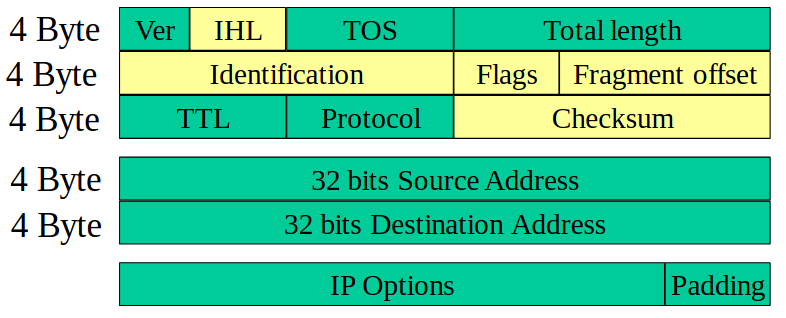
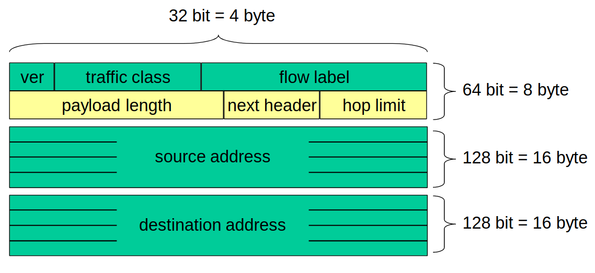

# 10 Gennaio

Argomenti: IPv6, Indirizzi Unicast
.: Yes

## IPv6 - formato del pacchetto e indirizzamento

In giallo sono evidenziati i campi che non sono più presenti in `IPv6`.

- `IHL`: (Internet Header Length) Non c’è più perche adesso l’header ha sempre la stessa lunghezza
- `Identification`,`Flags`,`Fragment offset`: spariscono perchè non si fa più frammentazione sui router. La frammentazione è utile farla solo nell’end system di partenza

Questo è l’header `IPv6`

## Tipologie di indirizzi

`IPv6` suddivide gli indirizzi in:

- `unicast`: indirizzi di nodi
- `multicast`: indirizzi di gruppi di nodi
- `anycast`: indirizzi di servizi

Gli indirizzi di broadcast in questo protocollo sono stati eliminati.

## Indirizzi unicast

`unspecified`: indica l’assenza di indirizzo, corrisponde alla `0.0.0.0` in `IPv4`

`loopback`: identifica il nodo stesso ed è come `127.0.0.1` in `IPv4`

- `IPv4-compatible`: serve a inserire indirizzi IPv4 in indirizzi IPv6
- `IPv4-mapped`: permettono di definire indirizzi IPv6 per nodi che supportano solo IPv4, utilizzati per la transizione IPv4-IPv6
- `scoped`:
    - `link local`: per link si intende una rete fisica unica, fornisce ad ogni nodo un indirizzo IPv6 per iniziare le comunicazioni
    - `site local`: per site si intende un gruppo di link gestiti da un’unica autorità, può essere usato soltanto fra nodi dello stesso site.
- `unique local`: simili agli indirizzi site local, ma “quasi” globalmente univoci
- `aggregatable global`: analoghi agli indirizzi IPv4 pubblici

---

## Indirizzi Multicast

In IPv6 non esite il broadcast e il multicast è usato al suo posto sopratutto nei link locali. Invece di mandare a tutti quanti ne manda solo a uno specifico gruppo

---

## Indirizzi anycast

Gli indirizzi anycast non sono distinguibili dagli indirizzi unicast, indicano il server più vicino ad un mittente