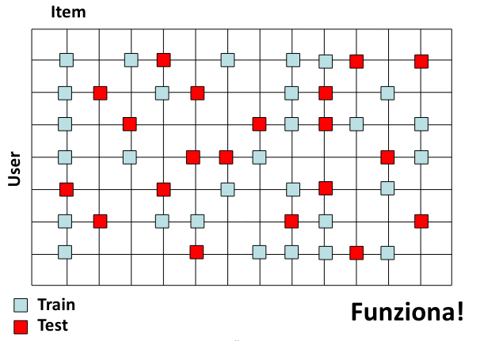

# 10 Giugno

Argomenti: Metriche di Valutazione, Normalized Discounted Cumulative Gain, Valutazione dei Recommender System
.: Yes
Description: Collaborative Filtering

## Valutazione dei RS

Per valutare un `recommender-system` bisogna controllare quanto è preciso nell’aiutare l’utente a trovare trovate “buoni” item. Prima di mostrare i vari modi in cui viene valutata l’accuratezza si assume che se un utente può esaminare tutti gli item disponibili li potrebbe elencare in ordine di preferenza. La valutazione dell’accuratezza può avvenire in più modi:

- `value-comparison`:  misurare quanto il sistema è in grado di predire il valore esatto di rating dell’utente target
- `relevant-vs-non-relevant`: misurare quanto il sistema è in grado di predire se l’item è rilevante o meno per l’utente target
- `ordering-comparison`: misurare quanto il ranking degli item predetto dal sistema è vicino al ranking reale dell’utente target

La valutazione di un recommender system viene eseguita con i seguenti passi:

- raccogliere i valori di rating user-item, e suddividere i dati disponibili in train-set e test-set
- costruire un modello sui dati di training
- confrontare i valori predetti recommender system, occorre quindi una `metrica` per confrontare i valori predetti di rating con i valori reali di rating

## Suddivisione dei dati

una volta raccoli i valori di rating user-item la suddivisione deve essere più “sparsa” possibile come mostrata nell’immagine

## Metrica di valutazione

- `Root-Mean-Square-Error`: si calcola la media del quadrato delle differenze e poi di fa la radice quadrata
    
    $$
    RMSE(r^*)=\sqrt{\dfrac{1}{|R_{test}|}\cdot\sum_{r_{ui}\in R_{test}}\left(r^*_{ui}-r_{ui}\right)^2}
    $$
    
- `Normalized MAE`: sarebbe il MAE diviso per l’intervallo dei possibili rating. con questa metrica è possibile in tal modo confrontare fra loro i risultati ottenuti su dataset differenti, che hanno differenti scale di rating.
    
    $$
    NMAE(r^*)=\dfrac{1}{|R_{test}|\cdot \left(r_{max}-r_{min}\right)}\cdot\sum_{r_{ui}\in R_{test}}|r^*_{ui}-r_{ui}|
    $$
    

## Relevant vs Non-Relevant

Per calcolare `precision` e `recall` la scala di rating deve essere binaria sennò bisogna trasformala in binaria:

- `precision`: rapporto fra gli item rilevanti restituiti dal recommender system e il numero totale di item restituiti dal recommender system $(N_{rs}/N_s)$
- `recall`: rapporto fra gli item rilevanti dal recommender system e il numero totale di item rilevanti presenti in catalogo $(N_{rs}/N_r)$

Per calcolare i valori di precision non di un singolo utente $u$ ma per l’intero insieme di utenti $U$, si suddividono i rating in train-set e test-set e si denota con $T(u)$ gli item che sono stati valutati high da $u$ e sono nel test-set. Si denota con $L(u)$ la recommendation list per $u$. $L(u)\cap T(u)$ è detto `hit-set`.

$$
P(L)=\dfrac{1}{|U|}\cdot \sum_{u\in U}\dfrac{|L(u)\cap T(u)|}{L(u)}
$$

La `precision` si calcola in questo modo

$$
R(L)=\dfrac{1}{|U|}\cdot \sum_{u\in U}\dfrac{|L(u)\cap T(u)|}{T(u)}
$$

La `recall` si calcola in questo modo

$$
F_1=\frac{2PR}{P+R}
$$

Si possono combinare queste 2 metriche per la $F_1$-score

Solitamente i recommender system tentano di massimizare la precision piuttosto che la recall, infatti l’utente è interessato per lo più a ricevere un numero limitato di buone raccomandazioni piuttosto che a conoscere tutti gli item rilevanti. In generale è molto più difficile formulare raccomandazioni precise che ottenere alti valori di recall.

Il problema è che per calcolare `precision` e `recall` occorre sapere quali item sono `rilevanti` e `non rilevanti`, questa cosa è diffile saperla se ci sono milioni di item.

- `recall`: è la più difficile da stimare perché occorre conoscere tutti gli item rilevanti nel dataset
- `precision`: leggermente più semplice da stimare perché ocorre conoscere quanti dei prodotti selezionati sono rilevanti, lo si può chiedere all’utente dopo la raccomandazione.

## Ordering Comparison: NDCG

Dato un set di query $Q$, sia $R(j,m)$ il valore di rilevanza che valutatori umani hanno attribuito all’item in posizione di indice $m$ per la query $j$.

$$
NDCG(Q,k)=\dfrac{1}{|Q|}\sum_{j=1}^{|Q|}Z_{kj}\cdot\sum_{m=1}^{k}\dfrac{2^{R(j,m)}-1}{log_2(1+m)}
$$

Il ranking è calcolato ordinando gli item per valore descrescente del rating predetto

Il valore di $R(m,j)$ vale 1 se rating è maggiore di 3 in caso contrario vale 0. $Z_{kj}$ è un fattore di normalizzazione calcolato in modo tale che l’`NDCG` di un ranking perfetto sui $k$ top serach result per la query $j$ sia 1