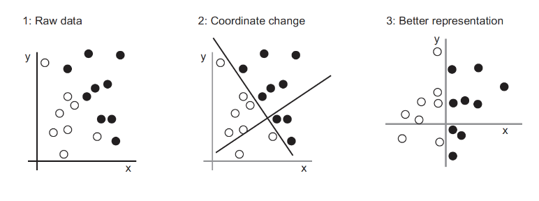
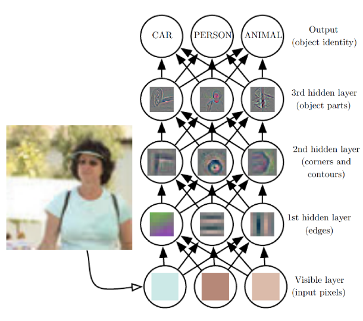
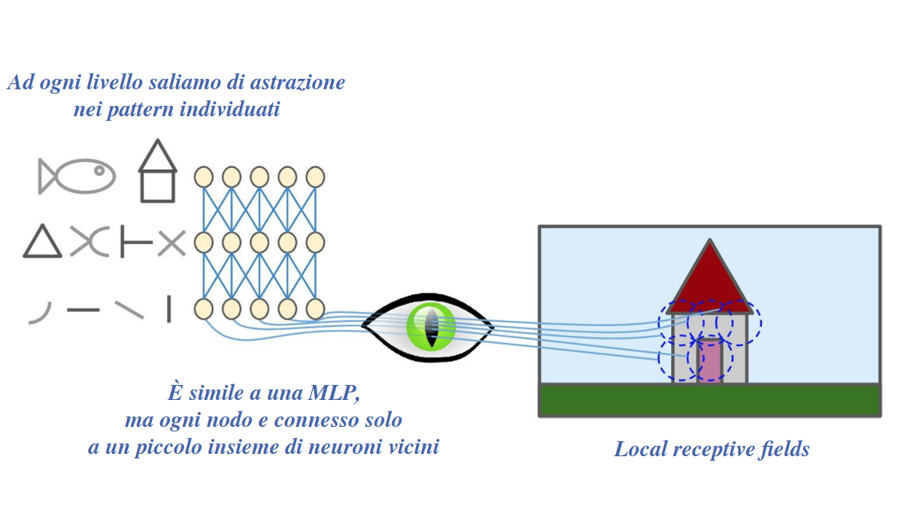
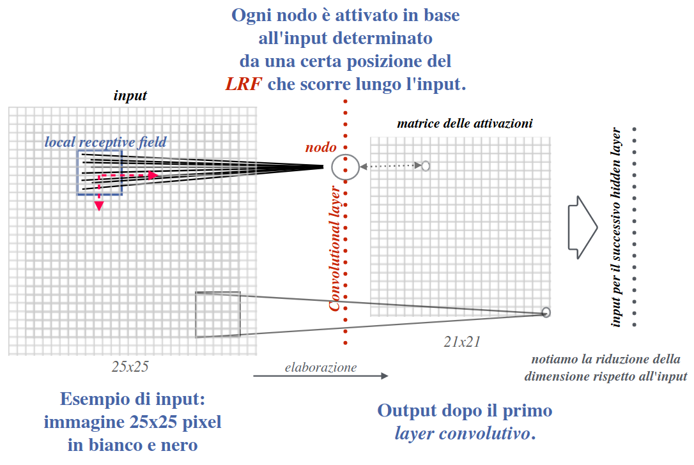

# 10 Giugno

Argomenti: Autoencoders, Convolutional neural network, Curse of Dimensionality, Disentangled Representation Learning, Local constancy prior / Smoothness prior
.: No

## Introduzione al Deep Learning

Il `DL` è stato pensato come insieme di processi ed elaborazioni utili ad identificare in modo automatico tali trasformazioni e riutilizzare in vari tasks.

## Disentangled Representation Learning

La `DRL` è una forma di apprendimento che mira ad estrarre caratteristiche o attributi di alto livello dai dati disponibili identificando i `fattori di variazione`, cioè una serie di caratteristiche che sono responsabili delle variazioni osservate nei dati in input. Si cerca quindi di comprendere le potenziali correlazioni tra caratteristiche e dati osservati, sopratutto in scenari real-world.

Una volta identificati i `fattori di variazione` in un certo dominio è più facile riutilizzarli in domini diversi, dove tali fattori possono essere ancora rilevanti per il task di interesse, questo processo è chiamato `transfer-learning`.

La fase di addestramento risulterà più veloce, e serviranno molti meno dati per identificare fattori aggiuntivi, poichè potremmo sfruttare i fattori già appresi in domini simili

## DL autoencoders

Gli autoencoders sono composti da un `encorder` e un `decoder`, vengono usati per identificare i fattori di variazione per poi prendere l’encoder e utilizzarlo per fare `transfer-learning`.

- `encoder`: costruisce una rappresentazione con dimensionalità ridotta
- `decoder`: ricostruisce l’input a partire da tale rappresentazione

Si ottiene uno `spazio latente` compatto in cui sono rappresentate le caratteristiche salienti.

## Deep Learning

Sono architetture su `reti neurali` che seguono un approccio di `representation-learning`. 

Tipicamente gli input vengono elaborati con pipeline dove si estraggono caratteristiche via via più ad alto livello. Tali caratteristiche saranno impiegate a valle dell’architettura per produrre l’output desiderato.

Il DL è motivato dall’incapacità degli algoritmi tradizionali di generalizzare bene su certi compiti, o di rendere le architetture sufficientemente specifiche senza impiegare troppe risorse.

## Curse of Dimensionality

Incrementando le dimensioni nello spazio delle istanze in input, il numero di istanze che ci occorrono per avere un campionamento dei dati sufficiente per addestrare un algoritmo di ML cresce esponenzialmente. Ogni caratteristica ha un intervallo di valori ammissibili, e richiederà un certo numero di istanze per poter campionare significativamente l’intero intervallo.

$$
d(p,q)=\sqrt{\sum_{i=1}^{n}\left(p_i-q_i\right)^2}
$$

Ogni dimensione aggiuntiva corrisponde ad un valore non negativo addizionale nel calcolo della distanza tra 2 istanze

La `sparsità` della feature space aumenta, se il numero di istanze in input, o le dimensioni della features space, sono troppo elevate non ci sono abbastanza risorse di calcolo per processarle.

## Prior beliefs

Le `prior` sono proprietà che rendono lo spazio delle istanze da esplorare più facile da trattare. Gli algoritmi di ML sfruttano le `priors` per generalizzare, costruendo distribuzioni di probabilità sui parametri, e perciò sulle funzioni che si vogliono stimare. La `local constancy prior` è la più nota

## Local constancy prior / Smoothness prior

La `prior` sui dati a livello spaziale è fondamentale perchè ci permette di generalizzare

$$
f^*(\bold x)=f^*(\bold x+\epsilon)
$$

Questa proprietà dice che se si hanno 2 istanze che si etichettano con la stessa classe, molto probabilmente nello spazio devono stare più o meno vicine.

Detto in un altro modo, se si prende un punto e gli si da una certa variazione deve essere classificata nello stesso modo (se si parla di classificazione, ma il ragionamento può essere generalizzato). Molti algoritmi ML sfruttano questa proprietà per garantire la generalizzazione per esempio il `k-nearest neighbors` (i punti che sono situati vicini producono lo stesso output)

La `universal-approximation` è un teorema che dice che qualsiasi funzione in $\mathbb{R}^n$ che si vuole stimare esiste una rete neurale che l’approssima.

---

## L’architettura della Visual cortex

E’ stato dimostrato che molti neuroni nella parte di corteccia occipitale possiedono un `Local receptive field (LRF)`, cioè reagisono agli stimoli situati in regioni circoscritte del campo visuale.

Alcuni neuroni si specializzano e si attivano solo in presenza di linee orizzontali, altri sono con quelle verticali, ecc. Alcuni neuroni hanno `LRF` più estesi e si attivano in presenza di certe configurazioni spaziali di caratteristiche a basso livello. Si deduce che l’attivazione di neuroni ad alto livello è basata sull’output di neuroni a basso-livello ritenuti vicini tra loro.

Aumentando la complessità, e ripetendo più volte in cascata i passi riportati, si possono apprendere `patterns visuali` anche molto `complessi`.

## Permutation invariance

La `permutation invariance` è una proprietà di funzioni matematiche o algoritmi per la quale l’output rimane costante anche quando l’ordine delle caratteristiche in input varia. L’obiettivo dell’invarianza è che ogni attributo sia codificato in modo invariante rispetto ai cambiamenti di altri attributi.

I neuroni specializzati sono attivati se il pattern da identificare è localizzato in una certa zona, ma si vorrebbe poter identificare lo stesso pattern indipendente dalla sua posizione.

## Convolutional neural networks

Il layer $H$ che viene introdotto prende il nome di `convolutional-layer` e le reti basate su tali layer si chiamano `CNN`.

La matrice di pesi che si impiega scorrendo il `LRF` è chiamato `kernel` o `filtro`, e si considera uguale per tutte le posizioni della `LRF`.

Il `kernel` permette di identificare caratteristiche salienti, cosa che veniva fatta manualmente in molti approcci ML. Si utilizzano piu layer convolutivi alternati a non linearità per rappresentare caratteristiche più complesse e ad alto livello.