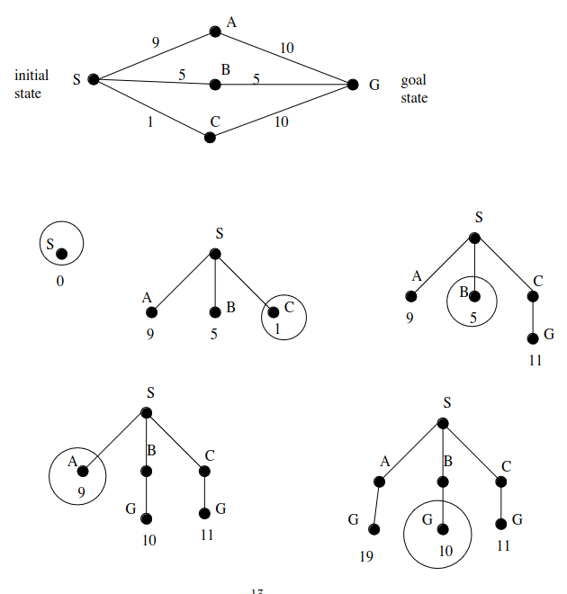

# 10 Ottobre

Argomenti: Algoritmo generale di ricerca, Ricerca a costo Uniforme, Ricerca in Ampiezza, Ricerca in Profondità, Ricerca in Profondità limitata, Ricerca per approfondimenti successivi
.: Yes

## Strategie di ricerca non informata

Queste strategie non ricevono nessuna informazione su quanto uno stato sia vicino all’obiettivo. Nella `Ricerca in Ampiezza` si procede come segue:

- si espande il nodo radice
- si espandono i nodi generati dalla radice
- si espandono i loro successori e cosi via.

---

## Ricerca in Ampiezza

```jsx
function BREADTH-FIRST-SEARCH(problem) returns a solution or failure

fringe <- MAKE-QUEUE(MAKE-NODE(INITIAL-STATE[problem]))
loop do
		if EMPTY?(fringe) then return failure
		node <- REMOVE-FRONT(fringe)
		if GOAL-TEST(problem, STATE[node]) then return SOLUTION(node)
    // aggiunta in coda alla lista
		fringe <- ENQUEUE-AT-END(fringe, EXPAND(node,OPERATORS(problem)))
end
```

- `completezza`: si
- `ottimalità`: se e solo se:
    
    $$
    depth(n)<depth(m) \Rightarrow path\_cost(n) \le path\_cost(m)\\
    depth(n)=depth(m) \Rightarrow path\_cost(n) = path\_cost(m)
    $$
    
- `complessità in tempo`: $O(b^d)$ dove $b$ rappresenta il fattore di ramificazione dell’albero, in pratica ogni nodo ha al massimo $b$ figli; $d$ rappresenta la lunghezza minima di un cammino dal nodo iniziale alla soluzione.
- `complessità in spazio`: $O(b^d)$ perchè tutte le foglie dell’albero devono essere conservate in memoria.

---

## Ricerca a costo uniforme (Dijkstra)



Questa ricerca è nota come algoritmo di `Dijkstra`. Se $g(n)$ è il costo del cammino dalla radice a $n$, viene scelto per l’espansione il nodo $n$ il cui costo $g(n)$ è minore. Se $g(n)=depth(n)$ si ha la ricerca in ampiezza.

L’algoritmo è completo e ottimale se il costo di ogni step $g(successor(n))-g(n)$ è sempre maggiore o uguale a una costante positiva $\varepsilon$.

---

## Ricerca in Profondità

Questo algoritmo espande sempre per primo il nodo a profondità maggiore nella frontiera, quindi:

- si espande il nodo radice
- si procede espandendo sempre per primo il nodo più `profondo` nella frontiera corrente dell’albero di ricerca

```jsx
function DEPTH-FIRST-SEARCH(problem) returns a solution or failure

fringe <- MAKE-QUEUE(MAKE-NODE(INITIAL-STATE[problem]))
loop do
		if EMPTY?(fringe) then return failure
		node <- REMOVE-FRONT(fringe)
		if GOAL-TEST(problem, STATE[node]) then return node
		/*
		inserimento in testa alla fringe perchè devono essere prima visitati
		i figli del nodo espanso
    */
		fringe <- ENQUEUE-AT-FRONT(fringe, EXPAND(node, OPERATORS(problem)))
end
```

- non è né `completa` né `ottimale`
- `Complessità in tempo`: $O(b^m)$ dove $b$ è il fattore di ramificazione dell’albero ed $m$ è la profondità massima dell’albero di ricerca.
- `Complessità in spazio`: $O(b\cdot m)$ perchè si deve memorizzare solo un cammino radice-foglia e i fratelli non espansi di ciascun nodo del cammino.

---

## Ricerca in profondità limitata

Opera come la ricerca in profondità però imponendo un limite, in pratica un nodo viene espanso solo se la lunghezza del cammino corrispondente è minore del massimo stabilito.

- `completa`: se il problema ha soluzione
- `ottimale`: no
- `complessità in tempo`: $O(b^l)$ con $b$ fattore di ramificazione dell’albero ed $l$ limite di profondità fissato
- `complessità in spazio`: $O(b\cdot l)$

---

## Ricerca per approfondimenti successivi

Alcune volte la scelta del massimo è molto difficile, per evitare il problema della scelta di un limite adeguato si prova iterativamente tutti i limiti possibili.

```jsx
function ITERATIVE-DEPPENING-SEARCH(problem) returns solution or failure

for depth = 0 to infinity do
		if DEPTH-LIMITED-SEARCH(problem,depth) succeeds
		then return its result
end
```

- `completezza`: si
- `ottimalità`: se e solo se:
    
    $$
    depth(n)<depth(m) \Rightarrow path\_cost(n) \le path\_cost(m)\\
    depth(n)=depth(m) \Rightarrow path\_cost(n) = path\_cost(m)
    $$
    
- `complessità in spazio`: $O(b\cdot d)$ dove $b$ è il fattore di ramificazione e $d$ è la profondità minima di una soluzione
- `complessità in tempo`: $O(b^d)$

---

## Eliminazione della ripetizione degli stati

Se si visita uno stato che è già stato visitato in precedenza allora il problema diventa irresolvibile. Per risolvere questo problema si aggiunge una lista `close` che contiene tutti gli stati dei nodi già visitati.

---

## Algoritmo generale di ricerca (Graph Search)

```jsx
function GRAPH-SEARCH(problem) returns solution or failure

close <- un insieme vuoto
fringe <- INSERT(MAKE-NODE(INITIAL-STATE[problem]))
loop do
		if EMPTY?(fringe) then retuns failure
		node <- REMOVE-FRONT(fringe)
		if GOAL-TEST?(problem,STATE[node]) then return SOLUTION(node)
		if STATE[node] NOT in close then
				aggiungi STATE[node] in close
				child_list <- EXPAND(node, OPERATORS(problem))
				for child_node in child_list do
						if STATE[child_node] NOT in close then
								fringe <-QUEUEING-FN(fringe, child_node)
end
```

Con questo algoritmo si può pensare che faccia crescere un albero direttamente sul grafo dello spazio degli stati.