# 11 Aprile

Tags: Data Fabric, Data Lake, Data Lakehouse, Data Mesh, Kappa Architecture, Lambda Architecture
.: No

## Classificazione di soluzioni per il big-data

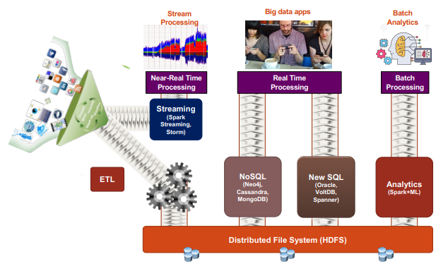

In questa immagine vengono mostrate le tre tipologie di trattamento dei dati che si possono fare nel contesto del big data.

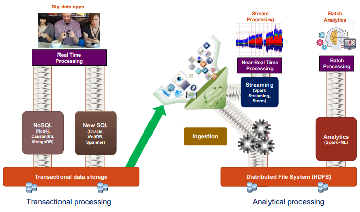

Si separano però gli aspetti legati alle elaborazioni `real-time` con quelli `near-real-time` e `batch-processing`.

Ci sono varie scelte per architetture `DS/DE` e sono: `data-lake`, `data-lakehouse`, `lambda/kappa` architecture oppure data `mesh/fabric`.

Di seguito sono elencati soluzioni che non sono necessariamente in costrasto che rispondono ad esigenze diverse

## Data Lake approach

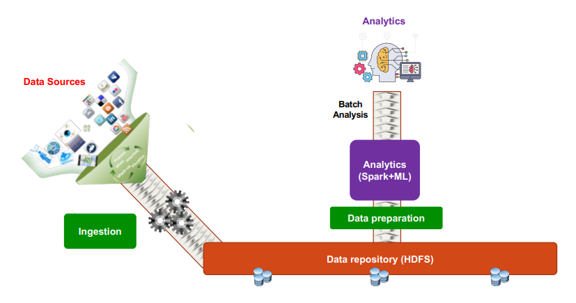

Questo approccio rimanda la fase di preparazione a una fase preliminare nella quale si prendono i dati che vengono da varie fonti costruendo un `data-lake`, cioè un contenitore che contiene dati d’imprese in qualsiasi formato. Viene utilizzato principalmente per fare `batch-analytics`.

## Data Lakehouse

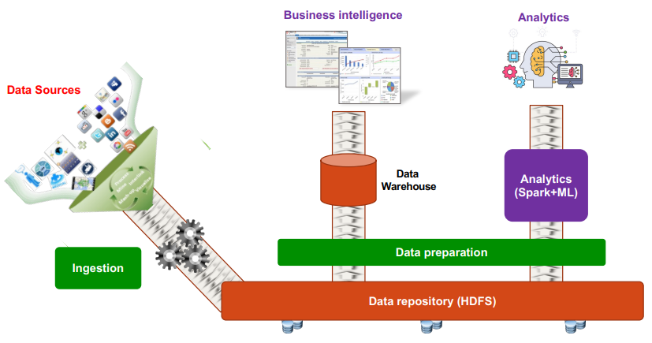

Questa è una variante del `data-lake`, in cui attraverso la fase di preparazione dei dati si può sia fare analisi di dati strutturati (tecniche di ML) oppure fare quello che serve per fare business intelligence.

Combina i vantaggi del data-warehouse e data-lake

Un `Data-Lakehouse` è come un magazzino intelligente e moderno; ha lo spazio per archiviare qualsiasi cosa (come il Data Lake), ma ha anche un sistema di gestione avanzato (come il Data Warehouse) che indicizza, cataloga, permette di definire schemi e di effettuare operazioni affidabili sui dati. Si possono ancora mettere dati grezzi, ma si possono anche creare delle "sezioni" organizzate e ottimizzate per le analisi più comuni, senza dover spostare i dati in un sistema separato.

---

Di seguito sono elencati soluzioni che hanno l’obiettivo di mettere insieme lo streaming e il batch

## Lambda Architecture

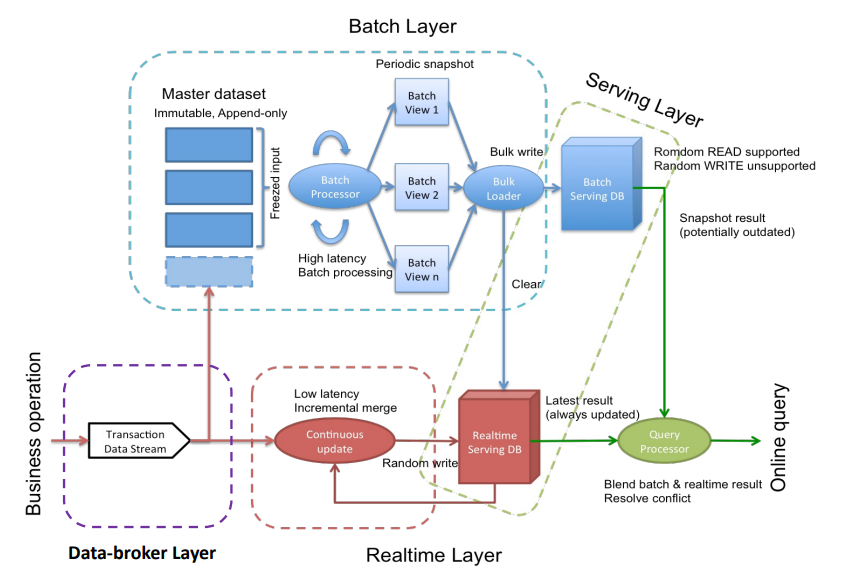

Questo è un tipo di architettura che ha l’obiettivo di combinare sia l’analisi in batch che l’analisi in streaming.

Tipicamente ci si aspetta che i dati arrivino sotto forma di streaming.

Questa architettura è un modello di progettazione per sistemi di elaborazione dati che mira a bilanciare la necessità di elaborare grandi volumi di dati storici (batch) con la necessità di ottenere risultati in tempo reale (streaming). Nasce per affrontare le sfide dei Big Data, dove la velocità, la scalabilità e la tolleranza agli errori sono cruciali.

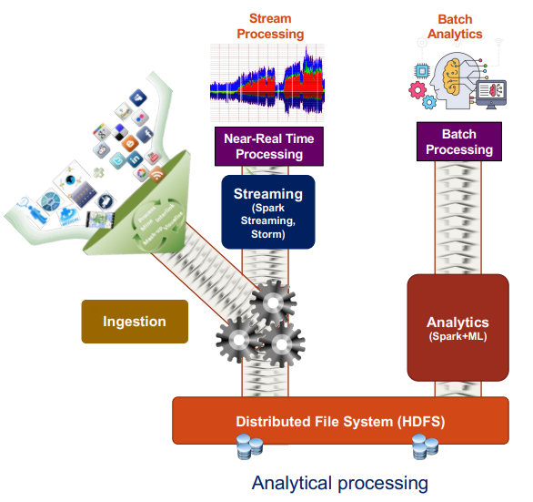

Qui viene mostrato l’architettura lambda, c’è comunque la fase di ingestion ma non è collegata direttamente al file system distribuito, o almeno non direttamente perché c’è la fase di streaming per fare `near-real time` processing.

## Kappa Architecture

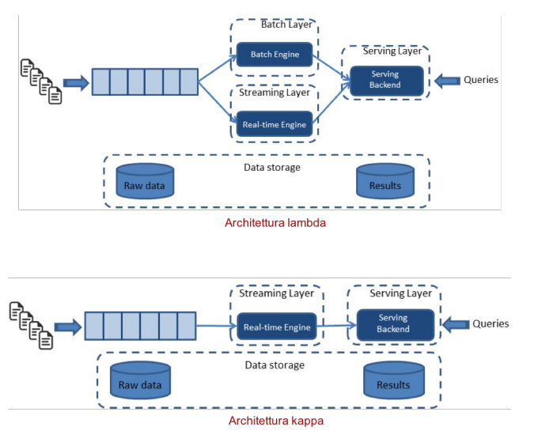

L’architettura `kappa` è una variante dell’architettura `lambda` in cui si ha un unico ramo dove:

- si prendono i dati
- si fa l’analisi stream di quei dati
- dall’analisi stream si fa successivamente analisi in batch

Mentre l'architettura `Lambda` ha due percorsi di elaborazione paralleli (batch e streaming), l'architettura `Kappa` si basa su un unico percorso di elaborazione basato sullo ****streaming. L'idea fondamentale è che tutti i dati (sia quelli storici che quelli in tempo reale) siano trattati come un flusso continuo di eventi.

---

Di seguito sono elencati architetture dove l’obiettivo fondamentale è risolvere la forte eterogeneità dei dati. Sono pensati in contesti in cui si ha per esempio un impesa che ha varie strutture (vendite, acquisti, risorse umane, ec…), dove si vogliono mettere insieme questi dati (volendo aggiungendo anche dati che vengono dall’esterno) per poi fare le attività di analisi.

## Data mesh

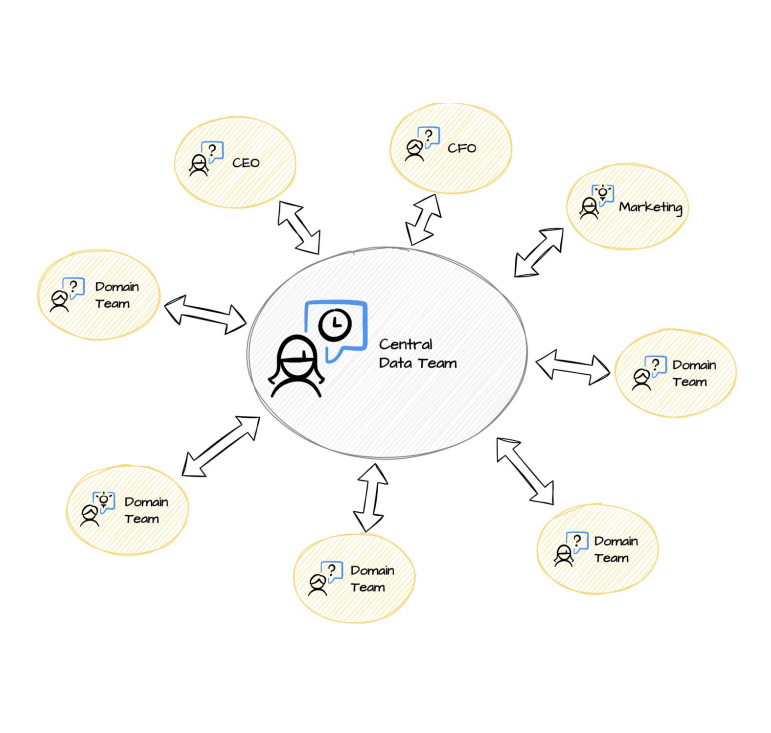

Nella soluzione `data-mesh` l’idea è che ciascuna struttura di un’organizzazione gestisce localmente i dati di propria proprietà e li esporta in un formato comprensibile a tutti gli altri. Quindi l’attività di preparazione dei dati viene fatto a livello di una singola struttura dell’azienda, dopodiché c’è un team centrale che cerca di uniformare le forme e i formati con cui i dati vengono pubblicati.

Quello che producono questi vari domini vengono chiamati `data-products`, questo può essere visto come un’architettura decentralizzata.

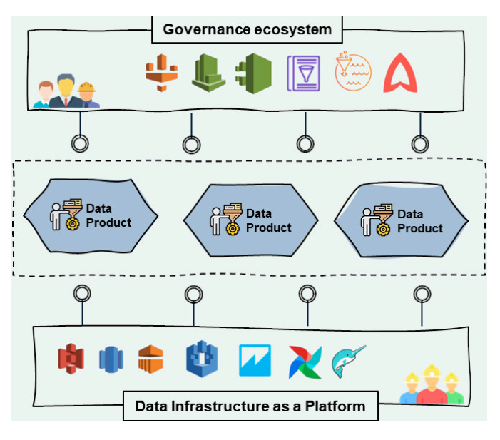

In pratica un `data-mesh` è fatto da un insieme di `data-products` prodotti dai vari domini. Si cerca che questi dati siano prodotti non soltanto con lo stesso formato ma se possibile con la stessa infrastruttura, il tutto attraverso l’attività di governance generale.

## Data fabric

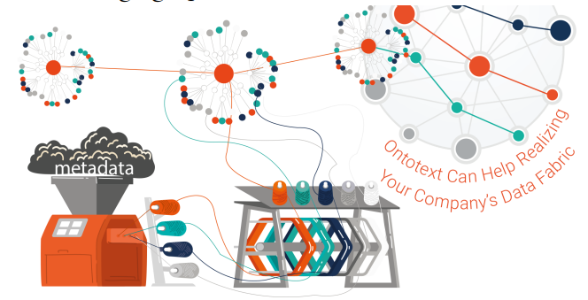

Questo è un approccio alternativo che ritorna all’approccio centralizzato dove si aggiungono però forme di rappresentazione di dati di alto livello (`knowledge-graph`). Per costruire questa architettura, ci si basa sempre sulla costruzione di un data-lake ma mano mano che arrivano i dati si raccolgono i metadati per costruire piano piano un knowledge graph. Si fa questo soprattutto per capire se esistono delle correlazioni tra dati in dataset diversi.

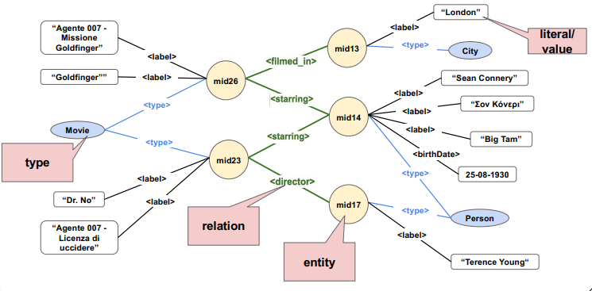

Sostanzialmente si hanno delle entità a cui si possono assegnare delle etichette che descrivono gli attributi associati; si possono assegnare anche dei tipi e soprattutto costruire relazioni tra le entità sia inter che intra dataset. In questo modo si trovano le relazioni fra dataset diversi

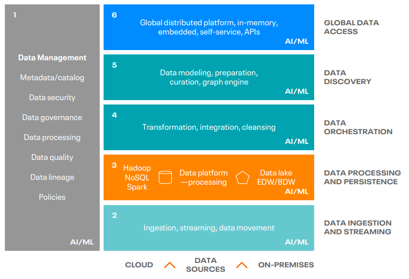

Qui viene mostrata l’architettura del `data-fabric`