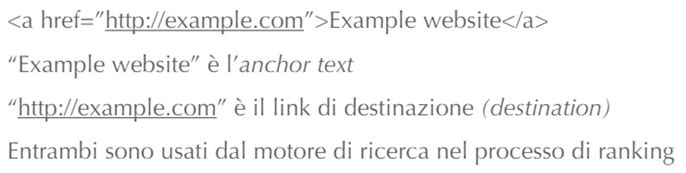

# 11 Aprile

Argomenti: Link-Analysis, POS-tagging, Stemmer Algoritmici, Stemmer Dictionary-based, Stemming
.: Yes
Description: Text Transformation 2

## Stemming

In molti linguaggi una parola ha molte variazioni morfologiche ma le stesse variazioni hanno significato identico o simile, quindi quello che gli `stemmer` fanno è ridurre queste variazioni ad una radice comune. Vengono utilizzati nella fase di indicizzazione o come parte dell’elaborazione della query. Generalmente, nel caso più semplice, si tentano di rimuovere i suffissi.

Ci sono 2 approcci per la realizzazione di stemmer:

- `algoritmici`: utilizzano un piccolo programma per decidere se 2 parole sono correlate fra loro. Si implementa con modelli di automi a stati finiti.
- `dictionary-based`: non hanno una vera e propria logica, ma si basano su dizionari di termini correlati per memorizzare le relazioni tra i termini e le relative inflessioni. Può essere complicato da realizzare e deve seguire l’aggiornamento della lingua.

## Stemmer algoritmici

Il più semplice `stemmer-algoritmico` per l’inglese è il `suffix-stemmer` che rimuove la “s” che termina la parola assumendo che questa indentifichi il plurale. Molti falsi negativi non rilevano le correlazioni e qualche falso positivo rileva correlazioni che non esistono.

- `stemmer di porter`: consiste in una serie di passi, ciascuno contenente un insieme di regole per rimuovere i suffissi. Ad ogni passo è eseguita la regola per suffisso più lungo applicabile. Il problema di questo stemmer è che produce `stem`, ovvero radici morfologiche senza un vero e proprio significato. Questo stemmer risulta comunque molto semplice che però può creare problemi difficili da correggere in fasi successive.

## Stemmer Dictionary-based

Inceve di cercare di rilevare correlazioni tra le parole da modelli lessicali, lo `stemmer dictionary-based` memorizza elenchi di parole correlate in un grande dizionario. Per ogni parola si possiedono tutte le possibili variazioni morfologiche, questo richiede la realizzazione del modello molto tempo di lavoro ma il tasso di falsi positivi è molto basso.

- `stemmer di krovetz`: aproccio ibrido basato su dizionario e algoritmico, una volta individuato lo `stem`, verifica se effettivamente è presente nel vocabolario. Rispetto allo `stemmer di porter` produce parole complete con la stessa efficacia.

## Frasi come query

Le frasi sono aggregazione di termini e rappresentano richieste più precise rispetto alle singole parole, questo può essere complesso da gestire per il ranking. Questo porta al problema dell’elaborazione del testo nel caso in cui siano presenti frasi da riconoscere. Sono possibili 3 approcci:

- Identificando frasi sintattiche usando un `part-of-speech`(POS tagger): in pratica è uno strumento che prende in input un testo e lo tagga sulla base di un’analisi sintattica.
- usando `n-grammi` di parole: questo approccio è basato su considerazioni di tipo statistico, non fa un’analisi grammaticale della frase.
- memorizzando le posizioni delle parole negli indici e usando operazioni di prossimità nelle query: questo approccio è più potente ma pesante.

## Approccio 1 - POS Tagging

Un `POS-tagger` usa approcci statistici o regole per la predizione dei tag sintattici delle parole, quello che fa è contrassegnare le parole in un testo con tag corrispondenti alla parte del discorso della parola in quel contesto, cioè fa l’analisi logica del testo.

## Approccio 2 - $n$-grammi

Il `POS-tagging` è troppo lento per grandi collezioni perchè deve taggare tutte le parole, quello che si fa quindi è semplificare la definizione di frase, cioè si dice che la frase è una qualunque sequenza di $n$ parole. Gli $n$-grammi frequenti hanno maggiore probabilità di essere significative. Seguono la distribuzione di `Zipf`, ovvero ci sono pochi termini molto frequenti e molti termini poco frequenti. A livello di effiacia è molto più veloce di un `POS-tagger` ma usa molto di più lo storage. 

---

## Link Analysis

Il `link-analysis` è una componente fondamentale per il web e parte dagli algoritmi di `ranking` per il posizionamento delle pagine all’interno della classifica. Si basano solo sulla topologia, per questo motivo i link sono importanti per 2 motivi:

- rappresentano una componente importante per la navigazione
- sono una componente chiave per la ricerca, dato che aiutano i motori di ricerca a capire la relazione fra le pagine.

Gli `anchor-text` sono importanti perchè forniscono una descrizione sintetica del contenuto della pagina. Molto utili per i `focused-crawler`.

Il problema è che questi anchor-text possono presentare delle limitazioni perché possono essere `biased`, possono soffrire di un pregiudizio e quindi essere distorti, quindi bisogna tenere conto di questa limitazione in fase di ranking delle pagine.
