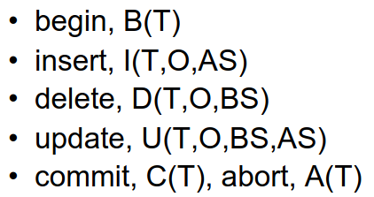
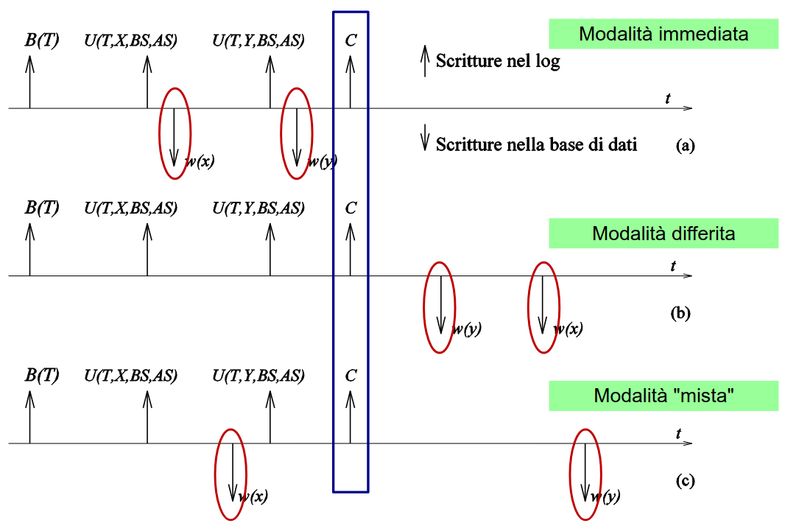
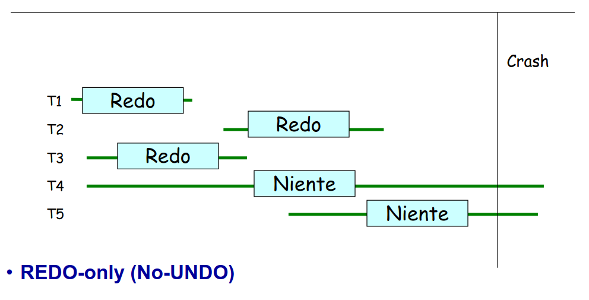
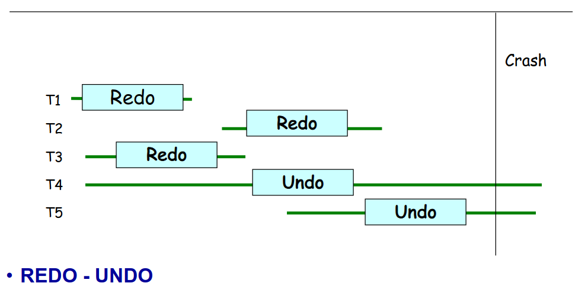

# 11 Aprile

Argomenti: Esito di una transazione, Gestione dei guasti, Gestione del log, Gestore dell'affidabilità, Politiche per la scrittura del log, Recovery, Rollback
.: No

## Gestore dell’affidabilità

Assicura atomicità e durabilità, gestisce l’esecuzione dei comandi transazionali come:

- `start-transaction(B,begin)`
- `commit-work(C)`
- `rollback-work(A,abort)`

Gestisce le operazioni di ripristino dopo i guasti come le `warm-restart` e `cold-restart`

Il gestore dell’affidabilità usa informazioni ridondanti e sono:

- `log`: è un archivio che si trova in memoria stabile, è un file sequenziale che riporta tutte le operazioni in ordine. Serve a tornare allo stato precedente prima di un checkpoint
- `dump`:  è una copia di dati di riserva della base di dati

## Modello di riferimento

Una transazione è costituita da una sequenza di operazioni di `input-output` su un record o un blocco, ecc. Le operazioni sono di inserimento `I(O)`, eliminazione `D(O)`, aggiornamento `U(O)`. I valori di interesse però sono solo 2 e sono lo stato prima dell’operazione (definito con `BS`) e lo stato dopo l’operazione (definito con `AS`).

## Gestione del log

Nei log vengono scritti le operazioni delle transazioni caratterizzati da `T` identificatore della transazione, `O` oggetto, `BS` before state, `AS` after state.

## Esito di una transazione

Una transazione si conclude positivamente quando viene scritto il record di `commit` nel log. Se avviene un guasto prima del commit bisogna ricostruire lo stato `originario` della base di dati quindi servono meccanismi per annullare e ricostruire.

- `undo`: supponendo di avere un oggetto O, se si legge update o delete si copia il valore di BS nell’oggetto O. Se si ha un insert si elimina O se esiste.
- `redo`: supponendo di avere un oggetto O, se si legge insert o update si copia il valore di AS nell’oggetto O. Se si ha un delete si elimina O se esiste.
- `idempotenza`: in pratica si ha che `undo(undo(A))=undo(A)` e `redo(redo(A))=redo(A)`

## Politiche per la scrittura del log

Il concetto di base è scrivere prima nel log e poi fare le operazioni. Il log deve contenere le informazioni necessarie a ripristinare lo stato corretto in caso di guasto, le 2 politiche utilizzate sono:

- `Write-Ahead-Log`: si scrive il BS sul log prima di scrivere nella base di dati
- `Commit-Precedenza`: si scrive l’AS sul log prima del commit

Bisogna tenere conto anche dei file che si trovano nel buffer, perchè non vengono scritti subito in memoria secondaria.

## Modalità immediata

Il DB contiene valori modificati per transizioni committed (tutte) e uncommitted

In questo caso bisogna annullare tutte le modifiche dalle transazioni `T4` e `T5`, perché non sono state committate prima della fine di tutte le operazioni

## Modalità differita

Il DB non contiene valori modificati da transazioni uncommitted, ma non è sicuro contenga i nuovi valori per quelle committed.

In questo caso bisogna rifare tutte le operazioni di `T1`,`T2`,`T3`. 

## Modalità mista

La scrittura può avvenire in modalità immediata e/o differita

Delle 3 modalità conviene più la terza perchè anche se richiede più operazioni in caso di guasto permette al gestore del buffer di decidere quando scrivere privilengiando l’operatività ordinaria

## Rollback

Un semplice uso del `log` è quello di annullare una transazione che non è arrivata al commit, per questo si fa `rollback`. Per fare questa operazione bisogna scandire il log dalla fine al record di begin della transazione T da annullare, quindi per ogni record che si riferisce da una azione della transazione T viene eseguito l’undo e al termine si aggiunge in coda un record di rollback

## Recovery

Lo scopo fondamentale del gestore dell’affidabilità è di garantire che il contenuto della base di dati sia corretto, in caso di guasto o allo shut down; poichè la conlusione non è sempre controllabile si può immaginare che all’avvio venga sempre effettuata una verifica che controlla che i dati nel database siano corretti.

1. Per ogni record nel log, dalla fine all’inizio,
    1. se è commit si aggiunge la transazione REDO
    2. se è rollback si aggiunge la transazione a RB
    3. se è un’azione e la transazione non è REDO né RB, si disfa l’azione
2. per ogni record del log dall’inizio alla fine
    1. se è un’azione di una transazione in REDO allora si rifà l’operazione

Visto che l’operazione richiede 2 passate, per ridurre i costi del recovery si chiudono periodicamente le transizioni in corso e per tutte quelle concluse in commit si salvano i dati su disco creando un `checkpoint`quiescente. Adesso l’algoritmo di recovery non avviene con tutto il log ma dal checkpoint di interesse.

## Guasti

I guasti `hard` sono quello che avvengono sui dispositivi di memoria secondaria ma non si perdono le informazioni nella memoria stabile. In questo caso si fa `cold-restart` cioè ripresa a freddo.

Per gestire questi tipi di guasti si fa il `dump`, cioè una copia completa dlela base di dati, in pratica viene prodotta quando il sistema non è operativo e salvato in memoria stabile; nel log viene inserito un record di dump che indica il momento in cui il dump è stato effettuato. Il dump viene eseguito molto più di rado rispetto al checkpoint.

## Ripresa a freddo

Si ripristinano i dati a partire dal backup, si eseguono le operazioni registrare sul log fino all’istante del guasto e poi si esegue una ripresa a caldo.