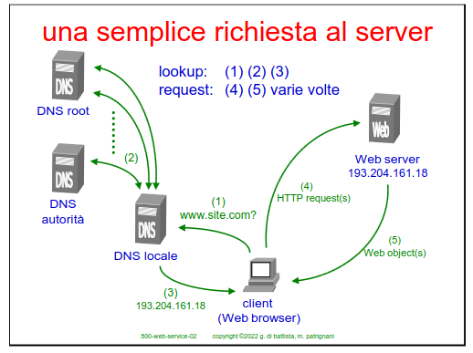
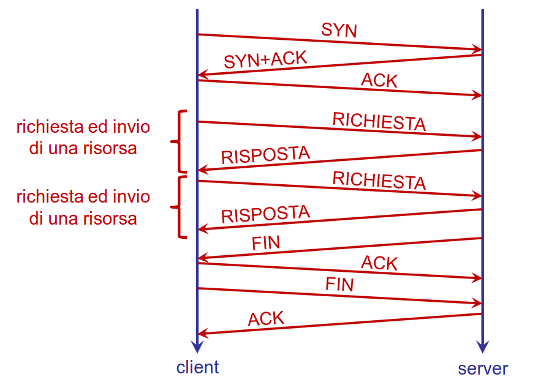
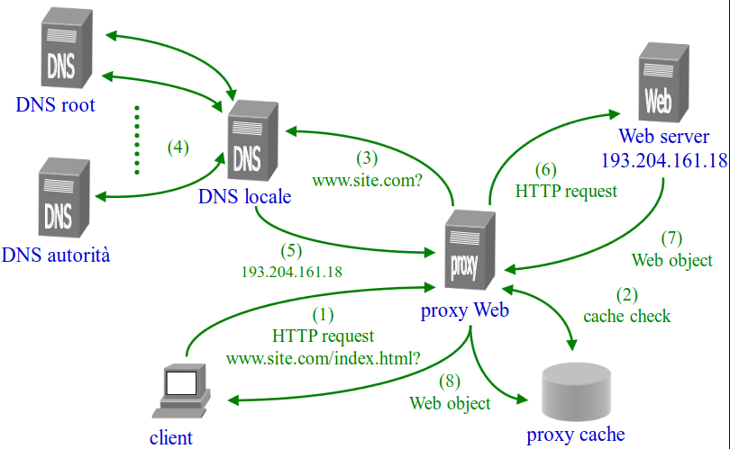
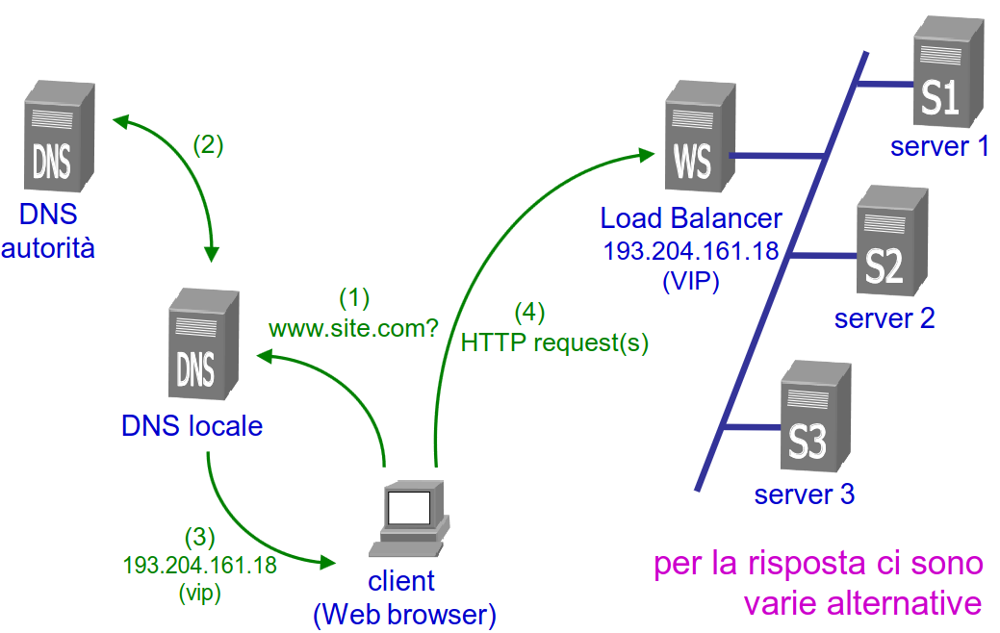
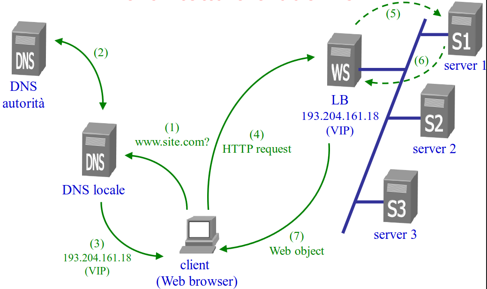
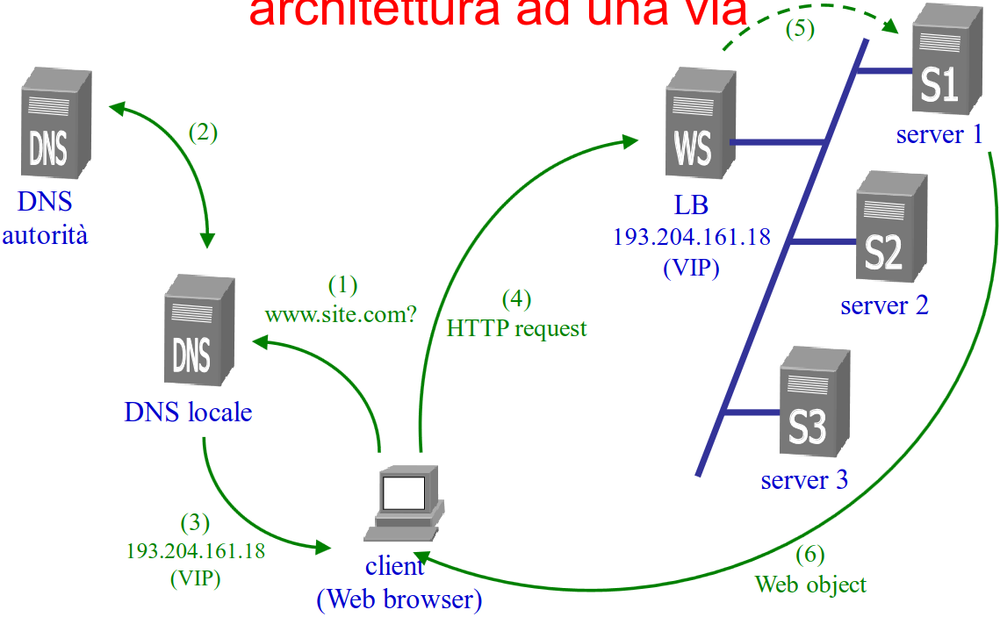

# 11 Dicembre

Argomenti: Algoritmi di scheduling per LB, Architetture per servizi web, Client-side caching, Distribuzione Locale, Load Balancer 4, Load Balancer 7
.: Yes

## Architetture, modelli e algoritmi per servizi basati sul web

Prima di cominciare si devono dare delle definizioni preliminari:

- `hit`: richiesta di un singolo oggetto al server da parte del client

- `page request`: richiesta che solitamente consiste di vari hit

- `session` sequenza di page request consecutive da parte dello stesso client

Ci sono 3 tipi di oggetti: `statici`, `dinamici` e `sicuri`.

Questa è una semplice richiesta al server, dove un client cerca di risolvere il web server mostrato. Visto che non sa come fare si rivolge al dns locale dove questo fa tutte richieste iterative per trovare questo web server. Alla fine il client fa la richiesta HTTP per ricevere l’oggetto web come risposta.

## Connessioni persistenti

Tipicamente sulla stessa connessione TCP il client fa più richieste consecutive ed ottiene le relative risposte, a partire da `HTTP 1.1` la connessione per default è persistente. I server e i client hanno comunque possibilità di abbattere la connessione TCP quando lo ritengono opportuno. Queste connessioni consentono di diminuire la latenza evitando il three-way handshake e chiusura per ogni richiesta, consentono anche di evitare slow-start TCP per ogni richiesta, avendo cosi un uso migliore della banda.

Sia server e sia client hanno propri interessi relativi alle connessioni persistenti:

- `client`: gli interessa avere la connessione attiva per avere un servizio più efficiente, al fine di effettuare più richieste contemporaneamente e può aprire connessioni multiple contemporanee con lo stesso server.
- `server`: gli interessa di aprire e chiudere le connessioni TCP il minimo numero di volte e terminare le connessioni non attive per non saturare le proprie risorse. Un server cerca di evitare troppe connessioni attive contemporaneamente.

## Client-side caching

I client confidano fortemente nel caching per l’incremento delle prestazioni. In pratica si usano queste proxy web che eseguono le richieste al DNS server e memorizzano le risposte in una cache locale

## Classificazione dei servizi web scalabili

Un servizio web scalabile è basato su vari server, un meccanismo di scheduling che serve per assegnare una richiesta al server migliore, un algoritmo di scheduling per stabilire quale sia il server migliore e un’entità che esegue l’algoritmo di scheduling e il relativo meccanismo

Ci sono 2 tipi di algoritmi per web scheduling:

- `statici`: non modificano mai la loro strategia di scheduling
- `dinamici`: modificano la loro strategia di scheduling in base alle informazioni sui client o sullo stato dei server oppure su entrambi

Ci sono 2 tipi di distribuzioni:

- `locale`: si hanno web clusters con scheduling a un livello (Load Balancer) e scheduling a due livelli (Load Balancer + redirection)
- `globale`: si hanno web clusters basati su mirroring, redirection, DNS e anycast

---

## Distribuzione Locale

Nella distribuzione locale si ha che l’intera architettura è situata in una singola locazione fisica e che i server possono essere macchine fisiche o virtuali.

Per l’indirizzamento si ha un Virtual IP associato a un Load Balancer

## Load Balancer

Il `Load Balancer` (chiamato anche Web Switch → WS )è l’entità che esegue l’algoritmo di scheduling e il relativo meccanismo, quindi smista le richieste effettuando il mapping tra VIP e indirizzo dei server.

Possono essere di 2 tipi:

- `livello 4`:(content-blind routing) sono load balancer che guardano fino al livello 4, quindi quello TCP. Questo significa che non hanno guardato la richiesta HTTP, si basano su indirizzo IP sorgente e destinazione, numero di porta TCP, SYN e FIN
- `livello 7`:(content-aware routing) sono load balancer più sofisticati perchè guardano fino al livello 7 e si basano sul contenuto dell’URL e cookies

## Load Balancer di livello 4

Questi tipi di Load balancer gestiscono le connessioni TCP, questo vuol dire che i pacchetti relativi alla stessa connessione sono inviati allo stesso server. Per identificare le connessioni il `Load Balancer` mantiene una tabella di corrispondenza connessione-server usando il bit `SYN` per identificare nuove connessioni e il bit `FYN` per identificarne la fine.

I Web cluster con LB di livello 4 possono essere classificati in base a dei `meccanismi` per lo smistamento dei pacchetti in arrivo e al `percorso` dei pacchetti in uscita. Questo percorso può avere una architettura a `due-vie`, (cioè sia i pacchetti in arrivo che quelli in partenza attraversano il LB) oppure può avere una architettura ad `una-via` (solo i pacchetti in arrivo attraversano il LB)

Usando una architettura a `due-vie`, i pacchetti che passano per il  LB vengono riscritti usando l’approccio `NAT` (Network Address Translation). Questo approccio consiste nel sostituire l’indrizzo `VIP` con quello del server, quando i pacchetti sono in ingresso si ha che `VIP`→`IP` server, quando i pacchetti sono in uscita si ha che `IP`server→`VIP`. 

Usando una architettura a `una-via` si hanno 2 tipi di meccanismi:

- meccanismo basato su `IP`
- meccanismo basato su `MAC`

Usando il meccanismo basato su `IP`, i pacchetti in entrata passano comunque per il LB sostituendo al `VIP` l’indirizzo `IP` del server scelto, poi i server modificheranno i pacchetti in uscita (che non passano per LB ) specificando come source address l’indrizzo `VIP`.

Usando il meccanismo basato su `MAC`, i pacchetti in entrata passano comunque per il LB dove l’indirizzo `VIP` è definito sull’interfaccia di loopback di ogni server. Il forwarding dal LB è effettuato a livello MAC questo significa che il LB e i server devono far parte della stessa sottorete fisica.

## Algoritmi di scheduling statici di LB di livello 4

- `random`: non si ha nessuna informazione sullo stato del cluster ne sulla storia delle assegnazioni
- `round robin`: non si ha nessuna informazione sullo stato del cluster e si conosce solo l’assegnazione precedente

## Algoritmi di scheduling dinamici di LB di livello 4

- `partizione dei client`: si fa la suddivisione dei client o delle richieste in diverse categorie o gruppi per distribuire il carico di lavoro in modo più efficiente tra i server di destinazione.
- assegnazione sulla base del carico dei server: si hanno 2 algoritmi, uno è `least loaded server` e l’altro è `weighted round robin`(i pesi sono configurati sulla base del carico). Le metriche per valutare il carico sono il numero di connessioni TCP attive, uso attuale di cpu e disco ed emulazione di richieste ai server.

## Load Balancer di livello 7

Lo switch prende una decisione in base al livello 7, quindi vede tutto il pacchetto di richiesta. Quello che succede è che LB ispeziona il contenuto delle richieste HTTP per decidere l’assegnamento ai server. Durante questo processo client e LB stabiliscono una connessione TCP perchè non sarebbe possibile ispezionare il contenuto della HTTP request.

## Algoritmi di scheduling per LB di livello 7

- `identificazione di sessione`: le richieste HTTP con lo stesso cookie sono assegnate allo stesso server cosi da avere un’intera sessione con lo stesso server
- `locality-aware request distribution`: la prima richiesta di una certa risorsa viene assegnata al server meno carico dopodichè le richieste successive verrano assegnate sempre allo stesso server scelto all’inizio.
- `cache affinity`: tecnica basata su un cache manager a cui è nota la situazione di tutte le cache dei server

In sintesi questa immagine mostra i pro e i contro delle architetture dei web cluster

---

## Elastic cluster

Un’ulteriore tecnologia è usare un `elastic cluster` dove il cloud provider mette a disposizione del servizio un numero di server virtuali che può variare nel tempo. Il `load balancer` di livello 4 o 7 oltre ad eseguire gli algoritmi di scheduling decide anche se aumentare o diminuire il numero dei server.