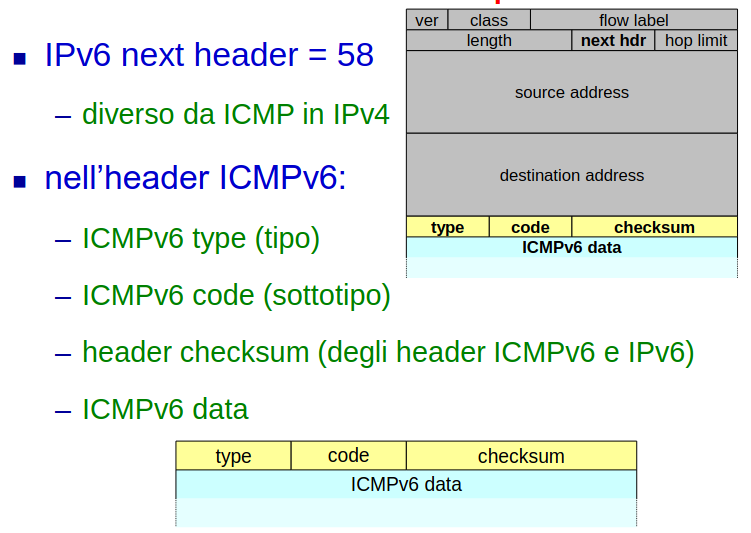
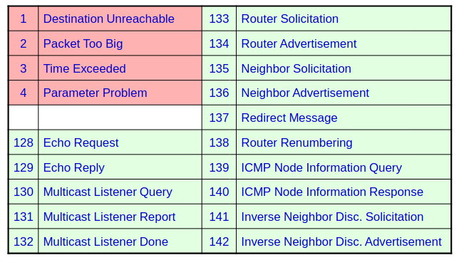
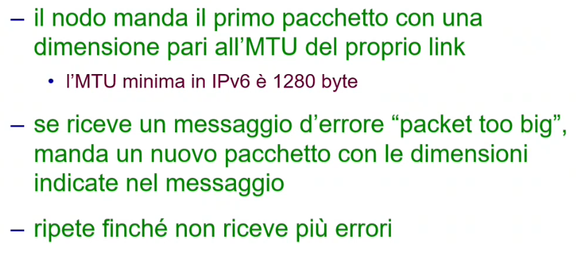
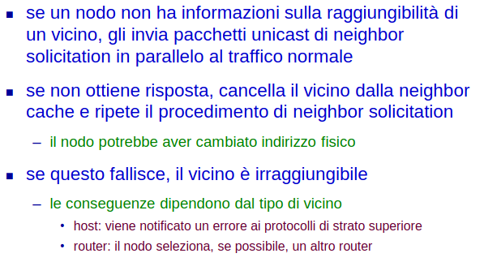

# 11 Gennaio

Argomenti: Address Resolution, ICMPv6, Messaggi ICMPv6, Neighbor discovery, Path MTU discovery, Redirect
.: Yes

## ICMPv6

Questo protocollo è analogo per `ICMPv4` per `IPv4` ma si aggiungono nuove funzionalità come `neighbor discovery` e `gestione dei gruppi multicast` a quelle già esistenzi che sono segnalazione di errori, controllo e diagnostica.

In particolare quando si parla di `neighbor discovery` in IPv6 si parla di neighbor solicitation, unreachibility e meccanismi di autoconfigurazione.

In pratica integra in un unico protocollo le funzioni svolte per IPv4 da ICMP, ARP e IGMP.

## Formato dei pacchetti

Dentro il pacchetto IPv6 e dentro ci sta il pacchetto ICMPv6

## Tipi di messaggi

Il primo bit del campo `type` distingue tra 2 classi di messaggi:

- da 0 a 127 sono segnalazioni di errore come per esempio `destination unreachable`,`packet too big`,`time exceeded`,`parameter problem`.
- da 128 a 255 sono messaggi informativi

## Messaggi informativi

- `diagnostica`: echo request/reply
- `controllo`:
    - `gestione dei gruppi multicast`: multicast listener query/report/done
    - `neighbor discovery`: router solicitaction/advertisement, neighbor solicitacion/advertisement, redirect, inverse neighbor discovery
- `richiesta di informazioni`: node information query/response

---

## Path MTU discovery

Si ricorda che nel protocollo `IPv6` la frammentazione se ci sta è end-to-end, quindi i router non frammentano i pacchetti ma l’host sorgente per effettuare frammentazione in modo opportuno deve conoscere la `MTU` di tutte le LAN attraversate.

Per conoscere queste `MTU` si usa la procedura `Path-MTU-discovery` basata su messaggi `ICMPv6` `packet-too-big`. Questi messaggi vengono generati dai router quando la linea su cui va inoltrato un pacchetto ha MTU inferiore alle dimensioni del pacchetto da inviare.

In questa immagine è rappresentato l’algoritmo utilizzato da `path-mtu-discovery`.

Periodicamente il nodo manda pacchetti di dimensioni maggiori per rinnovare la stima.

## Neighbor discovery - funzionalità di base

Per la scoperta dei vicini si utilizzano pacchetti `ICMPv6` utilizzando informazioni e pacchetti di controllo all’interno di un link attraverso operazioni di `redirect`, `address resolution` e `autoconfigurazione`.

## Redirect

In pratica un router informa un host che esiste un router migliore sul link per raggiungere la destinazione, oppure che la destinazione è sul link. Il messaggio di redirect include l’indirizzo link local e l’indirizzo di livello 2 del next hop o della destinazione. 

## Address resolution - Neighbor solicitation

 Il `neighbor-solicitation` è il modo in cui `ARP` viene cancellato in `IPv6` e sostituito da funzionalità di `ICMPv6`. Questo meccanismo è indipendente dal livello 2, questo significa che il livello 2 non si deve più adeguare ad un nuovo protocollo o ad ARP; si utilizzano indirizzi multicast anziché broadcast cosicché i nodi non interessati possono scartare il pacchetto senza esaminarne il contenuto.

## Address resolution - Neighbor advertisement

Per ottenere un indirizzo fisico di un altro nodo, il nodo “corrente” calcola l’indirizzo (multicast) solicited-node corrispondente all’indirizzo IPv6 del destinatario e poi il nodo “corrente” invia a questo indirizzo un pacchetto di neighbor solicitation specificando l’indirizzo IPv6 del destinatario nel campo dati. Se il destinatario è presente risponde con un pacchetto unicast di `neighbor-advertisement` dove il suo indirizzo fisico è specificato nella porzione dati del pacchetto e viene memorizzato nella `neighbor-cache`.

## Address resolution - Neighbor unreachability detection (nud)

Il `neighbor-unreachability-detection` è un algoritmo che permette di individuare rapidamente guasti o cambiamenti di indirizzo fisico; ogni nodo tiene traccia dello stato dei mutua raggiungibilità con i nodi vicini utilizzando le risponde dei vicini ai propri pacchetti.

In questa immagine è spiegata come funziona la `nud`.