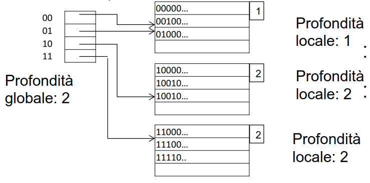
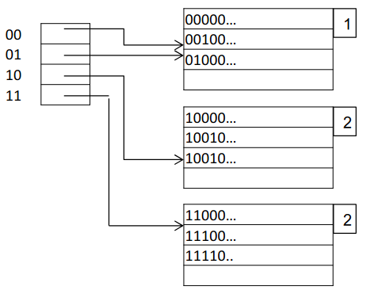
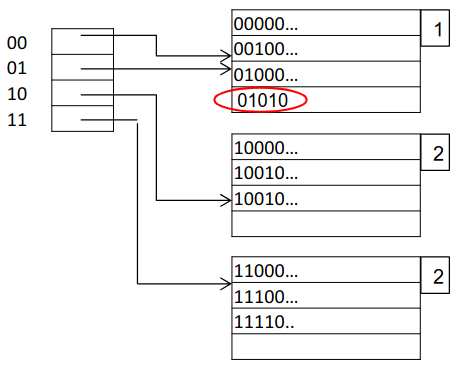
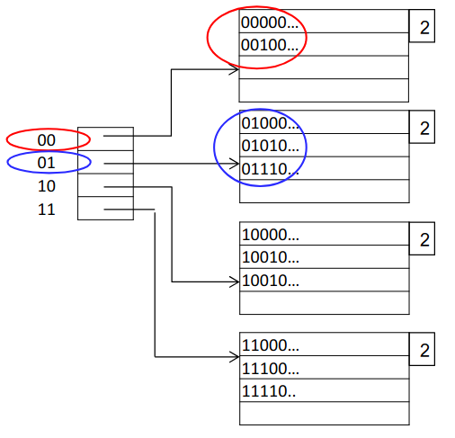
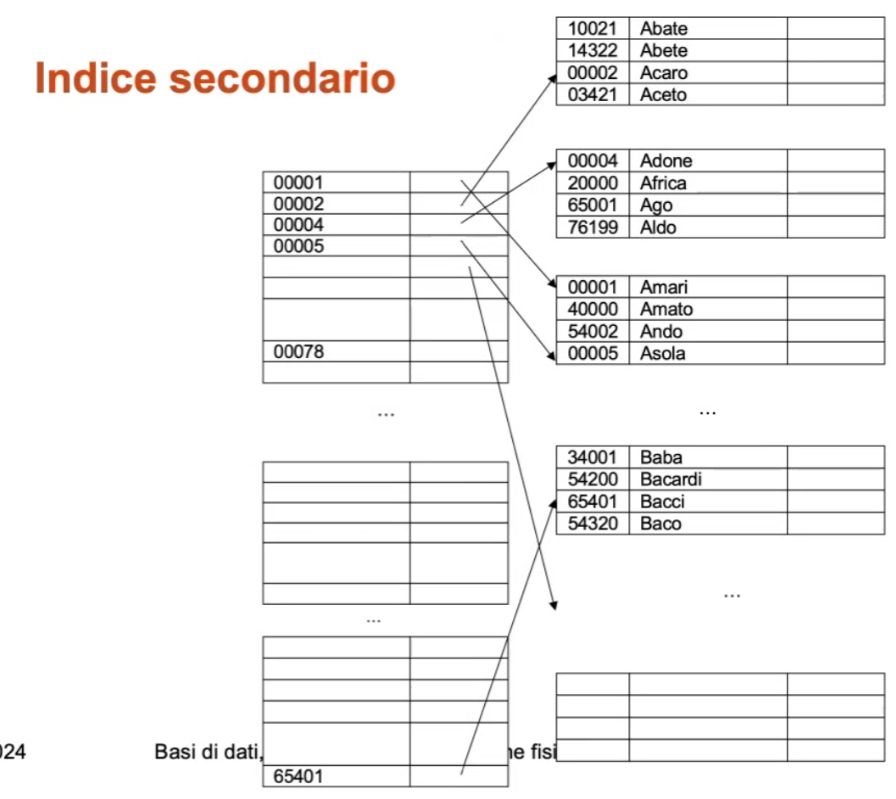
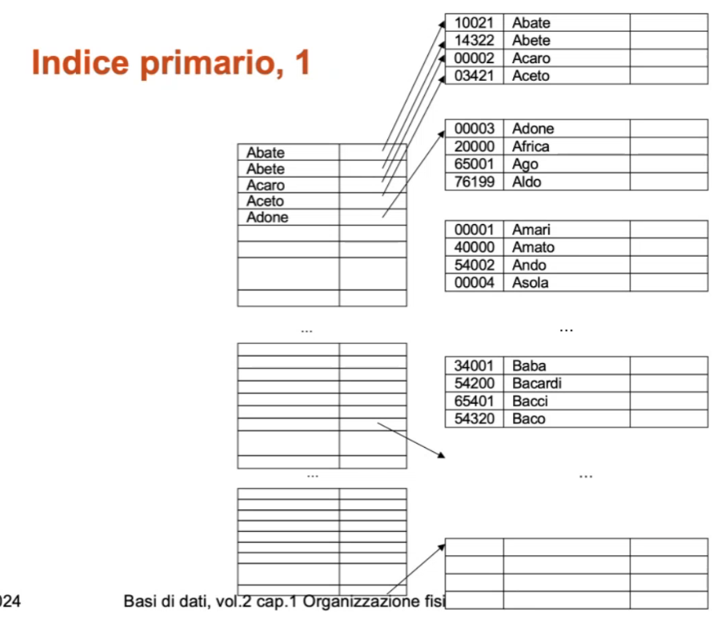
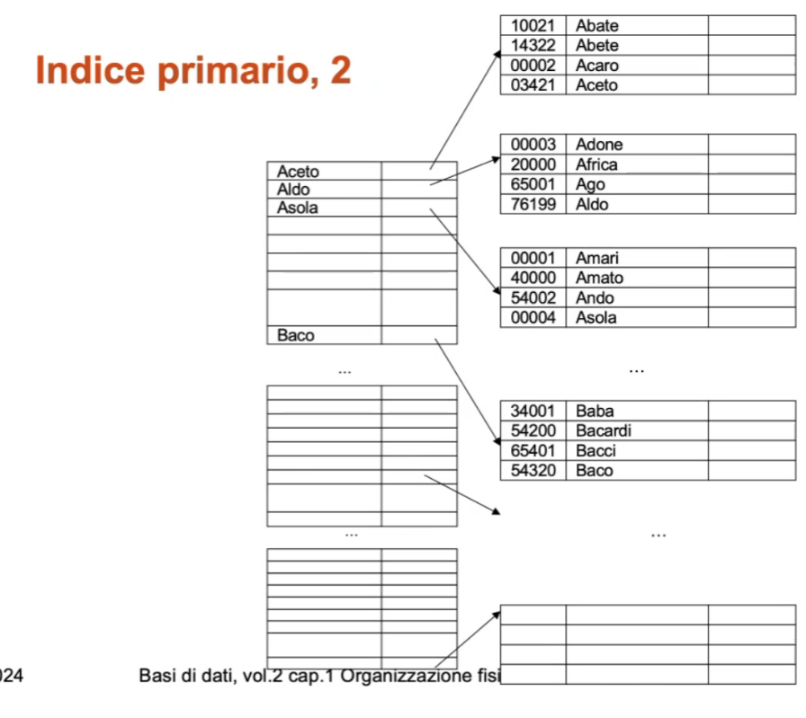
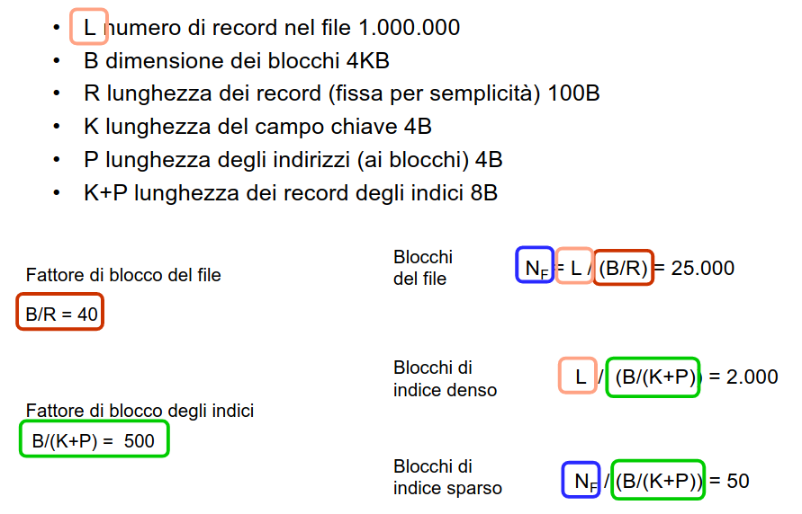
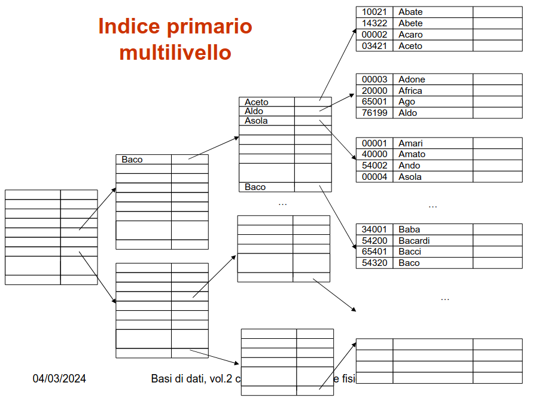
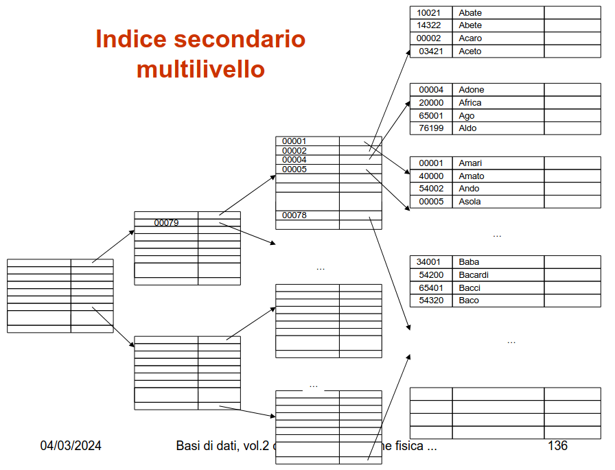

# 11 Marzo

Argomenti: File Hash, Hashing estensibile, Indici di file, Tavola hash
.: Yes

## Tavola hash

La `tavola hash` è una struttura dati che consente l’accesso diretto ad un insieme di record sulla base del valore di un campo (detto chiave, che per semplicità si suppone identificante).

Se i valori della chiave sono in numero paragonabile al numero di record allora si utilizza un array ma se i possibili valori della chiave sono molto di più di quelli effettivamente utilizzati, utilizzare l’array sarebbe uno spreco, ad esempio 40 studenti e matricola di 6 cifre dove se si prende come chiave la matricola allora si possono avere un milione di possibili valori

Per non sprecare spazio quindi si trasformano i valori della chiave in possibili indici di un array tramite una `funzione hash`, il quale associa ad ogni valore della chiave un “indirizzo”. Poiché il numero possibili di chiavi è molto maggiore del numero di possibili indirizzi la funzione non può essere iniettiva e quindi esiste la possibilità di `collisioni`. Al crescere della molteplicità decresce la probabilità di collisioni multiple

Lunghezza media delle catene di overflow, al variare di:

- Numero di record esistenti $T$
- Numero di blocchi $B$
- Fattore di blocco $F$
- Coefficiente di riempimento: $\dfrac{T}{F\cdot B}$

## File hash

L’accesso è diretto o associativo, la tecnica si basa su quella utilizzata per le tavole hash in memoria centrale, è l’organizzazione più efficiente per l’accesso diretto basato su valori della chiave con condizioni di uguaglianza (`accesso puntuale`)

Non è efficiente per ricerche basate su intervalli, per risolvere il problema si cambia struttura

I file hash funzionano solo con file la cui dimensione non varia molto nel tempo perché la riorganizzazione dei “record” è costosa quando ce ne sono tanti, esistono però tecniche per superare questo difetto: `hashing dinamico (estendibile, lineare)`

## Hashing dinamico - estendibile

Nell’`hashing estendibile` si basa sull’utilizzo di una funzione hash con un certo numero di bit.

La funzione di hash è di $k$ bit, la directory é composta da $2^d$ elementi con $d\le k$. I blocchi utilizzati sono in numero inferiore a $2^d$ quindi più elementi della directory possono puntare allo stesso blocco e se un blocco è pieno viene diviso in 2. Se si deve dividere un blocco che punta a un solo elemento della directory, allora si raddoppia la directory.

`profondità globale`:  numero di bit usati per la directory, per esempio $d=2$ allora la directory ha massimo 4 elementi, sono meno se non ci sono record che li utilizzano

`profondità locale`: numero di bit iniziali comuni ai record nel blocco sulla base dei riferimenti nella directory

Supponendo di avere questo esempio si inseriscono 2 record: $01010$ e $01110$.

Nell’inserimento di $01010$, si controllano i primi 2 bit per capire a quale blocco inserirlo

Inserendo $01110$ ci si accorge che andrebbe nel primo blocco ma non c’è posto perché il blocco è saturo quindi si raddoppia la directory

Quindi dagli esempi si può vedere che l’hashing estensibile supera le limitazioni dell’hashing statico in caso di dimensione variabile nel tempo.

Si ricorda che le strutture `hash` sono pure `primarie`(se ne può avere una variante secondaria)

---

## Indici di file

L’`indice` è una struttura ausiliaria secondaria, per l’accesso efficiente sulla base dei valori di un campo o concatenazione di campi detto `chiave`.

Un indice $I$ di un file $F$ è un altro file, con record a 2 campi, chiave e indirizzo(dei record di $F$ o dei relativi blocchi), ordinato secondo i valori della chiave

Esistono vari tipi di indice:

- indice `primario`: su un campo sul cui ordinamento è basata la memorizzazione
- indice `secondario`: su un campo con ordinamento diverso da quello di memorizzazione

Nell’esempio del libro l’indice generale è primario perché le pagine sono in ordine mentre l’indice analitico è secondario perché le pagine sono in disordine ma si sa cosa cercare

Questo è un possibile indice secondario, cioè un file ordinato per cognome e l’indice secondario sul numero di matricola.

Per la ricerca servono tutti i riferimenti

Questo è un esempio di indice primario il campo di ordinamento è basata sulla memorizzazione.

Per la ricerca non servono tutti i riferimenti

Quindi quello che si può fare è mettere un riferimento per ogni blocco

Il vantaggio di usare questo approccio è quello di avere un indice molto piccolo

Si possono dividere gli indici in 2 categorie:

- indice `denso`: contiene tutti i valori della chiave
- indice `sparso`: contiene solo alcuni valori della chiave e quindi un numero di riferimenti inferiore rispetto ai record del file

Sulla base degli esempi mostrati si dice che un indice secondario deve essere denso mentre un indice primario di solito è sparso ma può essere anche denso per verificare la presenza di un record e per permettere operazioni sugli indirizzi.

## Dimensioni dell’indice su campo identificante

Indicando con $L$ il numero di record nel file, $B$ dimensione dei blocchi, $R$ lunghezza dei record (fissa),$K$ lunghezza del campo pseudochiave, $P$ lunghezza degli indirizzi (ai blocchi), $K+P$ lunghezza dei record degli indici, si ha:

- Fattore di blocco del file: $\dfrac{B}{R}$
- Numero di blocchi per il file: $N_F=\dfrac{L}{(B/R)}$
- Fattore di blocco di un indice: $\dfrac{B}{K+P}$
- Numero di blocchi per un indice denso: $N_D=\dfrac{L}{B/(K+P)}$
- Numero di blocchi per un indice sparso: $N_S=\dfrac{N_F}{B/(K + P)}$

In questo esempio viene mostrato l’utilizzo delle formule

## Caratteristiche degli indici

- Permette l’accesso diretto sulla chiave, sia puntuale sia per intervalli perché tanto l’indice è ordinato in qualche modo
- tutti gli indici forniscono un `ordinamento logico` sui record del file; con numero di accessi pari al numero di record del file
- le modifiche della chiave, inserimenti ed eliminazioni sono efficienti e ci sono varie tecniche per alleviare i problemi

## Indici multilivello

Gli indici sono file essi stessi e quindi ha senso costruire indici sugli indici, per evitare di fare ricerche fra blocchi diversi

L’indice è ordinato e quindi l’indice sull’indice è primario

Il tutto a più livello, fino ad avere un livello con un solo blocco

Il problema è che tutte le strutture viste finora sono basate su strutture ordinate e quindi sono poco flessibili in presenza di elevata dinamicità