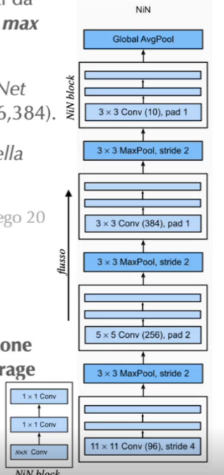
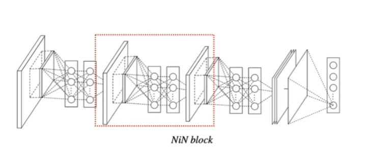
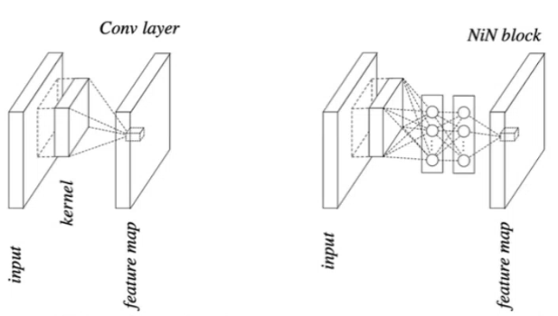
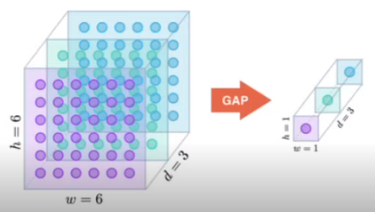
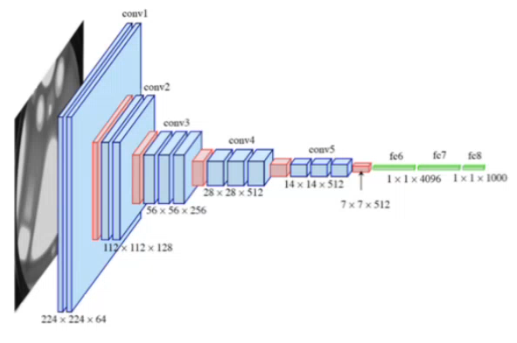
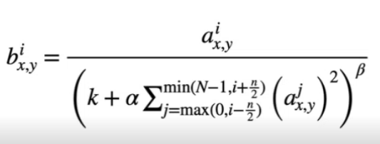
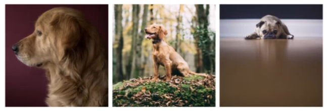

# 11 Ottobre

Tags: AlexNet, Network-in-Network, Visual Geometry Group
.: Yes

Le `CNN` sono concettualmente intuitive, ma creare una architettura efficiente ed efficace richiede intuizione, una base algebrica e molti tentativi. Per tale motivo le nuove architetture sfruttano spesso elementi di architetture precedenti.

Inoltre elementi studiati per determinati task, tipo object detection, possono essere riutilizzati molto bene in altri task come tracking, segmentation e altri domini.

## AlexNet - 2012

Questa è la prima architettura significativa deep dopo `LeNet`, è il primo tentativo di sfruttare piattaforme hardware GPU-enabled per addestrare reti complesse. Questa architettura è molto simile a `LeNet` ma con maggiore profondità e complessità, adatta ad input con dimensionalità più estesa.

La profondità della rete favorisce la `generalizzazione`, e quindi si ha la possibilità di risolvere lo stesso task su un insieme più vasto di istanze distinte. Il problema è che all’aumentare dei parametri si rischia l’overfitting. Si utilizza la funzione di attivazione `ReLU`, non satura e rende la convergenza più rapida

La rete implementa una normalizzazione delle attivazioni sulle feature maps

## AlexNet: versioni successive

Si è notato che solo alcuni nodi nei primi 2 layers sono realmente efficaci nella classificazione inoltre le caratteristiche estratte nel layer #2 corrispondono ad oggetti con alias. Con filtri con dimensione ridotta rendono la rete più accurata.

---

## Network-in-Network (NiN) - 2014

L’architettura `AlexNet` è basata su una architettura CNN profonda, con filtri più ampi e l’impiego seriale di pooling layers; il problema è che il numero di parametri è elevato a causa soprattutto dei layer FC finali. L’operazione di linearizzazione dei dati tra le 2 crea un disaccoppiamento sui modi in cui le 2 sotto-reti rappresentano le caratteristiche.

L’architettura si basa sul sostituire gli strati FC con strati di pooling. L’ultimo blocco `NiN` è composto da un filtro con dimensione pari alle classi richieste seguito da un global average pooling, che sostituisce i layer FC visti finora.

La 1x1 convolution fa una combinazione lineare di valori presenti in una certa posizione ognuno associato a una caratteristica, quindi si focalizza su combinare caratteristiche diverse.

I blocchi `NiN` non sono molto intuitivi, aiutano a gestire l’intrattabilità delle reti FC a causa del numero elevato di parametri, convertono una struttura basata su feature map in un vettore in output che rappresenti una distribuzione di probabilità e mantiene le non linearità introdotte con le FC.

## NiN block

Il blocco `NiN` ha 2 layer 1x1 convolution che possono essere interpretate come una piccola rete FC applicata alla sequenza di attivazioni estratte in una certa location generate dal convolutional layer.

Rispetto alla FC la NiN block richiede meno risorse computazionali e meno memoria. L’uso di questi blocchi permette di introdurre una non linearità già dai primi strati della rete.

Avendo in cascata più NiN block è come se si fosse spalmato la rete FC in vari strati dell’architettura, perciò l’ultimo blocco ha complessità e numero di parametri nettamente minori.

## NiN e GAP

Alla fine della rete si fa un `global-average-pooling` (GAP), che rimpiazza la rete FC. In sostanza la `GAP` ricava per ogni mappa un valore medio che viene associato al valore in output associato a una determinata classe

L’output dell’architettura si ottiene facendo una `softmax` sul vettore.

Questo tipo di pooling crea una associazione diretta tra le feature map e classe in output, senza l’impiego di ulteriori parametri. I valori si ottengono ignorando le informazioni spaziali, ottenendo maggiore robustezza rispetto a traslazioni spaziali nell’input.

In questa immagine viene mostrata la differenza tra FC e GAP per uno scenario di 1024 canali.

Rispetto a una rete FC, il GAP è più adatto ad input rappresentati come feature maps. Il layer non ha parametri.

---

## Visual Geometry Group (VGG) - 2014

Questa è una rete che viene utilizzata soprattutto nel contesto dell’estrarre caratteristiche tipicamente immagini. `VGG-X` identifica architetture VGG costituite da un numero di conv layers pari a X.

- La dimensione dei filtri convolutivi è limitata a 3x3
- La dimensione dei dati dopo la convoluzione si mantiene identica a quella di ingresso. Per ottenerlo si usa stride=1 e zero-padding
- I filtri sono seguiti da max-pooling
- La rete termina con 3 layer FC

In sostanza si analizzano di nuovo gli stessi dati più volte con diversi gradi di astrazione

In questa architettura viene introdotta la `local-response-normalization` (LRN) è un layer senza parametri che scorre la feature map e normalizza i pixel localizzati in una certa regione.

## Local Response Normalization (LRN)

Questa normalizzazione si ispira alla inibizione laterale, sarebbe il fenomeno per cui la risposta di un neurone a uno stimolo è inibita dall’eccitazione di un neurone vicino.

La nuova attivazione $b$ nella posizione $x,y$ corrisponderà alla precedente $a$ normalizzata per la somma delle attivazioni nella stessa posizione ma considerando più feature maps.

In sostanza si sta dando attenzione a particolari cose e si riduce il peso di altre.

## Blocchi di VGG - deep e narrow

`VGG` e `AlexNet` dimostrano che non esistono dimensioni standard per i filtri, ma dipendono dalle caratteristiche che si intendono rappresentare.

L’architettura `VGG` mostra come configurazioni `deep` e `narrow` sono da preferire nei task di object detection.

---

## Problematiche di AlexNet e VGG

Nei seguenti esempi si riconosce un cane, ma la posizione e dimensione dell’animale sono molto diverse tra loro. In tali situazioni non è facile determinare la dimensione esatta dei filtri. Filtri con medesima dimensione non aiutano.

`VGG` incrementa il numero di parametri: il traning richiede tempo e memoria, avere molti parametri rende più probabile ottenere configurazioni subottimali.