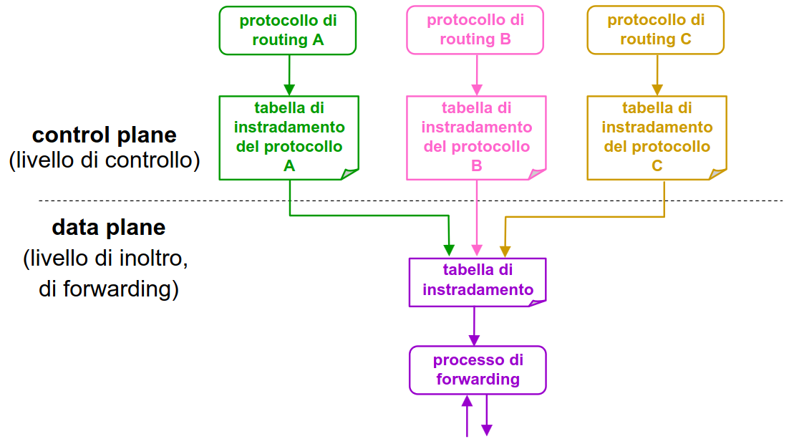
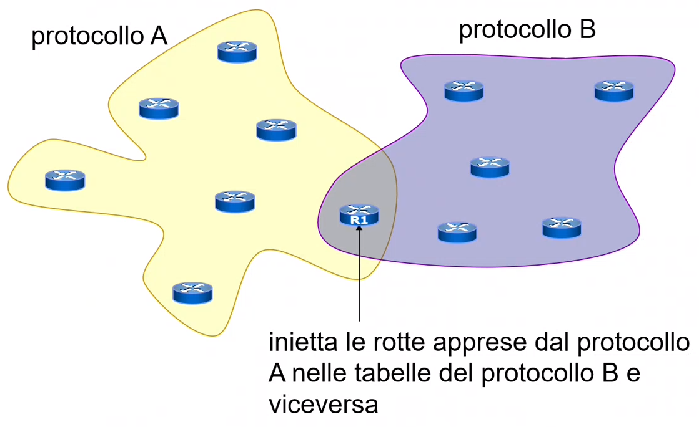
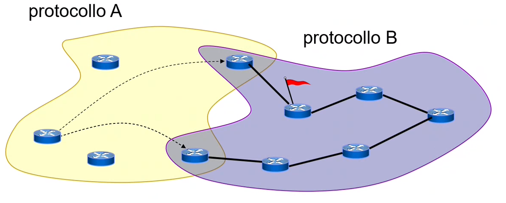
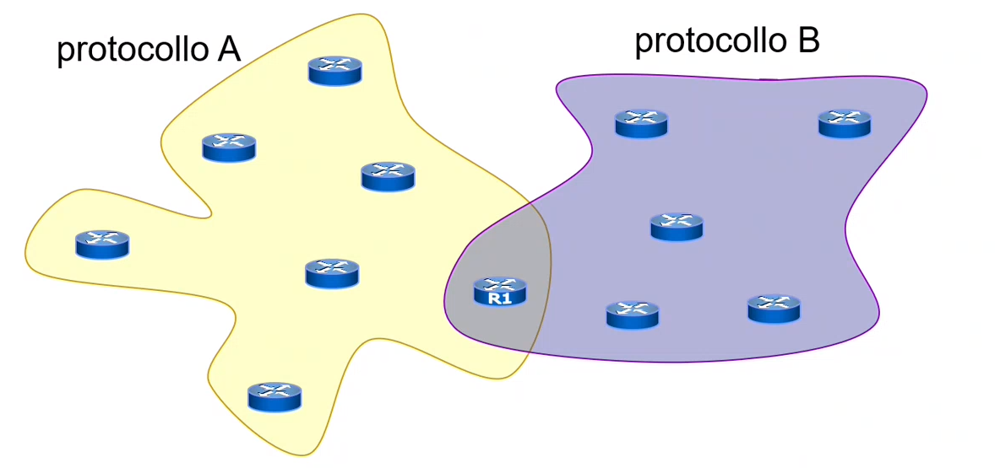
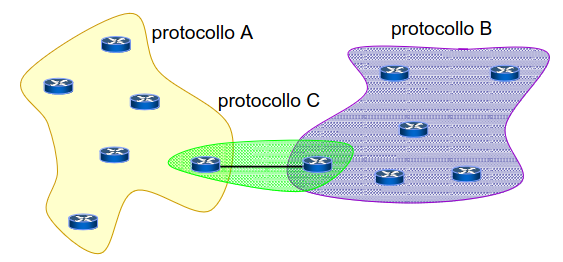

# 11 Ottobre

Argomenti: BGP, Is-Is, dual-stack
.: Yes

## Is-Is : Intermediate System to Intermediate System

- protocollo `lsp`, simile ad `OSPF`.
- Le aree sono definite in modo diverso, la frontiera tra 2 aree adiacenti non passa attraverso i router ma attraverso i link.

---

## Protocolli di rete e di routing

- Un protocollo di `rete`:
    - definisce uno schema di indirizzamento, determina il formato del pacchetto di rete, offre un servizio di consegna ai protocolli del livello di trasporto, fa tipicamente uso di tabelle di instradamento
- Un protocollo di `routing`:
    - si ispira a un algoritmo di routing (es. `dv`,`lsp`) e fa riferimento a uno specifico protocollo di `rete`. Quindi per ogni protocollo di rete ci possono essere più protocolli di routing.

---

Sia gli end-system (computer) che gli intermediate system (router) possono ospitare più protocolli di rete diversi, se ne ospitano 2 allora vengono chiamate macchine `dual-stack`.

- `end-system` dual stack: hanno 2 pile protocollari che corrispondono a 2 librerie API e le applicazioni devono scegliere quale pila usare.
- `intermediate-system` dual stack: sono in grado di instradare pacchetti relativi ad entrambi i protocolli di rete.

---

Ogni protocollo di routing fa riferimento ad un solo protocollo di rete, mentre diversi protocolli di routing possono far riferimento al medesimo protocollo di rete.

Ogni protocollo di routing gestisce indipendentemente i suoi dati (tabella di routing, un database lsp, ecc..); le tabelle di routing dei vari protocolli di routing contribuiscono a determinare la tabella di routing utilizzata per l’inoltro dei pacchetti.

Nella figura è mostrato come sono divisi il livello di controllo e il livello di inoltro.

La tabella di instradamento nel `data plane` è quello che si usa effettivamente mentre quelli nel `control plane` sono le possibili scelte in base al protocollo di routing utilizzato.

- `data-plane`: inoltro effettivo dei pacchetti
- `control-plane`: ciò che controlla la costruzione delle tabelle di instradamento

Tra protocolli di routing sulla stessa macchina ci può essere comunicazione

L’amministratore può governare i passaggi di rotte da un protocollo ad un altro. Le rotte trasferite vengono viste dal protocollo ricevente come rotte `statiche`.

Il router `R1` ridistribuisce nel protocollo `A` le rotte apprese dal protocollo `B` e nel protocollo `B` le rotte apprese dal protocollo `A`.

Non sempre il cammino scelto per raggiungere una destinazione remota è necessariamente un cammino minimo.

---

## EGP - Exterior Gateway Protocols

Sono fatti per far parlare tra di loro diversi Internet Service Provider.

La rete è divisa in diverse parti e in ogni parte si usa il protocollo preferito da ciascun service provider. Il problema è capire quale è il router `R1`.

Gli `EGP` nascono per risolvere questo problema; quando c’è da gestire un accordo tra provider non si vuole avere in comune un apparecchiatura complicata, la cui gestione può comportare problemi di responsabilità condivisa, ma si preferisce avere una zona di demarcazione che è un filo.

Su questo filo i 2 router si parlano attraverso protocolli `EGP`.

- simile a `distance vector` ma solo con indicazione di raggiungibilità, non si usa nessuna metrica.

---

## BGP - Border Gateway Protocol

- Questo protocollo è un `EGP`.