# 12 Aprile

Argomenti: Conflict-Serializzabilità, Controllo di concorrenza, Ghost-update, Livelli di isolamento, Lost-update, Phantom, Teoria del controllo di concorrenza, View-Serializzabilità
.: No

## Controllo di concorrenza

La concorrenza è fondamentale perche si hanno molte transazioni al secondo e soprattutto non possono essere seriali, cioè ognuna deve essere eseguita per intera senza azioni intercalte.

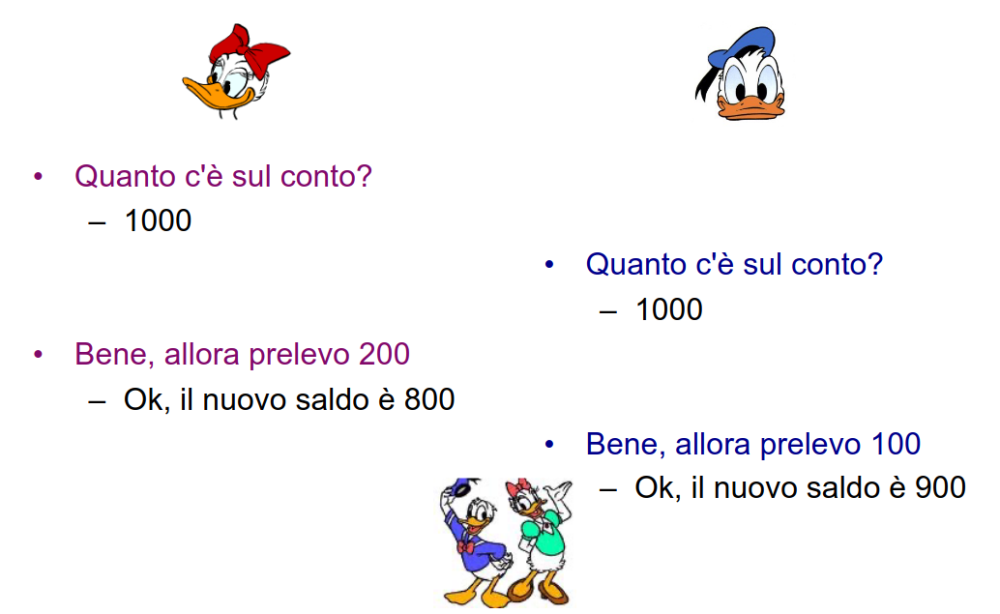

Per esempio questo problema può avvenire quando si fanno 2 prelevamenti contemporanei da un conto bancario

## Perdita di aggiornamento (lost update)

$$
t_1:r(x),x=x-200,w(x)\\
t_2:r(x),x=x-100,w(x)
$$

Leggendo la situazione in modo più formale si hanno 2 transazioni che leggono lo stesso valore condiviso e poi va a scrivere il nuovo valore

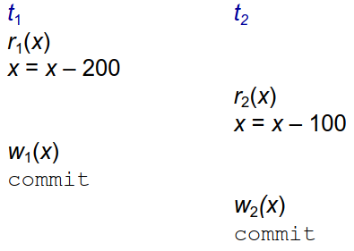

Qui viene spiegato graficamente, dove un aggiornamento viene perso perchè alla fine x=900. Quindi un aggiornamento viene completamente ignorato

### Lettura sporca (dirty read)

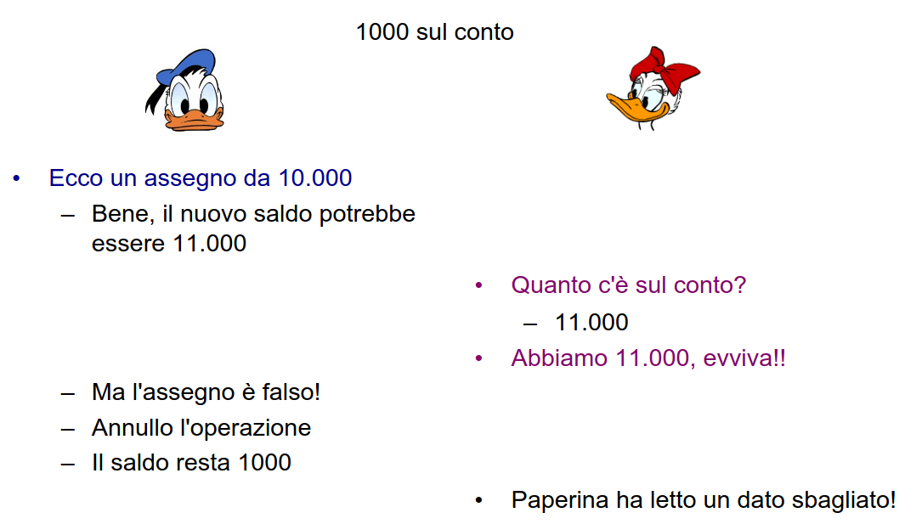

E’ importante vedere anche dal punto di vista della concorrenza cosa succede nel caso di fallimento di un commit.

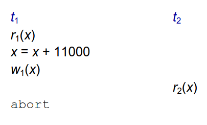

Questa anomalia è chiamata `dirty-read`, in sostanza $t_2$ ha letto uno stato intermedio e lo può comunicare all’esterno

## Aggiornamento fantasma (ghost update) - lettura inconsistente con la basi di dati

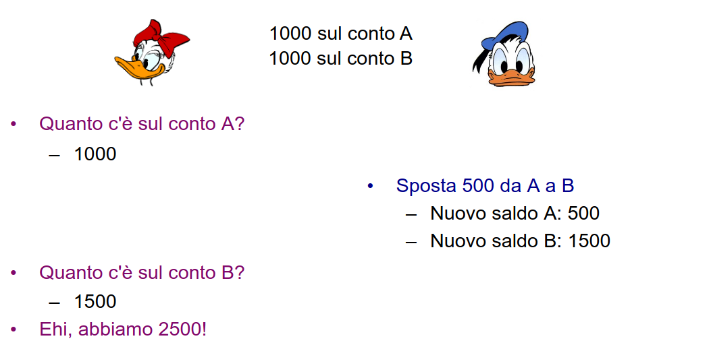

In questo caso si hanno 2 conti, il problema è che si è letto $y$ prima della transazione e $z$ dopo la transazione, infatti la somma $y+z$ è incoerente

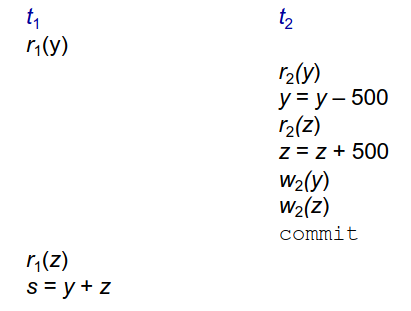

In sostanza $t_1$ vede uno stato non esistente o non coerente.

## Aggiornamento fantasma (ghost update) - caso ancora più semplice

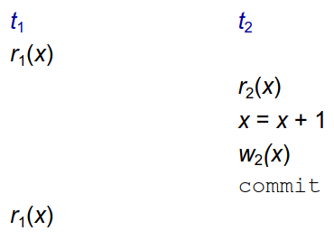

In questo caso la transazione $t_1$ legge 2 volte diversi valori per $x$

## Inserimento fantasma (phantom)


In questo caso il problema viene violata la proprietà di isolamento perche $t_1$ viene influenzata dalle modifiche di $t_2$

## Anomalie

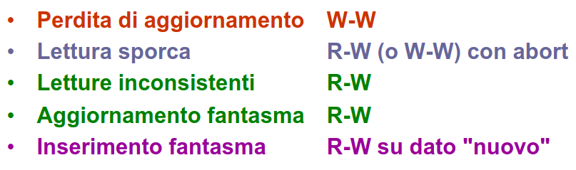

Le anomalie possono essere riassunte in questa immagine

## Livelli di isolamento

La gestione del controllo della concorrenza è costosa ma se non serve si può anche rinunciarsci. Questa gestione è per le letture non per le scritture. Le transazioni possono essere definite `read-only`. Il `livello di isolamento` può essere scelto per ogni transizione:

- `read-uncommitted`: permette le letture sporche, lettute incosistenti e inserimenti fantasma
- `read-committed`: evita letture sporche ma permette letture incosistenti e inserimenti fantasma
- `repeatable-read`: evita tutte le anomalie esclusi gli inserimenti fantasma
- `serializable`: evita tutte le anomalie


Ogni livello di isolamento evita le anomalie che lo precedono nell’elenco e permette quelle che lo seguono

---

## Esercizio

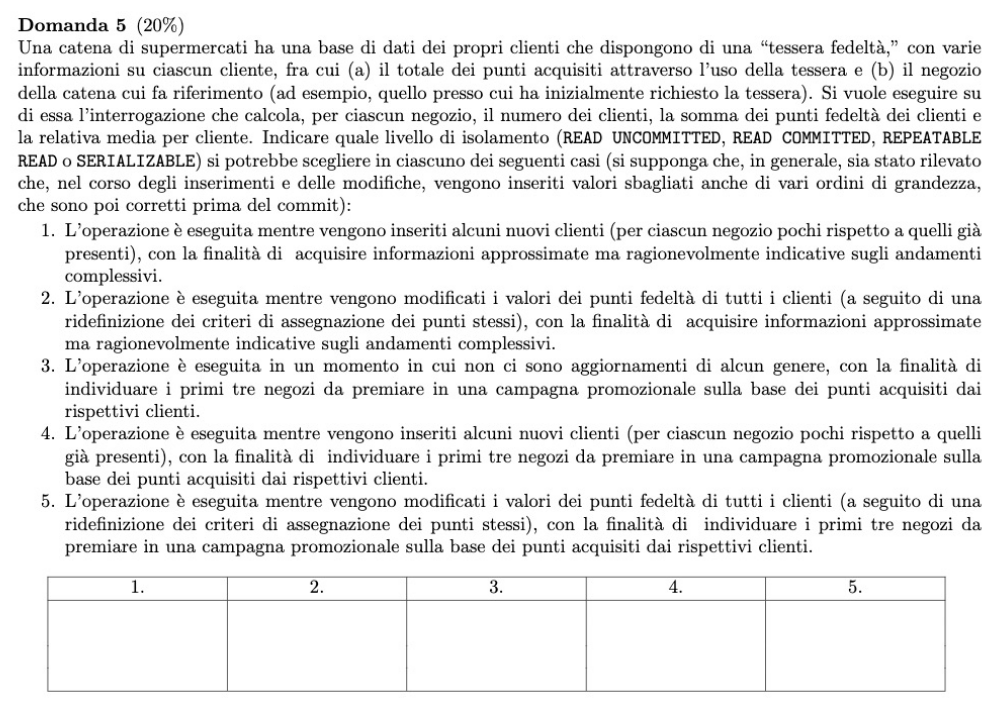

```sql
Clienti(Codice,Negozio,Punti)

SELECT Negozio
			 count(*) as numClienti,
       sum(Punti) as totalePunti,
       sum(Punti)/count(*) as MediaPunti
FROM Clienti
Group BY Negozio
```

(3) l’operazione è eseguita in un momento in cui non ci sono aggiornamenti di alcun genere, si vogliono individuare i primi 3 negozi da premiare sulla base dei punti acquisiti dai rispettivi clienti. Il livello di isolamento che si può pensare di utilizzare per questa transazione è quella che permette tutto perchè tanto se nella basi di dati non ci sono aggiornamenti il controllo della concorrenza non serve → `read-uncommitted`

(1) l’operazione è eseguita mentre vengono inseriti alcuni nuovi clienti con la finalità di acquisiste informazioni approssimate ma ragionevolmente indicative sugli andamenti complessivi. Non si usa `read-uncommitted` perché basta un inserimento “strano” per cambiare tutto. A questo punto si controlla se può bastare `read-committed` perchè se gli inserimenti sono pochi allora le statistiche non hanno un cambiamento grossolano quindi va bene questa opzione.

(2) l’operazione è eseguita mentre vengono modificati i valori dei punti fedeltà di tutti i clienti con la finalità di acquisiste informazioni approssimate ma ragionevolmente indicative sugli andamenti complessivi. In questo caso `repeatable-read` perchè non ci sono inserimenti quindi il problema di serializable non si pone però sono modificati tutti quanti i dati.

(4) l’operazione è eseguita mentre vengono inseriti alcuni nuovi clienti (per ciascun negozio porchi rispetto a quelli già presenti) con la finalità di individuare i primi 3 negozi da premiare sulla base dei punti acquisiti dai rispettivi clienti. Se si vogliono i primi 3 si vogliono dati precisi, ci sono inserimenti quindi deve essere per forza `serializable`

(5) l’operazione è eseguita mentre vengono modificati i valori dei punti fedelta di tutti i clienti (a seguito di una redifinizione dei criteri di assegnazione dei punti stessi), con la finalità di individuare i primi 3 negozi da premiare in una campagna promozionale sulla base dei punti acquisiti dai rispettivi clienti. Qui vale `repeatable-read`.

---

## Teoria del controllo di concorrenza

La transazione è una sequenza di letture e scritture e conclusione, ogni transazione ha un identificatore univoco

L’obbiettivo del `controllo di concorrenza` è evitare le anomalie; sicuramente lo schedule seriale non presenta anomalie, se lo schedule seriale è corretto l’obbiettivo è accettare schedule che si comportano come schedule seriali. Il `controllore di concorrenza` è un sistema che accetta o rifiuta le operazioni richieste dalle transazioni.

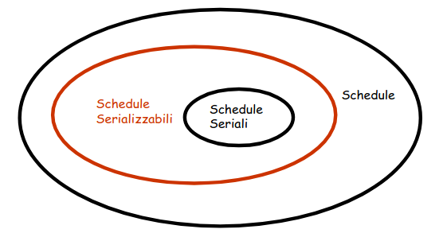

L’obbiettivo è quello quindi di ammettere solo schedule serializzabili

Questa cosa non è cosi semplice perché la verifica della serializzabilità è computazionalmente pesante.

## View-Serializzabilità

Per definire l’equivalenza di chedule sono necessarie 2 proprietà:

- $w_i(x)$ in uno schedule $S$ è `scrittura-finale` se è l’ultima scrittura dell’oggetto $x$ in $S$
- $r_i(x)$ legge da $w_j(x)$ in uno schedule $S$ se il valore letto da $r_i(x)$ è quello scritto da $w_j(x)$; cioè se $w_j(x)$ precede $r_i(x)$ in $S$ e non c’è $w_k(x)$ fra $w_j(x)$ e $r_i(x)$ in $S$
- Schedule $S_i$ e $S_j$ sono `view-equivalenti` se si hanno le stesse `scritture finali` e la stessa relazione `legge-da`

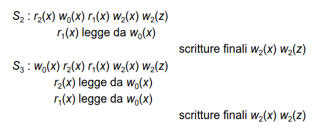

Queste 2 transazioni non sono equivalenti

## Conflict-serializzabilità

La definizione formale è che 2 azioni sono in conflitto se $i\neq j$, sono azioni sullo stesso oggetto e almeno una di loro è una scrittura, quindi ci sono 2 casi: conflittto `read-write` e `write-write`.

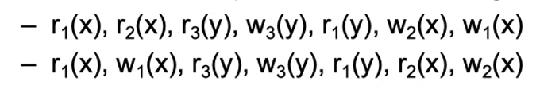

Dati questi 2 schedule


Qui sono mostrati i conflitti

Schedule $S_i$ e $S_j$ sono `conflict-equivalenti` se ogni coppia di operazioni in conflitto ha nei 2 schedule il medesimo ordine. Uno schedule è `conflict-serializzabile` se esiste uno schedule seriale conflict-equivalente ad esso.

Si indica con `CSR` l’insieme degli schedule conflict-serializzabili