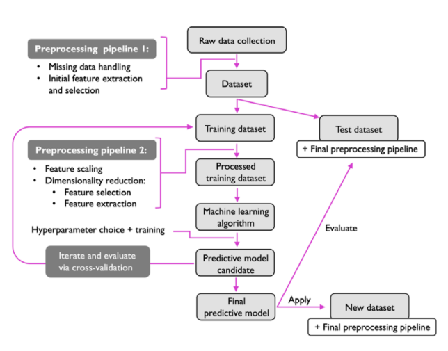
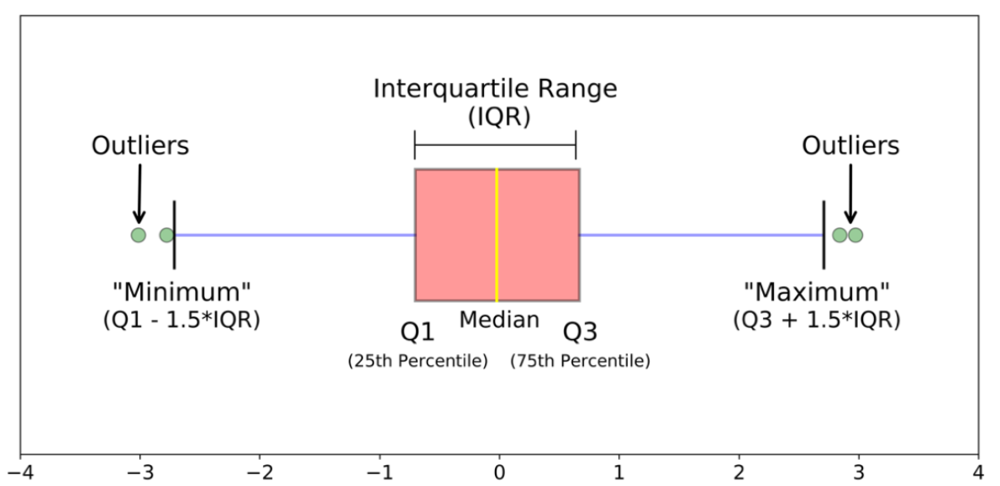

# 12 Aprile

Argomenti: Box-plot, Data Cleaning, Feature Scaling, Normalization, Predictive Modeling Workflow, Size Reduction, Standardization, Valutazione performance
.: Yes

## Predictive Modeling Workflow

Ci sono 3 step principali che servono per ottenere un buon modello predittivo:

- `preprocessing pipeline 1`
- `preprocessing pipeline 2`
- `iterate and evaluate via cross-validation`

## Preprocessing - Data cleaning

Prima di addestrare il modello si elabora il dataset che si da in input facendo `cleaning` cioè ci si occupa di dati che abbiano molto rumore, che siano errati oppure convertire tipi di in formati più adatti ai modelli di ML.

## Preprocessing - Normalization

Questo step ha anche lo scopo di migliorare computazionalmente le prestazioni del modello procedendo alla `normalizzazione` o `standardizzando` le caratteristiche in 2 modi:

- si mette tutto nell’intervallo $\left[0,1\right]$
- si cerca di organizzare il dataset con una distribuzione normale standard con media zero e varianza unitaria

Questi procedimenti possono essere ripetuti anche durante l’addestramento, operando sui dati derivati da quelli d’input.

## Preprocessing - Size Reduction

Alcune caratteristiche, cioè feature, sono altamente correlate fra loro quindi si utilizzano tecniche di `riduzione di dimensionalità` che sono utili per comprimere le caratteristiche in un sottospazio di dimensioni inferiori.

---

## Standardizzazione e Normalizzazione - feature scaling

La `scalatura` delle caratteristiche, può essere effettuata facendo standardizzazione oppure normalizzazione a seconda della distribuzione dei dati.

- `standardizzazione`: i valori dei dati vengono ridimensionati per adattarsi ad una distribuzione tra 0 e 1, utilizzando la `media` e `deviazione-standard`.
- `normalizzazione`: corrisponde allo `z-score` normalization cioè $\frac{x-media}{varianza}$

La domanda da porsi è quando usare la standardizzazione oppure quando usare la normalizzazione. 

- `standardizzazione`: utilizzata quando i dati seguono una distribuzione gaussiana, ed è spesso utilizzata quando il modello viene riaddestrato con nuovi dati utilizzando quindi valori di media e deviazione standard diversi da quelli precedenti.
- `normalizzazione`: utilizzata quando i dati non seguono una distribuzione gaussiana, convertendo i valori nell’intervallo $\left[0,1\right]$

Le normalizzazioni non si adattano alla presenza di `outliers` perché se un outlier è troppo lontano l’intervallo dove si trovano le informazioni importanti lo si comprime troppo. Invece nella standardizzazione non c’è problema.

---

## Box plot o box-and-whisker

Visto che serve vedere la distribuzione dei dati si usa il `box-blot` che mostra tipicamente per una singola caratteristica la distribuzione dei dati.

I `quartili` dividono un insieme in quattro parti di uguale numerosità.

Il `IQR` rappresenta il primo e terzo quartile, mentre la riga che divide questo box è il 2 quartile che costituisce la `mediana`.

I `whiskers` si estendono per mostrare il resto della distribuzione e si trovano spesso a distanza 1.5 rispetto a Q1 e Q3

Utilizzando l’approccio John Turkey si considera anomalo (`outliers`) qualsiasi datapoint che oltrepassi i whiskers.

Di seguito sono mostrati i procedimenti per visualizzare la distribuzione dei dati rispetto a una feature e la visualizzazione degli outliers.

- Dato un dataset si estrae il valore minimo, massimo e mediana, dove quest’ultima determina il centro di `IQR`.
- `Q1` e `Q3` sono il primo 25% e ultimo 25% di valori. (I valori vengono prima ordinati)
- I `whiskers` si determinano tramite il range interquartile che si calcola come la differenza di 2 quartili: $IRQ=Q_3-Q_1$, da cui si ottengono `whiskers-sx` come $Q_1-1.5\cdot IQR$ e `whiskers-dx` come $Q_3+1.5\cdot IQR$.

Grazie a questi box si possono distinguere il posizionamento centrale dei dati, lo spread dei dati dalla grandezza del IQR e dei baffi, e infine la simmetria dai baffi.

Visto che si possono vedere dove si trovano gli outliers si potrebbe procedere alla rimozione di questi ma la normalizzazione e standardizzazione non sono adatte a questa operazione.

## Valutazione performance

Le prestazioni di un modello possono essere valutate in diversi modi: `MAE`, `MSE`, `RMSE` e diversi altri modi.

- `Mean Absolute Error`: l’idea è quella di evitare che errori positivi e negativi si annullino tra di loro.
- `Mean Squared Error`: ha la stessa idea della `MAE` ma in questo caso si da più peso agli errori di grandi dimensioni e meno agli errori di piccoli dimensioni.
- `R^2`: Il coefficiente di determinazione rappresenta la proporzione della varianza dell’output ottenuto dal modello.
    
    $$
    1-\dfrac{\sum(y_i-\widehat{y}_i)^2}{\sum(y_i-\overline{y}_i)^2}
    $$