# 12 Dicembre

Argomenti: Computer Vision, Illusioni Ottiche, Modello Pinhole, Sistemi a Lenti
.: Yes

## Computer Vision

Consente ai computer di `interpretare` un’immagine, ossia a dare un senso a ciò che un’immagine o un video contiene

## Illusioni ottiche

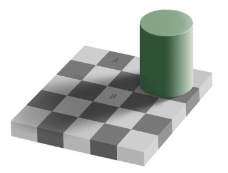

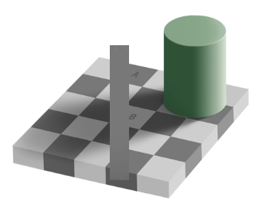

In questo esempio viene mostrato che `vedere` non è lo stesso che `misurare` determinate proprietà dell’immagine.

## Formazione immagini

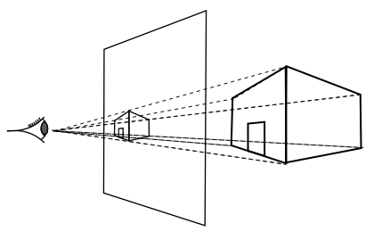

- l’edificio è l’oggetto presente nell’ambiente
- il piano è il punto di vista
- il punto di vista (l’occhio) fa la trasformazione da 3D a 2D

Questo significa che la prospettiva cambia il punto di vista

## Richiami di ottica

- `ottica ondulatoria`: si occupa di fenomeni ottici in cui non è possibile trascurare le caratteristiche ondulatorie del campo elettromagnetico della luce
- `ottica geometrica`: si occupa di fenomeni ottici sotto l’ipotesi semplificativa che la luce si propaghi sotto forma di raggi rettilinei

In questa immagine è mostrata la riflessione e rifrazione

- per la `riflessione` si ha che l’angolo di incidenza è uguale all’angolo di riflessione
- la legge della `rifrazione` è:

$$
n_1sin(\alpha_1)=n_2sin(\alpha_2)
$$

dove $n_1$ e $n_2$ sono gli indici di rifrazione del mezzo 1 e del mezzo 2 relativi al vuoto.

## Modello pinhole

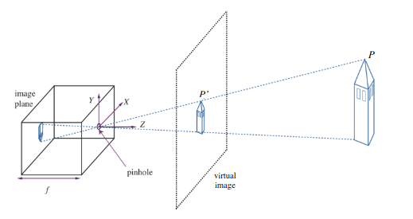

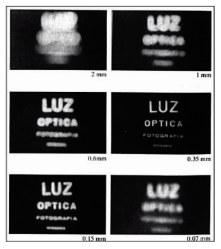

Questa è un immagine ottenuta mediante foro `stenopeico`.

La dimensione del foro è molto importante ai fini della formazione dell’immagine. Il foro deve essere sottile e stretto con un diametro:

$$
d=1.9\cdot\sqrt{f\cdot \lambda}
$$

dove $f$ sta per lunghezza focale e $\lambda$ lunghezza d’onda della luce.

Nella seconda immagine è mostrato come i diversi valori di $d$ influenzano la qualità dell’immagine

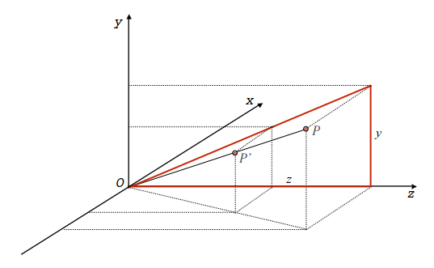

$$
\dfrac{y}{z}=\dfrac{y'}{f}\\[5pt]
y'=f\dfrac{y}{z}
$$

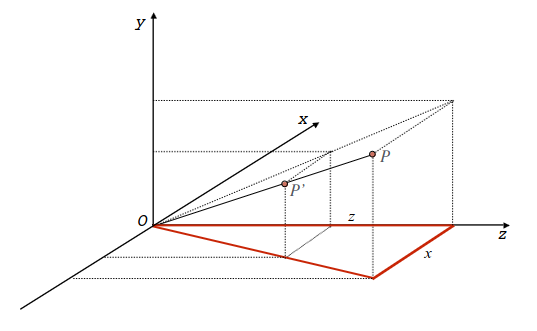

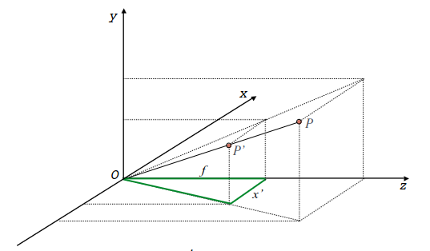

$$
\dfrac{x}{z}=\dfrac{x'}{f}\\[5pt]
x'=f\dfrac{x}{z}
$$

$$
\begin{cases}
x'=f\dfrac{x}{z}\\[10pt]
y'=f\dfrac{y}{z}
\end{cases}
$$

queste sono le equazioni fondamentali di proiezione prospettica

se si considera il piano dell’immagine, dove l’immagine è invertita le equazioni hanno un meno davanti

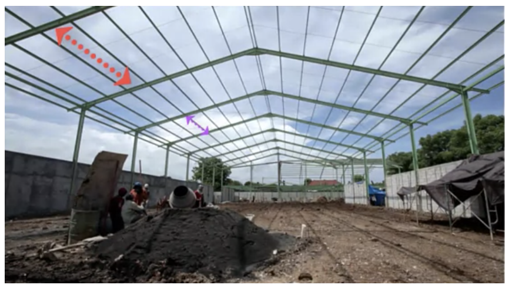

Dalle formule precedenti si deduce che più l’oggetto è lontanto più la sua immagine rappresentata diventa piccola

Per esempio la lunghezza dei tratti evidenziati è la stessa anche se nell’immagine il tratto più lontano appare corto.

## Punto di fuga

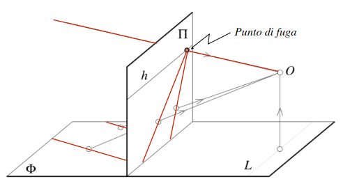

Ogni punto P della retta passante per il punto di fuga ha coordinate $(x,y,z)$ che possono essere espresse come segue:

→ per  $(\lambda \in[-\infty,+\infty])$

$$
x=x_0+\lambda u\\
y=y_0+\lambda v\\
z=z_0+\lambda w
$$

$$
x'=f\frac{x}{z}=f\frac{x_0+\lambda u}{z_0+\lambda w}\\[10pt]
y'=f\frac{y}{z}=f\frac{y_0+\lambda v}{z_0+\lambda w}
$$

Le coordinate di un punto $P'$, punto immagine di P sul piano $\pi$ sono mostrate di seguito

Se si fa il limite per $\lambda$→$\pm\infty$ e $w\ne0$ si ottengono le coordinate del punto di fuga

Le rette con la stessa direzione hanno lo stesso punto di fuga

## Sistemi a Lenti

Gli stenoscopi focalizzano bene la luce ma, essendo il foro di apertura stretto, la quantità di luce che lo attraversa è piccola. Essi pertanto richiedono un tempo di esposizione molto lungo.

Una soluzione a tale problema consiste nell’utilizzare un `sistema a lenti` che permette l’ingresso di molta più luce. Questo sistema è in grado di focalizzare la luce che proviene solo da punti che rientrano in un certo intervallo di profondità (`profondita di campo`) rispetto alle lenti. Il piano all’interno di questo intervallo, in cui si ha la massima nitidezza, è detto `piano focale`.

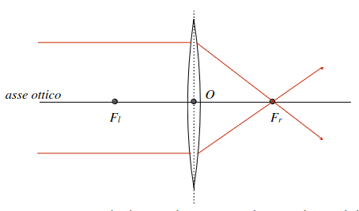

Ogni raggio di luce che entra da un lato della lente parallelamente all’asse ottico viene deviato verso il fuoco che si trova dall’altro lato

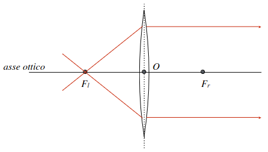

Stessa cosa quando ogni raggio di luce che entra passando per il fuoco, esce dall’altro lato parallelo all’asse ottico

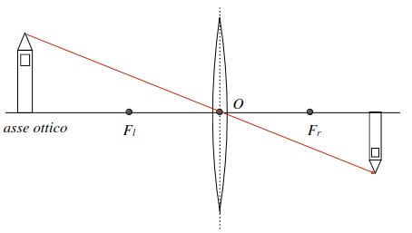

Ogni raggio di luce che passa per il centro della lente non viene deflesso

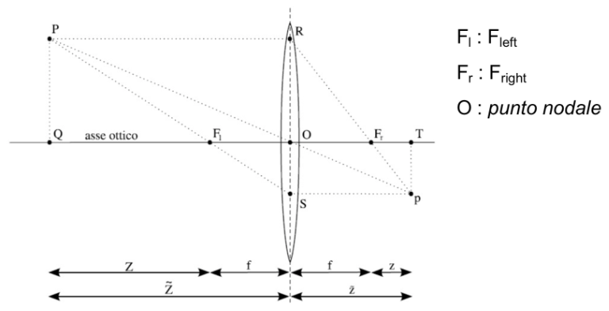

In questa immagine vengono riassunti tutti e 3 le proprietà. Di seguito è mostrata l’`equazione fondamentale delle lenti sottili`.

$$
\frac{1}{\widetilde{Z}}+\frac{1}{\widetilde{z}}=\frac{1}{f}
$$

In conclusione, l’immagine di un oggetto che si trova nella scena a distanza $\widetilde{Z}$ è prodotta a una distanza fissa $\widetilde{z}$ dalla lente. La relazione tra $\widetilde{Z}$ e $\widetilde{z}$ è data dalla equazione fondamentale delle lenti sottili.

Ricapitolando $\widetilde{Z}$ è la distanza dell’oggetto, $\widetilde{z}$ è la distanza dell’immagine e $f$ è la lunghezza focale della lente. Dato che solitamente $\widetilde{Z}$ è molto maggiore di $\widetilde{z}$ e di $f$ si può fare la seguente approssimazione $\widetilde{z}\simeq f$

Una lente è in grado di mettere a fuoco solo una sezione della scena parallela al piano immagine, cioè la scena non può essere tutta a fuoco nello stesso momento.

## Diaframma

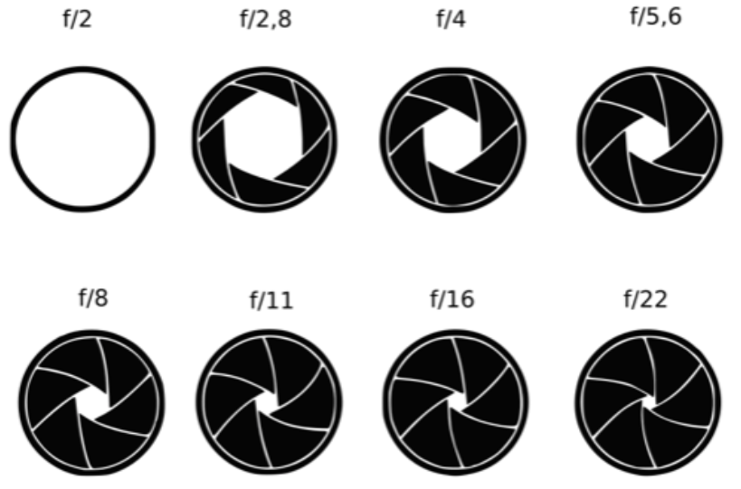

All’interno di un obiettivo è presente un `diaframma` regolabile ed è costituito da una serie di lamelle metalliche sovrapposte il cui movimento allarga o stringe l’apertura per il passaggio della luce.

Le varie aperture del diaframma sono indicate da numeri $f$ e questo numero è definito come il rapporto della lunghezza focale e il diametro effettivo dell’apertura

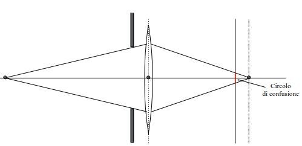

A parità di altre condizioni (lunghezza focale, punto di ripresa) la profondità di campo dipende dall’apertura del diaframma.

## Angolo di campo

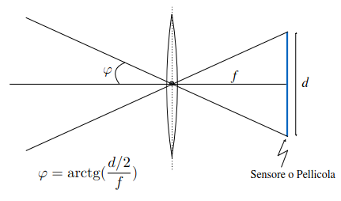