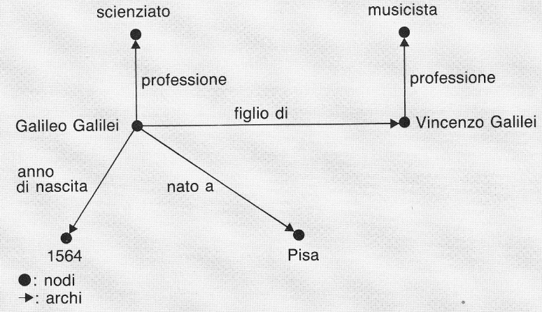
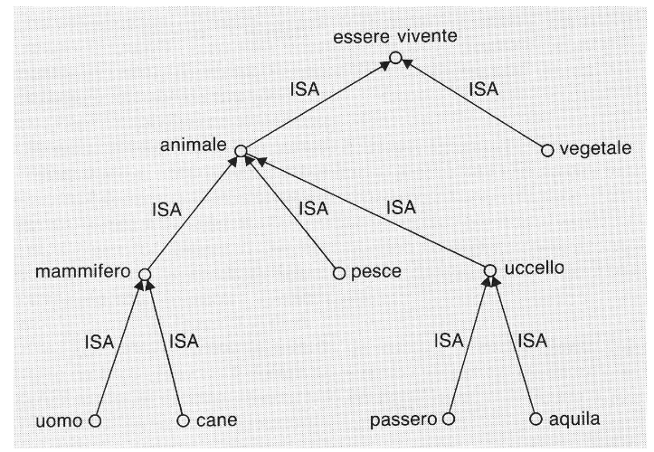
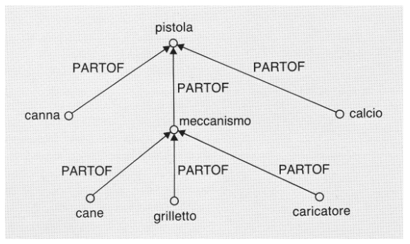
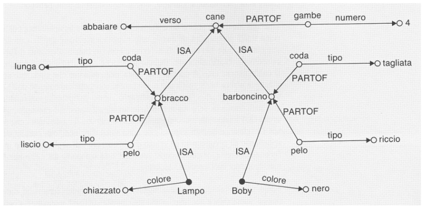
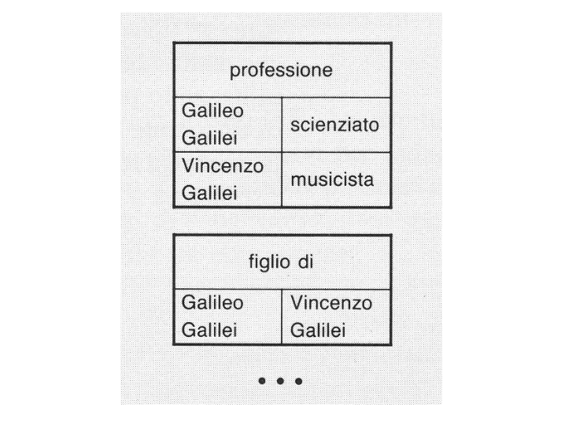

# 12 Gennaio

Argomenti: Conoscenza, Reti Semantiche
.: Yes

## Aspetti rilevanti per la risoluzione di problemi

Esistono 2 aspetti concettualmente distinti nella risoluzione di problemi:

- `euristico`: riguarda metodi per la ricerca automatica per la soluzione
- `epistemologico`: riguarda il modo in cui viene rappresentato il problema nel calcolatore

Quando la rappresentazione di un problema si complica anche l’aspetto euristico si fa più complesso; per risolvere problemi di questa complessità un sistema artificiale deve essere in grado di operare su grandi quantitativi di informazioni, ricavandone dati utili tramite veri e propri **ragionamenti**. Questo porta al concetto di `conoscenza`.

In pratica si vuole avere un IA che è in grado di collegare i tipi di informazioni a suo possesso e di ragionare ricavando nuovi dati dalle informazioni in suo possesso.

## L’oggetto della conoscenza

Il problema della struttura della conoscenza è molto importante, per prima cosa si assume che le conoscenze siano distinte in base all’argomento (anche chiamato `dominio`). Inoltre all’interno di un dominio specifico, gli esseri umani possiedono conoscenze su `entità` di tipo diverso, anche se non è possibile dare un catalogo esaustivo di tutti i tipi di entità possibili.

Un primo tipo di entità è costituito dagli `oggetti`, la proprietà principale di questi oggetti è la loro esistenza indipendente dalle situazioni che si incontrino. Tuttavia le proprietà non valgono eternamente nel tempo perché in genere gli oggetti nascono e muoiono, occorre quindi discutere fra gli oggetti intesi come `classi` o come `individui`.

Dati degli oggetti si conoscono in generale `proprietà` e `relazioni` con altri oggetti e quando queste 2 sussistono si conoscono i `fatti`. Grazie a questi si possono elencare tutti i fatti che possono essere veri, alcuni però cambiano nel tempo e questi tipi di fatti vengono chiamati `eventi` dove l’agente che provoca l’evento intenzionalmente produce `azioni`.

In genere ci interessa conoscere perché un evento determinato è avvenuto, qui entra in gioco la conoscenza delle `connessioni causali` fra eventi.

## Rappresentazione della conoscenza

Dal punto di vista dell’IA, la questione è come si possono rappresentare nel calcolatore le conoscenze relative ad un dominio determinato, in modo che queste conoscenze possano essere sfruttate per risolvere efficacemente dei problemi.

Ci sono 2 caratteristiche da tenere in considerazione e sono il `livello di dettaglio` e il `punto di vista`.

## Metodi per la rappresentazione e l’uso della conoscenza

- logica
- reti semantiche
- frames
- sistemi di produzione
- case-based reasoning

---

## Reti Semantiche

Le `reti semantiche` sono state utilizzate per costruire modelli della memoria umana

Una `rete semantica` è costituita da un insieme di `nodi` collegati fra loro da `archi`, sia i nodi che gli archi sono contrassegnati da un’`etichetta`, che serve ad attribuire loro un significato. Di solito i nodi rappresentano classi di oggetti, oggetti individuali, situazioni o eventi, gli archi esprimono invece relazioni fra le entità rappresentate dai nodi

## Relazioni nelle reti semantiche

La scelta delle entità da associare ai nodi e agli archi è a priori arbitraria e dipende dagli scopi per cui la rete viene costruita. Ci sono però alcune relazioni molto importanti.

relazione `ISA`: dall’inglese “is a” e viene utilizzata per esempio quando si dice [Verdi è un italiano] oppure [gli italiani sono europei], fra questi 2 casi ci sta differenza perché usando il linguaggio della teoria degli insiemi si distinguerebbero i 2 casi scrivendo: [verdi $\in$ italiani] e [italiani $\sub$ europei].

sfruttando la proprietà transitiva della relazione `ISA` è possibile costruire rappresentazioni gerarchiche

relazione `PARTOF`: dall’inglese “parte di” e viene utilizzata quando si desidera analizzare la struttura di un oggetto

anche la relazione `PARTOF` è transitiva e quindi consente di costruire rappresentazioni gerarchiche

L’esempio nella figura utilizza le 2 relazioni e altre permettendo di utilizzare la relazione `ISA` per ereditare le relazioni associate a un altro nodo

Consente in questo modo di realizzare notevoli economie di memoria nella rappresentazione di certi domini

## Motivi di successo

Uno dei motivi di successo delle reti semantiche è sicuramente costituito dalla possibilità di darne una rappresentazione grafica molto suggestiva. Naturalmente questo aspetto è del tutto irrilevante per il calcolatore; chi ne attribuisce significato sono i programmi che le utilizzano.

L’uso di queste reti permette di avere programmi differenti che utilizzano la stessa rete per risolvere problemi di natura diversa.

## Rappresentazione delle reti

In questo tipo di rappresentazione si usano le tabelle.

Ogni tabella rappresenta una relazione e contiene la lista delle coppie di nodi collegate dagli archi relativi

In questo tipo di rappresentazione ci si basa su strutture a puntatori consentendo una elaborazione più efficiente

Ogni nodo viene rappresentato da una struttura che rimanda mediante puntatori ai nodi collegati; si fa notare che per ogni arco ci sono 2 puntatori per far in modo che si possono percorrere nei 2 sensi