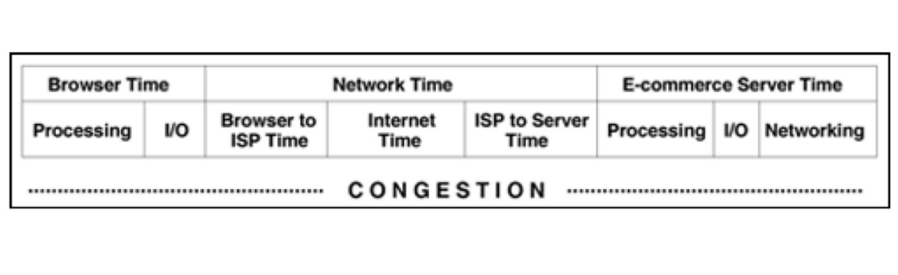
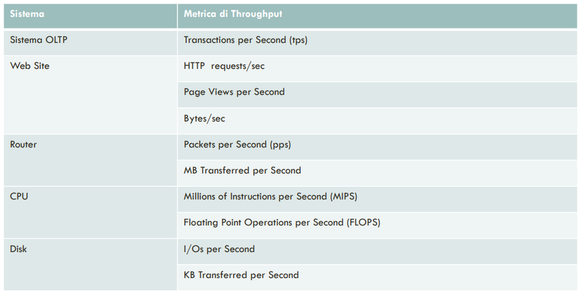
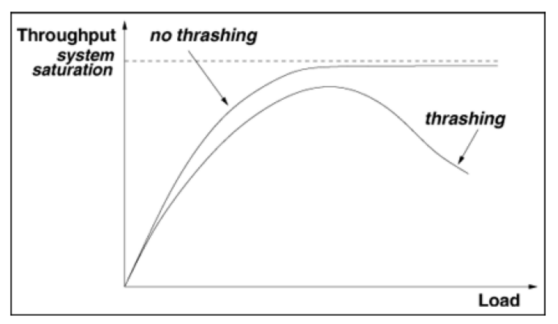
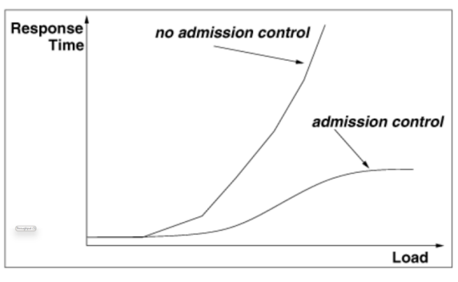
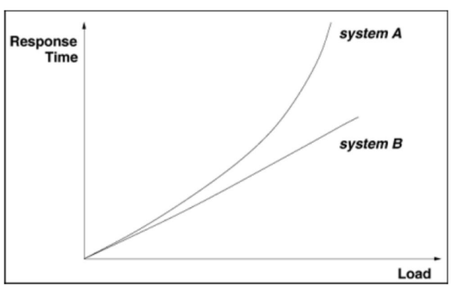
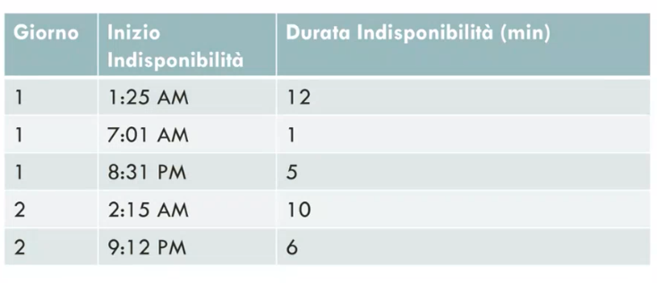

# 12 Maggio 2025

Text: Availability, Quality of Service, Scalability, Tempo di Risposta, Troughput

## Quality of service

I sistemi basati su internet e IT sono pervasivi, bisogna fare in modo che funzionino correttamente e che siano garantite le performance (Tempi di risposta, troughtput, disponibilita, scalabilità). 

## Tempo di risposta

Definito come il tempo necessario ad un sistema per reagire ad una richiesta

In questa immagine vengono mostrati gli step necessari per far apparire una pagina web

## Troughput

Definito come il numero di richieste completate per unità di tempo, la sua unità di misura è specifica è dipende dal tipo di sistema preso in considerazione

Si suppone che un’operazione I/O su un disco in un sistema `OLTP` impieghi in media $10 ms$ e che il disco sia costantemente occupato, quindi che la sua utlizzazione sia pari al $100\%$.

$$
\dfrac{1}{0.01}=100\space\text{IOPS}
$$

Per calcolare il troughtput (ideale) massimo del disco si divide 1s per 0.01 che sono 10ms

Avendo lo stesso disco, se il tasso di richieste I/O è pari a 60 IOPS, quanto produce il disco? Cioè se si chiede 60 e il disco è capace di 100 quanto si produce? La risposta è 100. Se si chiede 150 non si va oltre a 100.

Esiste quindi una relazione tra il troughput e la capacità di una risorsa con il worload a quale la risorsa è soggetta.

$$
min(\text{capacità},\text{workload})
$$

Questa è una prima approssimazione non sempre vera.

Nei sistemi reali può avvenire `trashing` cioè come varia il troughput in funzione del workload. Idealmente la figura mostra che si converge a un asintoto che rappresenta la capacità delle risorsa, ma in realtà succede che se si sovraccarica la risorsa avviene `trashing` ovvero la diminuzione del troughtput. 

## Disponibilià

Sarebbe la frazione di tempo durante la quale il sistema è attivo e disponibile e i suoi utenti. Per esempio un sistema con il 99.99% di disponibilità in un periodo di 30 giorni è indisponibile per:

$$
(1-0.9999)\cdot 30\cdot 24\cdot 60=4.32\text{ min}
$$

Le cause di indisponibilià possono essere per esempio rotture di componenti hardware o software, oppure quando si hanno dei sovraccarichi di richieste.

Nel caso in cui non si adopera `admission-control` il tempo di risposta aumenta in modo esponenziale, perchè se si continuano a mandare richieste al sistema queste si accodano e quindi il tempo di risposta aumenta gradualmente.

Se si utilizzano meccanismi di `admission-control` si va a favorire quello che è il tempo di risposta a discapito della disponibilità del sistema.

## Scalabilità

Un sistema è detto scalabile se le sue prestazioni non degradano significativamente al crescere del numero dei suoi utenti o in altre parole all'aumentare del carico a cui è soggetto.

Qui vediamo due sistemi che scalano in modo differente. C'è il sistema $B$ che scala linearmente rispetto al workload a cui è sottoposto, mentre vediamo che il tempo di risposta del sistema $A$ scala esponenzialmente rispetto a quello che è il workload a cui il sistema è sottoposto.

Quello che si vuole idealmente è una linea orizzontale molto basso.

## Ciclo di vita di un sistema

L’analisi dei requisiti dovrebbe essere divisia in 2 parti:

- definizione di quelli che sono i requisiti `funzionali` dell’applicazione, cioè un insieme di funzioni che il sistema deve fornire con corrispondenti input e output
- è importante definire quelli che vengono chiamati i requisiti `non-funzionali`, cioè i requisiti che non vanno a dire come funziona qualcosa, quali sono le funzionalità che un determinato software deve esibire, ma con quale qualità dovranno essere esibite queste funzionalità.

---

## Esercizio disponibilità

Per calcolare la disponibilità $a$ di un sistema caratterizzato dai seguenti periodi di indisponibilità, si fa il rapporto del tempo di operativita e il tempo totale di osservazione

$$
a = 1-\dfrac{12 + 1 +5 + 10 + 6}{2 \cdot 24 \cdot 60}=0.9888
$$

Per questo calcolo non si tiene conto delle ore, cioè dell’inizio dell’indisponibilità.