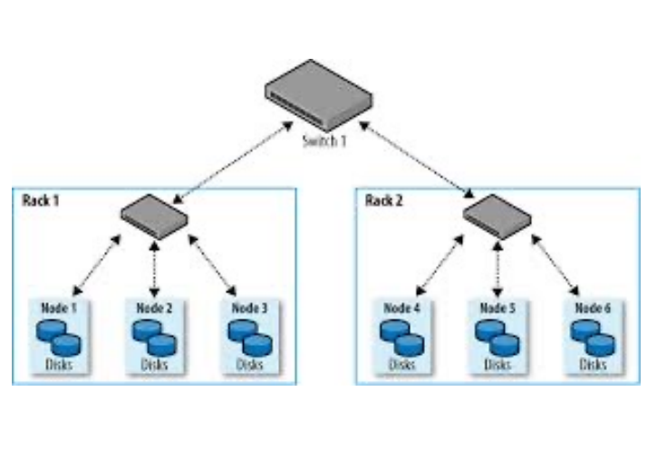
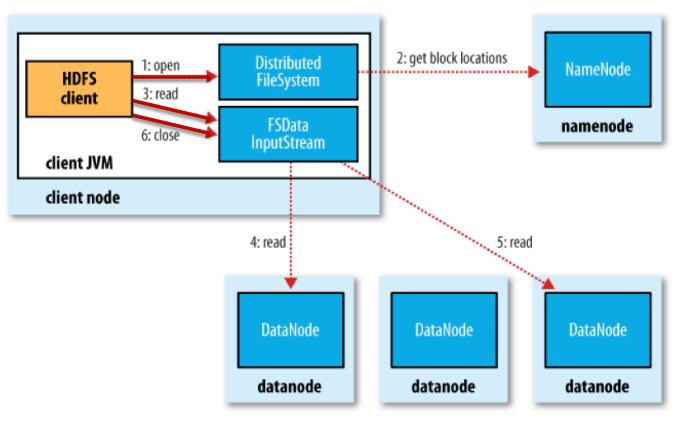
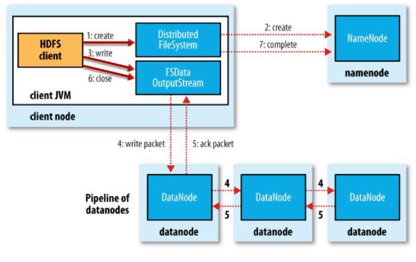
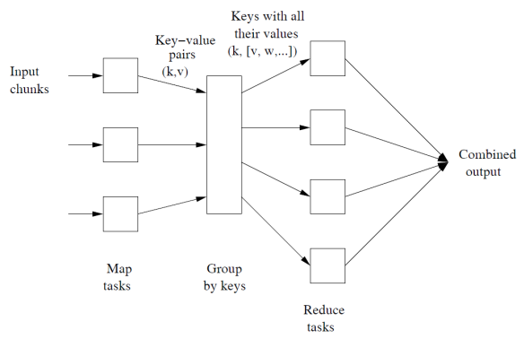
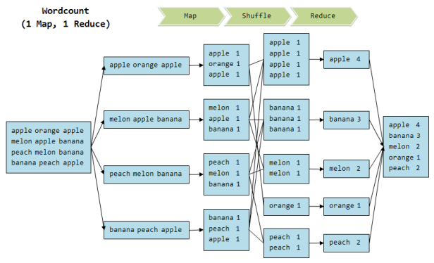
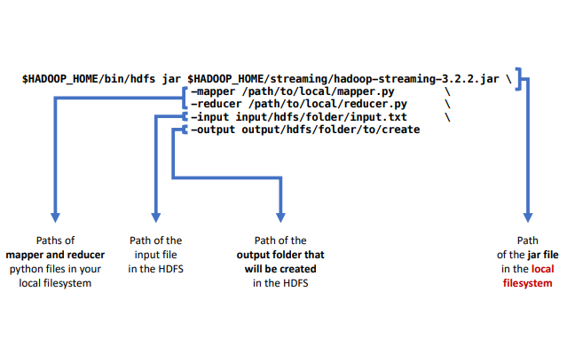
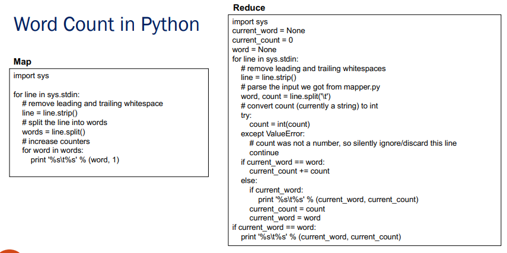

# 12 Marzo

Tags: Cluster Computing, HDFS, Map Reduce
.: No

## Paradigma Map-Reduce

La `map-reduce` è un paradigma di programmazione utilizzato per distribuire lavoro di calcolo su larga scala. Questo è un framework adatto per organizzare e svolgere tali calcoli, eseguendo i vari compiti in parallelo fornendo ridondanza e tolleranza ai guasti.

Il problema è che nel corso degli anni le dimensioni di archiviazione sono cresciuti ma la velocità di accesso ai dischi non ha avuto la stessa velocità di crescita, quindi la soluzione che viene utilizzata al momento è il `cluster-computing`.

## Cluster computing



I nodi di calcolo sono memorizzati su `rack`, in generale si hanno 8-64 nodi su un `rack`.

I nodi su un singolo `rack` sono collegati tipicamente con ethernet mentre i `rack` sono collegati da un altro livello di rete o uno switch.

I nodi di calcolo possono guastarsi, quindi quello che si fa è aggiungere ridondanza memorizzando più volte lo stesso file.

## Organizzazione del DFS

- I file sono divisi in blocchi (chiamati `shard`) e sono poi replicati su diversi nodi di calcolo.
- I nodi che contengono coppie di un blocco sono situati su `rack` diversi.
- Un file speciale (`node-master`) memorizza per ogni file, le posizioni dei suoi blocchi. Esso stesso è replicato.
- La directory del `file-system` sa dove trovare il nodo master e la stessa directory può essere replicata.

## HDFS

L’acronimo sta per `Hadoop-Distributed-File-System` ed è un sistema di file distribuito progettato per gestire grandi set di dati su hardware di consumo. Utilizza un’architettura `master/slave`, tramite questo si crea un cluster chiamato `HDFS-cluster` che ha 2 tipi di nodi:

- `namenode`: è un server master che gestisce il `file-system-namespace` e controlla l’accesso ai file da parte dei client. Conosce i `datanode` su cui sono situati tutti i blocchi di un determinato file.
- `multiple-datanode`: solitamente uno per un nodo del cluster, gestiscono lo storage collegato ai nodi su cui sono in esecuzione. Gli `shard` di un file sono memorizzati in un insieme di datanode

C’è da tenere conto che la macchina `namenode` è un `single-point-of-failure` per un cluster `HDFS`.

Quando un client vuole leggere un file oppure una porzione di essa deve prima parlare con il `namenode` per determinare dove il file è effettivamente memorizzato, il `namenode` risponde poi con gli ID dei blocchi rilevanti e la posizione in cui sono memorizzati i blocchi, cioè un insieme di `datanode`.



In questa figura viene mostrato come avviene la lettura di un file



In questa figura viene mostrato come avviene la scrittura di un file

```bash
# schema URI per accedere a file situati nei server HDFS
hdfs://hostname/path/to/file

# HDFS supporta i comandi file system UNIX
> hdfs dfs –ls /
> hdfs dfs –mkdir hdfs://myfiles
> hdfs dfs -copyFromLocal file://input/docs/1.txt hdfs://myfiles/1.txt
> hdfs dfs –cat hdfs://myfiles/1.txt
> hdfs dfs –rm hdfs://myfiles/1.txt
```

## Esecuzione della Map-Reduce

Problema tipico con grandi quantità di dati:



- `(1)` Iterare su un gran numero di record in parallelo.
- `(2)` Estrarre qualcosa di interessante da ogni iterazione.
- `(3)` Mescolare e ordinare i risultati intermedi di diverse iterazioni concorrenti.
- `(4)` Aggregare i risultati intermedi.
- `(5)` Generare l'output finale.

L’idea chiave è quello di fornire un’astrazione di 2 operazioni cioè quella di `map` e `reduce`:

- 1-2 sono l’operazione di `map`.
- 4-5 sono l’operazione di `reduce`.

Il processo di esecuzione è mostrato in dettaglio di seguito:

1. A un certo numero di compiti `map` gli vengono assegnati uno o più blocchi di dati.
2. Ogni compito `map` trasforma il blocco assegnato in una sequenza di coppie chiave-valore.
    - Il modo in cui le coppie chiave-valore vengono prodotte è determinato dal codice scritto dall'utente per la funzione Map.
3. Le coppie chiave-valore di ogni compito `map` vengono raccolte da un controller master e ordinate e raggruppate per chiave (`Shuffle and sort`).
4. Le chiavi sono divise tra tutti i compiti `reduce`, quindi tutte le coppie chiave-valore con la stessa chiave finiscono nello stesso compito `reduce`.
5. I compiti `reduce` lavorano su una chiave alla volta e combinano tutti i valori associati a quella chiave in qualche modo.
    - Il modo in cui i valori vengono combinati è determinato dal codice scritto dall'utente per la funzione `reduce`.
6. Le coppie chiave-valore di output di ogni reducer vengono scritte persistentemente nel `file-system` distribuito.
7. L'output finisce in $r$ file, dove $r$ è il numero di `reducer`.
    - Gli $r$ file spesso servono come input per un altro lavoro `map-reduce`.


In questa immagine viene mostrato un generico esempio dell’esecuzione di `map-reduce`.



---

## Esempio di word count in python





---