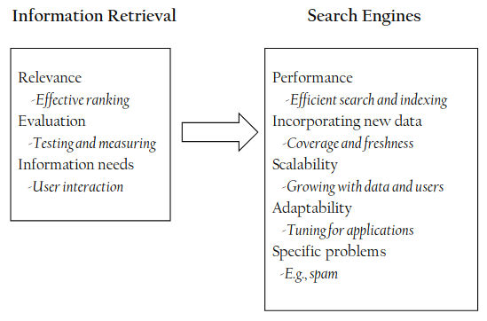

# 12 Marzo

Argomenti: Information Retrieval, Motori di ricerca
.: Yes

## Information Retrieval

L’`information-retrieval` è un campo che riguarda la struttura, l’analisi, l’organizzazione, l’archiviazione, la ricerca e il recupero delle informazioni

Alcuni esempi di `documento` sono pagine web, email, libri, notizie, articoli scientifici, messaggi di testo, ecc. Le proprietà comuni sono il testo contenuto e la struttura riconoscibile da campi comuni come titolo, autore, data, etc.

La `search` con il testo in linguaggio naturale è più difficile rispetto alla ricerca dei record all’interno del database perché quest’ultimi hanno campi ben definiti di cui è molto facile l’operazione di confronto, al contrario del documento dove il contenuto è nella forma di testo. 

L’obiettivo di un sistema di information retrieval è confrontare il testo della query con il testo dei documenti, ma la corrispondenza esatta delle parole non è sufficiente perché si hanno molti modi diversi di descrivere la stessa cosa in un linguaggio naturale.

## Task IR

- `ricerca ad-hoc`: trovare documenti rilevanti per una query testuale arbitraria
- `filtraggio`: identificare documenti rilevanti per determinati profili utente
- `classificazione`: identificare etichette rilevanti per i documenti
- `question answering`: fornire una risposta specifica a una domanda espressa in linguaggio naturale

## Progettare Sistemi di IR

La `rilevanza` è un concetto fondamentale nell’information retrieval, con questo concetto si può dire se un documento, ottenuto da una query, contiene informazioni che si stanno cercando. Però la rilevanza del documento dipende da 2 fattori: `topical relevance` e `user relevance`.

La `valutazione` nell’IR, tipicamente fa uso di collezioni di documenti di test, query e giudizi di rilevanza. In sostanza sono procedure per misurare e comparare l’output dei sistemi di IR con ciò che si aspetta l’utente. Precision e Recall sono 2 esempi di misure di efficacia.

La valutazione è centrata sull’utente mentre l’`information need` si concentra nel comprendere gli intenti dell’utente attraverso interazione e contesto.

## Motori di Ricerca

Un `motore di ricerca` è una particolare applicazione pratica delle tecniche di information retrieval applicata a collezioni di testo in larga scala, altri esempi pratici possono essere la desktop search e l’enterprise search.

Il `search engine` è un caso particolare di motore di ricerca, deve tenere conto di performance, di informazioni recenti, scalabilità, adattabilità e problemi specifici come per esempio spam.

- `performance`: l’idea è quella di misurare e migliorare l’efficienza della ricerca cercando di ridurre i tempi di risposta aumentando il numero di query che possono essere processate e la velocità con cui i documenti di testo possono essere indicizzati ai fini della search. Gli indici per esempio sono strutture dati progettate per migliorare l’efficienza della ricerca.
- `incorporare` nuovi dati: un’altra caratteristica da tenere conto è quanto velocemente nuovi dati possono essere incorporati negli indici
- `scalabilità`: è necessario far lavorare il motore di ricerca con milioni di utenti ogni giorno su documenti di grandi dimensioni
- `adattabilità`: i motori di ricerca sono impiegati in molte applicazioni per molti task, devono quindi essere customizzabili. Questo comporta ad avere un “fine-tuning” di varie componenti di un motore di ricerca  per adattarlo ai requisiti della specifica applicazione.