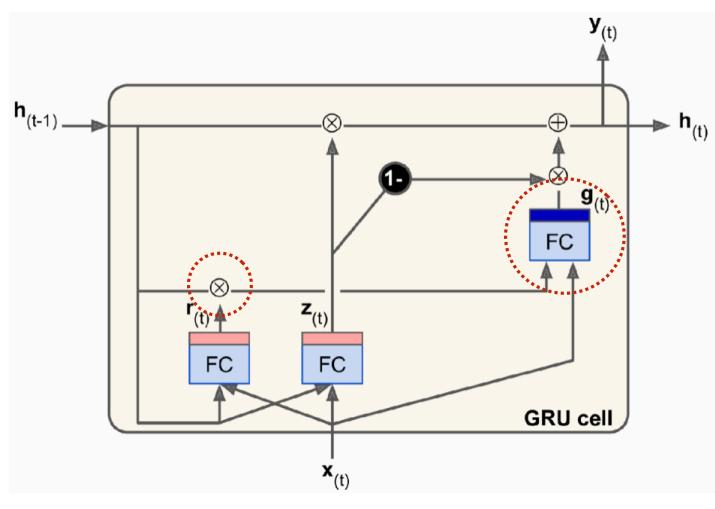
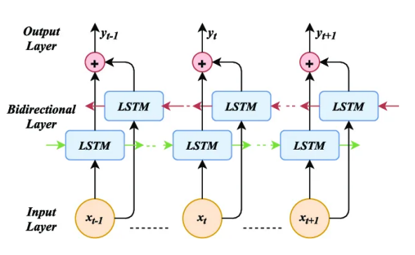
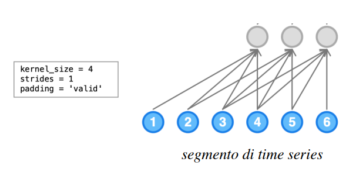
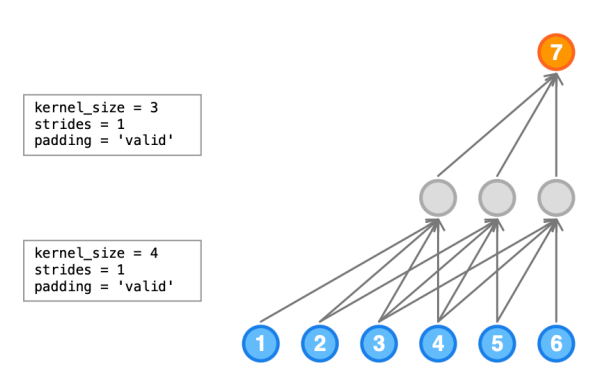
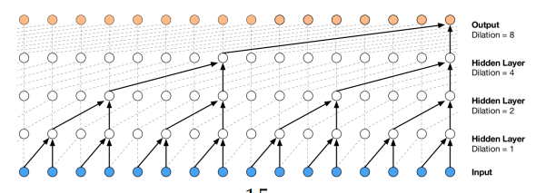
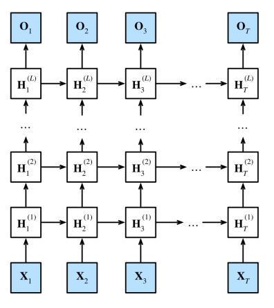

# 12 Novembre

Tags: Autoregressive model, Bidirectional RNN, Celle GRU
.: Yes

## Celle GRU

Le celle `Gated-Recurrent-Unit` sono nodi ricorrenti con un numero minore di gate rispetto alle `LSTM`. I gate più importanti sono il `reset-r` e `update-z`.

Le semplificazioni che questo tipo di cella introduce sono le seguenti:

- $h_{(t)}$: in queste celle non si fa distinzione tra i vettori di stato $c_{(t)}$ e $h_{(t)}$ perciò non c’è più distinzione tra memoria short e long-term
- $r_{(t)}$: controlla quanto dimenticare dallo stato dell’iterazione precedente
- $z_{(t)}$: determina quanto hidden state candidato $g_{(t)}$ aggiungere nello stato del prossimo step

Entrambi questi gate sono controllati dallo stato precedente $h_{(t-1)}$ e l’input corrente $x_{(t)}$.

Questa è la rappresentazione di una cella `GRU`

Nell’immagine viene mostrato che lo stato $g_{(t)}$ è candidato perché bisogna ancora considerare il contributo $z_{(t)}$.

Se $r_{(t)}$ ha output pari a 1 allora $h_{(t-1)}$ sarà considerato per la generazione di $g_{(t)}$, nel caso l’output fosse 0 allora $h_{(t-1)}$ sarà completamente ignorato.

## Bidirectional RNN

Questa architettura determina l’output considerando le informazioni passate e future. Rispetto alle altre ricorrenti richiedono più tempo per l’elaborazione e il training; sono anche meno parallelizzabili.

L’output è generato concatenando l’output dei 2 layers. Nel caso multi-layer, l’output sarà l’input dei successivi 2 layers bidirezionali, e cosi via fino al layer di output.

Le singole celle possono essere implementate con LSTM, GRU, etc.

---

## RNN e sequenze lunghe

Il problema delle reti `LSTM` e `GRU` non si adattano a sequenze con molti steps che contengono pattern significativi, quindi quello che si fa senza un metodo è ridurre la lunghezza di queste sequenze ignorando potenziali correlazioni significativi.

Usando però la convoluzione è possibile vedere la ricerca di particolari sequenze codificate con dei filtri. Una `1d-conv` può analizzare le `time-series` prendendo il tempo come dimensione da considerare e fissando poi un valore predefinito per i segmenti di dimensione temporale. In sostanza la dimensione dei segmenti corrisponderà alle dimensioni del kernel.

Da una time-series si otterranno più segmenti, ognuno dei quali genererà una attivazione, anche nel caso delle altre architetture per riconoscere più pattern si utilizzano più filtri.

$$
p(x)=\prod_{n=1}^{N}p(x_n|x_1,x_2,...,x_{n-1})
$$

Con `autoregressive-model` si intende un task di regressione di un valore di una time series considerando i valori precedenti della stessa time-series.

Si mette un filtro pari a 4 e stride pari a 1, come mostrato nell’immagine dati 4 campioni si ottiene una singola attivazione.

L’elaborazione mostrata in precedenza non basta, bisogna fare più elaborazioni, perché come nelle convoluzioni via via ogni volta si estraggono più caratteristiche supponendo sempre di più ad alto livello.

## Multiple Input time series

Se si hanno più time series in input allora si può fare l’analogia con le immagini che hanno più canali, quindi si raggruppa l’input in una unica time-series con profondità pari al numero di segnali in ingresso ottenendo una `multivariate time-series`.

## Dilated Convolution kernels applicati alle time-series

Per avere caratteristiche estese si usano `LRF` di dimensioni più ampie di quelle tipiche, il problema è che aumentare le dimensioni richiede molta più memoria. Quello che si fa quindi è utilizzare i `dilated-kernels` cioè si usano filtri dove alcuni elementi della `feature-map` in input sono ignorati.

Nelle time-series vengono applicate usando lo stack di convoluzioni dilatate, dove più si sale più la dilatazione aumenta.

Il numero delle attivazioni è la metà di quelle in ingresso.

## Google DeepMind WaveNet

Fa parte di un modello generativo per audio, usa più `1d-dilated-conv-layers`, dove ogni layer raddoppia il dilatation factor. I primi layer riconoscono pattern brevi mentre gli ultimi pattern estesi, se si impone valori di dilatation maggiori di 1 allora i layer ignoreranno alcuni campioni in input che però verranno comunque utilizzati in altri step e layer.

## Deep RNN

Quello che si fa è inserire più layer, dove ogni istante ogni cella riceve una $x$ e una $h$, in generale lo riceve dalla cella che si trova sotto. In sostanza dello stesso step ma di un layer precedente.

Ogni cella perciò dipenderà dai valori del layer negli step precedenti e dai valori generati dai layer precedenti nello stesso step.