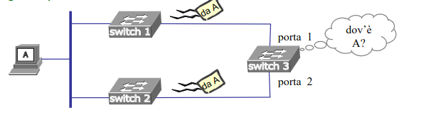
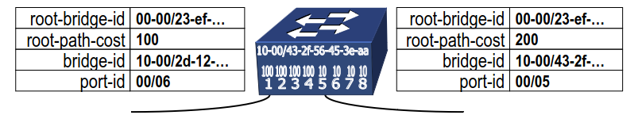
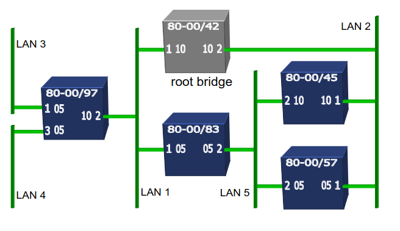
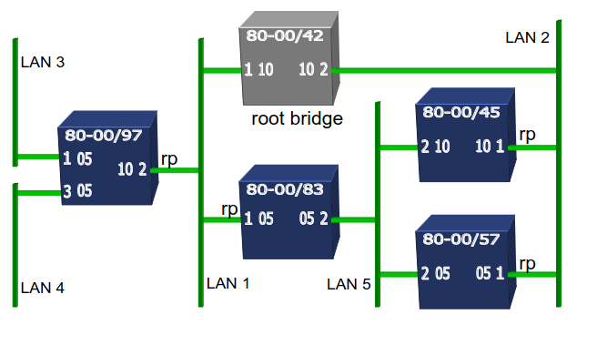
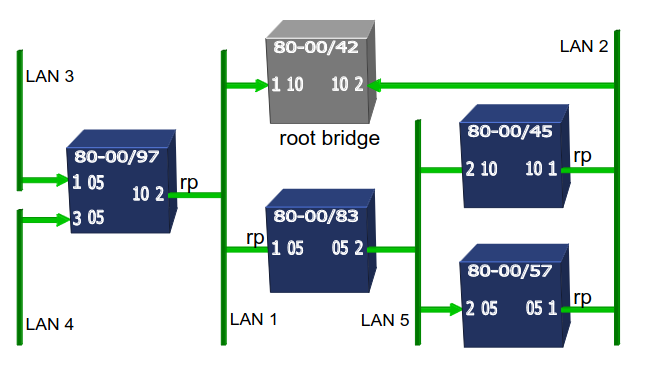
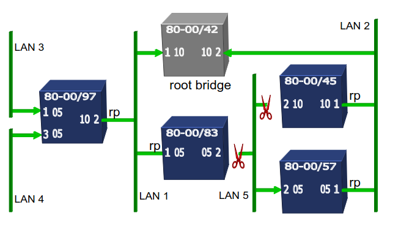
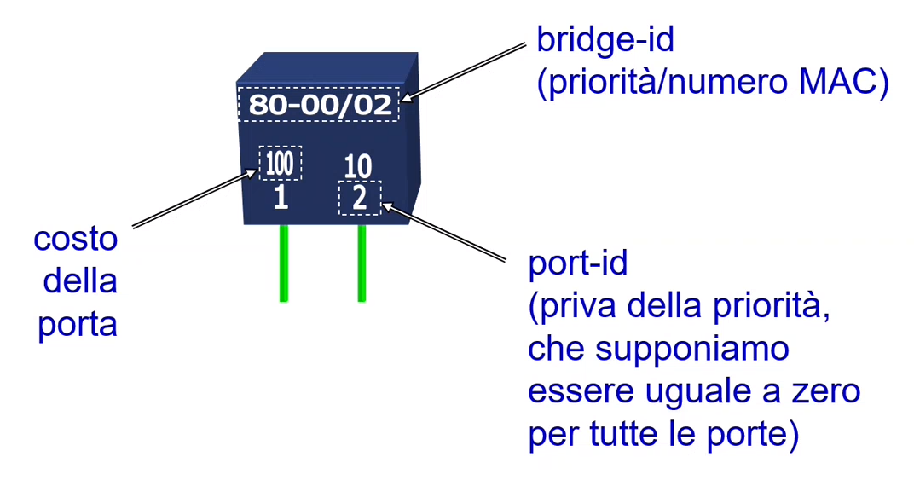

# 12 Ottobre

Argomenti: Spanning Tree Algorithm
.: Yes

## Spanning tree algorithm

- Lo `spanning tree algorithm` è pensato per essere utilizzato in una rete locale nella quale siano presenti switch (bridge)

- In una rete locale costituita da bridge e domini di collisione la presenza di cicli renderebbe impossibile l’operazione di backward learning. Però rinunciare del tutto alla presenza di cicli comporterebbe alla rinuncia della ridondanza offerta da questi.

Questo algoritmo è distribuito, cioè non c’è uno che calcola lo spanning tree e poi lo dice agli switch, gli switch sono in grado di fare questo lavoro per contro proprio. Questo algoritmo è responsabile al calcolo dell’albero ricoprente (spanning tree) in una rete dove sono presenti dei cicli. Se questo è il caso allora:

- il `backward learning` funziona
- la ridondanza offerta dai cicli viene conservata.

---

L’albero calcolato è radicato a un bridge che viene scelto come radice: il `root bridge`, al termine della computazione alcuni bridge mettono alcune porte in `blocking state` quindi queste porte non vengono utilizzate. (L’amministratore può influenzare l’esito del calcolo)

- I `requisiti` dell’algoritmo sono:
    - `robustezza`: l’albero ricoprente deve essere computato in maniera distribuita, si vuole quindi che non ci sia un unico calcolatore nell’albero ricoprente perché questo diminuisce la resistenza ai guasti
    - `efficacia`: la formazione di cicli deve essere esclusa sia in condizioni stazionarie che transitorie.
    - `efficienza`: lo spanning tree calcolato deve corrispondere ad un uso efficiente delle risorse di reti disponibili.
    - `bandwidth`: i pacchetti scambiati dai bridge devono comportare un limitato consumo di banda.
    - `tempo`: la computazione dell’albero deve essere più veloce possibile per limitare il disservizio.
    - `flessibilita`: l’amministratore è libero ad assegnare livelli di priorità a ciascun bridge per influire sull’output dell’algoritmo
    - `facilità d'uso`: l’algoritmo funziona correttamente anche in assenza di configurazione.
- `input`:
    - una topologia costituita da un insieme di LAN e un insieme di bridge le cui porte afferiscono alle LAN.
    - un identificatore (`bridge-id`) distinto per ogni bridge della rete. Più l’identificatore è basso e più è preferibile.
        - costituito dalla concatenazione di 2 parti [2 byte]/[6 byte]. I primi 2 byte sono di priorità scelti dall’amministratore, mentre i restanti 6 byte corrispondono all’indirizzo MAC della prima porta bridge → `80-00/23-ef-c0-4b-93-a0`
    - un identificatore (`port-id`) per ogni porta di ogni bridge. Come sempre il più basso è il più preferibile.
        - costituito da 2 parti [1 byte]/[1 byte]. Il primo byte è di priorità scelto dall’amministratore, mentre il restante byte corrisponde al numero della porta sul bridge → `80/0a`
    - un valore (`costo`) per ogni LAN. Il costo viene associato alle porte che afferiscono alla LAN e convenzionalmente sommato in ingresso. → il costo viene scritto su tutte le porte che sono attaccate alla LAN
- `output`:
    - un insieme di porte che, una volta messe in blocking garantiscano la piena connettività (esiste un cammino tra ogni coppia di LAN) e che non ci siano cicli (il cammino tra ogni coppia di LAN deve essere unico)
    - il costo dei cammini è contenuto anche se la minimilità non è garantita, questo perchè l’algoritmo garantisce solo la minimalità del cammino tra la root-bridge e qualunque altro nodo della rete.

---

## Fasi dello spanning tree algorithm

- elezione del `root bridge`: un singolo bridge è selezionato per essere la radice dell’albero, il metodo di selezione del bridge è deciso senza nessuna regola
- identificazione della `root port` su ogni bridge: ogni bridge diverso dal root bridge seleziona una delle sue porte come quella più conveniente per connettersi al root bridge. In pratica se ci mettiamo nei panni di ciascun altro bridge si sceglie la porta che ci manda più velocemente possibile verso la radice
- determinazione delle `designated ports`: ogni LAN sceglie anch’essa una porta che è quella che sceglie per andare verso il root bridge
- blocco di porte ridondanti: cio che non è root o designated sono messe in `blocking`

## Pacchetti utilizzati

- I pacchetti scambiati dai bridge vengono chiamati `bpdu` cioè bridge protocol data unit, sono previsti 2 tipi di `bpdu`:
    - `configuration bpdu`: contiene tutte le informazioni necessarie per lo spanning tree algorithm
        
        
        | root-bridge-identifier | l’attuale root dello spanning tree |
        | --- | --- |
        | root-path-cost | il costo del cammino verso il root bridge |
        | bridge-identifier | l’id del bridge che invia questa bpdu |
        | port-identifier | la porta da cui è uscita questa bpdu |
    - `topology change bpdu`: servono per segnalare che ci sta un guasto sulla rete

## STA : fase 1

- Ogni bridge invia una `configuration-bpdu` nella quale specifica il proprio bridge-id come root-identifier, perché all’inizio tutti i bridge credono di essere il root-bridge.
- Quando un bridge riceve una `configuration-bpdu` con un valore più basso di bridge-id, allora smette di produrre `configuration-bpdu` con il suo bridge-id come root-identifier e propaga la nuova `configuration-bpdu` su tutte le porte (per dire anche agli altri chi è per lui il nuovo root-bridge).
- Il `root-bridge` è quello che continuerà a produrre `configuration-bpdu` con il suo bridge-id nel campo root-identifier.

---

- l’inoltro delle `configuration-bpdu` ha 2 casi:
    - quando una `configuration-bpdu` è prodotta dal root bridge il suo campo `root-path-cost` è posto a zero.
    - quando una `configuration-bpdu` è inoltrata da un bridge che non è il root bridge, i suoi campi sono aggiornati come segue:
        - il `root-path-cost` è incrementato con il costo della porta del bridge che riceve la `configuration-bpdu`
        - il `bridge-identifier` è costituito con il `bridge-id` del bridge corrente.
        - la `port-identifier` è sostituita con l’id della porta da cui la `bpdu` sarà inviata.
    
    
    

## STA : fase 2

- ogni bridge diverso dal `root-bridge` identifica la porta attraverso la quale il root bridge è più facilmente raggiungibile
- la `root-port` è quella che riceve le configurazioni `bpdu` tali che (in ordine di priorità):
    - il `root-path-cost` della bpdu sommato al costo della porta ricevente è il più basso
    - il `bridge-identifier` specificato nella `bpdu` è il più basso
    - la `port-identifier` specificata nella `bpdu` è la più bassa
    - la `port-identifier` nella porta ricevente è la più bassa

## STA : fase 3

- per ogni LAN, una porta di un bridge è scelta come `designated-port` in base alla `configuration-bpdu` che sono inviate nella LAN da quella porta
- la `designated-port` è quella che invia le `configuration-bpdu`: (in ordine di priorità)
    - `root-path-cost`
    - `bridge-identifier`
    - `port-identifier`

## STA : fase 4

- tutte le porte che non sono `root-ports` o `designated-ports` sono poste in blocco
- tutte le `root-ports` e `designated-ports` sono poste in stato di `forwarding`.

---

Notazione usata per gli esercizi

(il costo si calcola quando la BPDU entra)