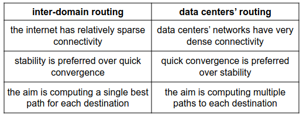
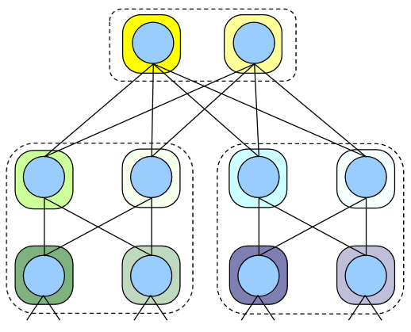
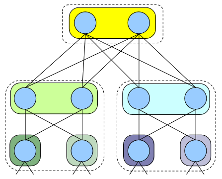
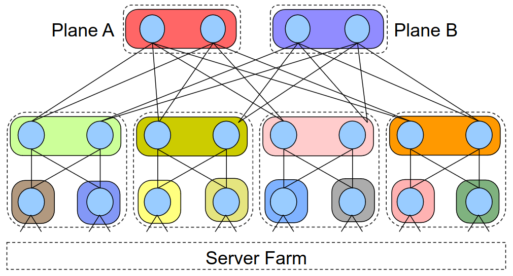
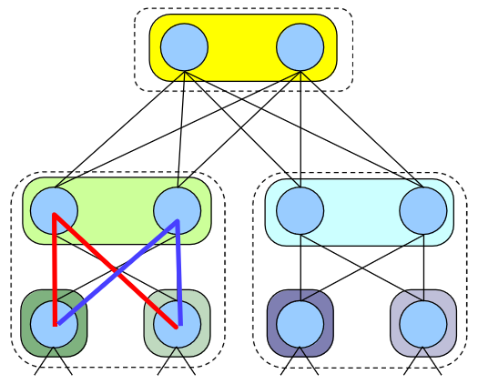
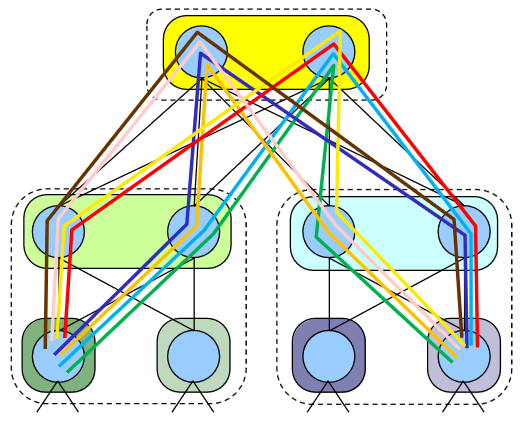
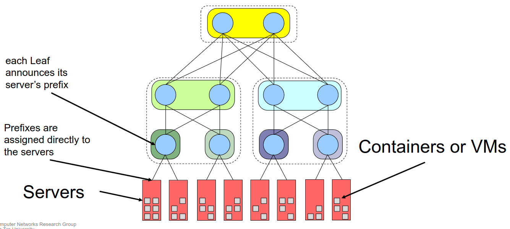

# 13 Dicembre

Argomenti: ASN assignment, BGP nei DC
.: Yes

## Instradamento di pacchetti nei Data Centers

Si usa il routing e non lo switching perche si ha il supporto al `multipath` ma la configurazione è estremamente complessa, quindi si usano degli algoritmi per la configurazione.

## Scelta di un protocollo di routing per i data centers

Durante il corso si sono visti tanti protocolli routing:

- `RIP`: questo protocollo non è una buona scelta a causa del `count-to-infinity`, perchè una rete se ha più di 15 nodi non funziona perchè il `cti` di `RIP` è 15 di default
- `OSPF`: questo protocollo funziona bene e converge anche bene, purtroppo non è stabile quanto `BGP` e fa anche tanto `flooding`
- `SDN`: non è una buona idea utilizzare questi protocolli è il `single-point-failure` del controller
- `BGP`: si usa questo protocollo perchè si hanno robuste implementazioni (in frr e quagga), genera meno `flooding` rispetto ai comuni protocolli e supporta nativamente `ECMP`. Si andrà pero ad utilizzare `BGP` nella sua modalità external (`eBGP`) perchè affinchè funzioni `BGP` deve avere un `iBGP`.

## BGP nel data center

`BGP` è stato inizialmente ideato per `inter-domain` routing. Tramite la `RFC-7938` si va a modificare BGP per l’utilizzo all’interno dei data centers, con l’introduzione di `AS numbers assignment`,`ECMP policy relax` e `timer adjustment`.

## AS numbers assignment

All’interno dei data centers si usano `ASN` privati perchè se si sbaglia una configurazione e esce per internet, tutto quello che esce non si deve propagare.

La scelta più ovvia sarebbe assegnare un diverso `ASN` a ciascun nodo, tuttavia questo approccio porta a `BGP` un problema di `path exploration`.

Usando questa configurazione si potrebbero generare dei cicli, se si generano dei guasti si trasmettono molti annunci BGP updated inutili

Per questo problema si usa questa configurazione, ogni foglia usa un `ASN` differente, i nodi `Spine` di ogni `PoD` appartengono allo stesso `AS` e i nodi `ToF` dello stesso piano appartengono allo stesso `AS`.

Non ci sono `iBGP` peerings.

Qui viene mostrato il `multi-plane` utilizzando la configurazione precedente.

Usando $FT(K=2,R=2)$ ci sono solo 2 path possibili tra 2 foglie dello stesso `PoD` e la cosa positiva è questi 2 path non lasciano il `PoD`

Usando $FT(K=2,R=2)$ ci sono 8 path tra 2 leaf di 2 `PoD` diversi.

Questo significa che si devono rompere ben 8 path prima che queste 2 leaf non possano più comunicare

## BGP e multi-path relax

Questo `multi-path relax` va a verificare l’uguaglianza di `as-path` a livello di lunghezza e non di contenuto in modo tale da avere più path che passano per `AS` diversi.

## Configurazioni dei timer BGP

Affinchè `BGP` nei data centers sia reattivo si vanno a modificare i timer principali responsabili del comportamento di `BGP`.

- `advertisment interval` timer : questo timer rappresenta l’intervallo di tempo in cui si manda un annuncio al vicino; il valore di default è di 30s e viene modificato a 0s.
- `keepalive` e `hold` timers: il `keepalive` è un timer che indica ogni quanto bisogna controllare il vicino per sapere se è ancora presente. Il timer `hold` indica quanto tempo bisogna aspettare l’annuncio `keepalive` per mantenere attiva la sessione. Rispettivamente questi valori sono 60s e 180s e vengono ridotti a 3s e 9s.
- `connect` timer: questo timer indica quanto bisogna aspettare prima di riaprire la connessione quando questa cade. Il valore di default è 60s e viene decrementato a 10s.

## Automatizzare la configurazione

- `unnumbered interfaces`: è una modalità di BGP che permette di fare peering senza specificare l’indirizzo IP di un altro router BGP.
- `peer groups`: si possono raggruppare questi peering in un gruppo e impostare le regole su un gruppo.

## Connettere i server

I prefissi vengono assegnati direttamente ai server perchè all’interno dei server ci sono container o Virtual machine con un indirizzo IP specifico.