# 13 Giugno

Argomenti: Architetture RNN, Feature Maps, LeNet-5, Memory Cells, Recurrent Neural Network
.: No

## Canali multipli in output

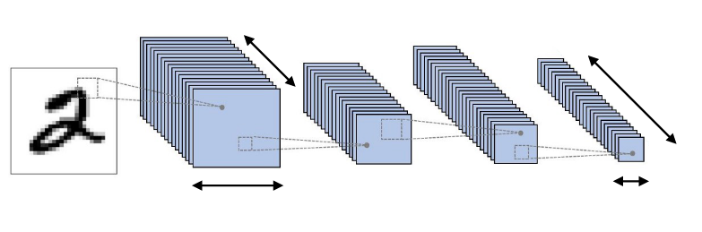

Tradizionalmente il numero di canali impiegati in un layer aumenta con la profondità della rete, riducendo allo stesso tempo la risoluzione spaziale degli input

Ogni filtro in un layer produce un singolo canale in output. Per `output multicanale`, si intende creare più tensori $c_i\cdot k_h\cdot k_w$ dove ognuno rappresenta un singolo canale in output $c_0$ e perciò un filtro. Se vengono concatenati si ottiene un unico filtro con dimensioni $c_0\cdot c_i\cdot k_h\cdot k_w$

## Feature Maps

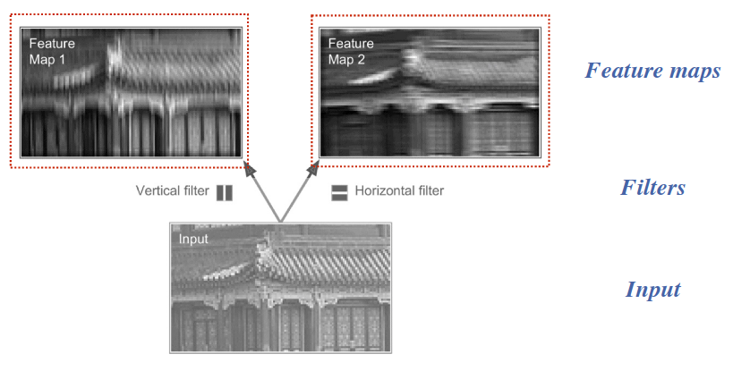

L’insieme delle attivazioni ottenute con lo stesso filtro viene chiamato `feature-map`. Esse possono essere visualizzate come una immagine.

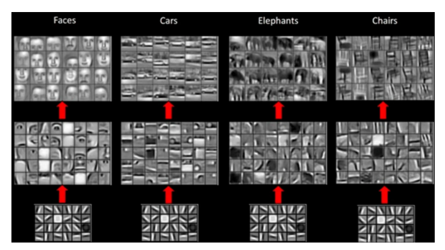

## Architettura LeNet-5

Questa architettura è una delle prime architetture `CNN`, ideata per fare OCR. Combina layers `CNN` con una rete tradizionale `MLP` a valle, lo scopo è di usare le caratteristiche salienti identificate dalle CNN per fare classificazione per mezzo della MLP.

- Le CNN sono utili per estrarre le feature e non per fare classificazione

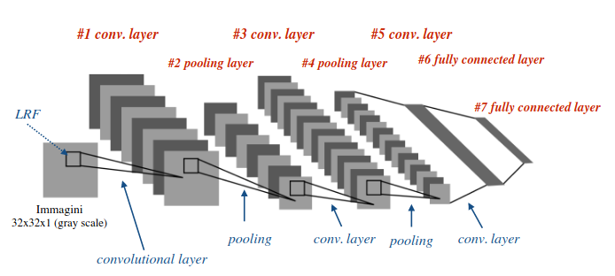

Architettura

## Preprocessing per le time series

Nelle `time-series` l’informazione non è contenuta solo su una singola misurazione, o su un intorno, ma anche su un arco temporale a volte molto esteso. Per tale motivo esistono ulteriori tecniche di standardizzazione o più in generale preprocessing oltre a quelle già viste più impiegate nel dominio delle time series quali:

- `power-transforming`: si usa una funzione che rende i dati più vicini da una distribuzione normale, utile per dati skewed e in presenza di outliers
- `outlier-removal`: tecniche per rimuovere outliers
- `pairwise difference`: creare nuovi segnali sottraendo campioni tra 2 segnali o aggregandoli
- `seasonal decomposition`: rimuovere andamenti che si estendono su archi temporali molto estesi; possono successivamente essere reintegrati nell’output se necessario
- `engineering more features`: features extraction
- `resampling`: si fa di nuovo il samping nella dimensione del time o delle caratteristiche
- `moving averages`:

## Nodo RNN

Le `RNN` sono architetture di reti neurali adatte ad analizzare `time-series`, stimare misure mancanti, riconoscere periodicità, o stimare funzioni obiettivo che prendono le time-series come parametro. Rispetto alle CNN possono elaborare dati in ingresso con lunghezza abitraria non prefissata.

Finora abbiamo considerato reti neurali `feedforward`, dove le attivazioni si propagano dall’input all’output layer. Le `RNN` sono simili alle reti `feed-forward`, ma hanno connessioni anche verso i layer precedenti, creando una specie di processamento ciclico.

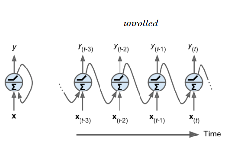

La più semplice `RNN` consiste in un nodo ricorrente che riceve l’input $x$, produce un output $y$ e lo stesso output viene riproposto in input. Ad ogni iterazione, il nodo ricorrente riceve l’input $x_{(t)}$ e l’output precedente $y_{(t-1)}$. Si può dire che il nodo ha una memoria interna di ciò che ha fatto in passato.

Se $x_{(t)}$ e $y_{(t-1)}$ sono vettori campionati nell’istante $t$ e $t-1$, i parametri che definiscono il comportamento di un nodo ricorrente consistono in 2 vettori $w_x$ e $w_y$

$$
y_{(t)}=\sigma\left(w_x^T\cdot x_{(t)}+w_y^T\cdot y_{(t-1)}+b\right)
$$

L’output di un singolo nodo si ricava in questo modo

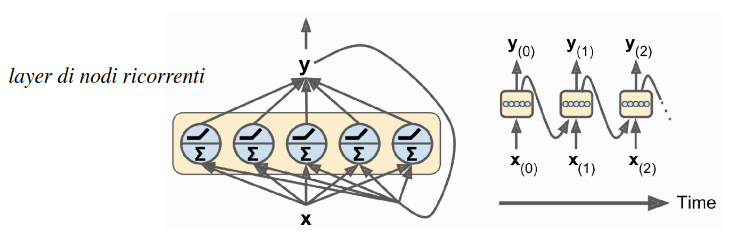
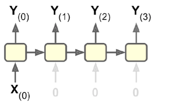

Si può definire un layer di nodi ricorrenti, comprendente più nodi, ed i parametri saranno perciò rappresentati da 2 matrici $W_x$ e $W_y$

## Memory Cells

Una `memory cell` è una rete neurale in grado di tenere traccia degli stati in cui si è trovata in passato, (perchè con i nodi RNN si ha troppa poca memoria per fare qualcosa) e ne esistono di vari tipi.

Si indica con `stato` di una cella all’istante $t$ con la notazione $h_{(t)}$, dove $h$ sta per `hidden`. Lo stato dipende dall’input corrente e dallo stato precedente:

$$
h_{(t)}=f\left(f_{(t-1)},x_{(t)}\right)
$$

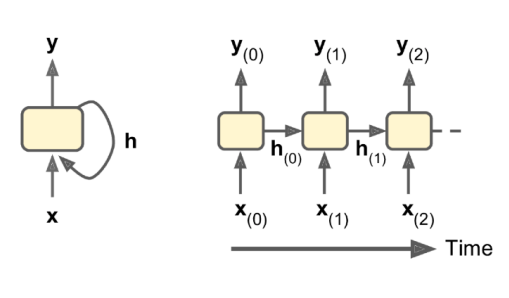

Nelle celle elementari output e stato coincidono e l’output è propagato nelle iterazioni successive. Ma nelle celle più complesse non accade.

In tal caso una cella genera in ogni istante $t$ un valore corrispondente all’output richiesto $y_{(t)}$ ed un secondo valore $h_{(t)}$ che indica lo `stato` di elaborazione, è quest’ultimo valore che è propagato per $t+1$.

Lo stato $h(t)$ rappresenta:

- le `caratteristiche` della specifica sequenza analizzata fino all’istante $t$ (short term memory), nel dominio della comprensione del linguaggio naturale rappresenta le ultime parole e frasi analizzate in input
- la `conoscenza` acquisita precedentemente analizzando le sequenze contenute nel training set (long-term memory), nel dominio della compresione del linguaggio naturale memorizza le regole fondamentali per la compresione del linguaggio apprese durante il training.

## Architetture RNN

Ci sono vari tipi di architetture RNN, che dipendono dal task che si vuole affrontare. Ogni architettura consiste di più celle:

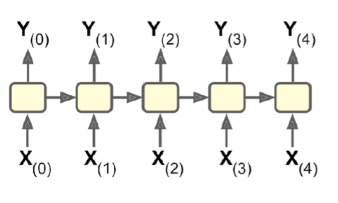

rete `sequence-to-sequence` o `many-to-many`

(es. quotazioni traslate di un giorno futuro)

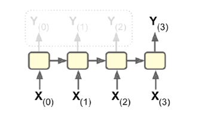

rete `sequence-to-vector` o `many-to-one`: simile alla precedente ma scarta tutti i valori in output tranne l’ultimo

(es. sentiment analysis)

`vector-to-sequence` o `one-to-many`: prende in input ripetutamente lo stesso vettore per una successione di steps e procude una sequenza in output

(es. OCR)

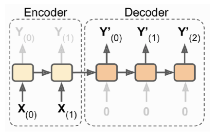

Infine si può combinare una rete `sequence-to-vector` (encoder) con una `vector-to-sequence` (decoder) ottenendo una rete `encoder-decoder`.

Il machine translation può essere un traduttore di lingue.

Una rete `sequence-to-sequence` non sarebbe adatta per il machine translation poichè le ultime parole dell’input potrebbero influenzare l’inizio dell’output, mentre la rete traduce ogni parola via via che l’input è reso disponibilie. Inoltre le lunghezze dell’input e output potrebbero non corrispondere.