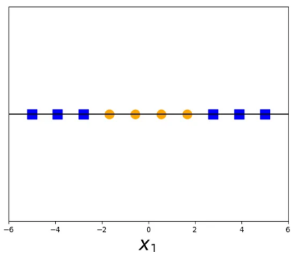
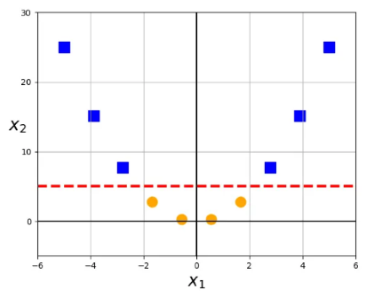
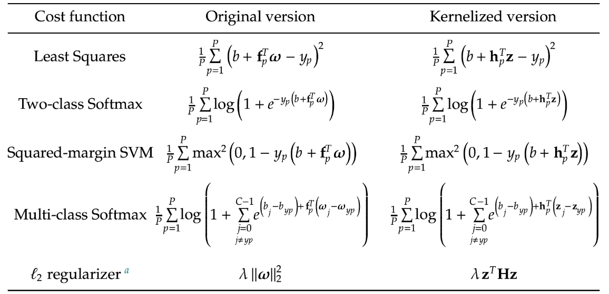

# 13 Maggio

Argomenti: Metodi Kernel
.: No

## Metodi Kernel

Questi metodi sono popolari per la loro capacità di gestire pattern non lineari nei dati. Quello che fanno è gestire gli spazi di caratteristiche ad alta dimensione, mappando l’input in tale spazio.

L’idea principale è trovare una `funzione kernel` che determina la somiglianza tra punti mappati in uno spazio delle caratteristiche trasformato ad `alta densità`, dove è più facile identificare pattern rilevanti

Le funzioni comunemente utilizzate includono kernel lineari, polinomiali, a base radiale e sigmoidi; ogni funzione ha particolari proprietà e si adatta a diversi tipi di dati.

Mappare i dati in uno spazio è in generale computazionalmente oneroso,il `kernel-trick` permette di ridurre la complessità computazionale, perché non è necessario “mappare” i punti nel nuovo spazio. Cioè il `kernel-trick` è una tecnica che permette di calcolare la similarità tra le istanze dei dati senza la necessità di trasformare esplicitamente i dati in uno spazio di dimensioni superiori.

Per capire più in dettaglio queste funzioni kernel, si fa vedere questo semplice esempio dove ci sono dati che non sono linearmente separabili in uno spazio a una dimensione.

Dopo aver applicato un metodo kernel cioè, più semplicemente, dopo aver applicato la trasformazione $\Phi(x)=x^2$, le classi diventano linearmente separabili

Ci sono molti di tipi di `kernels` e ciascuno ha un diverso modo di essere utilizzato:

- `linear kernel`: utilizzato quando i dati sono linearmente separabili, per esempio viene utilizzato per semplici problemi di classificazione binaria.
- `polynomial kernel`: utilizzato quando i dati non sono linearmente separabili, quello che fa è mappare i dati di ingresso in uno spazio di caratteristiche a più alta dimensione, dove può essere applicato un classificatore lineare
- `radial-basis-function kernel`: è un kernel non lineare equivalente al kernel gaussiano, viene utilizzato per problemi di classificazione e regressione lineare
- `sigmoid kernel`: viene utilizzato per problemi di classificazione binaria ed è simile al classificatore di regressione logistica
- `laplacian kernel`: viene utilizzato per problemi di regressione non lineare ed è simile al kernel gaussiano, molto utile per set di dati con modelli complessi
- `cosine-similarity kernel`: per problemi di classificazione del testo, dove la somiglianza tra 2 documenti viene calcolata in base alla regola coseno in uno spazio di caratteristiche ad alta dimensione

## Approssimatori fixed-shape

$$
f_m(x)=sin(m\cdot x)
$$

Sono caratterizzati dalla mancanza di parametri interni, per esempio le funzioni trigonometriche.

$$
f_m(\bold x)=\prod_{i=1}^{N}sin(m_i\cdot x_i)
$$

Come nel caso di polinomi, ogni unità ha un indice che determina anche un ordine di complessità. Si generalizza ad input multi dimensionali, per esempio seno e indice $m$.

$$
f_m(x)=\prod_{j=1}^{N}e^{2\cdot\pi \cdot i\cdot m_j\cdot x_j}
$$

Attraverso fourier, si può esprimere un approssimatore come la produttoria di `unità di fourier` multidimensionale.

## Approssimatori e input multidimensionali

$$
f_m(x)=\prod_{i=1}^{N}x_i^{m_i}
$$

Con input $N$-dimensionali, un’unità di tipo polinomiale assume la seguente forma

$$
0<\sum_{i=1}m_i\le D
$$

Supponendo $\forall m_i\ge0$, per ottenere un modello polinomiale di grado $D$ è necessario soddisfare questa condizione.

E’ pratica comune, includere le unità della stessa famiglia di complessità inferiore, cioè se si ha $x_1^2x_2^2$ si includono tutte le altre combinazioni $x_1^ix_2^j$ con $i,j\le2$ (supponendo $D=2$)

Il problema è che il numero di termini cresce esponenzialmente con la dimensione dell’input $N$, quindi si fa `kernelization`, cioè si mira a costruire feature a forma fissa per qualsiasi problema di apprendimento automatico evitando il problema dell’esplosione combinatoria.

Ricapitolando, si sta cercando di mappare tutto in un altro dominio, in particolare anche la funzione costo dovrà essere kernelizzata; cioè si parla di kernelizzazione quando tutto il procedimento analitico viene trasformato con delle funzioni di kernel.

## Decomposizione di un vettore M-dimensionale

La `decomposizione` di un qualsiasi vettore $M$-dimensionale $w$ sulle colonne di una data matrice $\bold F_{M\mathtt{x}P}$ corrisponde ad un certo spazio. Se si denota la $p$-esima colonna di $\bold F$ come $\bold f_p$ si hanno 2 casi:

$$
\omega=\sum_{p=1}^{P}\bold f_p\cdot \bold z_p
$$

se $w$ giace sullo spazio delle colonne di $\bold F$ si può scrivere la formula seguente, dove $\bold z_p$ sono i coefficienti di $\omega$ associati a $\bold f_p$. 

$$
\omega=\bold F\cdot \bold z
$$

Raggruppando i coefficienti in un vettore $\bold z_{P\mathtt{x}1}$ si può riscrivere la formula precedente in modo più compatto

 

$$
\omega=\bold F\cdot \bold z+\bold r
$$

se invece $\omega$ non giace sullo spazio delle colonne di $\bold F$ lo si può sempre decomporlo in 2 parti, la prima parte è quella che appartiene allo spazio delle colonne di $\bold F$ e la seconda come una componente ortogonale $\bold r$

## Kernelizing delle funzioni di costo

Si ricorda che l’obiettivo è kernelizzare cioè fare la versione kernel di quello che si ha, quindi gli `approssimatori`, il `modello` e la `funzione di costo`; si vuole quindi riproporre queste 3 cose sotto un kernel, in modo da operare direttamente nello spazio delle feature kernelizzate anziché nello spazio delle feature originali.

Si prende un approccio supervisionato, e le funzioni di costo Least squares e Softmax

$$
model(x_p,\bold w)=w_0+\sum_{i=1}^{M}f_i(x_p)\cdot w_i
$$

si parte dal generico `modello` con `approssimatori`

$$
model(\bold x_p,b,\bold w)=b+\bold f_p^T\cdot \bold w
$$

Si riscrive il modello nella versione compatta per il `kernelization`

Adesso viene riscritto la funzione costo:

$$
g(b,\omega)=\dfrac{1}{P}\sum_{p=1}^{P}\left(b+\bold f_p^T\omega-y_p\right)^2
$$

Si scrive il costo Least squares in questo modo

$$
g(b,\omega)=\dfrac{1}{P}\sum_{p=1}^{P}\left(b+\bold f_p^T\bold F\bold z-y_p\right)^2
$$

visto che $\omega=\bold F\bold z+\bold r$ ed $\bold r$ normale al sottospazio, si ha che $\bold f^T_p\bold r$=0 perciò si riscrive la funzione costo come segue

$$
g(b,\bold z)=\dfrac{1}{P}\sum_{p=1}^{P}\left(b+\bold h_p^T\bold z-y_p\right)^2
$$

Si introduce la matrice simmetrica $\bold H_{P\mathtt{x}P}=\bold F^T\bold F$ chiamata `kernel matrix` dove la $p$-ma colonna è $\bold h_p=\bold F^T\bold f_p$, si riscrive il costo in questo modo

Si uniscono i risultati dei 2 procedimenti:

$$
model(\bold x_p,b,\bold z)=b+\bold h_p^T\cdot \bold z
$$

Dopo tutti questi calcoli si può riscrivere il modello valutato sulla $p$-ma istanza come

$$
\left[f_1(\bold x_p),f_2(\bold x_p),..,\bold f_M(\bold x_p)\right]^T
$$

Per dare una interpretazione all’ultima espressione, all’inizio si era supposto che $\bold f_p$ era definito in questo modo

Nella espressione finale sono spariti gli `approssimatori` (il significato di un approssimatore è estrarre una feature, quindi $\bold F$ è una matrice che contiene tante funzioni che estraggono delle feature), al posto di esso ci sono degli $h$ (è come se fosse sparita la computazionalità pesante).

Se si riuscisse a ricavare una formula più efficiente per la $\bold h$ si riuscirebbe a calcolare il modello e costo in modo più veloce.

In questa immagine sono mostrati le versioni kernelizzate di funzioni di costo molto usati

## Vantaggi dei kernel

Per molti unità fixed-shape comprese polinomiali e di Fourier, la matrice kernel $\bold H$ può essere costruita evitando di partire dalla matrice $\bold F$, che spesso ha dimensioni poco trattabili a causa della numerosità delle features raw in input

Con i kernel non è più necessario formalizzare esplicitamente le trasformazioni raw in input (kernel trick), basta solamente calcolare la matrice kernel $\bold H$.