# 14 Maggio

Tags: Aggregate Data Model, Column-Family Stores, Document Databases, Graph Data Model, Key-Value Databases, NoSQL, Schemaless Databases
.: No

## Sistemi NoSQL

I sistemi `NoSQL` sono sistemi non-relazionali proposti come alternativa ai sistemi relazionali. L’idea di quest’ultimi è di descrivere i dati in modo semplice in formato tabellare e gestire meccanismi di correlazione dei dati attraverso vincoli referenziali con un meccanismo di interrogazione standardizzato che è `SQL`.

- `impedence-mismatch`: I sistemi relazionali presentano però alcuni problemi come per esempio l’`impedence mismatch`, in sostanza è la differenza con cui i dati vengono gestiti a livello della persistenza rispetto allo strato applicativo (incompatibilità tra il modello dati orientato agli oggetti e il modello relazionale). Per risolvere questo problema sono stati introdotti meccanismi tipici della programmazione orientata agli oggetti all’interno delle basi di dati.
- `attack-of-the-cluters`: Col crescere dei volumi si è capito che per la scalabilità di un’applicazione l’unica soluzione era quella di introdurre delle infrastrutture che fossero estendibili a piacimento, quindi delle infrastrutture basate su cluster. Il problema quindi non è più di tipo applicativo ma di tipo sistemistico. Il limite forte dei sistemi relazionali è che non sono stati realizzati per sistemi cluster. Si può dire che questo è un `mismatch sistemistico`.

Il punto chiave database `NoSQL` è che non utilizzano il modello relazionale, funzionano bene su cluster, sono open souce e c’è un concetto di `schema` rilassato. 

## NoSQL Data Models

Un `data-model` è un insieme di regole per rappresentare l’informazione (nel caso dei modelli relazionali sono le tabelle, colonne e righe). Il modello di memorizzazione invece è come il DBMS memorizza e manipola i dati internamente. Tipicamente il modello di dati è indipendente dal modello di memorizzazione.

I modelli di dati per sistemi `NoSQL` possono essere divisi in 2 macro-classi:

- `aggregate models`: possono utilizzare il modello chiave-valore per esempio, oppure document-based o column-family based
- `graph-based models`

## NoSQL Data Models - Aggregates

In questo modello si vanno ad individuare delle componenti atomiche che al loro interno possono essere molto complesse, per esempio un record dove all’interno non ci sono solo attributi ma anche strutture nidificate oppure array, etc.

Il concetto di `aggregato` è utilizzato molto in metodologie di progettazione in particolare nel `domain-driven` in cui questo aggregato può essere talmente strutturato che può essere fatto da diversi oggetti atomici che però vengono visti in maniera unitaria. Questi aggregati sono le unità di manipolazione che si adottano se si vuole interagire con essi.

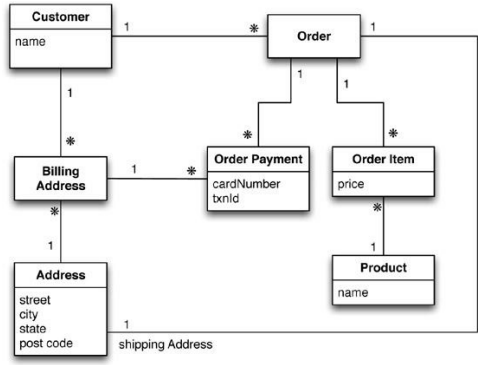

Si suppone di avere una rappresentazione concettuale

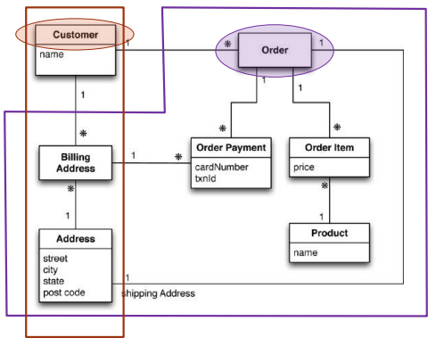

Se si volesse accedere ai dati in 2 modalità diverse, per esempio operazioni che riguardano i `clienti` e operazioni che riguardano gli `ordini`, si definisce un aggregato che conosce i dettagli dei suoi indirizzi. (in questo caso `billing-address`)

In sostanza si deve definire la granularità con cui si pensa di manipolare i dati.

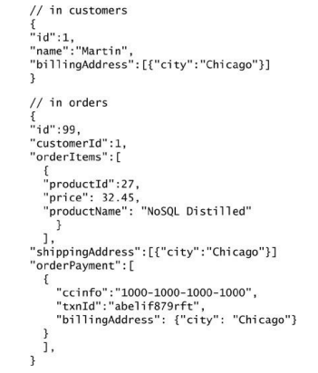

Dopodiché se si vuole implementare questo sistema, l’idea è quella di avere da una parte i customer in formato json e stessa cosa per gli ordini.

I dati adesso si possono manipolare sotto forma di aggregato che al suo interno ha diverse entità.

(Bisogna considerare anche la distribuzione tra cluster) Una volta definiti questi livelli di granularità si chiede al sistema di distribuire sul cluster i dati come specificato dall’aggregato. (L’aggregato suggerisce una modalità con cui i dati vengono distribuiti su cluster)

## Design strategy

Quando si ragiona con i sistemi `NoSQL` bisogna pensare a una strategia di progettazione dei dati, basata sui questi concetti di aggregati dove i limiti di questi aggregati dipendono dall’applicazione. Tipicamente si fa riferimento alla maniera con cui si vogliono manipolare i dati.

## Aggregates: Key-Value Databases

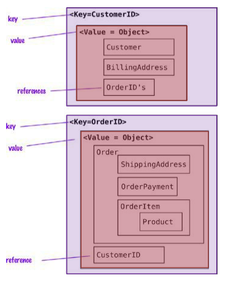

Le basi di dati basate su `chiave-valore` sono sistemi molto semplici, dove tutti i dati vengono visti come coppie valori chiave-valore dove il valore può essere un oggetto particolarmente complesso (aggregato).

L’aggregato, cioè il valore associato alla chiave, è `opaco` cioè non è visibile al programmatore. Cioè non si può fare un’interrogazione che va a guardare dentro il valore. L’unico modo per accedervi è attraverso la chiave.

Il valore associato può essere di qualsiasi tipo.

## Aggregates: Document Databases

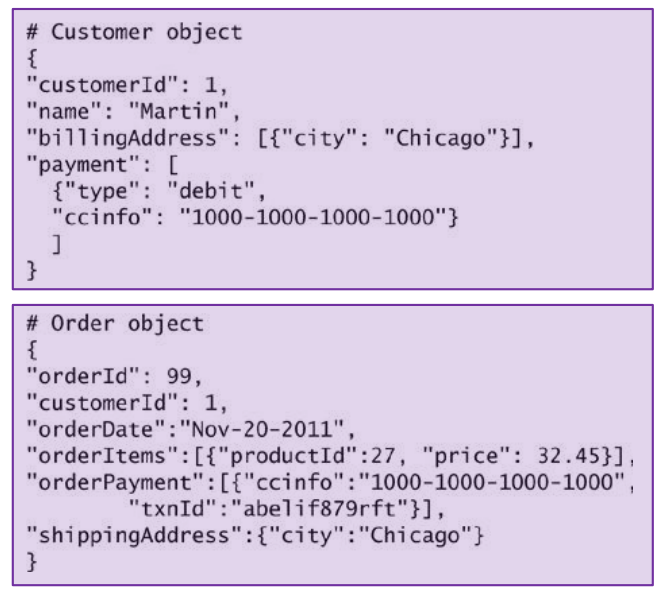

Esiste un altra classe di sistemi NoSQL basati su `documento`, dove si vedono tutti i dati sotto forma di chiave-valore ma la differenza è che questi documenti associati alle chiavi sono visibili dal programmatore permettendo cosi di fare interrogazioni che fanno riferimento a componenti interne del documento.

Il valore associato deve essere “strutturato”, non può essere di qualsiasi tipo.

| Requisito da soddisfare | Key-Value Store | Document DB |
| --- | --- | --- |
| Massima velocità per lookup da chiave | ✅ | ⚠️ più lento |
| Query su attributi interni | ❌ | ✅ |
| Struttura dati molto semplice | ✅ | ⚠️ overkill |
| Supporto a filtri, ordinamenti, aggregazioni | ❌ | ✅ |
| Cache, sessioni, contatori, leaderboard | ✅ | ⚠️ meno adatto |
| Archiviazione di oggetti complessi (JSON) | ⚠️ serializzato | ✅ leggibile e indicizzabile |

## Aggregates: Column-Family Stores

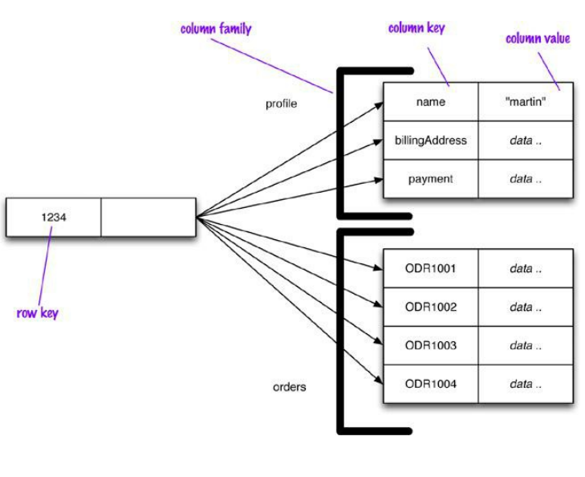

Questi sistemi sono apparentemente simili a quelli relazionali perché un oggetto viene visto come un insieme di coppie chiave-valore dove i valori sono atomici e le chiavi sono visti come attributi. In realtà questi sistemi vengono gestiti attraverso un meccanismo di indicizzazione a 2 livelli.

A differenza dei `Document DB` (che organizzano i dati in JSON/BSON) e dei `Key-Value DB` (che memorizzano coppie chiave-valore opache), i Column Store strutturano i dati in colonne anziché righe, ottimizzando operazioni di lettura/aggregazione su grandi volumi.

```jsx
get('1234', 'name')
```

Le operazioni permettono di scegliere un campo particolare

Ogni colonna deve far parte di una singola famiglia di colonne e si comporta come unità di accesso. E’ possibile vedere i dati sia per riga che per colonna. Uno dei sistemi a colonne più diffuso è `cassandra`.

## Relationships


In questa visione basata su aggregati si ha un problema quando si vogliono mettere insieme degli aggregati diversi.

Esiste un meccanismo di gestione delle relazioni attraverso l’uso di indici e chiavi, questo però ha un limite in termini di efficienza ma soprattutto il limite grosso si ha quando si vogliono fare gli aggiornamenti. Se bisogna ragionare in termini di transazione non si possono più garantire le proprietà `ACID`.

## NoSQL Data Models - Graph Based

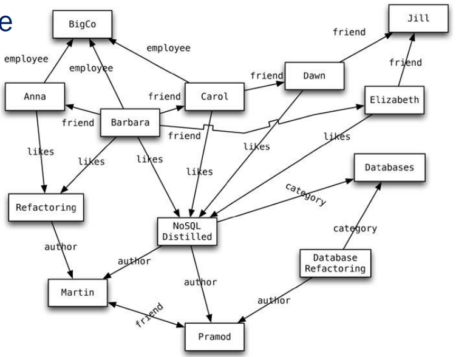

Questa classe di sistemi ragiona in termini di grafi, cioè si rappresentano i dati tramite nodi e archi.

Le interrogazioni avvengono attraverso meccanismi di navigazione. Cioè si parte da un nodo per poi trovare i risultati “interessanti”.

In questo sistema è difficile spezzare i dati per distribuirli in cluster, sono pensati quindi per sistemi `single-server`.

I vantaggi si hanno nelle operazioni in cui i dati coinvolti sono “altamente connessi” (le relazioni non vengono ricostruite a ogni query, sono già presenti nel grafo). Altri vantaggi quindi sono che i tempi di query vengono ridotte grazie ad algoritmi di `shortest-path` e `graph-search`, uno svantaggio però sono i tempi di inserimento/aggiornamento perché si lavorano con molti dati.

---

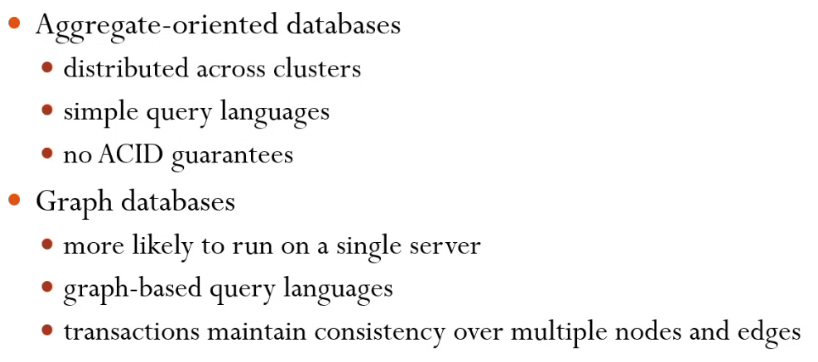

In questa immagine vengono mostrati i casi d’uso delle 2 macro-classi

---

## Schemaless Databases

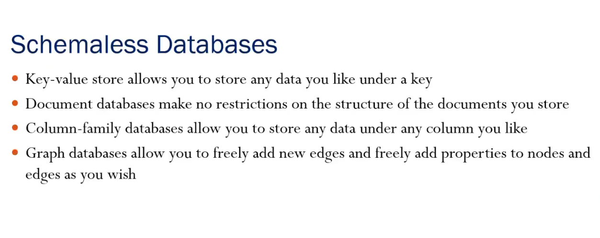

Una caratteristica che caratterizza tutte le classi (sia basati su grafo che basate su aggregates) è che sono basi di dati chiamate `schemaless`, sostanzialmente non hanno uno schema rigido di riferimento.

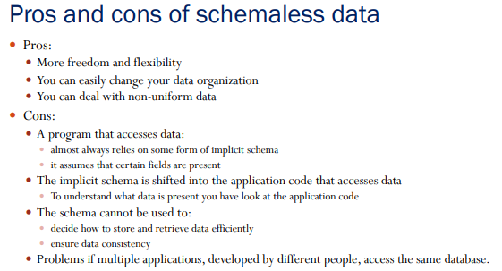

Qui vengono mostrati i vantaggi e svantaggi dei dati `schemaless`.

L’assenza di uno schema di riferimento permette di avere una massima flessibilità della memorizzazione dei dati.

---

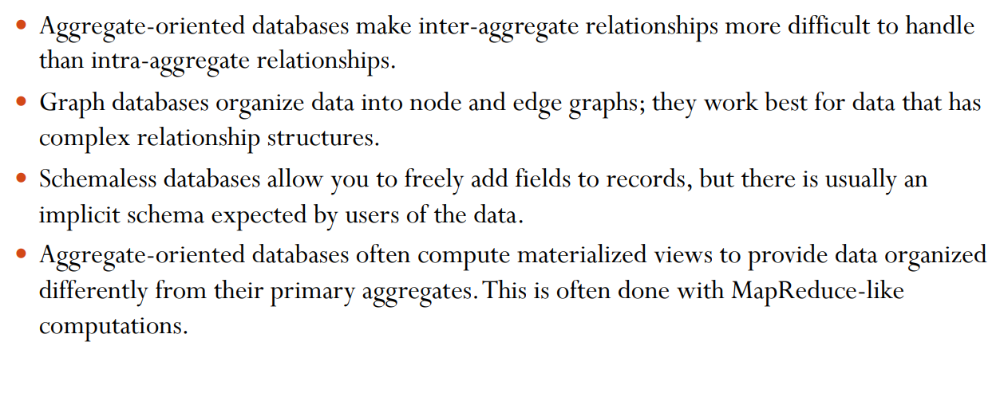

Qui vengono riassunti i punti chiave