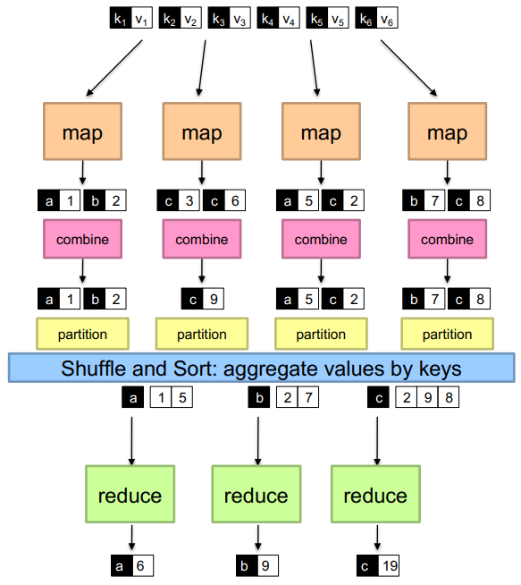
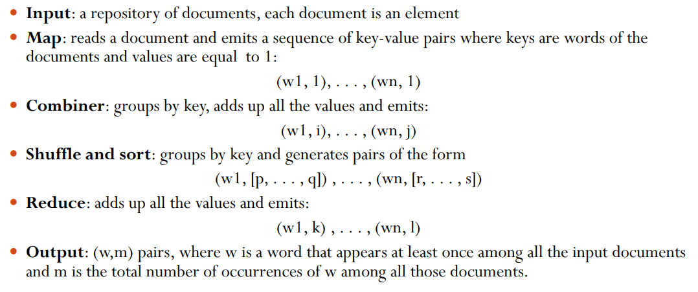

# 14 Marzo

Tags: Combiners, Map Reduce runtime task, Partitioners, Principi di Data Distribution in Hadoop
.: Yes

## Combiners

Quando la `reduce` è sia associativa che commutativa allora la parte di lavoro di riduzione può essere spostato sui task di mappatura per semplificare in parte il carico di lavoro.

Viene quindi applicato un `combiner` all’output della funzione di mappatura. Spesso, la stessa funzione utilizzata per la riduzione finale può essere utilizzata come combinatore.

Eseguendo una riduzione parziale durante la fase di `map` la quantità di dati intermedi viene ridotta. Questo significa che meno dati intermedi si hanno allora meno dati di dovranno trasferire sulla rete durante la fase di `shuffle`.

Utilizzo di `word-count` con i `combiners`.

## Partitioners

I `partitioners` sono responsabili della distribuzione delle coppie-chiave valore intermedie generate dai task di `map` e `reduce`. Utilizzano una funzione di hash per determinare quale riduttore riceverà una determinata coppia chiave-valore. A ogni chiave viene applicata una funzione di hash predefinita o personalizzata, la quale determina quale riduttore riceverà la coppia chiave-valore. Qualunque sia l'algoritmo utilizzato, ogni chiave è assegnata a uno e un solo task di riduzione, garantendo che le chiavi identiche finiscano nello stesso riduttore.

I `partitioners` assicurano che lo spazio delle chiavi delle coppie chiave-valore intermedie sia distribuito uniformemente tra i riduttori. Questo aiuta a bilanciare il carico di lavoro tra i vari riduttori.

## Task a runtime di map-reduce

La gestione della pianificazione in MapReduce è fondamentale per il corretto funzionamento del sistema. Ecco i principali compiti che svolge:

1. Assegna i lavoratori ai task di mappatura (Map) e riduzione (Reduce).
2. Gestisce la distribuzione dei dati, assicurandosi che i dati arrivino ai lavoratori.
3. Gestisce la sincronizzazione dei dati intermedi, raccogliendoli, ordinandoli e distribuendoli (shuffle).
4. Rileva i fallimenti dei lavoratori e li riavvia.
5. Tutto avviene su un file system distribuito (Distributed File System, DFS).

## Principles for data distribution in Hadoop

Ci sono 2 principi per la distribuzione dei dati e sono:

- `data-locality`: I dati e i lavoratori devono essere vicini tra loro per minimizzare la latenza e massimizzare l’efficienza. Quello che si fa quindi è che invece di spostare i dati per essere processati si avviano i lavoratori sui nodi che contengono i dati localmente.
    - Il numero di riduttori è determinato dalla configurazione:
        
        $$
        (0.95\text{ or }1.75)\times (\#\text{nodes})\times (\#\text{max containers per node})
        $$
        
- `shared-nothing architecture`: Ogni nodo è indipendente e autosufficiente, senza condivisione di risorse tra i nodi. Questo aumenta la scalabilità e la tolleranza ai guasti.
    - In questa architettura i task non dipendono l’uno dall’altro. La sincronizzazione tra i task è necessaria ma viene gestita dal sistema
    - Quello che bisogna fare è scrivere solamente le funzioni di `map` e `reduce`.