# 14 Marzo

Argomenti: Bias, Bias-Variance Tradeoff, Generalization Error, Noise, Overfitting, Test Error, Training Error, Training/Test Split, Valutazione delle prestazioni, Variance, Workflow per Regression
.: Yes

## Valutazione delle prestazioni

La valutazione delle prestazioni è di importanza cruciale per poter apprezzare il metodo che viene utilizzato per le previsioni, per questo motivo serve definire una metrica che consente di valutare quanto si perde quando si fa una certa previsione

$$
L\left[y,f_{\widehat{w}}(\bold x)\right]
$$

dove $y$ é il valore attuale mentre la funzione $f$ fornisce il valore previsto $\widehat{y}$. La funzione $L$ rappresenta il costo che si ha usando $f$ con i vettori dei pesi $\widehat{\bold w}$ a fronte dell’input $\bold x$

$$
L\left[y,f_{\widehat{w}}(\bold x)\right]=|y-f_{\widehat{w}}(\bold x)|
$$

La funzione di `loss` può essere ad esempio definita come `errore assoluto`

$$
L\left[y,f_{\widehat{w}}(\bold x)\right]=[y-f_{\widehat{w}}(\bold x)]^2
$$

oppure come `errore quadratico`

Tali esempi di funzione assumono che la `loss` per unpredicting sia uguale a quello di overpredicting.

Per valutare la funzione di `loss` bisogna definire il `training error`,`generalization error`,`test error`.

## Training Error

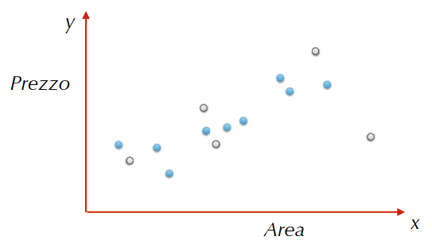

Supponendo di avere questo dataset, bisogna decidere il modello da utilizzare e scegliere un sottoinsieme delle osservazioni per effettuare la fase di training del modello

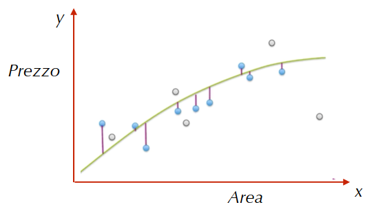

Se per esempio si sceglie un modello quadratico e ci si calcolano i pesi $w$ tali da minimizzare la funzione $RSS$ si ottiene la funzione mostrata

$$
\dfrac{1}{N}\cdot \sum_{i=1}^{N}L\left[y_i,f_{\widehat{w}}(\bold x_i)\right]
$$

Con questa formula ci si calcola il training error come la media della loss definito sui $N$ punti di training

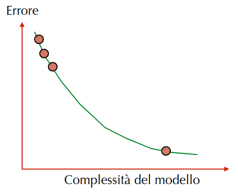

Nell’esempio si è scelto un modello quadratico e in generale all’aumentare della complessità del modello diminuisce l’errore

- Partendo da sinistra a destra i punti sono:
    - modello `costante`
    - modello `lineare`
    - modello `quadratico`
    - modello `polinomiale`

## Generalization Error

Il `training error` non è una buona misura per predire la performance del modello perché è molto ottimistico proprio perché il vettore $\widehat{\bold w}$ è calcolato affinché il modello si adatti ai dati di training. Quindi sarebbe interessante conoscere il `loss` prendendo in considerazione tutte le possibili coppie $(x,y)$

$$
E_{\bold x,y}\left[L(y,f_{\widehat{w}}(\bold x))\right]
$$

Chiamato anche `true-error`, viene definito come mostrato, ossia la media della funzione loss calcolato su tutte le possibile coppie pesate in base alla loro probabilità di comparire nella zona.

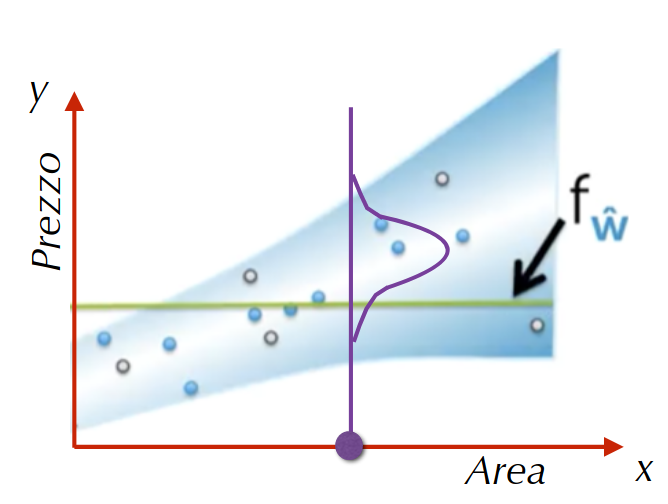

Per intuire come il `generalization error` possa variare in base alla complessità del modello ci si avvale di questa rappresentazione. La regione blu rappresenta la distribuzione di probabilità di avere una istanza “corretta” nel dataset, la parte bianca rappresenta le più alte probabilità.

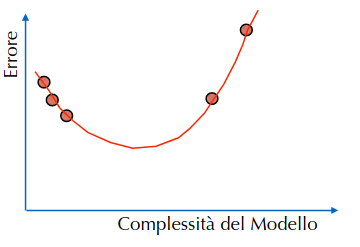

L’andamento dell’errore è in genere cosi

- Partendo da sinistra a destra i punti sono:
    - modello costante
    - modello lineare
    - modello quadratico
    - modello polinomiale
    - caso di modello high-level

A differenza del training non è possibile calcolare il generalization error, per calcolarlo bisognerebbe conoscere la `true distribution`(distribuzione di probabilità in blu), cosa che non si può fare.

## Test Error

$$
\dfrac{1}{N_{test}}\cdot \sum_{i\in test}L\left[y_i,f_{\widehat{w}}(\bold x_i)\right]
$$

Il `test-error` è definito come media delle loss sui punti dell’insieme di test.

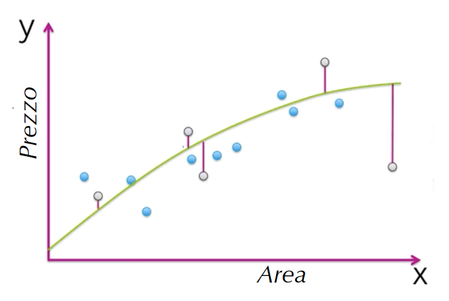

Nella figura sono mostrati le istanze del dataset che appartengono al test set.

## Relazione tra gli errori e la complessità del modello

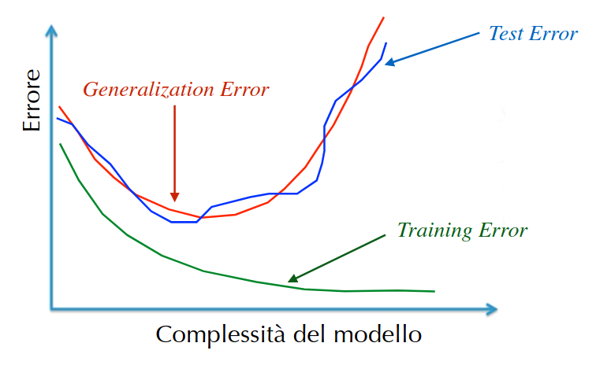

Mettendo tutto insieme, si ha che il `test-error` ha un andamento che si può approssimare al `true-error`.

In pratica la situazione che si vuole avere è organizzare il dataset in modo tale che il `test-error` approssimi il più possibile il `true-error`.

## Overfitting

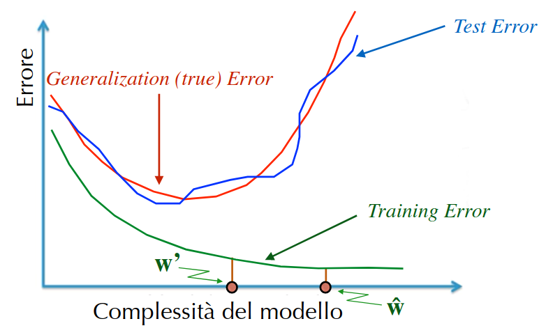

Dato un modello con parametri $\widehat{\bold w}$, si ha un overfitting se esiste un modello con i parametri stimati $w'$ tale che:

- training-error $\widehat{\bold w}$ $<$ training error $\bold w'$
- true error $\widehat{\bold w}$ $>$ true error $\bold w'$

## Training/Test Split

Un importante problema da considerare è la suddivisione delle osservazioni disponibili tra training set e test set

- Se per il training set si hanno poche osservazioni, si rischia di non stimare in modo adeguato il modello, il che comporterebbe previsioni imprecise da parte dello stesso
- Se per il test set si hanno poche osservazioni, si rischia di non avere una rappresentazione adeguata dei dati che si stanno analizzando (quindi si ha bassa probabilità che il modello generalizzi)

Purtroppo non esiste una formula che dice come suddividere esattamente il dataset, la regola pratica è quella di mettere una quantità di punti per il test set in modo tale da avere una buona approssimazione del true error.

Se questo però lascia troppi pochi punti per il training set allora ci si può avvalere del `cross-validation`.

## Noise

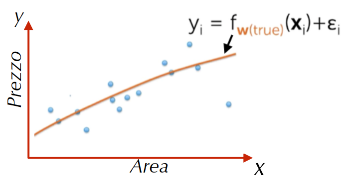

In genere i dati contengono “rumore”; ipotizziamo che esiste una `true-function` che lega $\bold x$ a $y$, che però non è una descrizione perfetta di tale legame perché ci possono essere altri fattori di cui non si è tenuto conto. Questo implica automaticamente la presenza di un “rumore” definito con $\epsilon$ tale che $\left\langle \epsilon \right\rangle=0$

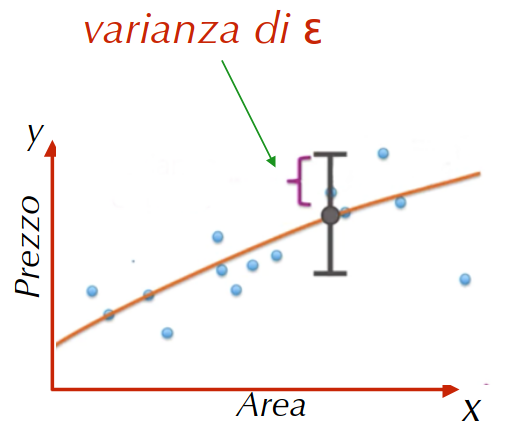

La presenza di questo rumore di solito comporta uno spostamento rispetto alla vera funzione.

Nella figura viene mostrato che si deve prendere in considerazione la varianza di $\epsilon$

Il rumore in questione è chiamato `irreducible-error`.

La presenza del rumore non si può controllare mentre il `bias` e la `variance` si possono controllare. 

## Bias

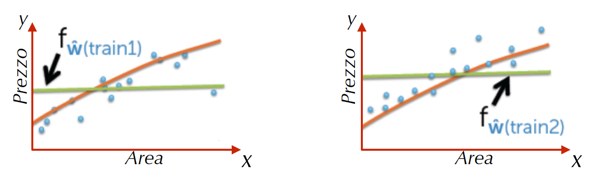

Per definire il `bias` si considera ad esempio un modello costante addestrato con diversi training set.

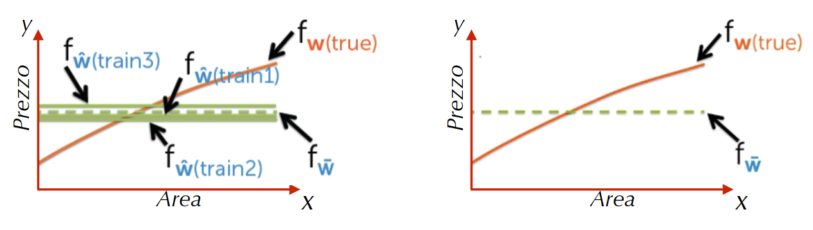

Si considera adesso la funzione media delle varie funzioni $f$ stimate, quindi:

$$
f_{\overline{\bold w}}(\bold x_t)\triangleq E_{train}\left[f_{\widehat{\bold w}}(\bold x_t)\right]
$$

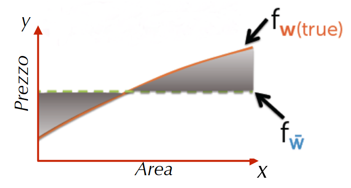

Il `bias` è definito come la differenza tra la true function e la funzione media

$$
bias(f_{\widehat{\bold w}}(\bold x_t))=f_{\bold w(true)}(\bold x_t)-f_{\overline{\bold w}}(\bold x_t)
$$

In sostanza dice quanto il modello si adatti alla true function (low complexity → high bias)

## Variance

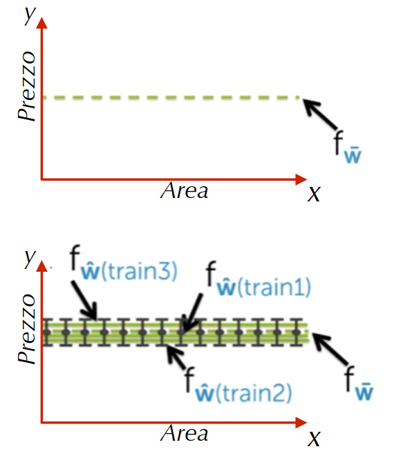

Si considerano di quanto le varie funzioni $f$ stimate differiscono dalla funzione media

$$
var(f_{\widehat{\bold w}}(\bold x_t))=E_{train}\left[(f_{\widehat{\bold w}}(\bold x_t)-f_{\overline{\bold w}}(\bold x_t))^2\right]
$$

In questo caso non si ha una variazione elevata per le diverse funzioni $f$ stimate. In genere quando la complessità del modello è bassa la variance è bassa.

In altre parole indica quanto i dati si allontanano dalla media dell’intero set di dati.

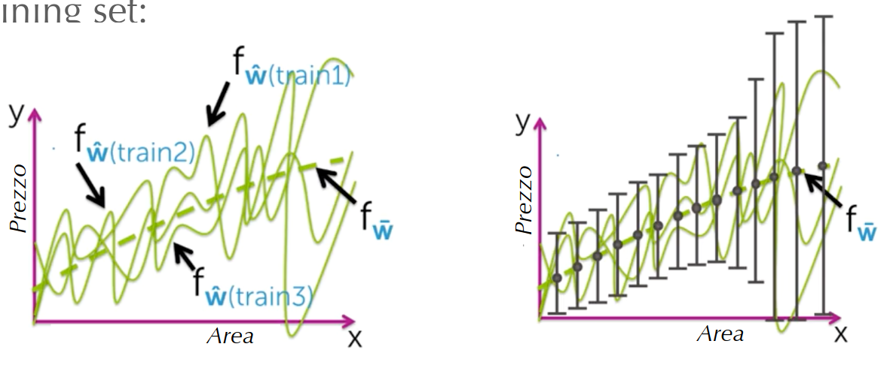

In questo caso la complessità del modello aumenta di conseguenza anche la `variance` farà la stessa cosa

## Bias-Variance Tradeoff

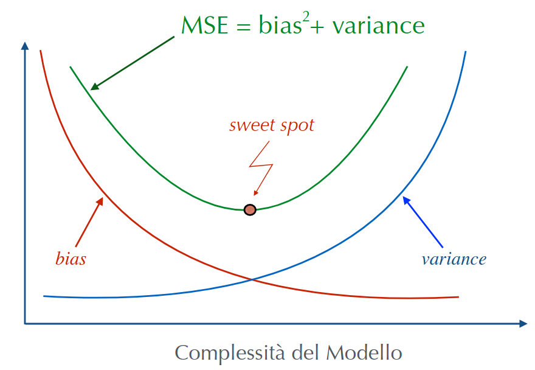

L’obiettivo nel machine learning è trovare lo `sweet-spot`, purtroppo non si può calcolare `bias` e `variance` perché non si dispone della `true-function` e tutti i possibili training set.

`MSE`: Mean Squared Error

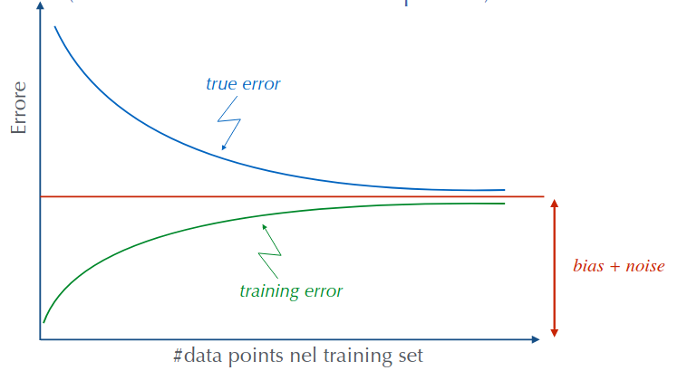

Se si hanno pochi punti nel training set il true error è alto perché la funzione $f$ non stima bene la vera relazione tra $\bold x$ e $y$

Se si hanno pochi punti nel training set il training error è basso perché la funzione $f$ non può approssimare più facilmente la vera relazione tra $\bold x$ e $y$ 

La `true-error` e il `training-error` tendono a un valore uguale a `bias` + `noise`.

## Workflow per Regression (ML in generale)

Ci sono 2 task importanti per la `regression`:

- `model selection`: spesso si devono scegliere parametri di tuning $\lambda$ che controllano la complessità del modello
- `model assestment`: una volta scelto il modello bisogna effettuare la valutazione del generalization error

Il fenomeno di `peaking` avviene quando l’ipotesi è stata selezionata in base alle sue prestazioni sull’insieme di test, in pratica l’informazione non si deve “infiltrare” nell’algoritmo di apprendimento. 

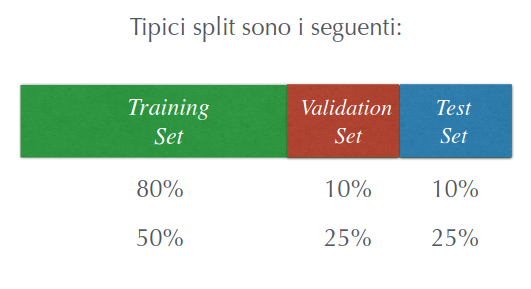

Una soluzione è quella di considerare non solo il training e test set.

Non c’è una regola generale per suddividere le osservazioni disponibili tra i 3 dataset