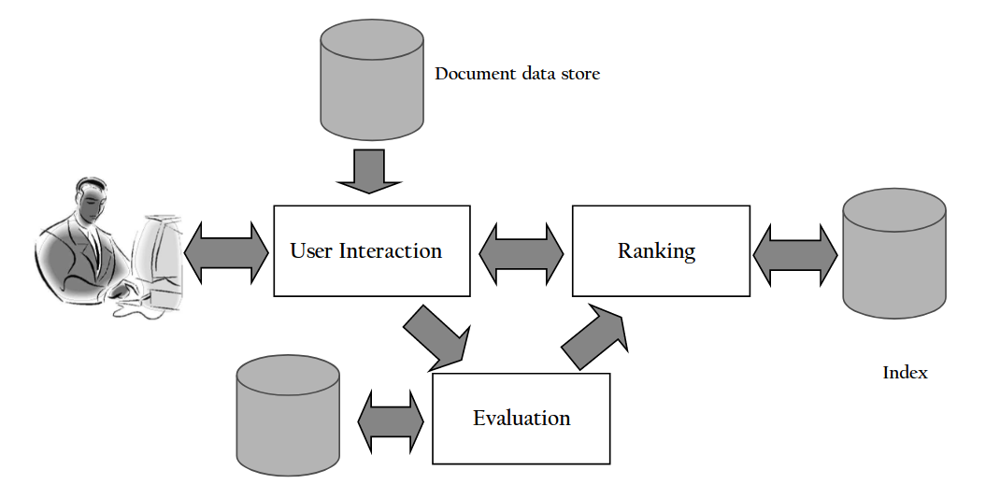

# 14 Marzo

Argomenti: Architettura di un motore di ricerca, Processo di indicizzazione, Processo di interrogazione
.: Yes

## Architettura di un motore di ricerca

L’architettura di un motore di ricerca mira a soddisfare 2 obiettivi fondamentali:

- `efficacia`: si vuole recuperare l’insieme più rilevante possibile di documenti per una query
- `efficienza`: si vuole processare le query degli utenti il più velocemente possibile

# Processo di indicizzazione

In questa immagine è mostrato il processo di `indicizzazione`, cioè la creazione degli indice tramite acquisizione e trasformazione dei documenti.

- `text-acquisition`: in questo step vengono ottenuti i documenti senza nessuna modifica e vengono salvati in un `document-data-store`; si cerca di mantenere l’architettura il più semplice possibile per poter garantire l’efficienza.
- `text-transformation`: i documenti ottenuti vengono trasformati in `index-term` e viene aggiornato l’`index-vocabulary` cioè il set di tutti i termini che sono indicizzati per una collezione di documenti. Questa trasformazione viene fatta per poter garantire il fast retrieval
- `index-creation`: gli `index-term` creati nello step precedente sono usati per creare gli `indici` che poi vengono memorizzati in un database e usati come supporto alla ricerca veloce

## Text Acquisition

In questa fase è importante parlare dei 4 componenti principali utilizzati e sono: `crawler`, `document-feed`, `conversion` e `document data store`

- `crawler`: componente software che naviga su web, identifica e acquisice i documenti per i motori di ricerca. I crawler partono da dei punti specifici chiamati `seed` e naviga su web seguendo i link. Gli obiettivi sono la `coverage`, cioè recuperare quante più informazioni possibili dal web e tenerle aggiornate, quindi mantenere una `freshness`. Esistono 2 tipi di crawler che vengono utilizzati
    - `focused`: sono indirizzati verso un argomento, necessita di un classificatore di documenti per poter capire se il testo recuperato può essere o meno inerente all’argomento trattato.
    - `document`: effettuano la ricerca di documenti aziendali seguendo i link all’interno delle directory
- `document-feed`: sono un meccanismo per accedere a stream in real-time di documenti, dove lo standard più utilizzato è `RSS`. Offre tutte le notizie ad un argomento, e il motore di ricerca per poter ottenere queste informazioni deve solamente collegarsi ed analizzare lo streaming di notizie
- `conversion`: si convertono i documenti ottenuti in testo che usa i metadati come formato.
- `document-data-store`: memorizza tutte le informazioni dei documenti analizzati; l’inserimento e il recupero delle informazioni deve essere efficiente

## Text Transformation

In questa fase vengono processati i documenti in input per poter ottenere gli indici che verranno utilizzati per accedere al contenuto di questi documenti in modo efficiace. Di seguito sono elencati i componenti principali di questo processo:

- `parser`: è un analizzatore sintattico che verifica la correttezza del testo, fa uso di un `tokenizzatore` che prende in input una sequenza di caratteri e restituisce una sequenza di token che verranno utilizzati negli step successivi. Tramite i tag riconosce la struttura e le caratteristiche della pagina.
- `stopping`: le parole meno importanti vengono rimosse perché non aggiungo nessun contributo informativo, si potrebbero però presentare problemi nel caso di documenti piccoli  perché si potrebbe avere perdite di informazioni
- `stemming`: si raggruppano le parole che derivano dalla stessa radice semplificando l’analisi, i benefici di questa tecnica varia in base alle diverse lingue
- `link-extraction e analysis`: fa uso dei link e anchor texts nelle pagine web per capire quale pagina analizzare e acquisire. Questa analisi non si interessa del contenuto, ma fornisce al motore di ricerca una valutazione della popolarità.
- `information-extraction`: si cerca di identificare classi di `index-term`, i `named-entity-recognizer` fanno questo processo e grazie a loro è possibile capire qual’è l’argomento trattato dal testo.
- `classifier`: assegnano etichette ai documenti, l’uso di questi strumenti dipende dal tipo di applicazione

## Index creation

Di seguito sono mostrati le tecniche che compongono la creazione degli indici:

- `document-statistics`: si raccolgono e registrano le informazioni statistiche relative a parole, feature e documenti per poterle utilizzare negli algoritmi di `ranking`. Queste statistiche sono memorizzate in `lookup-table` che sono strutture dati progettate per il fast retrieval.
- `weighting`: meccanismo di pesatura dei termini in funzione dei documenti, usato negli algoritmi di ranking.
- `inversion`: sarebbe il cuore del processo di indicizzazione, per ogni termine restituisce l’indice dei documenti nel quale è presente tale indice. Deve essere in grado di trattare in maniera efficiente l’aggiornamento.
- `indice distribuito`: gli indici creati vengono distribuiti su molteplici computer, in modo da rendere più efficiente l’elaborazione della query. Molto importante se il numero di documenti è grande.

# Processo di interrogazione

In questa immagine viene mostrato il processo di interrogazione, quindi come i motori di ricerca rispondono alle richieste dell’utente. Mostra anche quanto sono utili i risultati ottenuti dal processo di indicizzazione

- `user-interaction`: interfaccia che permette all’utente di effettuare una query, permette anche il raffinamento della query per poter aumentare l’efficacia del motore di ricerca
- `ranking`: fase principale della fase di ricerca; si ordinano i documenti sulla base del ranking usando la query e gli indici.
- `evaluation`: permette di effettuare il tuning del motore di ricerca. Misura l’efficienza e l’efficacia del motore di ricerca

## User interaction

- `query-input`: fornisce l’interfaccia e il parser per il linguaggio della query
- `query-transformation`: componente che include le tecniche per migliorare la query iniziale, sia prima che dopo aver prodotto un ranking di documenti. Lo `spell-checking` e la `query-suggestion` forniscono alternative alla query originale. Mentre la tecnica di `revelance-feedback` espande la query in base alle occorrenze dei termini nei documenti identificati come rilevanti dall’utente.
- `result-output`: costruisce la visualizzazione dei documenti, ordinati relativi ad una query.

## Ranking

- `scoring`: componente che calcola il punteggio per i documenti usando un algoritmo di ranking che è basato su modello di retrieval. La forma base di un punteggio è $\sum q_id_i$, dove $q_i$ e $d_i$ sono i pesi della query e del documento per il termine $i$, la sommatoria è estesa a tutti i termini nel vocabolario della collezione.
- `performance optimization`: tramite i risultati dello `scoring` e il feedback degli utenti, di progettano algoritmi di ranking e indici per un’elaborazione efficiente
- `distribution`: le query sono processate in ambienti distribuiti, il `query-broker` distribuisce le query e assembla i risultati.

## Evaluation

- `logging`: loggare le query degli utenti e le loro interazioni è cruciale per migliorare l’efficienza e l’efficacia della ricerca. Per esempio le analisi dei click possono essere usati per ottenere informazioni sulla permanenza degli utenti nella pagina web