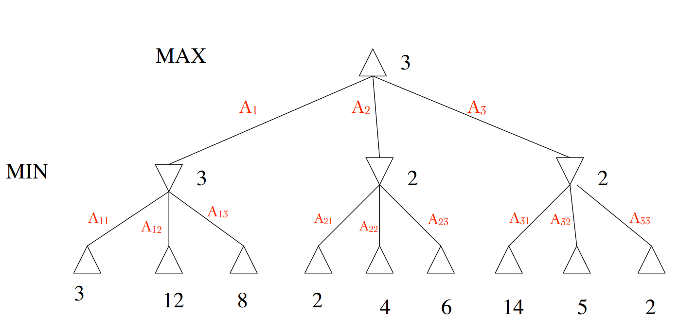
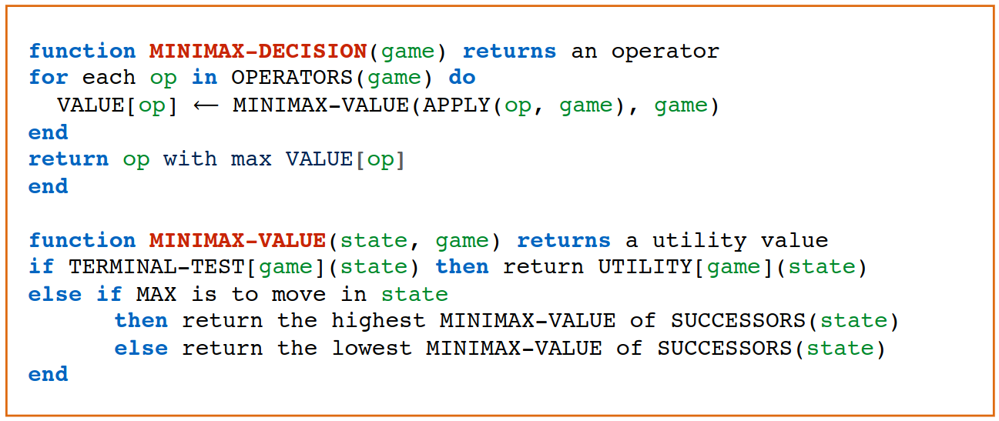
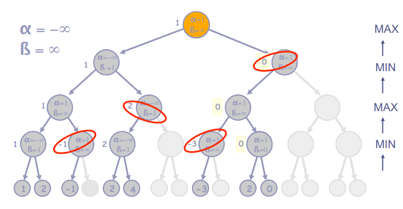

# 14 Novembre

Argomenti: Algoritmo MiniMax, Potatura di rami
.: Yes

## Giochi a 2 avversari

La presenza di un `avversario` rende il problema più complicato, rispetto ai problemi di search, perchè si inserisce un fattore di `incertezza` dovuto alla mancanza di conoscenza sulle mosse che farà l’avversario.

Uno dei problemi più importanti che si prendono in considerazione è la dimensione del problema, perchè è impossibile esaminare tutto l’albero per trovare la mossa migliore senza conoscerne tutte le possibili conseguenze

Un gioco può essere formalmente definito come un problema di ricerca:

- `Stato iniziale`: posizione sulla scacchiera, turno.
- `Operatori`: realizzano le mosse legali.
- `Goal-Test`: determinano la fine del gioco (stati terminali)
- `Funzione di utilità`: attribuisce un valore numerico agli stati terminali.

## Algoritmo MiniMax

- Consente di trovare la mossa teoricamente migliore, senza considerare limitazioni di tempo
- Tipicamente i 2 giocatori vengono chiamati `Max` e `Min`; per vincere il giocatore `Max` deve massimizzare la funzione di utilità, stessa cosa per il giocatore `Min`.
- La ricerca della mossa migliore da parte di `Max` deve tener conto delle possibili contromosse di `Min`. Quindi `Max` deve trovare una strategia che permette di vincere indipendentemente dalle mosse di `Min`: quindi serve un algoritmo che dia la mossa migliore di `Max` per ciascuna mossa possibile di `Min`.

## Procedura del Mini-Max su un albero completo

Questo algoritmo che deve funzionare per decisioni perfette segue questa procedura:

- generare tutto l’albero di gioco
- determinare il valore delle foglie applicando la funzione di utilità
- propagare i valori ai genitori:
    - il valore di un nodo `Min` è il minimo tra i valori dei figli
    - il valore di un nodo `Max` è il massimo tra i valori dei figli
- la radice corrisponde a un turno di `Max` che sceglierà la mossa che porta al valore più alto.

In questo esempio `Max` ha la possibilità di fare 3 mosse: $A_1$,$A_2$,$A_3$; dopo aver fatto la mossa è il turno di `Min`, che se `Max` fa la mossa $A_1$ allora `Min` avrà le mosse $A_{11}$,$A_{12}$,$A_{13}$.

Visto che da giocatore uno deve massimizzare e l’altro deve minimizzare allora, `Max` farà la mossa $A_{1}$ perchè massimizza la funzione di utilità. Mentre `Min` farà la mossa $A_{11}$

La propagazione dei valori ai genitori è alternata, cioè partendo dall’ultima “generazione” il nodo genitore è di tipo MIN quindi viene propagato il valore più piccolo mentre se il nodo fosse MAX allora viene propagato il valore più grande

- `complessità in tempo`: $O(b^m)$ dove $m$ è la profondità e $b$ fattore di ramificazione
- `complessità in spazio`: $O(b^m)$

## Algoritmo Mini-Max per decisione imperfette

Anzichè costruire l’albero fino agli stati terminali, si costruisce fino a una profondità fissata: al posto del TERMINAL-TEST si mette CUT-OFF TEST

Per valutare le foglie dell’albero, al posto della funzione UTILITY, si utilizza una funzione di valutazione `euristica` EVAL

La funzione di valutazione EVAL fornisce una stima dell’utilità di una certa posizione di gioco e deve riflettere l’effettiva possibiltà di vittoria. Il suo calcolo non deve essere troppo costoso.

### Problemi nel tagliare la ricerca (CUT-OFF TEST)

- Posizione `non quiescente`:
    - la funzione di valutazione dovrebbe essere applicata solo alle posizioni che sono `quiescenti`, ossia che è improbabile che manifestino delle notevoli oscillazioni di valore nel futuro immediato.
- Posizione dell’`orizzonte`:
    - questo problema è più difficile da eliminare. Si presenta quando il programma si trova di fronte a una mossa dell’avversario che causa seri danni ed è del tutto inevitabile.

La scelta del `Cut-Off` dipende da questi punti:

- si deve scegliere una profondità fissata tale da usare al meglio il tempo a disposizione
- applicare la tecnica degli approfondimenti iterativi.

## Potatura di rami

Se la valutazione delle posizioni avviene contemporaneamente alla costruzione dell’albero è possibile potare dei rami cioè calcolare la decisione `MiniMax` senza esaminare tutti i nodi dell’albero (`pruning`). In pratica se non trova subito un nodo che è più piccolo dell’etichetta corrente allora continua a cercare nodi con etichetta minori fino a che non è uguale per poi potare quel ramo.

## Potatura ALFA-BETA

Non appena si determina nell’albero un nodo `Min` con valore provvisorio $\le$ `alpha`, non vengono generati altri sottoalberi di tale nodo.

Non appena si determina nell’albero un nodo `Max` con valore provvisorio $\ge$ `beta`, non vengono generati altri sottoalberi di tale nodo