# 15 Aprile

Argomenti: 2PL, Gestione dei lock, Lock, S2PL, Timestamp
.: No

## Lock

L’utilizzo delle risorse è controllato per evitare aggiornamenti indesiderati, quando una transazione prima legge e poi scrive allora questo può richiedere subito un lock esclusivo e può chiedere prima un lock condiviso e poi uno esclusivo (`lock-upgrade`)

## Gestione dei lock

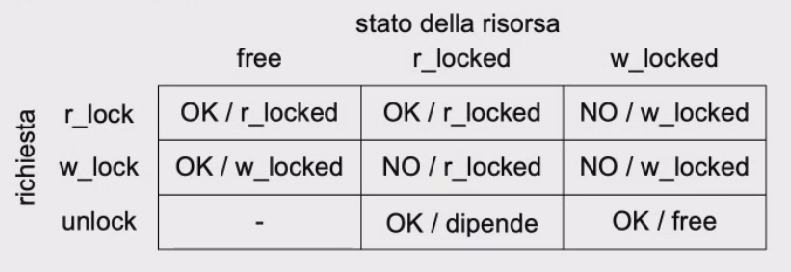

Il `lock-manager` riceve richieste di lock dalle transazioni e le accoglie o rifiuta, sulla base di definizioni formalizzate in questa tabella

Questa tabella indica come le richieste sono gestite in base allo stato della risorsa

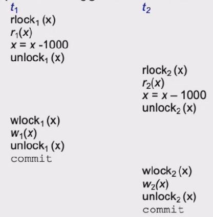

Si suppone di avere queste 2 transazioni, la perdita di aggiornamento si ha comunque, anche se si usano i lock

Si può pensare di risolvere il problema con il locking a 2 fasi (`2PL`)

## Locking a 2 fasi (2PL)

In pratica oltre alla protezione con lock di tutte le letture e scritture si aggiunge un vincolo sulle richieste e i rilasci dei lock cioè una transazione, dopo aver rilasciato un lock, non può acquisirne altri.

## Locking a due fasi stretto (S2PL)

Sarebbe una variante di `2PL` dove I lock vengono mantenuti e rilasciati solo dopo il commit o l’abort

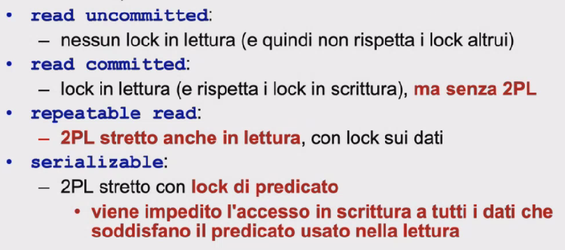

In questa immagine viene mostrata l’implementazione dei livelli di isolamento

## Controllo di concorrenza basato su timestamp

Questa è un altra tecnica di controllo di concorrenza e sarebbe una alternativa al `2PL`, si usa il `Timestamp` cioè un identificatore che definisce un ordinamento totale sugli eventi di un sistema. In pratica ogni transazione ha un timestamp che indica l’istante di inizio della transazione e tramite questa informazione gli schedule vengono accettati solo se riflettono, nei conflitti, l’ordinamento seriale delle transazioni indotto dai timestamp.

Per ogni oggetto ci sono 2 variabili denotate con `RTM(x)` e `WTM(x)`. La prima indica il timestamp della transazione più giovane che ha letto x mentre la seconda indica il timestamp della transazione più giovane che ha scritto x

Lo scheduler riceve di letture e scritture, con $t$ si indica il timestamp della transazione che richiede l’operazione:

- $r_t(x)$: se $t<WTM(x)$ allora la richiesta è respinta e la transazione uccisa; altrimenti viene accolta e $RTM(x)$ è uguale al maggiore tra $RTM(x)$ e $t$
- $w_t(x)$: se $t<WTM(x)$ o $t<RTM(x)$ allora la richiesta è respinta e la transazione viene uccisa; altrimenti viene accolta e $WTM(x)$ è posto uguale a $t$

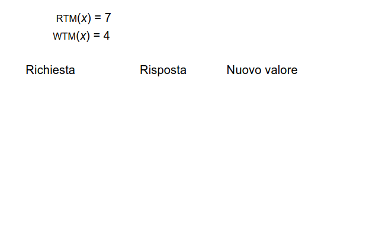

Si suppone di avere questo esempio dove l’oggetto $x$ ha un timestamp di lettura pari a 7 e un timestamp di scrittura pari a 4, questo vuol dire che la transazione più giovane che ha letto è la 7 e la transazione più giovane che ha scritto è la 4 

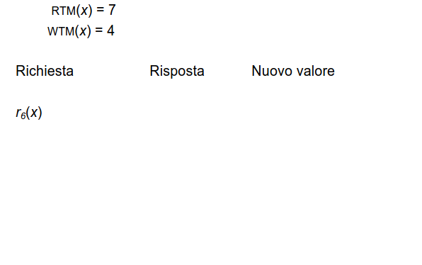

Arriva una richiesta di lettura da parte della transazione 6, si deve confrontare il timestamp di questa transazione con quella di scrittura e si ottiene che non c’è conflitto perchè 6 è più giovane di 4 quindi tutto va bene e non c’è da cambiare timestamp

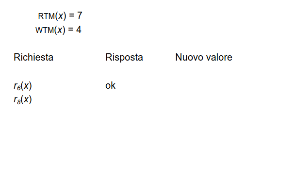

Poi arriva una richiesta di lettura con timestamp pari a 8, che in questo caso ancora va bene perche 8 > 4, ma si deve aggiornare la RTM(x) a 8

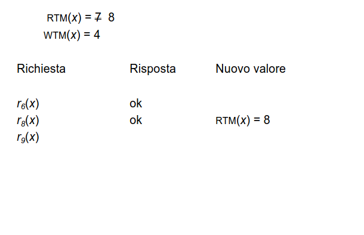

Poi arriva una richiesta dalla transazione con timestamp pari a 9

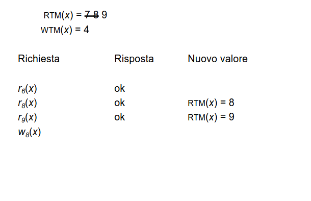

Poi arriva una richiesta di scrittura dalla transazione con timestamp pari a 8, da qui si ha un problema perché si ha sbagliato ordine, quindi la transazione 8 fallisce quindi deve essere uccisa

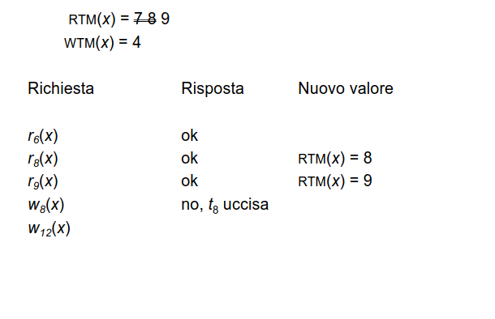

Non si hanno problemi

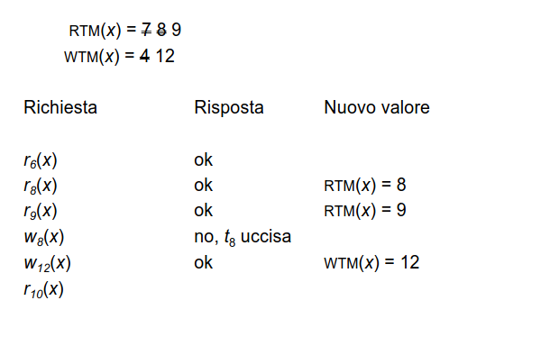

Arriva una lettura della transazione 10, ma il dato non c’è più perché è stato sovrascritto dalla transazione 12 quindi viene uccisa la transazione 10

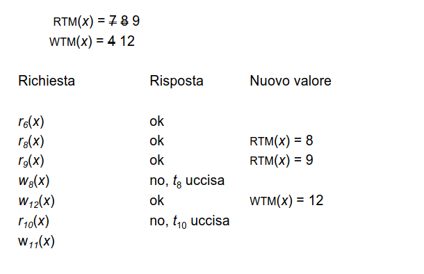

Infine arriva una scrittura della transazione 11 ma il dato è già stata scritta dalla transazione 12, quindi viene uccisa

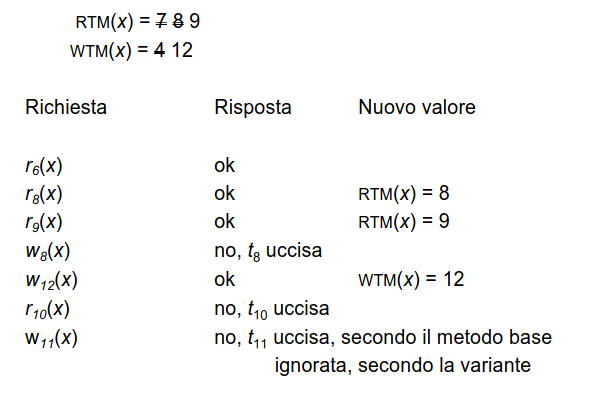

Si ottiene questo risultato, la variante dice che per $w_t(x)$ se t < wtm(x) allora la richiesta viene ignorata

---

## Controllo di concorrenza multiversione

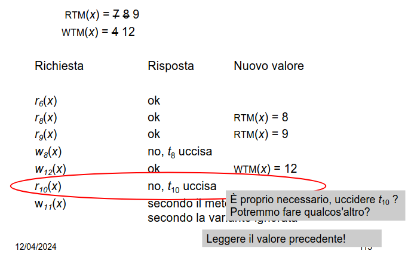

Quello che si potrebbe fare la lettura per la transazione 10 è mantenere una storia, cioè far leggere alla transazione 10 il valore che c’era prima dell’aggiornamento compatibile con il suo timestamp 

Quello che si fa è che per ogni scrittura si generano nuove copie e le letture leggono la copia “valida” per la transazione

## Controllo di concorrenza in Postgres multiversione

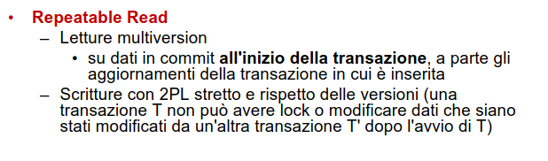

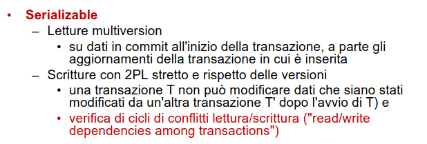