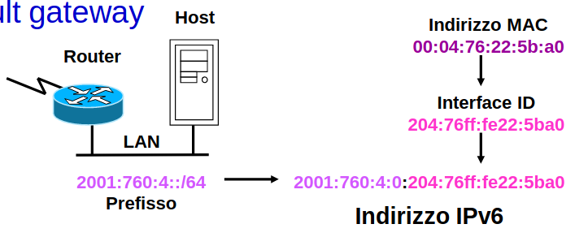
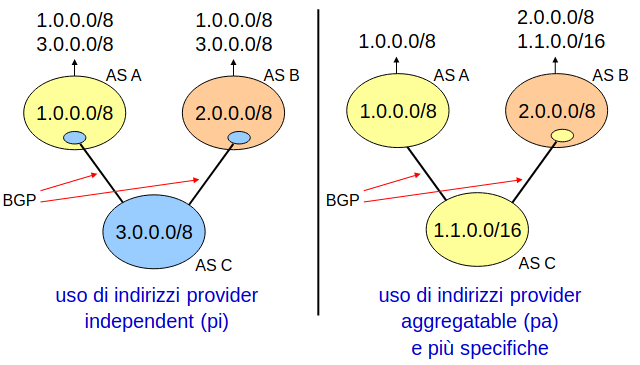
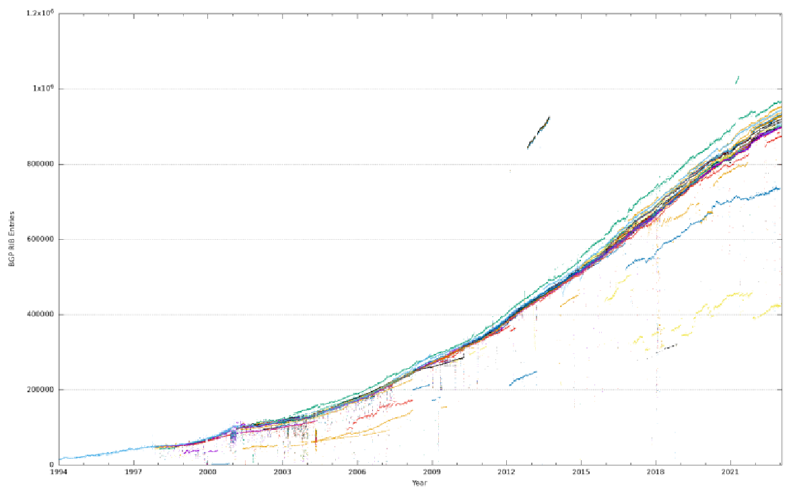
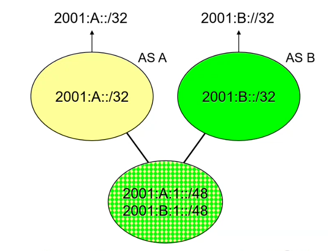
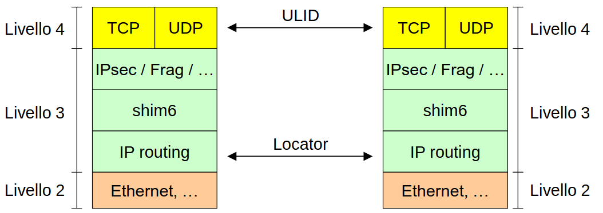

# 15 Gennaio

Argomenti: Autoconfigurazione stateless, Configurazione stateful, Duplicate address detection, Host renumbering, Multihoming IPv4, Router renumbering, Source address selection, shim6
.: Yes

## Autoconfigurazione stateless

L’autoconfigurazione degli indirizzi permette ai nodi `IPv6` di connettersi alla rete senza dover configurare manualmente gli indirizzi, il requisito è che il link deve supportare il multicast.

Nell’autoconfigurazione `stateless` la cosa che può fare il computer, quando si accende, è prendersi un `interface-id`, per potersi costruire il proprio indirizzo link-local. Per poter fare questi indirizzi è necessario avere i prefissi che arrivano tramite `router-advertisement`

- Con il `router-advertisement` i router inviano periodicamente su ogni link dei pacchetti di `router-advertisement` con un indirizzo IPv6 multi-cast, in pratica con questi pacchetti si annunciano la presenza dei router, forniscono il valore di hop-limit, reachable time, MTU,etc. e contengono una lista di prefissi assegnati al link

Gli host indirizzi IPv6 concatenando il loro interface-id, tali indirizzi permettono agli host di comunicare con nodi off-link attraverso il router.

- Un’alternativa sarebbe quella di utilizzare `router-solicitation`, che permette di far ottenere agli host le informazioni sul link, sui prefissi e gli indirizzi IPv6 immediatamente. All’avvio viene inviato un paccheti di `router-solicitation` all’indirizzo multicast che corrisponde a tutti i router sul link (FF02::2) e ogni router risponde con un pacchetto unicast di `router-advertisement` indirizzato al nodo che ha emesso la richiesta.

## Duplicate address detection

Una macchina `IPv6` quando si assegna un indirizzo si chiede anche se quell’indirizzo è già stato assegnato a qualcun’altro nella rete (il che non succede se si usa il mac-address per costruire l’indirizzo). 

La procedura per il controllo è chiamata `duplicate-address-detection` e funziona in questo modo: il nodo invia una serie di pacchetti di neighbor solicitation all’indirizzo solicited-node corrispondente all’indirizzo che vorrebbe assegnare, se non riceve in risposta un neighbor advertisement allora l’indirizzo è valido e può esse assegnato

In `IPv4` esiste la funzionalità simile utilizzando però ARP

## Procedura dell’autoconfigurazione

- All’avvio l’host configura gli indirizzi link-local per ciascuna interfaccia poi con duplicate address detection verifica che l’indirizzo sia unico sul link
- se il nodo è un host effettua le ulteriori operazioni:
    - emette dei router solicitation su tutte le interfacce
    - per ogni router advertisement che riceve aggiunge il router alla lista dei router disponibili e configura un indirizzo per ogni prefisso nell’annuncio
    - rimane in ascolto dei messaggi di router advertisement

Nel router advertisement ad ogni prefisso sono associati 2 tempi di vita in secondi che sono

- `valid` lifetime: il tempo per cui l’indirizzo può essere associato all’interfaccia, se 0 allora non è valido e non può rimanere assegnato all’interfaccia
- `preferred` lifetime: il tempo per cui l’indirizzo può essere utilizzato per le nuove connessioni se 0 l’indirizzo non è valido e non può essere utilizzato per nuove connessioni

## Host renumbering

Il tempo di vita dei prefissi permette il renumbering automatico degli host, in pratica se si vogliono cambiare i prefissi sulla lan si configura il nuovo prefisso sul router mettendo a 0 il `preferred-lifetime` di quello vecchio. 

## Gestione avanzata degli indirizzi - router renumbering

Il processo di `router renumbering` si riferisce al processo di assegnazione o modifica degli indirizzi IP all'interno di una rete da parte di un router. Questo può avvenire per diverse ragioni, tra cui la necessità di ridisegnare la topologia della rete, migliorare l'efficienza nella gestione degli indirizzi IP o risolvere conflitti di indirizzi.

---

## Configurazione stateful

La configurazione stateful si fa con il protocollo `DHCPv6`, che serve ad assegnare l’indirizzo `IPv6` in caso non se ne abbia uno e di configurarti.

---

## Source address selection

Un nodo ha in generale più indirizzi `IPv6`, almeno un indirizzo link-local per interfaccia e in genere uno o più indirizzi unique-local, globali, ecc. Il problema è capire quale utilizzare come sorgente e destinazione per ogni flusso.

`IPv4`: 203.178.141.194

`IPv6`: 2001:200:0:8002:203:47ff:fea5:3085

Uno scenario tipico è quando si cerca di connettersi ad un host del quale è noto il nome aventi 2 indirizzi come mostrato a sinistra

La scelta dell’indirizzo del destinatario dipende dagli indirizzi sorgente che sono disponibili ma è anche vero il viceversa, quindi per risolvere questo problema si procede in questo modo:

- se un host ha un indirizzo `IPv6` link-local e un indirizzo `IPv4` globale, ha senso preferire `IPv4`
- se un host ha un indirizzo `IPv6` globale e un indirizzo `IPv4` autoconfigurato ha senso preferire `IPv6`

## Algoritmo di source address selection

- si ordinano tutti gli indirizzi della destinazione in ordine di `preferenza` decrescente inclusi gli eventuali indirizzi `IPv4`
- si provano gli indirizzi destinazione uno alla volta e per ogni indirizzo destinatario si sceglie l’indirizzo sorgente più appropriato

L’indirizzo mittente è scelto in base al giusto scope, per evitare indirizzi deprecati, ecc.

L’ordine di preferenza degli indirizzi è stabilito da regole che evitano destinazioni irraggiungibili, uso del giusto scope, evitano indirizzi sorgente deprecati.

---

## Multihoming IPv4

In `IPv4` il multihoming si basa su BGP, il primo caso si usano indirizzi provider independent (cioè ereditato da nessuno dei propri upstream), nel secondo caso si usano indirizzi provider aggregatable (cioè si prende un pezzo dello spazio di indirizzamento di uno dei provider che fanno upstream)

Il problema è che usando questo approccio le tabelle di instradamento con tutti i prefissi di internet crescono tanto

Gli indirizzi provider indipendent non sono aggregabili, ogni blocco di indirizzi provider indipendent aggiunge una entry al routing interdominio

La soluzione che offre `IPv6` è quella che ogni interfaccia può avere più di un indirizzo anche di provider diversi.

### Soluzione banale

In questa soluzione banale il customer non parla BGP, in questo modo non si aggiungono rotte alle tabella di routing globali e le uniche entry nella default-free zone sono le /32 dei grandi provider

Però questo modo non offre ridondanza e non bilancia il traffico in ingresso.

## Separate locator from identifier

Un approccio possibile è quello di separare il locator dall’identifier. Si sa che un indirizzo IPv4 o anche un indirizzo IPv6 ha 2 valenze: la prima è quella di identificare un host e una seconda è di dire dove sta un host.

- si può pensare di utilizzare un indirizzo come `upper-layer-id` (`ULID`) per identificare il nodo rispetto ai protocolli di livello superiore
- poi si può pensare di utilizzare degli indirizzi come `locator` per identificare la posizione del nodo nella rete

 `shim6` è un piccolo strato tra il 3 e il 4, che consente di mantenere in piedi le connessioni TCP al variare delle caratteristiche della rete senza variare BGP

## shim6 - funzionamento

Prendendo riferimento all’immagine precedente si suppone che i 2 TCP stabiliscano una connessione utilizzando 2 indirizzi IP (mittente e destinatario), a questo punto gli `shim6` di sinistra e destra si rendono conto di questa cosa. Da questo punto in poi ci sono 2 situazioni:

- se la connesione è breve allora si lascia che i 2 TCP facciano quello che devono fare
- se la connessione non è di breve durata i 2 `shim6` si scambiano dei tag che contengono degli indirizzi che possono essere usati nel caso in cui l’indirizzo che si sta utilizzando per la connessione TCP non potesse più essere utilizzata

Una volta spiegato il funzionamento è facile vedere che la funzione di separazione tra locator e identifier è soddisfatta perchè gli indirizzi iniziali servono a `identificare` i 2 end-point dall’inizio fino alla fine della connessione mentre gli indirizzi che si utilizzano nel corso del tempo hanno una funzione di `locator` perchè essenzialmente dicono quale provider si sta utilizzando in un certo istante.

Il funzionamento di `shim6` adesso viene spiegato con più dettaglio:

- la connesione si apre usando l’`ULID`, che sarebbe l’indirizzo scelto da `source-address-selection`
- se la connessione è persistente si inizializza `shim6`, se il peer non risponde non supporta `shim6` e si continua senza, in caso contrario la negoziazione di pacchetti avviene attraverso extension header
- i due peer di scambiano `context-tags` `shim6`,  una context tag identifica gli `ULID` della connessione e i locator attualmente in uso; se si va a formare un problema i peer provano gli altri locator nel tentativo di ristabilire la comunicazione
- una volta trovata una coppia di locator funzionante, `shim6` modifica tutti i pacchetti in transito cambiando gli indirizzi dagli `ULID` ai locator in uso. Inserisce in un extension header la context tag in modo che il destinatario sappia a che connessione corrisponda il pacchetto