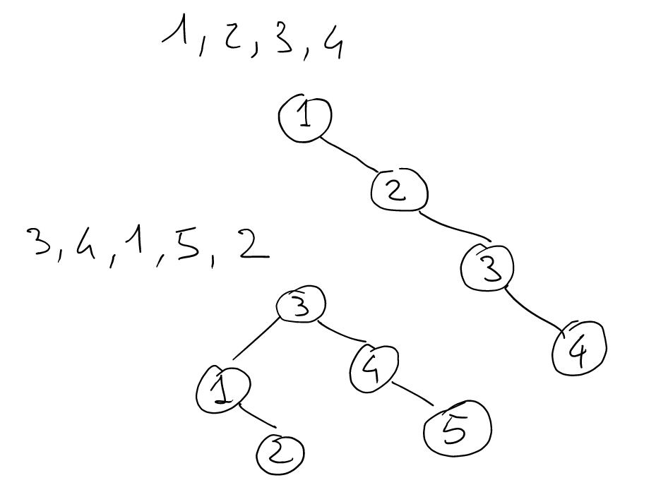
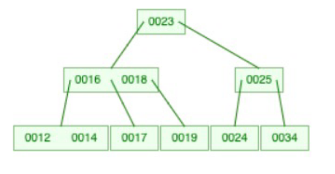
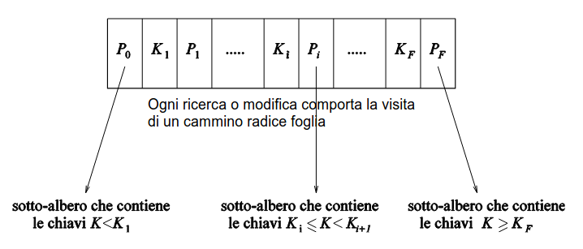
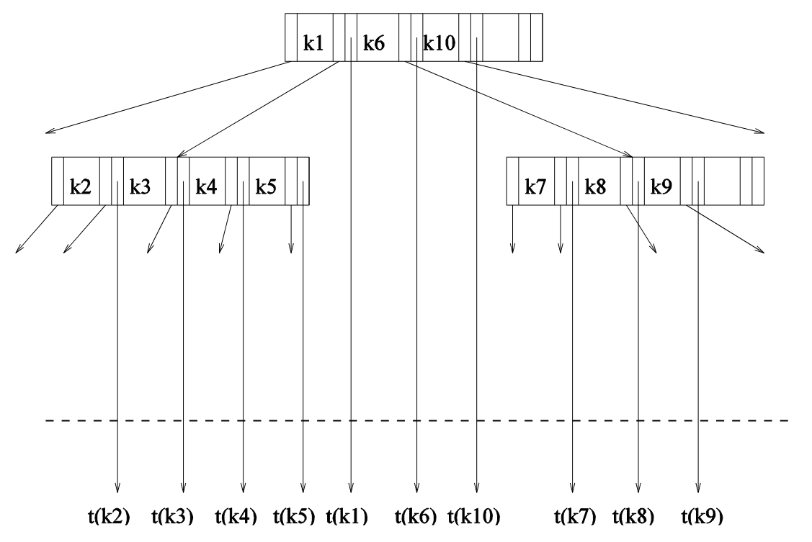
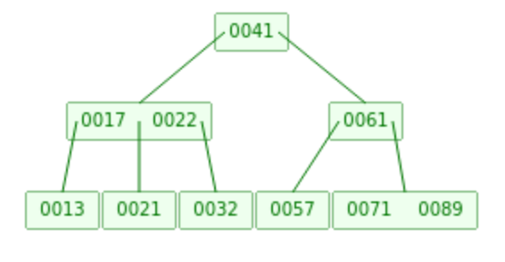
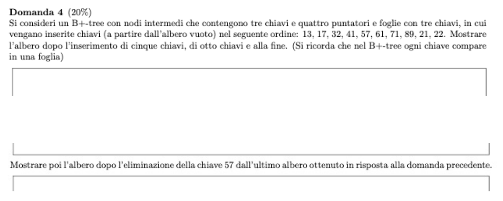
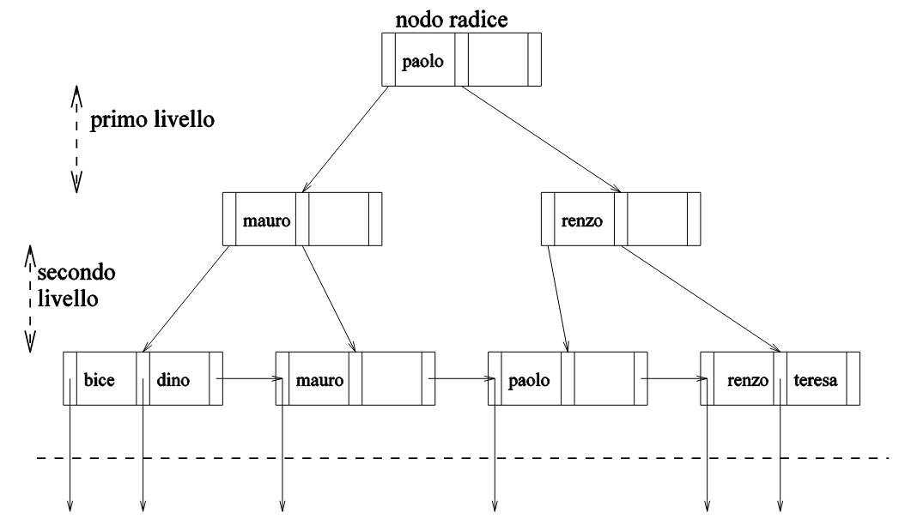
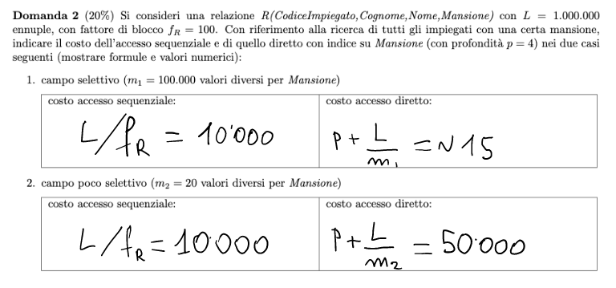
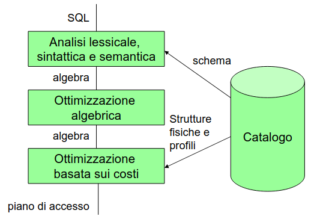

# 15 Marzo

Argomenti: Albero binario di ricerca, Albero di ricerca di ordine P, B+-Tree, B-Tree, Indici hash, Ottimizzazione Algebrica
.: Yes

## Albero binario di ricerca

L’`albero binario di ricerca` è un albero etichettato da valori che sono il discrimine dei valori a destra e a sinistra. Il tempo di ricerca e inserimento è pari alla profondità oppure logaritmico nel caso medio

Funziona bene se è bilanciato, ma il bilanciamento dipende dall’ordine di inserimento 

## Albero di ricerca di ordine P

Nella gestione della memoria secondaria nella maggior parte delle volte vengono utilizzati gli alberi, ma nella gestione della memoria ci possono essere dei problemi. Per esempio quello che non vabbene in un albero di ricerca binario è che i rami sono solamente 2 il che non va bene perchè i blocchi possono essere di dimensioni molto grandi e allora può essere conveniente utilizzare tutto lo spazio disponibile per ridurre il numero di accessi.

Questo è un albero di ricerca di ordine 3

ovviamente le etichette possono essere molti di più, nel senso che l’idea che si vuole avere è quella di riempire un nodo tanto quanto è grande un blocco in memoria secondaria

## B-tree

Il `b-tree` è un albero di ricerca il quale è mantenuto perfettamente `bilanciato`, nel senso che tutte le foglie sono allo stesso livello grazie al riempimento parziale e riorganizzazioni locali in caso di sbilanciamento.

Il `b-tree` è un approccio per ridurre gli spostamenti di dati da memoria secondaria a memoria principale, quindi di ridurre i `pin`.

## B-tree : split e merge

Il bilanciamento avviene con riferimento alla struttura ricorsiva dell’albero, sostanzialmente l’inserimento si esegue visitando l’albero fino alle foglie, se nella foglia ci sta spazio allora si fa l’inserimento mentre se non ci sta allora si crea un nuovo nodo lo stesso ragionamento si può fare con l’eliminazione.

## Esercizio

## B+-tree

In questo caso le chiavi compaiono tutte nelle foglie e i riferimenti al file sono tutti nelle foglie, mentre nel caso `b-tree` le chiavi compaiono nei nodi intermedi e non sono ripetute nelle foglie in pratica si aveva che i nodi intermedi hanno riferimenti ai blocchi del file

## B/B+ tree, primari e secondari

- In un `b+-tree`:
    - primario, le ennuple possono essere contenute nelle foglie
    - secondario, le foglie contengono puntatori alle ennuple
- In un `b-tree`:
    - anche i nodi intermedi contengono ennuple (se primari) o puntatori (se secondari)

## Indici hash

Anche le tecniche `hash` possono essere utilizzate per creare indici. Si avranno strutture secondarie costituite da un file hash con record contenenti pesudochiavi e puntatori ai record. 

## Esercizio

## Esecuzione e ottimizzazione delle interrogazioni

In pratica l’ottimizzatore sceglie la strategia realizzativa a partire dall’istruzione `SQL`.

## Ottimizzazione algebrica

Il termine `ottimizzazione` si basa sulla nozione di equivalenza cioè 2 espressioni sono equivalenti se producono lo stesso risultati qualunque sia l’istanza attuale della base di dati

I `DBMS` cercano di eseguire espressioni equivalenti a quelle date, ma meno “costose”

L’euristica fondamentale è quella di fare selezioni e proiezioni il più presto possibile per ridurre le dimensioni dei risultati intermedi.