# 15 Marzo

Argomenti: Funzione di costo della Ridge, Minimizzazione in forma chiusa, Minimizzazione in gradient descent, Problema dell'overfitting, Ridge Regression, Sintomi dell'overfitting, gestione dell'intercetta, k-fold cross validation, leave-one-out cross validation
.: Yes

## Problema dell’overfitting nella polynomial regression

$$
y_i=\sum_{i=0}^{p}w_ix_i^i
$$

Ricordando che il modello nella polynomial regression lo si può scrivere in questo modo

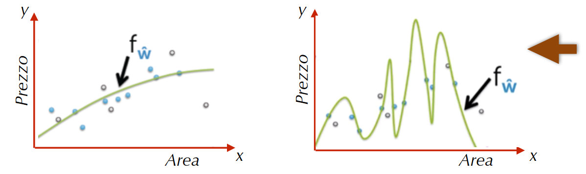

A seconda del grado del polinomio si possono avere diverse situazioni.

Dove la seconda situazione è un caso di `overfitting`

## Sintomi dell’overfitting

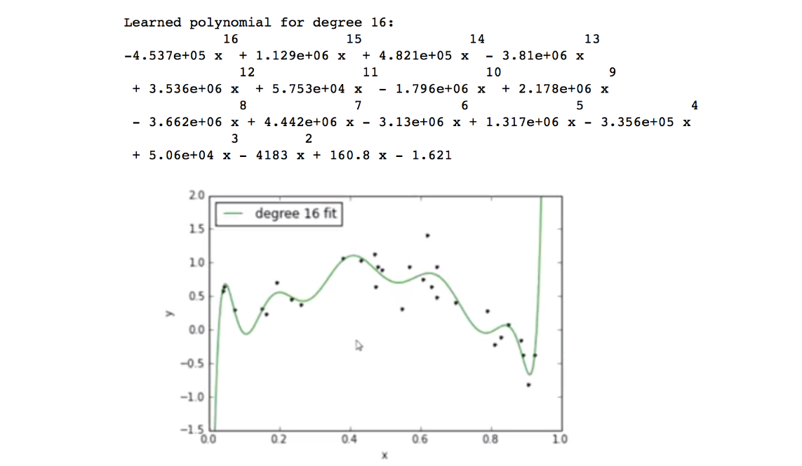

Quando i valori assoluti dei parametri stimati $\widehat{\bold w}$ assumono valori molto `alti` allora si manifesta l’`overfitting`. Accade non solo nella polynomial regression ma anche quando il numero degli input è molto elevato e più in generale quando è elevato il numero delle `feature`.

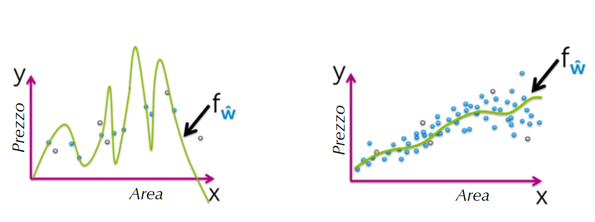

Si ha anche dal numero di osservazioni, quindi se ce ne sono poche allora è facile avere overfit.

Per evitare `overfit`  nel caso di 1 input allora servono osservazioni che sono molto “dense” sull’asse delle ascisse, come mostrato nell’ultima immagine. In pratica servono osservazioni rappresentative di tutte le coppie $(x,y)$, cosa che è difficile da ottenere.

Se si hanno invece $d$ input allora è ancora più difficile avere molte osservazioni rappresentative delle coppie $(x,y)$

## Funzione di costo nella Ridge Regression

L’idea alla base della `ridge-regression` è quella di limitare il valore assoluto dei coefficienti $w_i$ definendo la funzione di costo come la somma di 2 termini:

- misura del `fit`: si intende una funzione come la $RSS$
- misura della `grandezza` dei coefficienti: definita in vari modi come
    - la somma dei valori assoluti ($w_i$) (`L1-norm`)
    - la somma dei quadrati di ($w_i^2$)(`L2-norm`)

$$
\text{costo ridge}(\bold w)=RSS(\bold w)+\lambda \cdot||\bold w||_2^2
$$

La `ridge-regression` usa la `L2-norm`, quindi il costo ridge è definito in questo modo, dove $\lambda$ sta per `tuning-parameter` che serve per bilanciare i 2 termini.

Per vari valori di $\lambda$ si hanno diversi casi:

- $\lambda=0$: si riconduce alla vecchia soluzione, ossia minimizzare la $RSS$
- $\lambda\to\infin$: per soluzioni dove $\widehat{\bold w}\ne0$, il costo totale tende a infinito, l’unica soluzione per minimizzare il costo è $\widehat{\bold w}=0$
- $0<\lambda<\infin$: allora si ha $0 \le ||\widehat{\bold w}||_2^2\le ||\widehat{\bold w}_{LS}||_2^2$

Riconducendosi al tradeoff tra bias e variance, se $\lambda$ è elevato allora si ha bias alto e variance basso, mentre per $\lambda$ piccolo si ha bias basso e variance alto.

## Gradiente della funzione di costo

$$
\lambda||\bold w||_2^2=\lambda \bold w^T\bold w
$$

Scrivendo la somma dei quadrati in notazione matriciale

$$
(\bold y-\Phi\bold w)^T(\bold y-\Phi\bold w)+\lambda \bold w^T\bold w
$$

Si ottiene la nuova forma della funzione costo per il calcolo del gradiente.

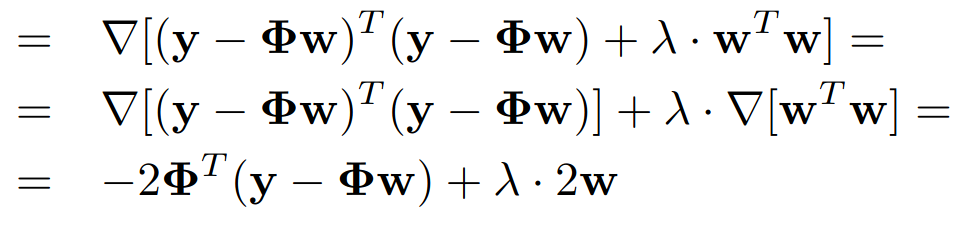

Il calcolo del gradiente della funzione cioè $\nabla\text{costo ridge}(\bold w)$ è il seguente.

Anche in questo caso una volta calcolato il gradiente ci sono 2 possibili approcci per minimizzare la funzione di costo cioè la `forma-chiusa` e il `gradient descent`.

## Minimizzazione costo ridge - forma chiusa

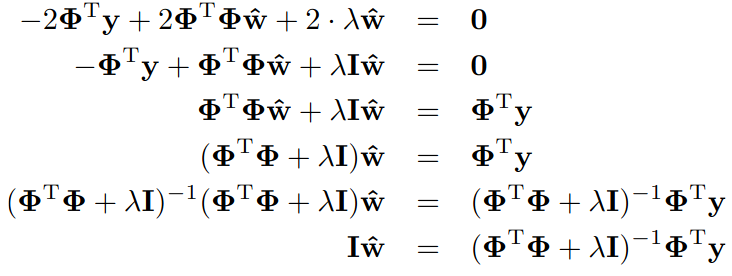

Si pone il gradiente uguale a 0, da cui si ottiene nell’ultimo passaggio il vettore dei pesi $\widehat{\bold w}$

## Minimizzazione costo ridge - gradient descent

$$
\bold w^{(t+1)}\gets \bold w^{(t)}-\alpha \cdot \nabla\text{cost ridge}(\bold w^{(t)})
$$

Si deve aggiornare il vettore dei pesi in modo tale da spostarsi nel verso opposto al gradiente

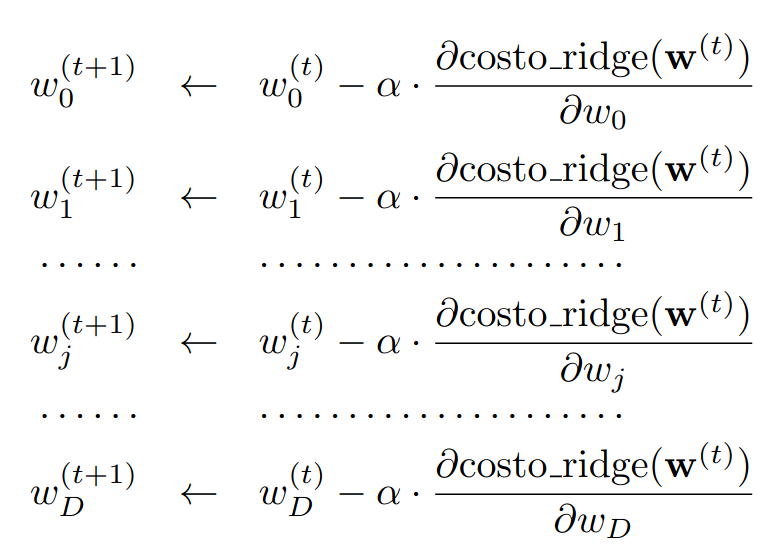

I singoli pesi devono pertanto essere aggiornati come segue

Il dato mancante adesso è la derivata parziale del costo ridge rispetto a $w_j$

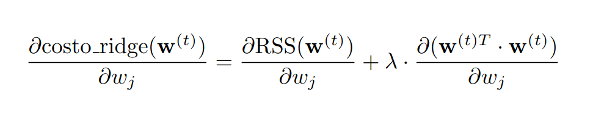

La derivata parziale della funzione di costo rispetto al generico peso $w_i$ è mostrata in questa figura

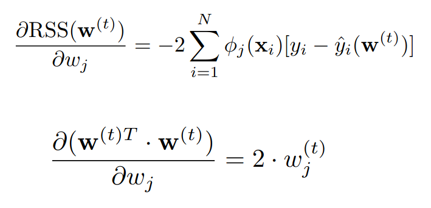

Poiché le derivate parziali dei 2 termini sono definiti in questo modo

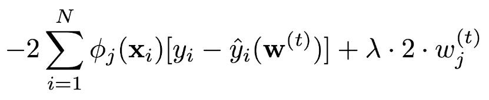

Si ottiene la derivata parziale rispetto a $w_j$ del costo ridge

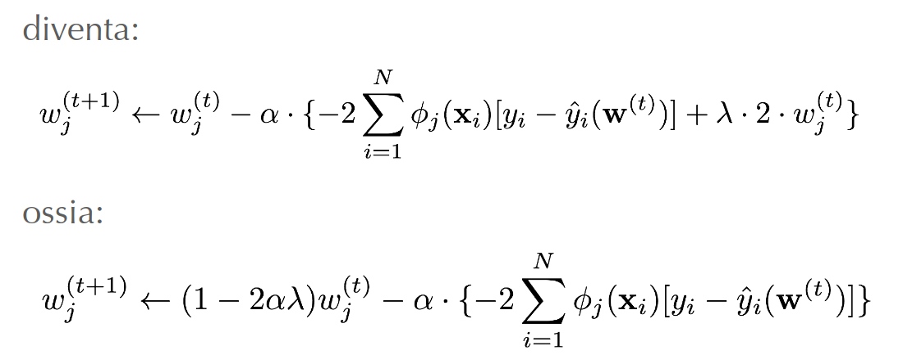

L’aggiornamento del generico perso $w_j$ diventa in questa forma.

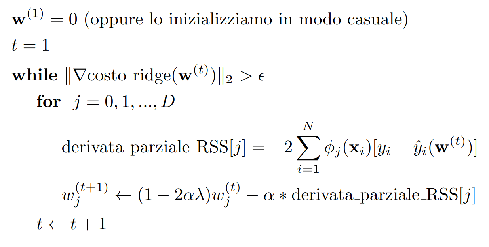

L’algoritmo di `gradient-descent` è mostrato di seguito

## Selezione dei parametri tramite Cross Validation

Un problema è scegliere il valore di $\lambda$ che ottiene i migliori risultati, cioè un validation error più basso. Il validation error lo si ottiene con un validation set ma può accadere che i dati di training non sono sufficienti per poterli suddividere in training, validation e test set. Quello che si fa quindi è utilizzare tutti i dati effettuando una `average performance` su tutte le scelte, in questo modo si evita la `sensitivity` dei risultati in base al particolare sottoinsieme scelto causata dalle poche osservazioni che contiene.

## K-fold cross validation

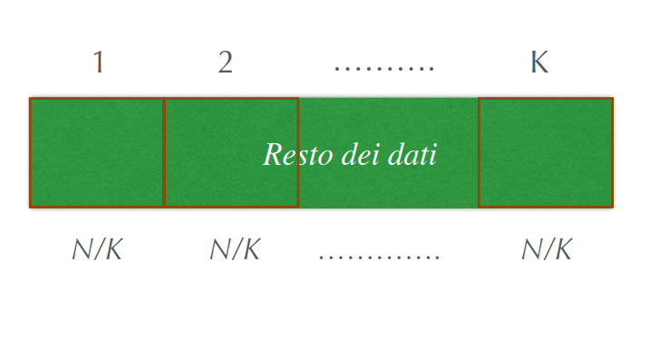

Dopo aver scorporato il Test Set di dimensioni adeguate, si considera il resto dei dati come un training set, si suddividono poi N dati in $K$ blocchi assegnando casualmente i dati a ciascuno dei blocchi

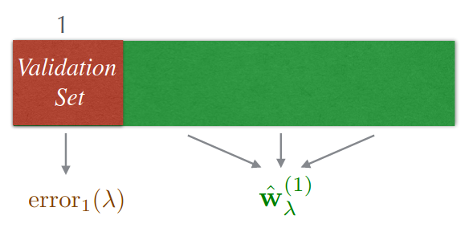

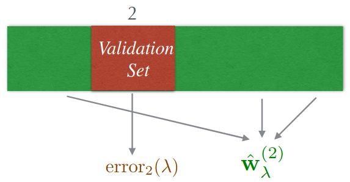

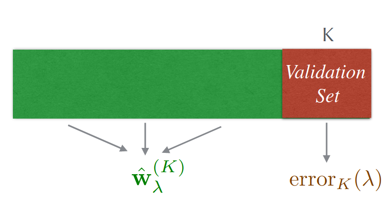

Per ciascuno dei $K$ blocchi, si opera considerando il $k$ blocco come validation set e il rimanente come training set.

Per ogni scelta del valore di $\lambda$ si fa la stima di $\widehat{\bold w}_\lambda$ sui blocchi di training e ci si calcola l’errore sul validation block 

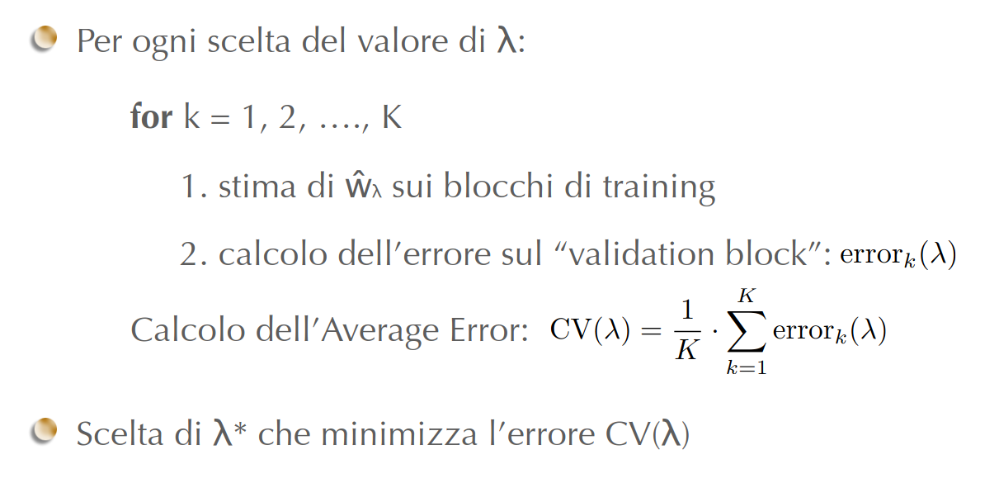

## leave-one-out Cross validation

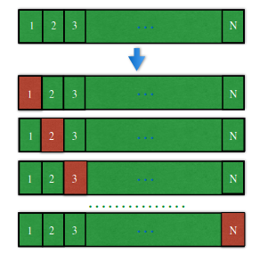

Il caso particolare di $k-fold$ è quando $N=K$, in pratica per addestrare si toglie solamente un elemento e poi per testarlo si usa l’elemento estratto in precedenza.

Questo approccio però è molto pesante dal punto di vista computazionale perché richiede il calcolo di $N$ fit del modello per ogni $\lambda$.

## Gestione dell’intercetta

Nella discussione su `ridge` e `cross-validation` non è stato considerato il come gestire l’intercetta che compare in tanti modelli. Spesso la feature $\Phi_0$ è posta uguale a $1$, in tal caso il coefficiente $w_0$ rappresenta per l’appunto l’intercetta del modello.

Per la `ridge` se si minimizza la funzione, anche $w_0$ tende ad assumere piccoli valori ma questo non è necessario in quanto l’intercetta non è un parametro da considerare all’overfitting.

$$
RSS(w_0,\bold w_{resto})+\lambda||\bold w_{resto}||_2^2
$$

Si può quindi considerare una versione modificata della funzione di costo per la `ridge`.

In questo modo la parte relativa alla `l2-norm` non considera $w_0$

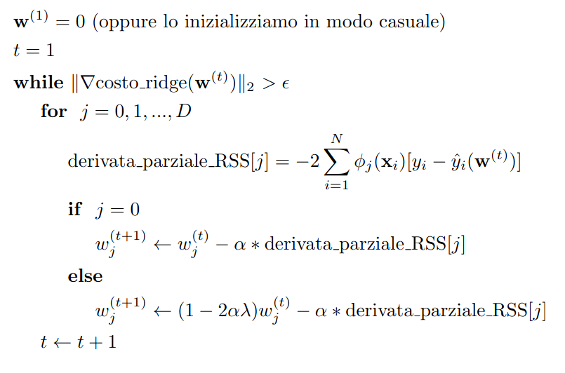

L’algoritmo del `gradient-descent` viene modificato come segue