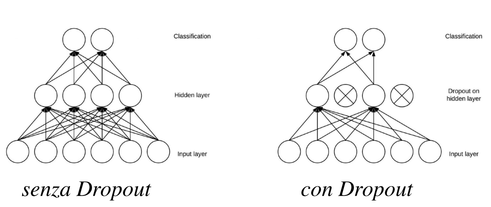
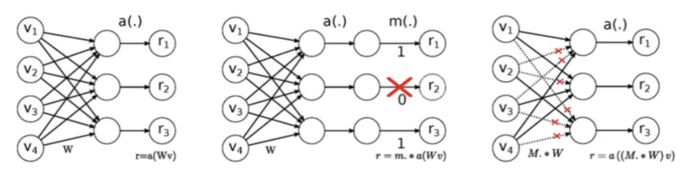

# 15 Novembre

Tags: Data augmentation, Dropconnect, Dropout, Max-Norm regularization
.: Yes

## CNN + RNN

CNN → restituisce i pesi (informazione spaziale)

RNN → dato l’output dei pesi ritorna l’importanza dei pesi. (informazione temporale sempre dell’output)

## Dropout

Questa tecnica si implementa disabilitando di nodi del layer precedente rispetto a quello interessato durante il training, facendo in modo che i nodi non si basino sulle stesse configurazioni di pattern. Questo è anche un modo per ridurre la dimensionalità del modello che se da esito positivo allora si ha un modello più semplice

Quello che si fa è assegnare ad ogni nodo una probabilità $p$ di essere disattivato in un certo step durante la fase di forward e backward propagation ad eccezione dei nodi dell’output layer.

$$
h'=\begin{cases}
0, \text{with probability p}
\\
\dfrac{h}{1-p}, \text{otherwise}
\end{cases}
$$

$p$ è chiamato `dropout-rate`, ogni attivazione di un layer intermedio è sostituita con questa formula. Nel caso fosse 0 allora i gradienti svaniscono durante la backpropagation.

In questo modo ad ogni step si ha una diversa configurazione di rete, con $N$ nodi si possono avere $2^N$ configurazioni diverse, tutte addestrate per lo stesso scopo

In questa immagine viene mostrata la configurazione della rete neurale durante il training quando si applica il `dropout`

Lo svantaggio di questa tecnica è che il numero di iterazioni raddoppia per raggiungere la convergenza ma il tempo di addestramento per epoca è più breve visto che si hanno meno nodi funzionanti e meno gradienti da ricavare e poi propagare

La tecnica del `dropout` ha una analogia con il `boosting`, si potrebbe usare l’ultima tecnica ma questo richiederebbe tempi molto più lunghi e non si avrebbe la dipendenza dovuta alla condivisione dei parametri dei sotto-modelli; quindi il `dropout` crea un compromesso.

## Dropconnect

Questa tecnica è una generalizzazione del dropout dove invece di disattivare le attivazioni si disattivano i pesi in modo casuale. Si dice che questa è una versione generalizzata perché genera più configurazioni, comprese tutte quelle generate da dropout anche se per ogni singola configurazione si ottengono risultati simili.

## Max-Norm regularization

Con questa tecnica si cerca di controllare l’incremento del modulo dei pesi, questa sarebbe una alternativa alla $l_1$ e $l_2$ regularization, dove i pesi sono influenzati ad ogni aggiornamento per mezzo della loss function.

$$
||w||_2\le r
$$

Il vincolo da soddisfare è questo

$$
w\gets w\cdot\frac{r}{||w||_2} 
$$

ad ogni training step, se il vincolo non è soddisfatto si normalizzano i pesi per poi procedere all’aggiornamento tradizionale dei pesi

## Data augmentation

Il processo di `data-augmentation` genera nuove istanze a partire da quelle esistenti con operazioni di modifica, allo scopo di incrementare la dimensione e la varietà delle istanze nel training. Generalmente quello che si ottiene è la riduzione dell’overfitting e l’aumento dell’accuracy. Questo processo di contrappone alla generazione di dati sintetici che sfruttano approcci generativi e non impiegano direttamente il dataset originale.