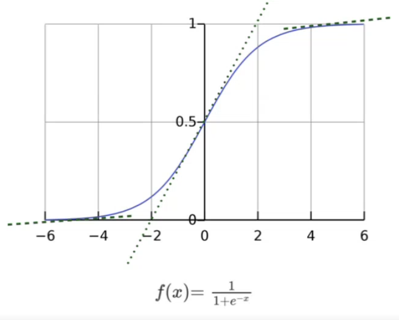
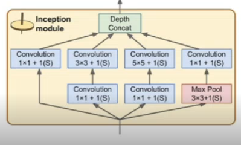
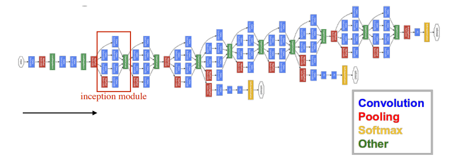
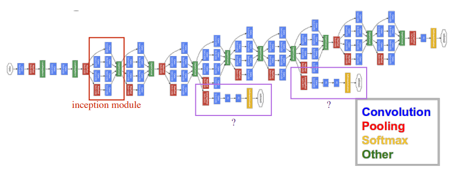
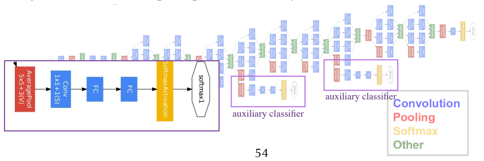
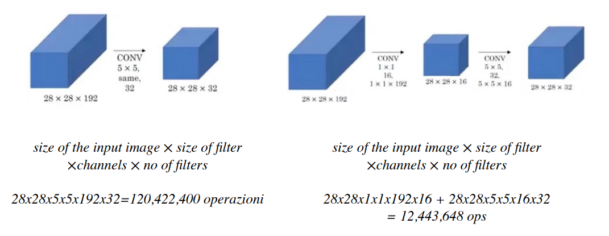
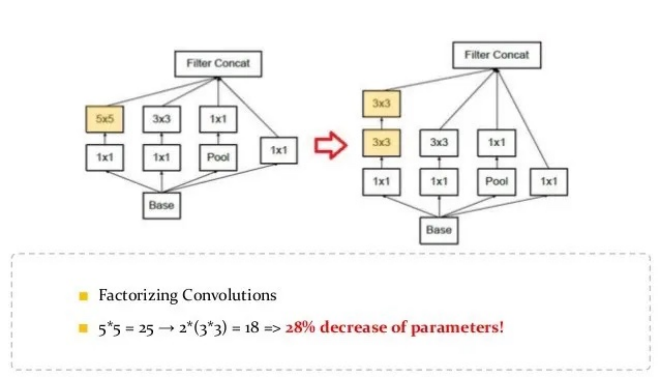
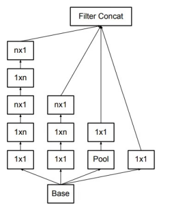
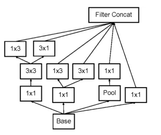

# 15 Ottobre

Tags: Exploding gradients, GoogLeNet, Inception Block, Vanishing Gradients
.: Yes

## Cenni applicativi per la face recognition

- La `softmax` è spesso usata come loss, ma nella face-recognition le variazioni intra-classe possono essere più tangibili delle differenze inter-classe. Il modello ha difficoltà a trovare le caratteristiche più discriminative per riconoscere persone diverse. Sono state introdotte nuove loss per rendere le caratteristiche non solo più separabili ma anche discriminative.
- `Euclidean-distance loss`: funzioni che usano la distanza misurata in uno spazio euclideo in cui le immagini sono mappate con lo scopo di minimizzare variazioni intra-classe, e massimizzare quelle inter-class.

---

## Richiami: gradient descent

$$
w_i'=w_i+\Delta w_i\\
\Delta w_i=-\lambda\frac{\partial \Delta L}{\partial \Delta w_i}
$$

Se si indica con $L$ la loss function e con $\lambda$ il learning rate, l’aggiornamento dei parametri segue la procedura di `gradient-descent`.

Il problema è che i valori dei gradienti si possono ridurre notevolmente per esempio settando un tasso di apprendimento basso.

## Richiami: chain rule

Nelle architetture `multi-layer`, l’algoritmi di `backpropagation` aggiorna i pesi dopo ogni `forward-pass`. 

$$
\bold y=f_k(f_{k-1}(...(f_1(\bold x))...))
$$

La rete può essere vista come una composizione di funzioni, dove ogni funzione $f_i$ si riferisce ad un certo hidden layer.

Il problema dei gradienti che assumono valori molto piccoli lo si ha quando si hanno architetture multi-layer. La `chain-rule` ci permette di ricavare i gradienti di $f_i$ a partire dai gradienti ricavati per $f_{i-1}$ e questo viene applicato con la `backpropagation`.

---

## Vanishing gradients

Alcune volte succede che i gradienti diventano talmente piccoli, prossimi allo zero, soprattutto per i layer vicini all’input, infatti il gradiente si ottiene come prodotto dei gradienti degli strati più a valle. Questo implica che nei primi layer i pesi non vengono alterati di molto durante il training e la convergenza a valori ottimi non è possibile.

Di seguito sono elencati comportamenti tipici in presenza del problema del vanishing gradient:

- le performance migliorano troppo lentamente o non migliorano
- si converge troppo velocemente a valori sub-ottimi
- le variazioni più significative si hanno nei layer a valle cioè quelli più vicini all’input

## Exploding gradients

Se i gradienti possono diventare prossimi allo zero, possono fare anche il processo inverso, cioè le componenti del gradiente assumono valori talmente grandi che in alcuni layer il valore può eccedere gli intervalli rappresentabili. Questo fenomeno capita spesso nelle `Recurrent-NN`.

La funzione obiettivo spesso contiene forti non linearità nello spazio dei parametri. Tali non linearità danno origine a derivate molto elevate. Quando i parametri si avvicinano a queste regioni la norma di alcuni gradienti può assumere valori elevati.

## Logistic (sigmoid) function

Si vuole una funzione di attivazione non lineare, perché senza una funzione non lineare una rete complessa che sia sarebbe una semplice trasformazione affine.

Se la rete non ha linearità non può rappresentare tutte le famiglie di funzioni non lineari. Si starebbe quindi nel caso in cui si ha una rete molto complessa ma che alla fine ha una capacità di rappresentare un sottoinsieme molto semplice di funzioni.

Si introducono quindi funzioni di attivazioni, soprattutto le non lineari, proprio perché si vuole aggiungere espressività nella rete e la capacità di esprimere anche tutte le famiglie di funzioni non lineari. Si vuole quindi:

- non linearità
- gradienti significativi ma non troppo
- lavorare su intervalli ampi ma non troppo: l’output di un layer lo si vorrebbe non troppo vicino lo 0 cioè non troppo normalizzato, deve essere sufficientemente alto per rappresentare un intervallo abbastanza esteso in modo da includere condizioni di non linearità

## Inception block

Il problema del `vanishing-gradient` ha giustificato la creazione di nuove architetture. L’obiettivo era concentrato nell’aumentare la profondità perché questo significherebbe aggiungere nuove feature in modo tale da rendere le figure in input più significative soprattutto per task sempre più complessi, il problema è che questo porta a problemi come il vanishing-gradient perciò non si può andare troppo in profondità perché una parte della rete si congela.

Detto questo invece di far aumentare la profondità della rete con strati convolutivi si fanno dei piccoli blocchi con filtri convolutivi 1x1, 3x3 e 5x5, tutti con stride 1 e padding SAME e ripetere questa elaborazione tante volte. Il punto qui è che non si sta risolvendo il problema del gradiente che scompare ma sicuramente il fatto di avere grosse complessità con grandi filtri con grande profondità aumenta la probabilità di trovare più informazioni utili.

Detto in modo formale si è ipotizzato che se si combinano in parallelo le informazioni provenienti da più pipeline basate su conv-layers (con LRF distinti) permetta di rappresentare più caratteristiche salienti. I diversi output poi sono combinati in una singola struttura dati in output. 

Questo è un esempio di blocco dove ci sono 4 pipeline di processamento diverse, tutte queste operazioni fluiscono in una operazione di `depth-concat` dove in sostanza concatena le feature-maps prodotte dalle diverse conv-layers.

Si concatena perché se si somma il risultato potrebbe essere mischiato, in questo modo le informazioni estratte da ogni pipeline vengono propagate a tutta la rete .

L’input è dato contemporaneamente a 3 convolutional layers e ad un 3x3 max-pooling, mentre le 1x1 convolution riducono i parametri per le successive convolutioni 3x3 e 5x5 che richiedono più risorse computazionali. In sostanza aggiungere le combinazioni con 1x1 incrementa le chance di rappresentare caratteristiche complesse.  Questo blocco ha diversi scopi in base a dove è posizionato.

Se per esempio si dovesse fare un task di classificazione, ci sono alcune feature che devono essere ignorate e quindi sempre queste feature che devono essere ignorate devono essere comunque ignorate affinché la rete sappia cosa ignorare. Quindi la rete deve sapere identificare quando ci sono rotazioni, traslazioni occlusioni.

## GoogLeNet v1 (2014)

Questa è la rete dove la principale caratteristica è la profondità con 9 `inception-block` in cascata, aumentando le feature che si estraggono complessivamente. Dopo alcuni `inception-block` si opera un `average-pooling` per ridurre il numero di parametri.

Le parti di architettura che danno un output prima della fine obbliga la rete a risolvere il problema ancora prima di essere arrivati alla fine. 

Questo permette di ispezionare la rete, ovvero senza andare tanto nei parametri, ma a capire quello che sta succedendo. Chiaramente questo output preliminare anche se all’inizio non darà esiti positivi, se l’addestramento sta andando nella direzione giusta, continuerà a migliorare negli output preliminari successivi. Quindi se la rete nella sua interezza si sta comportando bene anche i risultati intermedi miglioreranno.

In realtà questi rami non servono solo ad ispezionare la rete ma anche ad addestrare la rete perché se si ha un solo output, il gradiente è calcolato su un’approssimazione molto grande e talvolta non si ha il gradiente perché non riesco a propagarsi per quanto diventano piccoli. Quindi questi vari output si combinano in qualche modo per fare un unico gradiente che aggiorna la rete.

## GoogLeNet v1 - auxiliary loss

L’output preliminare di 2 `inception-block` intermedi è sottoposto a valutazione nel task di classificazione, come se fossero l’ultimo layer. 

Il valore della loss intermedia è chiamato `auxiliary-loss`. Durante il traning viene combinato linearmente con la loss dell’intera rete, in produzione questa loss viene ignorata.

Le versioni v2, v3 e v4 di GoogleNet introducono ulteriori espedienti per rendere più efficiente il training e migliorare l’accuracy

In questa immagine viene mostrato come una convoluzione 1x1 messa prima 

## Inception v2 e v3

Le reti neurali funzionano meglio quando le convoluzioni non alterano drasticamente le dimensioni dell’input. Ridurre le dimensioni può causare una perdita di informazioni, noto come `represenational-bottleneck`.

Questo è un ulteriore tentativo dove si esegue uno `smart-factorization` dove una convoluzione è scomposta in 2 convoluzioni in cascata con riduzioni del tempo di addestramento del 33%

Per affrontare l’eventuale representational bottleneck introdotto incrementando la profondità della rete si aumenta l’ampiezza del blocco con convoluzione in parallelo

Si introduce il `label-smoothing`, un tipo di regolarizzazione della loss che impedisce alla rete di avere comportamenti troppo certi riguardo determinate classi, prevenendo l’overfitting.

## Problematiche delle architetture presentate

Aumentando la profondità si incrementa la classe di funzioni che si possono stimare. Ma se si aggiungono layer, oltre ad aumentare la complessità computazionale aumenta la difficoltà di convergere in modo più ottimale. In sostanza i layer aggiuntivi non favoriscono la `backpropagation` nelle reti più complesse.