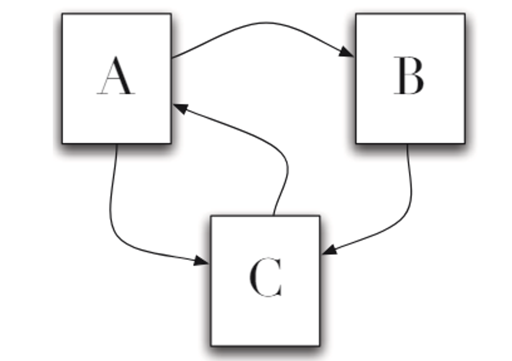
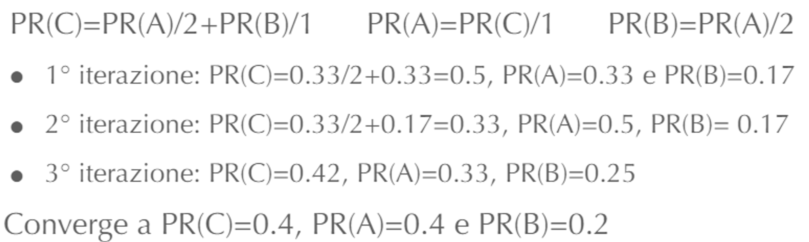
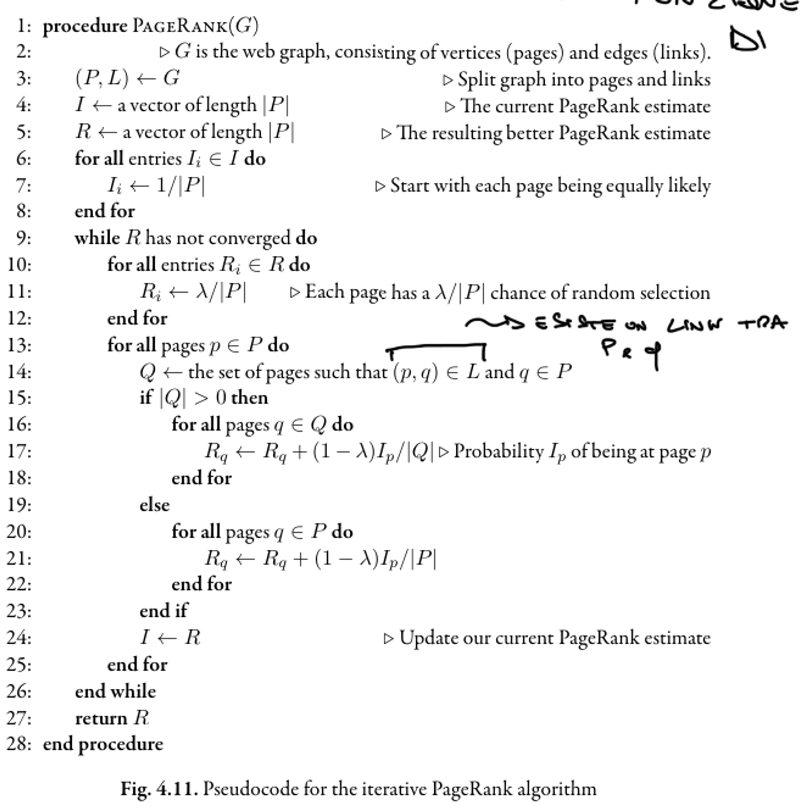
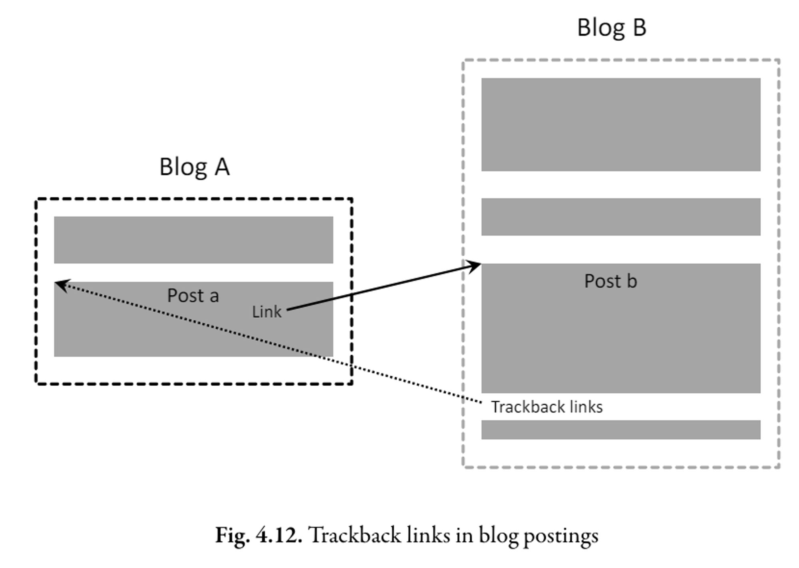

# 16 Aprile

Argomenti: Dangling Link, HITS, Modello Random Surfer, Pagerank
.: Yes
Description: Text Transformation 3

## Pagerank - Introduzione

Sfrutta la `link-analysis`, ovvero le informazioni della popolarità; se una pagina ha molti link in entrata allora vuol dire che la pagina è popolare. Il numero di link in entrata può essere quindi utilizzato come una semplice misura.

## Modello Random Surfer

L’algoritmo `PageRank` si basa sul modello di un `random-surfer`. Questo modello si basa sul concetto che il surfer naviga senza fine e meta fra le pagine web, ogni volta che è su una pagina web ha 2 alternative:

- cliccare su `surprise-me` che lo conduce su una nuova pagina web a caso
- cliccare su uno dei link a caso senza fare analisi del contenuto

Il calcolo del `page-rank` corrisponde a trovare la distribuzione di probabilità stazionaria di un random walk sul web graph. Il `random-walk` è un caso particolare di Markov Chain in cui la prossima pagina da visitare dipende solo dalla pagina corrente. Le transazioni consentite fra gli stati sono tutte ugualmente proababili e sono date dai link. 

In forma più strutturata, si traduce il tutto usando il seguente algoritmo:

```
si sceglie un numero casuale r tra 0 e 1
while condizione:
		se r < lambda : vai ad una pagina casuale cliccando surprise me
		se r >= lambda : clicca su un link a caso nella pagina corrente
```

In genere si assume che un valore $\lambda$ è piuttosto basso, questo vuol dire che è più probabile che l’utente clicchi su un link a caso piuttosto che scegliere `surprise-me`. 

## Dangling Link

I `dangling-link` sono link particolari che soffrono problematiche del tipo:

- rimanere bloccati in condizioni in cui sono presenti in una pagina solo link che non puntano ad altre pagine
- situazioni in cui si hanno link che formano un loop

Il salto casuale `surprise-me` impedisce di rimanere bloccati sulle pagine che non hanno link, ovvero pagine `rank-sink`. I link sono intesi come coppie $\left\langle p,q \right\rangle$, dove $p$ rappresenta la pagina di origine e $q$ il nodo di destinazione; queste coppie sono appesi quando la componente $q$ non porta a nulla. 

## Pagerank - algoritmo



Supponendo di avere questo caso, in cui ci sono 3 pagine $A,B$ e $C$.

Si vuole calcolare il pagerank di queste 3 pagine.

$$
PR(C)=\frac{PR(A)}{2}+\frac{PR(B)}{1}
$$

Se si ignora l’opzione `surprise-me`, il pagerank di una pagina $C$ può essere calcolato in questo modo

$$
PR(u)=\sum_{v\in B_u}{\dfrac{PR(v)}{L_v}}
$$

In maniera più generale è possibile calcolare il pagerank per qualsiasi pagina $u$ come mostrato

Il `page-rank` rappresenta la probabilità che l’utente ricada nella pagina $u$ con:

- $B_u$ insieme di pagine che puntano ad $u$
- $L_v$ è il numero di link in uscita da una pagina $v$

Da come si può vedere nell’ultima formula mostrata, i valori di pagerank vengono ricalcolati in funzione dei valori stessi, quello che si fa all’inizio è di assumere che tutte le pagine abbiano la stessa probabilità.



Il criterio di convergenza è scelto in base a un certo numero di iterazioni raggiunte, oppure se la differenza dai valori tra 2 passaggi non varia di un valore massimo $\epsilon$.

$$
\frac {\lambda}{3}+(1-\lambda)\cdot\left(\frac {PR(A)}{2}+\frac {PR(B)}{1}\right)
$$

Prendendo in considerazione l’opzione `surprise-me`, esiste $1/3$ delle probabilità di andare su qualunque pagina quando $r<\lambda$, questo vuol dire che il pagerank totale per la pagina $C$ vale come mostrato

$$
PR(u)=\frac{\lambda}{N}+(1-\lambda)\cdot \sum_{v\in B_u}\frac{PR(v)}{L_v}
$$

La formula generale per il `pagerank` è mostrato qui sopra, $N$ è il numero di pagine totali e $\lambda$ vale tipicamente $0.15$. Il fattore $(1-\lambda)$ è anche detto `damping-factor`.

Per andare più velocemente in convergenza si assegna la probabilità iniziale in funzione del numero di link in entrata.



In conclusione, PageRank è un importante esempio di metadati indipendenti dalla query, che possono migliorare il processo di ranking delle pagine web. Le pagine web hanno infatti lo stesso valore di PageRank indipendentemente dalla query elaborata. I motori di ricerca che usano PageRank preferiranno le pagine con valori di PageRank elevati invece di assumere che tutte le pagine web abbiano la stessa probabilità di soddisfare una query, tuttavia, il PageRank non è così importante nella web search come si potrebbe credere, ma è solo una delle varie funzionalità impiegate nel ranking. In ogni caso, tende ad avere l’impatto maggiore sulle query più comuni, il che è comunque utile.

## Hypertext Induced Topic Search - HITS

L’algoritmo `HITS` è stato sviluppato contemporaneamente a `pagerank`, la differenza è che `HITS` considera i risultati della query. 

Quello che fa questo algoritmo è stimare il valore del contenuto di una pagina (`authority-value`) e il valore dei link ad altre pagine (`hub-value`); entrambi i valori sono calcolati mediante un algoritmo iterativo basato solo sulla struttura dei link, analogamente a pagerank.

L’algoritmo `HITS` però calcola tali valori solo per un sottoinsieme di pagine recuperate da una data query, differentemente da `pagerank`. Ciò può essere un vantaggio in termini di impatto dei metadati di HITS sul ranking ma può essere computazionalmente impossibile per motori di ricerca con alto traffico di query.

## Link trackback



Se si crea il loop mostrato nell’immagine, il `pagerank` continua ad aumentare, il blog $B$ dovrebbe essere più importante in quanto citato da $A$, ma dal punto di vista di pagerank sono uguali. Una possibile soluzione è rendere i motori di ricerca in grado di rilevare automaticamente queste sezioni e di ignorarne i link durante l’indicizzazione, un altra soluzione è chiedere ai propetari di siti web di modificare i link non importanti in modo che i motori di ricerca possono rilevarli, a questo scopo si usa l’attributo `nofollow`.
