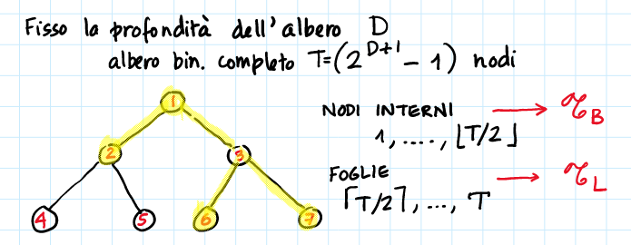

# 16 Gennaio

Argomenti: Algoritmi di approssimazione, Algoritmi online
.: Yes

## Algoritmi di approssimazione e algoritmi online

- `Algoritmi di approssimazione`: si usando quando si affrontano problemi computazionalmente difficili perché spesso non si ha tempo di cercare la soluzione ottima e quindi ci si accontenta di una sub-ottima, questi algoritmi sono detti anche offline
- `Algoritmi online`: sono necessari nei contesti in cui bisogna prendere una decisione sulla base di una sequenza incompleta di dati in input, senza alcuna conoscenza su eventuali altri “dati futuri”.

## Algoritmi di approssimazione

Si suppone di dover risolvere un problema NP-hard e si sa che si deve rinunciare a risolvere il problema dell’ottimo per poter risolvere il problema in tempo polinomiale e risolvere per qualsiasi istanza del problema

La differenza tra le `euristiche` e gli `algoritmi di approssimazione` è che la prima non fornisce alcuna garanzia sulla bontà della soluzione trovata mentre la seconda sono algoritmi polinomiali che forniscono una garanzia a priori sulla distanza dall’ottimo della soluzione trovata.

Si è interessati soprattutto agli algoritmi $\varepsilon$ approssimati, cioè quelli che garantiscono che la soluzione trovata abbia un errore relativo rispetto all’ottimo limitato da una costante, indipendentemente dalla dimensione dell’istanza del problema

Quindi sia $P$ un problema di ottimizzazione e sia $I$ un’istanza di $P$. Sia $A$ un algoritmo polinomiale per $P$ si ha che:

- $A(I)$ è il valore della soluzione trovata da $A$ sull’istanza $I$ di $P$
- $OPT(I)$ è il valore della soluzione ottima dell’istanza $I$

La bontà di un algoritmo si misura in 2 modi:

- `misura assoluta`: $|OPT(I)-A(I)|$
- `misura relativa`:$max\left\{\dfrac{OPT(I)}{A(I)},\dfrac{A(I)}{OPT(I)}\right\}$, detta anche `rapporto di approssimazione` di un algoritmo $A$ su un’istanza $I$ → $R_A(I)$

Un algoritmo polinomiale $A$ per un problema di ottimizzazione è $\varepsilon$-approssimante se $R_A(I)\le\varepsilon$ per ogni istanza $I$ di $P$

## Algoritmi online e analisi competitiva

Un `algoritmo online` è un algoritmo che riceve l’input un pezzo per volta e che deve prendere una decisione ad ogni passo senza la conoscenza di ciò che avverrà nel futuro.

L’`analisi competitiva` è quando si confronta la prestazione di un algoritmo online con quella di un algoritmo offline (algoritmo di approssimazione) che conosce tutta la sequenza di richieste in anticipo. Per effettuare l’analisi spesso si assume che ci sia un `avversario` che ad ogni passo fornisce all’algoritmo online la richiesta che lo mette di più nei guai.

L’analisi competitiva è troppo pessimistica, e l’avversario spesso è troppo potente facendo perdere di significato l’analisi.

## Rapporto competitivo

Sia $\sigma$ una sequenze di richieste, sia $A(\sigma)$ il valore (vista anche come costo) della soluzione trovata dall’algoritmo $A$ sulla sequenza $\sigma$ allora $A$ è detto c-competitivo se esiste una costante $\alpha$ tale che per ogni $\sigma$, di qualsiasi dimensione si ha che $A(\sigma)\le c\cdot OPT(\sigma)+\alpha$, dove $c$ è detto rapporto competitivo.

## Algoritmo on-line e algoritmi real-time

Nei sistemi `real-time` non solo bisogna prendere decisioni online ma devono essere prese in un tempo limitato. La qualità delle soluzioni viene valutata non solo dal punto di vista del costo, ma anche del tempo.

## Algoritmi dinamici (diversi dagli algoritmi online)

Una soluzione `naif` consiste nel ricalcolare la soluzione da zero dopo ogni aggiornamento dei dati di input ma esiste un modo migliore di questo approccio.

Gli algoritmi `dinamici` affrontano problemi in cui ogni volta che i dati in input vengono modificati si deve calcolare in modo efficiente la nuova soluzione ottima.

## Decisione base

$\forall t\in \mathscr{T}_B$ si ha che o fa `split`o `classifica`.

$$
a_t^T\cdot x\ge b_t
$$

Per fare il test al nodo $t$ si verifica la disuguaglianza dove $a_t^T$ è il vettore dei coefficienti di dimensione $p$. 

$$
a_t\in \{0,1\}^P \\
\sum_{i=1}^P a_{ti}=1 \\
b_t \in [0,1]
$$

Se il test è soddisfatto si fa a destra nel caso contrario si va a sinistra

Di seguito sono elencate altre condizioni sulle termini presenti nel test