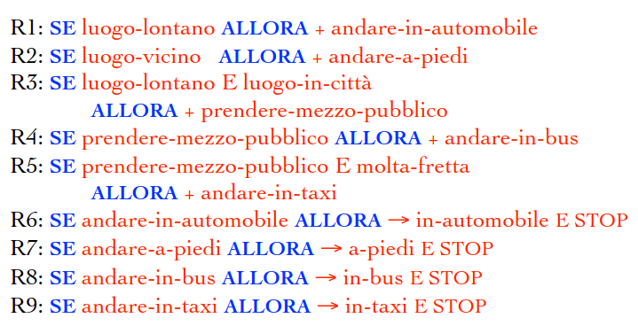
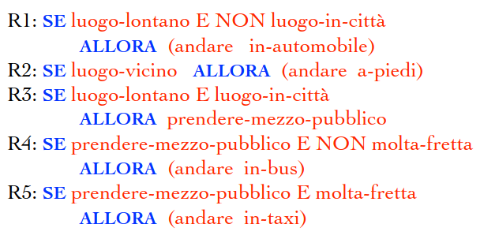

# 16 Gennaio

Argomenti: Backward Chaining, Formalismi Dichiarativi, Formalismi Procedurali, Forward Chaining, Sistemi di Produzione
.: Yes

## Formalismi dichiarativi e procedurali

Nell’IA si distingue fra formalismi di rappresentazione di tipo `dichiarativo` e di tipo `procedurale`; la `logica` e le `reti semantiche` sono un formalismo di tipo dichiarativo.

Ciò significa semplicemente che mediante un formalismo di questo tipo è possibile descrivere un dominio, utilizzando poi la descrizione in modi diversi per risolvere problemi di differente natura.

## Formalismo Procedurale

Se non si vuole descrivere il dominio ma si vuole descrivere come il sistema dovrà comportarsi in determinate situazioni allora si preferisce l’uso di un formalismo di tipo `procedurale` come i `sistemi di produzioni`.

## Sistemi di produzione - Regole di produzione

Alla base di sistemi di produzione sta il concetto di `regola di produzione` del tipo “SE x allora y”; le regole di produzione possono essere utilizzate in avanti(`forward`) o all’indietro(`backward`). Poiché i 2 casi presentano differenze notevoli vengono gestite separatamente.

## Sistemi di produzione - Forward chaining

Questi sistemi possono essere considerati dei veri e propri linguaggi di programmazione speciali per l’IA. In genere questi tipi di sistemi sono costituiti da 3 componenti:

- la `base delle regole`: contiene tutte le regole di produzione del sistema
- la `memoria di lavoro`: serve a memorizzare lo stato raggiunto nel processo di risoluzione di un problema
- l’`interprete`: utilizza le regole e la memoria per realizzare il processo di risoluzione automatica di un problema.

La condizione in questo tipo di sistemi è : [SE condizione x ALLORA azione y], dove per `condizione` si intende una lista di `fatti` e se tutti questi fatti si trovano nella memoria di lavoro allora si dice che la regola è `soddisfatta`. In pratica se tutte le condizioni all’interno di x sono vere vuol dire che l’informazione che fa parte dello stato raggiunto del sistema è memorizzata in memoria

Quando una regola è soddisfatta può essere `attivata` dall’interprete e questo interprete ha diversi criteri per la scelta della regola da attivare

Esempi di regole

Il `+` significa aggiungere il fatto indicato nella memoria di lavoro.

## Sistemi di produzione - Backward chaining

Questi tipi di sistemi consentono la risoluzione di problemi mediante riduzione a sotto-problemi, sono costituiti da una `base di regole`,`base di fatti` e da un `interprete`. Al posto di una memoria di lavoro si ha un `albero AND/OR` costruito dall’interprete durante il processo risolutivo

Le regole di produzione in questo caso hanno la forma: [SE premesse x ALLORA conclusione y], le premesse sono come le condizioni costituite da una lista di fatti. La regola [SE x E y ALLORA z] può essere vista come un operatore che riduce il problema $z$ nei 2 sotto problemi $x$ e $y$.

La `base dei fatti` non viene utilizzata per mantenere una descrizione dello stato raggiunto nel processo di risoluzione del problema, piuttosto vengono rappresentati i problemi primitivi che possono essere dati risolti senza ulteriori riduzioni. Permette di descrivere anche le particolari condizioni sotto cui un problema deve essere risolto.

Esempi di regole

Si assegna l’obiettivo da raggiungere, ovvero la radice dell’albero AND/OR uguale ad (andare X), quello che ci interessa è il valore che il sistema ad X nel corso del processo risolutivo

A questo punto l’interprete identifica tutte le regole la cui conclusione (la parte dopo ALLORA) si unifica con l’obiettivo

## Differenze tra i 2 chaining

1. **Forward Chaining (o Forward Reasoning):**
    - **Descrizione:** Con l'approccio di forward chaining, il sistema inizia con i fatti noti e utilizza le regole per dedurre nuovi fatti fino a raggiungere l'obiettivo o una conclusione.
    - **Processo:** Il ragionamento si muove "in avanti", partendo dai fatti iniziali e applicando le regole di inferenza in modo sequenziale fino a quando si raggiunge una conclusione o uno stato desiderato.
    - **Utilizzo:** Forward chaining è spesso utilizzato quando si conoscono i fatti di partenza e l'obiettivo è dedurre altre informazioni o arrivare a una conclusione specifica.
2. **Backward Chaining (o Backward Reasoning):**
    - **Descrizione:** In backward chaining, il sistema parte dall'obiettivo desiderato e lavora all'indietro, cercando di trovare le regole che possono giustificare l'obiettivo, risalendo ai fatti noti.
    - **Processo:** Il ragionamento si muove "all'indietro", partendo dall'obiettivo e cercando le regole che possono supportare l'obiettivo. Successivamente, vengono cercati i fatti che soddisfano queste regole, e il processo può essere iterato fino a quando si raggiunge una conclusione.
    - **Utilizzo:** Backward chaining è spesso utilizzato quando si conosce l'obiettivo che si desidera raggiungere, ma non si conoscono necessariamente tutti i fatti di partenza. Viene utilizzato per trovare la catena di ragionamento che giustifica l'obiettivo.