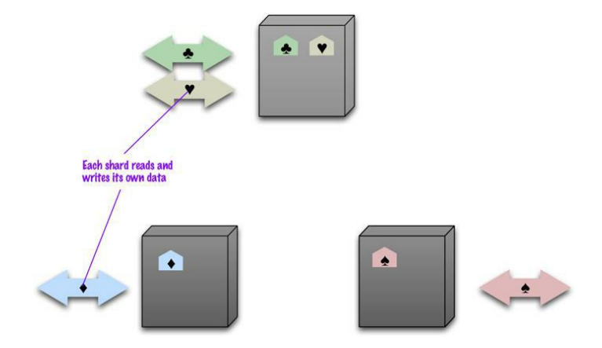
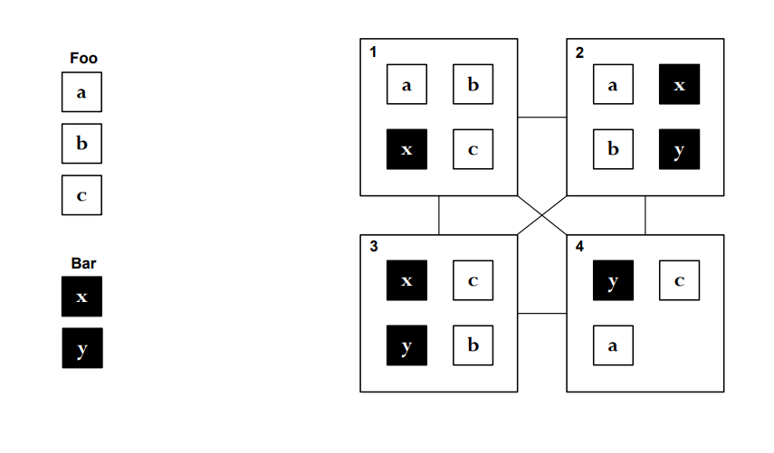
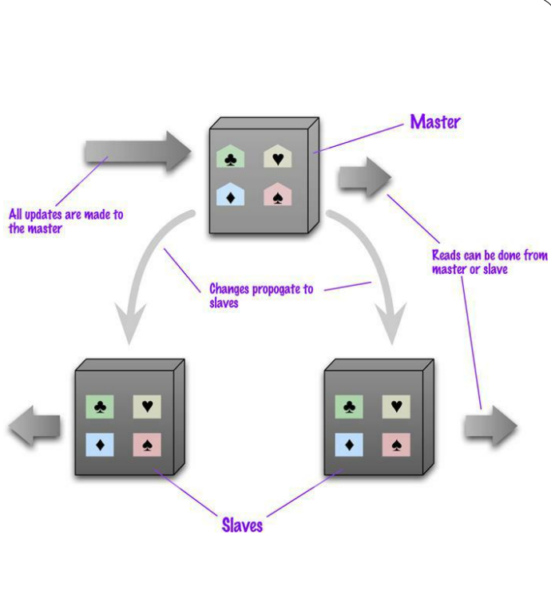
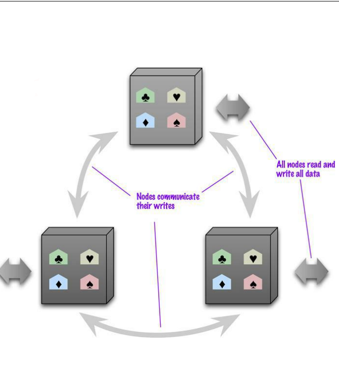

# 16 Maggio

Tags: Auto-Sharding, Consistency, Data distribution in NoSQL, Durability, Master-Slave, NoSQL Transactions, Peer-to-Peer, Replication
.: No

## Data distribution

Nei sistemi `NoSQL` i dati sono distribuiti in cluster molto grandi. I sistemi basati su `aggregati` hanno la caratteristica fondamentale di essere stati progettati nativamente per lavorare su cluster con tutti i vantaggi di scalare su grandi volumi in modo molto rapido.

Si hanno due modelli per distribuire i dati e sono `single` e `multiple` server. Per distribuire i dati si utilizzano tecniche come `sharding` e `replication`.

## Data distribution - Sharding

Tutti i sistemi `NoSQL` offrono il meccanismo di `sharding`, in sostanza si “spezza” un database e si distribuiscono questi pezzi tra i vari nodi.

A questo punto si possono fare letture e scritture su ciascun nodo andando a prendere i dati dove stanno.

La costruzione di uno `shard` nei sistemi `NoSQL`, dipende molto dalla scelta del livello di granularità (di aggregazione) che si è scelto. Quindi più in dettaglio:

- Non spezzare un aggregato su due nodi diversi
- Supponendo di avere un cluster distribuito, si piazzano i dati vicino a dove possono essere acceduti
- Bisogna garantire una uniformità di distribuzione per evitare che ci sia un nodo troppo carico rispetto agli altri
- Se si sa che ci sono dei dati che vengono acceduti insieme allora si cerca di mettere quei dati sullo stesso nodo

Queste scelte vengono gestite automaticamente nella maggior parte dal sistema (si dice che il sistema fa `auto-sharding`), l’unico meccanismo con cui l’utente può intervenire è sul livello di granularità.

## Data distribution - Replication

Ogni `shard` viene replicato tipicamente di un fattore maggiore a 2 (tipicamente si usa il valore 3). Dopodiché ci sono 2 meccanismi per gestire la replicazione e sono `master-slave` e `peer-to-peer`.

### Applicazione delle 2 tecniche

In questa immagine vengono mostrati i 2 metodi con fattore di replicazione pari a 3

## Replication - Master Slave

Il `master` gestisce gli aggiornamenti, cioè una volta che questo nodo riceve l’aggiornamento allora viene propagato alle altre repliche.

Gli `slave` ”possono” accettare richieste di interrogazione di accesso ai dati. Uno `slave` può diventare il nuovo `master`. 

Il problema è che il `master` può diventare il collo di bottiglia.

L’incremento delle richieste può essere effettuato aumentando gli slave, se il master fallisce per le richieste di letture si può ancora continuare a lavorare (Perché uno slave diventa il nuovo master). (Funziona bene per sistemi che prevalentemente fanno letture)

Un nodo può essere master per dei dati e slave per altri dati. Qualche volta invece si cerca di fare in modo che un nodo sia solo master e altri solo slave.

## Replication - Peer to Peer

Tutti i nodi possono rispondere sia a richieste di lettura e sia a richieste di scrittura. Una volta che un nodo qualunque ha ricevuto una richiesta, lui stesso lo deve propagare agli altri nodi.

Il limite è che si possono creare delle inconsistenze che non possono essere risolte come per esempio l’aggiornamento dello stesso dato su 2 nodi diversi contemporanee.

(Successivamente sono presentati alcuni problemi sulle proprietà ACID che possono accadere, per questo tipo di replicazione)

## Consistency

Il concetto della consistenza è diverso rispetto ai sistemi tradizionali, nei sistemi `NoSQL` si parla di `eventual-consistency` (si ottiene consistenza ma alla fine).

Di seguito sono mostrati le tipologie di conflitti che si possono verificare:

- `read-read`: per esempio nell’approccio master-slave si è generato un aggiornamento dove il master vede il dato aggiornato e lo slave ancora no perché l’aggiornamento non si è propagato in tempo
- `write-write`: avviene quando si cerca di aggiornare lo stesso dato allo stesso tempo. Quello che si fa è utilizzare l’aggiornamento più recente ottenendo un `lost-update`.
- `read-write`: avviene quando si fa una lettura in mezzo a un operazione di lettura-scrittura.

Ci sono 2 approcci che si possono adottare:

- `pessismistic`: impedisce che i conflitti avvengano implementando un sistema di lock per le scritture gestite dal sistema
- `optimistic`: non ci si preoccupa che i conflitti avvengano, quello che si fa è rilevarli dopo che certe operazioni abbiano avuto luogo. Per esempio per i conflitti `W-W` si usano diversi approcci e sono: last-write-wins, controllare il valore prima di aggiornarlo oppure i record che sono in conflitto vengono “uniti”.

## Transazioni in NoSQL databases

I database `graph-based` supportano le transazioni di tipo `ACID` mentre i sistemi `aggregated-based` supportano atomicità e isolazione ma solo per un singolo aggregato.

Il teorema `CAP` dice che date le proprietà di consistenza, disponibilità e tolleranza alle partizioni è possibile solamente averne 2.

- `consistenza`: tutti gli utenti vedono lo stesso record nello stesso momento oppure vedono un errore
- `availability`: ogni richiesta riceve una risposta, senza la garanzia che contiene l’ultimo aggiornamento fatto
- `partition-tolerance`: il sistema continua ad operare nonostante le interruzioni di comunicazione che separano il cluster in partizioni incapaci di comunicare tra loro.

Quello che si ottiene quindi sono 3 soluzioni: `CA`, `CP` e `AP`.

## Durability

La `durabilità` può essere “rilassata” per aumentare di molto le performance. Per esempio se i server vanno in crash, qualsiasi aggiornamento che è avvenuto dopo l’ultimo flush viene perso. Quello che si fa è mantenere degli stati `user-session` come informazione temporanea.

Un approccio pratico è quello dei `quorums` dove in sostanza si cerca di capire quanti nodi devono essere contattati per essere sicuri di avere le informazioni più recenti. Supponendo $N$ come fattore di replicazione, $W$ il numero di scritture confermate nei vari nodi ed $R$ il numero di letture nei vari nodi che garantiscono una risposta corretta,  si hanno i seguenti risultati:

- `read-quorum`: $R +W \gt N$
- `write-quorum`: $W\gt \dfrac{N}{2}$

Per avere una forte consistenza bisogna avere $W=N$ mentre per una consistenza `eventual` si ha $W\lt N$.

In una distribuzione `master-slave` basta avere $W=N=1$, il fattore di replicazione è di solito posto a 3 per avere una buona resilienza.