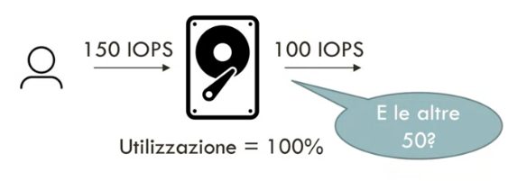
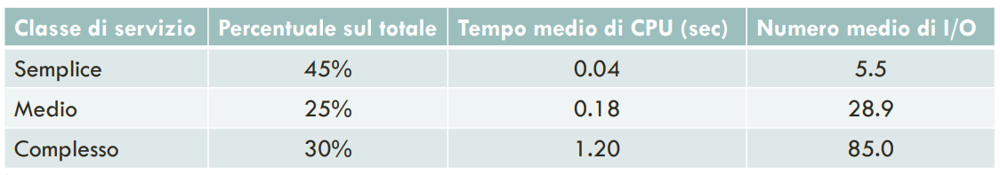
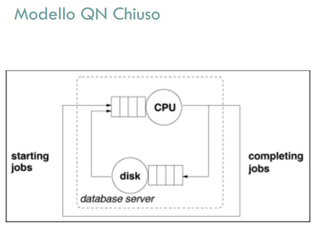
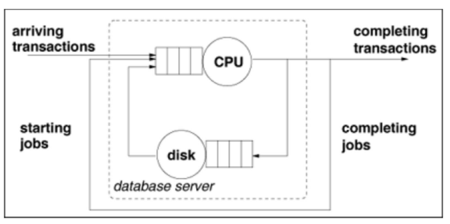
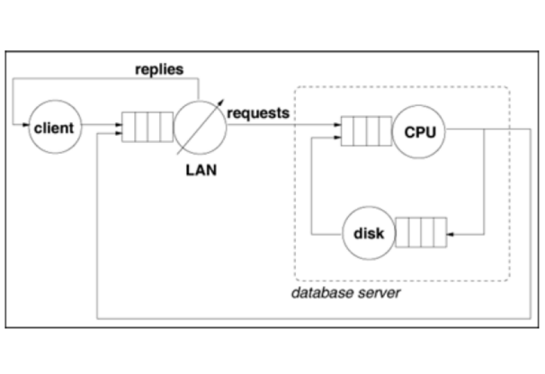
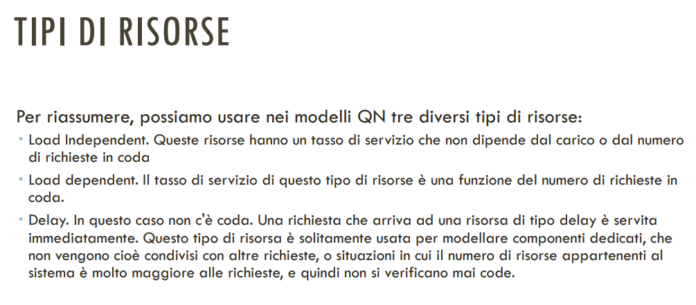
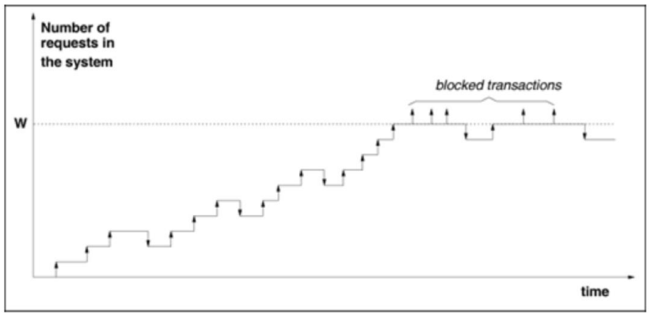
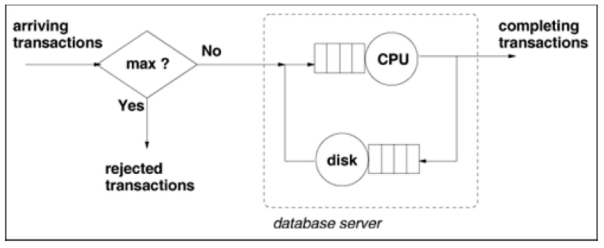

# 16 Maggio 2025

Text: Modelli Analitici, Modelli Simulativi

## Modellamento di sistemi: aspetti qualitativi

I sistemi che noi utilizziamo sono costituiti da risorse, solitamente si a che fare con risorse di tipo processore, risorse di tipo disco, risorse di tipo memoria, risorse di tipo rete e così via quindi quello che bisogna cercare di fare è astrarre queste risorse, metterle in un modello e cercare di vedere come possono essere combinate per tirar fuori i risultati che ci interessano.

Una considerazione che è opportuno fare e che data la macchina dove è in esecuzione il database per esempio, tutte queste risorse sono condivise dale varie richieste a cui il sistema è soggetto. Solitamente è un sistema al quale arrivano richieste ad esempio con un certo tasso di arrivo, quindi è lecito pensare che in un dato momento dentro il sistema ci possono essere più richieste che sono correntemente in elaborazione.

Qui nasce già una prima osservazione: è possibile che se si ha un sistema che è caratterizzato da $k$ risorse questo sistema non possa gestire più di $k$ richieste contemporaneamente?  Evidentemente no perchè l’obiettivo è modellare un sistema in cui richieste che non trovano immediatamente accesso ad una risorsa possono mettersi in coda per quella risorsa quindi queste richieste saranno sempre all'interno del sistema però saranno in attesa di essere in qualche modo processate.

In questo esempio le altre 50 richieste stanno in coda

## Modelli simulativi

Si tratta fondamentalmente di andare a realizzare un programma che simuli il comportamento delle risorse del nostro sistema e nel momento in cui si va a realizzare questo programma, sicuramente si avrà l'opportunità, che è una cosa non banale ma estremamente interessante, di poter riprodurre il workload a partire da una traccia.

I componenti modellati sono arricchiti con contatori per metriche di prestazione, che possono essere usati al termine della simultazione per calcolare statitiche. A causa però dell’alto livello di dettaglio, possono essere molto costosi e difficili da realizzare.

## Modelli analitici

Con i modelli analitici non c’è bisogno di scrivere un'applicazione che simuli il comportamento di un sistema, perché molto spesso si ha a disposizione delle formule in forma chiusa per andare a calcolare ciò di cui si ha bisogno. Sono meno dettagliati il che li rende matematicamente trattabili ma con la conseguenza di avere risultati meno accurati rispetto ai modelli simulativi. Alcuni comportamenti non possono essere gestiti da questi modelli perchè non esistono le formule in forma chiusa.

---

## Modello QN Aperto

Durante le esecuzioni di una transazione vengono utilizzate in modo alternato le risorse di CPU e disco e molto spesso più di una volta ciascuna, per questo motivo si modella il server in questo modo.

Nella figura mancano ancora alcune cose importanti come il numero di transazioni in arrivo, esecuzione di una transazione oppure tempo di lettura/scrittura di un disco.

Ragionare per `classi di servizio`, consente di ottenere delle approssimazioni molto migliori del modello, per esempio classificare le query in base al livello di difficoltà:

Un modello QN multi-clase dovrebbe essere usato quando si hanno diversi tipi di workload (transazioni online e report generati la notte), oppure quando si hanno diversi `service-level-objectives` SLO cioè livelli di prestazioni che si vogliono ottenere per diverse classi di workload, oppure quando si hanno dei valori eterogenei di `service-demand` cioè il tempo medio totale speso da una transazione in una data risorsa (es. Tempo medio di CPU: i valori nella tabella sono molto diversi quindi conviene utilizzare QN multi-classe).

Un altra cosa che bisogna considerare è la tipologia delle classi, cioè se sono classi aperte o classi chiuse.

- `classe-aperta`: se ci si può calcolare l’intensità di workload specificato tramite un tasso di arrivi, se il numero di clienti del sistema è potenzialmente illimitato oppure quando il troughput è fornito come parametor di input
- `classe-chiusa`: se l’intensità di workload è specificato, se il numero di clienti è limitato e conosciuto e se il troughput di output che può essere calcolato risolvendo il modello a reti di code.

In questa immagine viene mostrato il modello QN chiuso

## Modello misto

Il modello misto è una combinazione tra QA aperte e QA chiuse.

Si vuole sapere se si può rispettare la `SLO` eseguendo insieme il workload delle classi aperte e chiuse.

Il `service-level-agreement` (SLA) sono dei veri e propri contratti che possono essere stipulati tra fornitore di servizi e cliente, riguardanti requisiti di qualità. Questa definizione è importante per fare fin da subito una prima anilisi quello che sarà il workload atteso.

## Delay

Un delay è un tipo di risorsa, costituita da un centro di calcolo che non ha una coda. Si assume o che il numero di job che posso andare a finire all'interno di questa risorsa sia esattamente pari a uno e quindi non ci sia necessità di accodamento oppure come conseguenza che la capacità di questo centro sia talmente elevata che non ci sia mai necessità di accodamento.

Nella pratica noi questo tipo di risorsa viene utilizzato per andare a modellare dei sistemi interattivi più precisamente l’interazione con l’utente (l’utente ci mette un attimo a capire cosa gli è arrivato e agire di conseguenza).

Questo tipo di risorsa è solitamente usata per modellare componenti dedicati, che
non vengono condivisi con altre richieste, o situazioni in cui il numero di risorse appartenenti al sistema è molto maggiore alle richieste, e quindi non si verificano mai code.

## Risorsa load-dependent

Questo tipo di risorsa dipende dal numero di richieste in coda

In questa immagine sono riassunti i 3 tipi di risorse

---

## Admission control

Esiste sempre un valore massimo $W$ di transazioni concorrenti che il sistema può gestire.

Una delle assunzioni per quanto riguarda i modelli aperti (le classi aperti per essere più specifici) è che il throughput è esattamente uguale al tasso degli arrivi nel momento in cui il sistema non è in saturazione(sarebbe il momento in cui c'è equilibrio) e questo qui non è più vero nel momento in cui si va a introdurre un meccanismo di admission control, perché evidentemente se io ho un sistema che mi gestisce fino a mille richieste al secondo e decido che lì taglio e me ne arrivano 1500 avrò che il tasso degli arrivi è 1500 e il tasso in uscita invece è esattamente pari a mille,

$$
\text{troughput}=\text{arrival rate}\cdot \left(1-\text{rejection prob}\right)
$$

In questa immagine viene mostrato una rete di code con admission control.