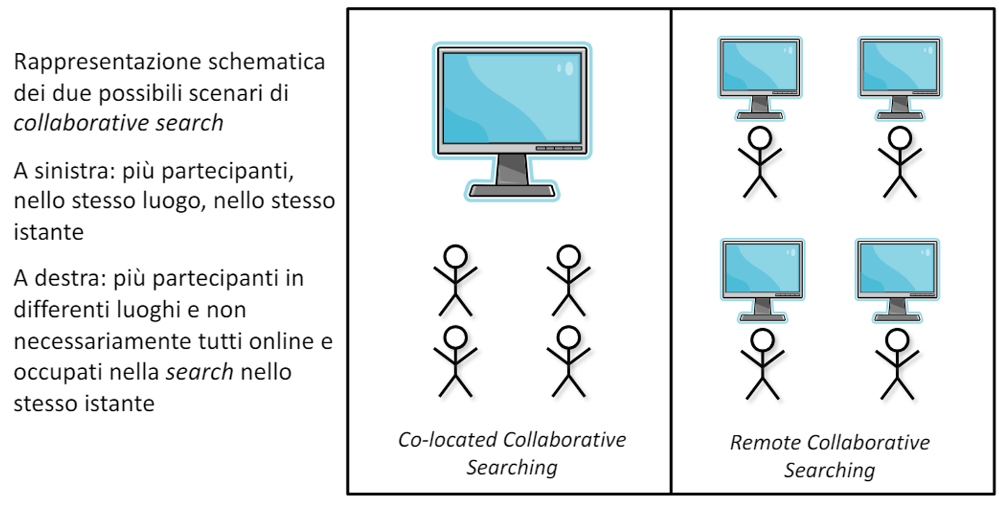
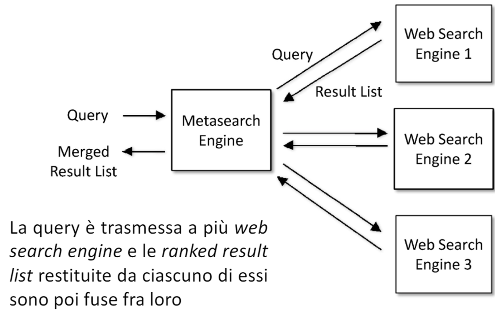

# 16 Maggio

Argomenti: Collaborative Search, Distributed Search, Reti P2P
.: Yes

## Collaborative Search

La `collaborative-search` suppone che ci sia un gruppo di utenti che cerca insieme in un quadro di collaborazione fra loro. Ci sono 2 diversi scenari di `collaborative-search` a seconda della collocazione fisica dei partecipanti:

- `co-located`: i partecipanti si trovano nello stesso luogo di fronte allo stesso computer nello stesso istante
- `remote`: i partecipanti si trovano in luoghi differenti ed eventualmente anche in  istanti differenti.

Ci sono alcune criticità da risolvere, principalmente dettate da problemi tecnologici come per esempio il metodo con cui gli utenti interagiscono con il sistema e come sono condivisi i dati.

## Distributed Search

Esistono numerosi tool per trovare e condividere informazioni sul web, i quali sono implementati usando comunità di nodi, in cui ciascun nodo può cercare informazioni, memorizzarle e comunicare con altri nodi. Di seguito sono elencati 2 forme di `distributed-search`:

- `metasearch-engine`: questa è il caso più semplice dove ogni nodo della comunità è un web search engine, in cui la query è inviata al metasearch engine che a sua volta la instrada a tutti gli altri web search engine recuperando e unendo i risultati. L’obiettivo è che usando più motori di ricerca ci si aspetta che la precision e la recall siano superiori rispetto al singolo motore di ricera. Lavora su dati di tipo `index-term` relativi ai documenti memorizzati dai motori di ricerca.
- `peer-to-peer`:  quello che si fa è costruire una comunità di moltissimi nodi, ciascuno con una quantità relativamente piccola di informazioni e con una conoscenza limitata riguardo gli altri nodi. Ogni macchina funge da client, server o hub. I dati posono essere indici oppure vere e proprie porzioni di informazione

Nel primo caso i nodi sono dei motori di ricerca, nel secondo caso i nodi sono macchine degli utenti. In questo tipo di architettura servono ulteriori operazioni fondamentali che tutte le applicazioni del tipo `distributed-search` devono eseguire:

- `rappresentazione delle risorse`: cioè il come rappresentare l’informazione contenuta in un nodo
- `selezione delle risorse`: sulla base dell’informazione ottenuta dalla fase precedente, si vuole selezionare una o più risorse di informazione. Il client seleziona le risorse che riceve dei vari nodi sulla base di un ranking.
    - prima si classificano i nodi usando la loro rappresentazione
    - poi si selezionano i top $k$ ranked nodi, o tutti i nodi con un punteggio superiore a un certo valore di soglia
- `fusione dei risultati`: questa operazione varia in base al tipo di distributed-search viene, unisce i ranked-result list provenienti dalle ricerche eseguite sui nodi contenenti le risorse di informazione selezionate.
    - dopo che i nodi sono stati selezionati, sono eseguite ricerche locali su ciascuno di essi
    - i risultati di queste ricerche devono essere poi fusi per produrre un singolo ranking
    - tali risultati possono non risultare comparabili fra loro, per cui devono essere normalizzati prima di essere fusi fra loro

Le funzioni elencate sopra sono eseguite da nodi disegnati che dipendono dall’architettura dell’applicazione; l’assunzione più semplice che si può fare è supporre che ci sia uno nodo speciale che organizza e memorizza informazioni riguardanti reti di computer e risorse condivise disponibili tramite esse, in pratica quello che fa questo `directory-service` è realizzare un controllo degli accessi.

In questa immagine è mostrato l’architettura di un metasearch-engine.

In alcune applicazioni i nodi possono non partecipare attivamente nel processo di ricerca distribuito, ma comunque forniscono una `seach-API` che permette di interagire con il nodo. Una descrizione del language model dei contenuti di query nodi può comunque essere generata tramite `query-based sampling`: vengono generate una serie di query per recuperare un campione di documenti dal nodo, che sono poi utilizzati per stimare il modello dei linguaggi per quel nodo.

Un approccio `euristico` comune per la normalizzazione degli score prevede l’uso del ranking $R_d$della risorsa del nodo che l’ha restituita

$$
S_d'=S_d(\alpha+(1-\alpha)R'_d)
$$

$S_d$ è lo score locale della risorsa, $R_d$ il ranking locale della risorsa, $\alpha$ una costante e $R'_d$ il ranking normalizzato della risorsa

$$
R'_d=\dfrac{R_d-R_{min}}{R_{max}-R_{min}}
$$

Una maniera per normalizzare il ranking della risorsa è calcolare i ranking minimo e massimo, $R_{min}$ e $R_{max}$ ottenuti da una data query su tutti i nodi e poi calcolare $R_d'$

Fondere i risultati nella `metasearch` è differente perchè lo stesso documento può apparire in più set di risultati.

$$
S_d'=n_d^{\gamma}\sum_{i=1}^{k}S_{d,i}
$$

Gli score per un documento $d$ ottenuti dagli $i$ motori di ricerca possono essere allora combinati come segue.

Con $n_d$ si indica il numero di motori di ricerca che hanno restituito il documento $d$ nella lista dei risultati, $k$ è il numero di motori di ricerca che ha restituito risultati (quindi si ha $n_d\le k$), $\gamma$ una costante che può essere posta pari a:

- $-1$: si ha una media degli score locali
- $0$: si ha una somma
- $+1$: si ha una somma pesata per il numero di motori di ricerca che ha restituito il documento $d$. Questa scelta è nota anche come `Combine and Multiply by the number of Non-Zero results`, si è dimostrata altamente efficace per combinare score.

---

## Reti Peer-to-Peer

I nodi sono le macchine degli utenti e i dati sono sia indici che file o porzioni di file. I nodi possono svolgere diverse funzioni e sono `client`, `server` e `hub`.

- i `client` (information consumer) sottomettono query per avviare la ricerca
- i `server` (information provider) rispondono alle query con file e possono anche instradare query ad altri nodi. I server che conservano informazioni riguardo al contenuto degli altri nodi forniscono un directory service e sono chiamati `hub`.

**Network Neighborhood**: Il flooding è inefficiente a causa del traffico di rete generato. Piuttosto che generare descrizioni delle risorse per ciascun nodo è possibile generarle per intorni (Neighborhood, N) di nodi. Un ***neighborhood*** di un hub Hi nella direzione di un hub Hj è definito come l’insieme di hub che una query può raggiungere in un numero fisso di *hop*. Il vantaggio di questa definizione di neighborhood è che le informazioni relative ai provider che possono essere raggiunti viaggiando per diversi *hop* oltre i neighbor immediati migliora l’efficienza dell’instradamento delle query.
