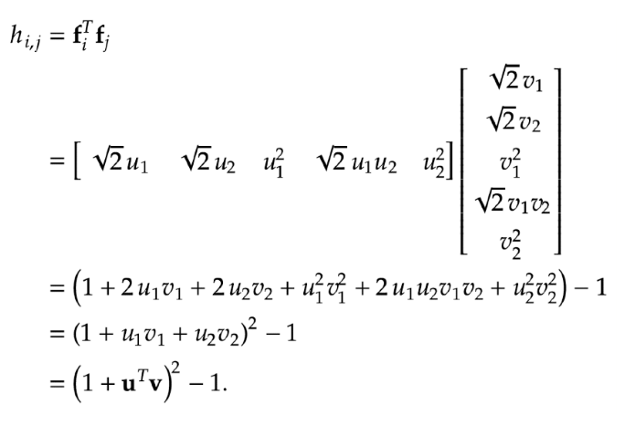
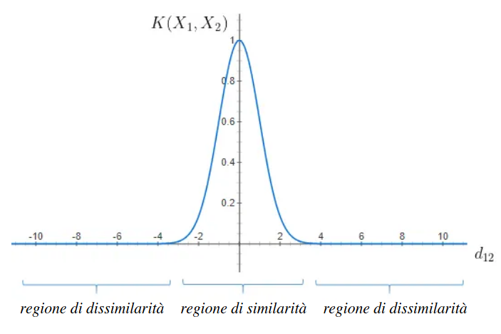

# 16 Maggio

Argomenti: Fourier Kernel, Kernel Polinomiale, Kernel function, Radial Basis Function Kernel
.: No

## Kernel Matrix - Kernel function

La `kernel-function` calcola i coefficienti della `kernel-matrix`. Il generico elemento della matrice $h_{i,j}$ corrisponde alla funzione $k(\bold x_i,\bold x_j)$ che accetta 2 istanze nello spazio dimensionale originale e restituisce il prodotto scalare delle istanze nello spazio kernel delle features di dimensionalità superiore

$$
k(\bold x_i,\bold x_j)=\phi(\bold x_i)^T\cdot \phi(\bold x_j)
$$

la funzione $\phi$ effettua il mapping tra i 2 suddetti spazi, da dimensione $N$ a $M$

$$
\phi:\mathbb{R}^N\to\mathbb{R}^M
$$

Formalmente la funzione $\phi$ è definita in questo modo

Le `kernel-matrix` sono fondamentali perché sotto determinate condizioni possono essere definite senza conoscere lo spazio di dimensioni superiori e tantomeno la funzioni $\phi$. La funzione obiettivo da ottimizzare sarà più semplice, poiché includerà solo i prodotti scalari con cui le funzioni kernel sono definite, senza includere altre informazioni.

## Kernel Polinomiale

Si considera la mappatura polinomiale di grado $D=2$ dallo spazio in input $N=2$ a quello $M=5$ dimensionale

$$
\bold f=\left[x_1,x_2,x_1^2,x_1x_2,x_2^2\right]^T
$$

data dal seguente vettore di trasformazione delle caratteristiche

Se si fanno le seguenti sostituzioni $u=x_i$ e $v=x_j$, il procedimento nell’immagine mostra come calcolare la matrice kernel $\bold H$ in modo `entry-wise`

$$
h_{i,j}=(1+x_i^Tx_j)^2-1
$$

$$
h_{i,j}=\left(1+\bold x_i^T\bold x_j\right)^D-1
$$

Si generalizza dicendo che un `kernel-polinomiale` è definito entry-wise per $N$ e $D$ generici senza introdurre le caratteristiche delle unità polinomiali, nel seguente modo

## Fourier Kernel

$$
f=\begin{bmatrix}
    \sqrt{2}\cdot cos(2\pi x) \\
    \sqrt{2}\cdot sin(2\pi x) \\
    \vdots \\
    \sqrt{2}\cdot cos(2\pi x) \\
    \sqrt{2}\cdot sin(2\pi x) \\
\end{bmatrix}
$$

Una trasformazione `D-Fourier` delle caratteristiche con $N=1$ e $M=2D$ può essere scritta come vettore di caratteristica $2D\cdot 1$.

Si ricorda che `fourier` è una combinazione di seni e coseni

$$
h_{i,j}=\sum_{m=1}^{D}2\cdot cos(2\pi m(x_i-x_j))
$$

Il corrispondente elemento $(i,j)$ della matrice kernel $\bold H$, può essere scritto in questo modo

$$
h_{i,j}=\left[\sum_{m=-D}^{D}e^{2\cdot\pi\cdot i\cdot m\cdot(x_i-x_j)}
\right]-1
$$

Mediante la definizione su numeri complessi si ottiene una semplificazione dell’espressione precedente

$$
e^{-2\pi iD(x_i-x_j)}\cdot\sum_{m=0}^{2D}e^{2\pi i m(x_i-x_j)}
$$

Si prende solo la parte in parentesi e si nota in questa espressione che se la differenza $x_i-x_j$ ritorna un intero allora $h_{i,j}=0$, in generale non si ha un intero e per questo si può riscrivere $h_{i,j}$ in questo modo

$$
\begin{align*}
  &= e^{-2\pi iD(x_i-x_j)}\left[\dfrac{1-e^{-2\pi i(x_i-x_j)(2D+1)}}{1-e^{-2\pi i(x_i-x_j)}}\right]
\\\space \\
  &= \dfrac{sin((2D+1)\pi(x_i-x_j))}{sin(\pi(x_i-x_j))}
\end{align*}
$$

La seconda parte del prodotto è una serie geometrica, cosi si semplifica in questo modo

$$
h_{i_j}=\dfrac{sin((2D+1)\pi(x_i-x_j))}{sin(\pi(x_i-x_j))}
-1
$$

Ricapitolando quindi l’elemento $(i,j)$ della matrice kernel si può calcolare in questo modo senza studiare la convergenza di fourier

## Radial Basis Function Kernel

$$
\begin{align*}
h_{i,j} &= e^{-\beta||x_i-x_j||^2_2} \\
       &= e^{\left(\dfrac{-||x_i-x_j||_2^2}{2\sigma^2}\right)}
\end{align*}
$$

La matrice kernel si costruisce nel seguente modo, dove $\beta$ è una costante positiva. 

Le 2 forme sono equivalenti

Quando le istanze sono molto distanti, il valore del kernel è inferiore a $1$ e vicino a $0$, il valore $\beta$ decide quando 2 punti sono da considerarsi simili. All’aumentare della distanza il kernel `RBF` diminuisce in modo esponenziale ed è pari a $0$ per distanze superiori a 4

Per differenti valori di $\sigma$ si hanno diversi tipi di gaussiane, quindi differenti valori per cui l’esponenziale vale $0$

Le trasformazioni `RBF` si differenziano dalle trasformazioni polinomiali e di Fourier poiché il vettore di caratteristiche $\bold f$ associato è infinito-dimensionale. I kernel `RBF` sono la forma più generalizzata di kernelizzazione ed è uno dei kernel più utilizzati avendo caratteristiche che si avvicinano a quelle di una distribuzione gaussiana.