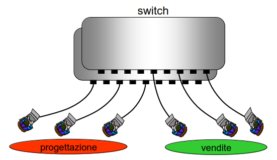
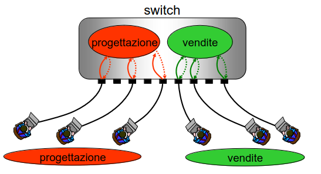
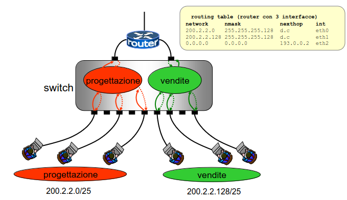
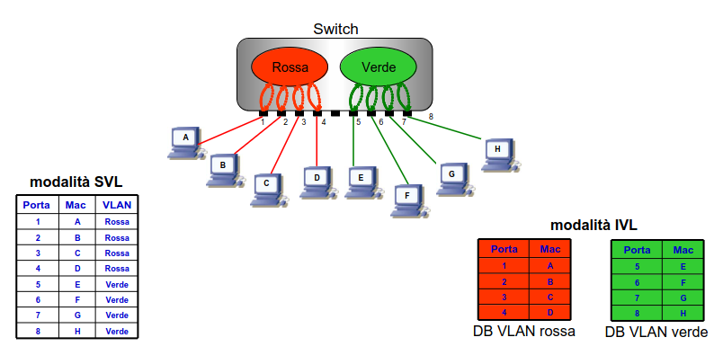
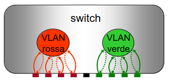
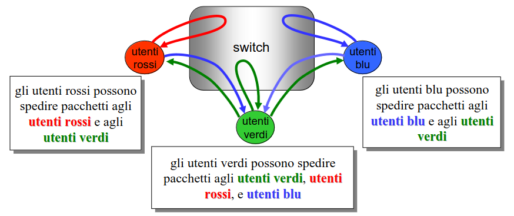
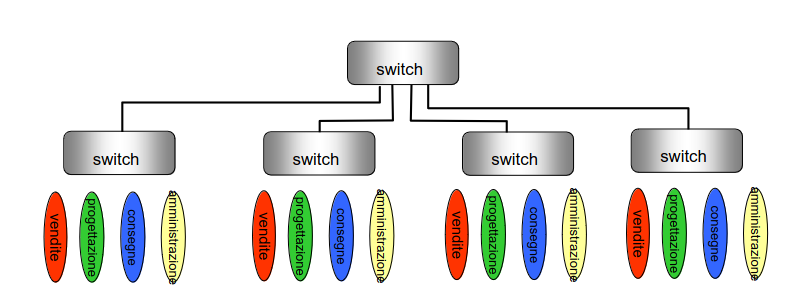
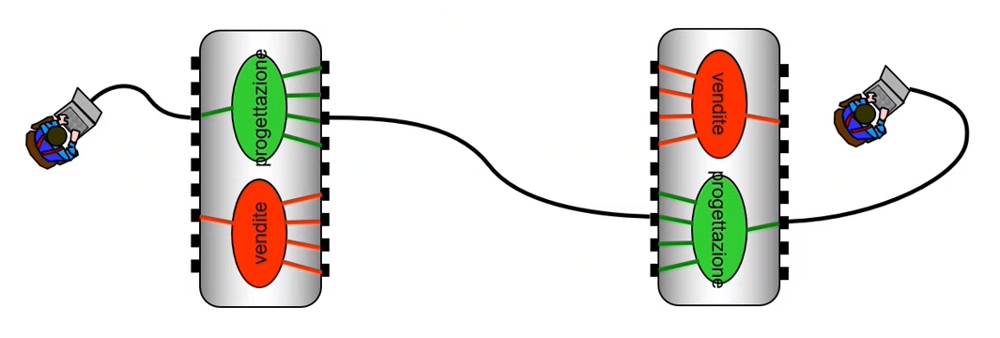
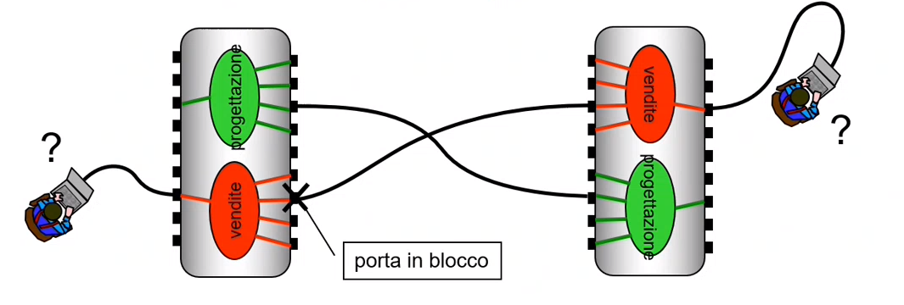
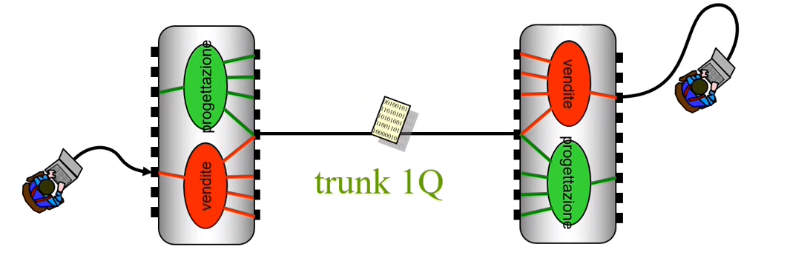

# 16 Ottobre

Argomenti: Trunk-1Q, VLAN, VLAN asimmetriche, VLAN simmetriche
.: Yes

## VLAN - Virtual LAN

Si suppone di avere un singolo switch a cui sono connessi vari calcolatori di 2 diversi uffici. L’azienda vuole suddividere i calcolatori in due LAN separate per motivi di sicurezza o anche solo per dividere il traffico di broadcast.

- Una soluzione è comprare un altro switch e distribuire i calcolatori su 2 switch
- Questa soluzione è poco flessibile e con un basso livello di modificabilità e anche poco economica.

- L’altra soluzione è realizzare vari switch virtuali avendo a disposizione un singolo switch.

---

Le `VLAN` sono configurate dall’amministratore della rete.

- situazione `semplice`: VLAN definite in funzione della porta
- situazione `complessa`: VLAN definite in funzione della porta e del contenuto del pacchetto.

---

- Una `VLAN` denota un insieme di pacchetti in transito per uno switch: ad esempio se mi interessano pacchetti di tipo `IPV4` e `IPV6` allora si è definito un insieme di pacchetti in ingresso, e contemporaneamente si è definita una politica.

Una VLAN denota un insieme di pacchetti in transito per uno switch e un pacchetto può appartenere ad una sola VLAN.

Una VLAN è sempre definita nelle switch di commercio, se nessuna è specificata allora la VLAN di default farà passare tutti i pacchetti.

---

## Configurazione di una VLAN

I pacchetti che arrivano allo switch da un certo insieme di porte passano da un `ingress-port`.

- di questi pacchetti fanno parte della VLAN solo quelli con certe caratteristiche definite.

I pacchetti che hanno quelle caratteristiche possono uscire dallo switch solo attraverso un certo insieme di porte: `egress-port`.

In pratica la `ingress-port` è la porta in cui i dati entrano nella `VLAN` da un dispositivo esterno o da un’altra `VLAN` mentre la `egress-port` è la porta di uscita all’interno di una `VLAN`. 

---

Un pacchetto viene associato a una certa VLAN al momento dell’entrata nello switch

Per ogni VLAN è associato un numero tra 1 e 4094; quella di default ha VLAN id = 1, oppure gli si da un nome di 32 caratteri alfanumerici come alternativa.

In questa figura viene mostrata la divisione tra la VLAN progettazione e la VLAN vendite

Ciascuna delle VLAN ha un proprio indirizzo di instradamento. In pratica il router vede 2 switch al posto di 1

## Inoltro di un pacchetto

Quando uno switch riceve un pacchetto (in presenza di VLAN):

- associa il pacchetto ricevuto alla giusta VLAN usando le regole di configurazione
- individua la porta dello switch da utilizzare per poter trasmettere il pacchetto accedendo al filtering database
- trasmette (eventualmente) il pacchetto

## Filtering Database

Gli switch possono operare in 2 modalita alternativa

- `IVL`: Indipendent VLAN learning, esiste un filtering database separato per ogni VLAN.
- `SVL`: Shared VLAN learning, esiste un solo filtering database condiviso tra tutte le VLAN.

Per la trasmissione del pacchetto si hanno 2 possibilità:

- la ricerca nel `filtering database` non è andata a buon fine ovvero non è stata individuata nessuna porta. Quindi lo switch trasmette in broadcast tutto il pacchetto su tutte le `egress-port` associate alla VLAN di appartenenza del pacchetto
- la ricerca nel `filtering database` ha individuato una porta, però prima di ritrasmettere il pacchetto controlla che la porta individuata sia stata configurata come `egress-port` per la VLAN del pacchetto. In caso affermativo il pacchetto viene trasmesso altrimenti viene scartato.

## VLAN simmetriche

Nelle VLAN `simmetriche`, quando una porta è `ingress-port` è anche `egress-port` per la stessa VLAN e viceversa.

## VLAN asimmetriche

Nelle VLAN `asimmetriche` l’insieme delle `egress-port` di una VLAN può essere diverso da quello delle `ingress-port`. 

In presenza di questo tipo di VLAN è preferibile utilizzare switch in modalita `SVL`.

## VLAN in reti con più switch

- Nella realtà le `LAN` sono composte quasi sempre da più switch

In questo esempio sarebbe utile avere 4 VLAN: vendite, progettazione, consegne, amministrazione.

---

In questo caso si connettono le 2 porte dei 2 switch, il problema è che le 2 VLAN del dipartimento vendite create dai 2 switch rimangono non connesse

Il problema è che interconnettendo entrambe le VLAN si crea un ciclo.

Per risolvere il problema, l’algoritmo per il calcolo dello spanning tree blocca uno delle 4 porte. Da cui non si comunica più.

(Lo Spanning Tree Protocol viene utilizzato nelle reti VLAN per evitare i loop di rete. Quando si configurano le VLAN in una topologia di rete che coinvolge più switch interconnessi, la possibilità di creare loop è sempre presente. Questi loop possono causare problemi gravi nelle reti, come l'instabilità della rete, la congestione del traffico e la ridondanza inefficace. )

## Standard trunk 1Q

In un `trunk-1Q` possono transitare pacchetti di diverse `VLAN`.

In pratica quando un filo è configurato come `trunk-1Q` i pacchetti che ci passano sopra vengono etichettati con un opportuno `tag` per dire se il pacchetto fa parte di una LAN o un altra.

Questo `tag` è un campo addizionale della `pdu` di livello 2.

Quindi applicando questo standard si ha che:

- quando una porta è indicata come `egress-port` per una VLAN, si può specificare se i pacchetti in uscita devono essere `tagged` come appartenenti alla VLAN
- quando una porta riceve un pacchetto si hanno 2 casi:
    - se è `tagged` con una VLAN viene attribuito a quella VLAN.
    - se è `non-tagged` viene attribuito ad una VLAN secondo le regole definite per quella porta, cioè è possibile configurare una porta in modo tale che i pacchetti in ingresso `non-tagged` o anche `tagged` siano scartati.

Coerentemente con le definizioni date, una porta può essere:

- `access`: riceve ed invia solo pacchetti `non-tagged`
- `trunk`: riceve ed invia solo pacchetti `tagged`
- `ibrida`: è sia `access` e/o `trunk`