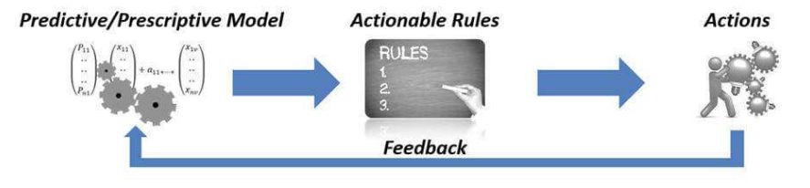
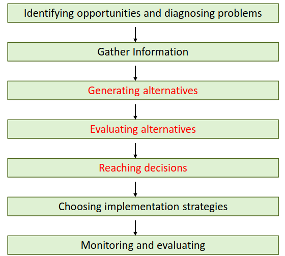

# 17 Gennaio

Argomenti: Descriptive Analytics, Predictive Analytics, Prescriptive Analytics, Processo di decision-making
.: Yes

## Significato di analytics

`Analytics` è il processo scientifico di scoperta e comunicazione dei modelli significativi che possono essere trovati nei dati. In pratica i dati grezzi vengono trasformati in intuizioni utili per prendere decisioni migliori e si basa su un insieme di tecniche che vanno dalla statistica, alla matematica, etc.

## Descriptive analytics

Insieme di strumenti orientati a descrivere la situazione attuale e passata dei processi aziendali e/o aree funzionali. Tramite tool di reportistica si analizzano dati del passato, categorizzandoli e aggregandoli a funzioni matematiche puramente descrittive.

## Predictive analytics

Area della statistica che si occupa di estrarre informazioni dei dati e di usarle per prevedere tendenze e modelli di comportamento. Le tecniche statistiche di analisi predittiva includono la modellazione dei dati, il machine learning, l’intelligenza artificiale, gli algoritmi di deep learning e il data mining. 

Il funzionamento è molto semplice, si cerca di acquisire informazioni su variabili aleatorie e le variabili previste degli eventi passati per sfruttarle per prevedere l’esito sconosciuto. L’accuratezza e l’utilizzabilità dei risultati dipende molto dal livello di analisi dei dati e dalla qualità delle ipotesi.

## Ricerca Operativa e Analytics

La ricerca operativa e l’analytics trasformano i dati in informazioni per prendere decisioni migliori e potenziare i risultati.

- La `ricerca operativa` è definita come il processo scientifico di trasformazione dei dati in intuizioni per prendere decisioni migliori. Impiega metodi altamente evoluti per fornire potenza analitica.
- L’`analytics` è l’applicazioni di metodi scientifici e matematici allo studio e all’analisi di problemi che coinvolgono sistemi complessi.  Realizza gli obiettivi di business analizzando i dati per creare modelli predittivi per la previsione e l’ottimizzazione dei processi di business per migliorare le prestazioni.

## Prescriptive analytics

Il modello prescrittivo abilita i decisori a intraprendere azioni immediate, basate su previsioni probabilistiche e soprattutto su regole chiare e comprensibili che provengono dal modello stesso. Un altro aspetto consiste nella loro capacità di analizzare anche il feedback che proviene dall’utilizzo delle regole, per tener conto delle azioni intraprese e dei loro effetti sui risultati.

La `prescriptive analytics` serve a determinare la soluzione e il risultato migliore tra le varie possibili scelte, dati i parametri noti. Si occupa di analizzare le potenziali decisioni in ambito aziendale, considerando tutte le variabili che concorrono alla scelta di quella migliore e a minor fattore di rischio, tutto questo può avvenire in tempo reale grazie al continuo utilizzo dei dati.

Ha le sue fondamenta nella `predictive analytics`, aggiungendo la possibilità di fornire indicazioni all’utente su cosa deve fare. Questi 2 tipi di analytics concorrono insieme a creare una customer experience avanzata. La comprensione delle azioni passate accresce la conoscenza dei propri clienti, consentendo di prevedere cosa accadrà in futuro e di pianificare azioni immediate per una esperienza cliente sempre più efficace.

## Classificazione dei metodi per la prescriptive analytics

Qui vengono rappresentati i metodi utilizzati sia per la predictive analytics e prescriptive analytics

## Tecniche per la prescriptive analytics

Le tecniche più comuni sono `ottimizzazione`,`simulazione` e `teoria dei giochi`.

## Passi per il processo di decision-making

Di seguito sono riportati gli step per il decision making