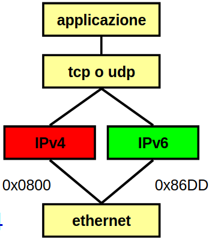
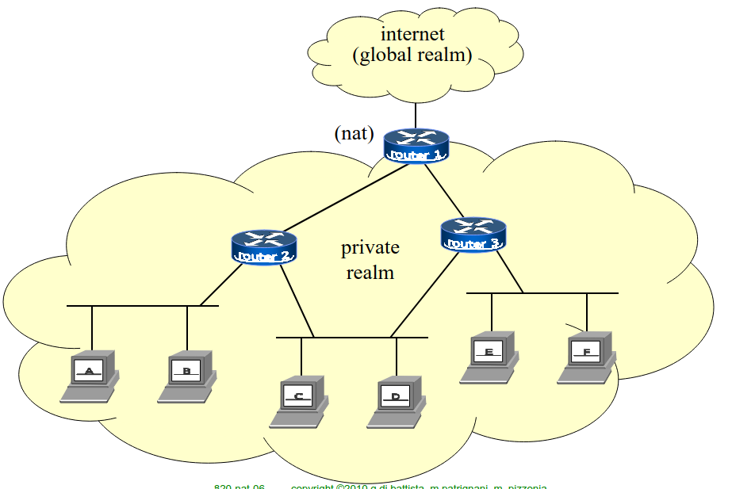
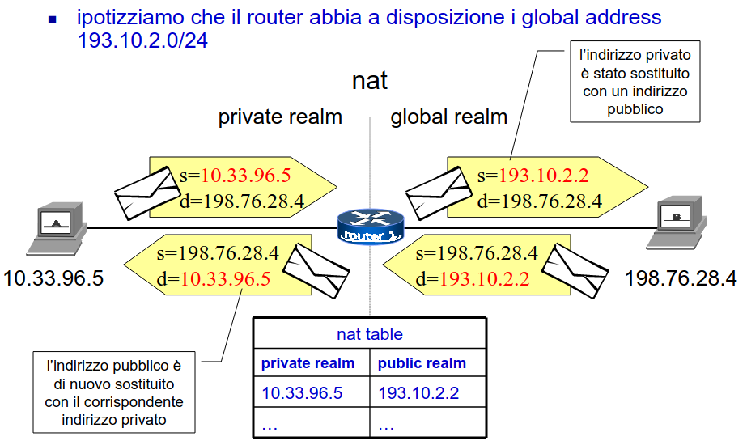
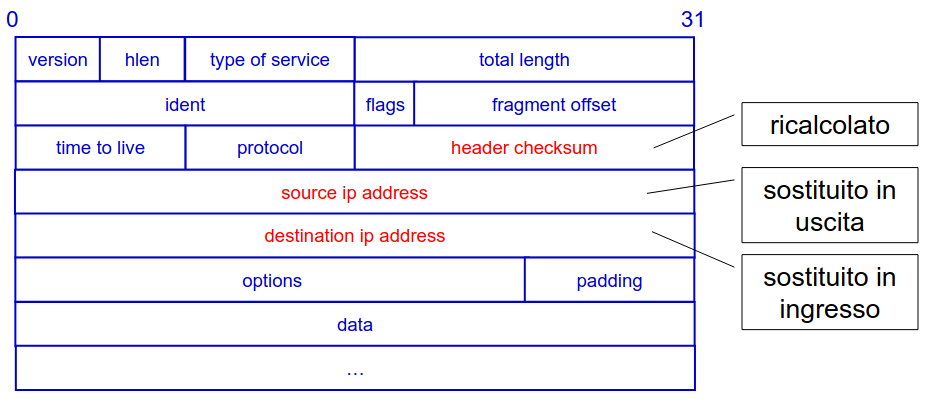
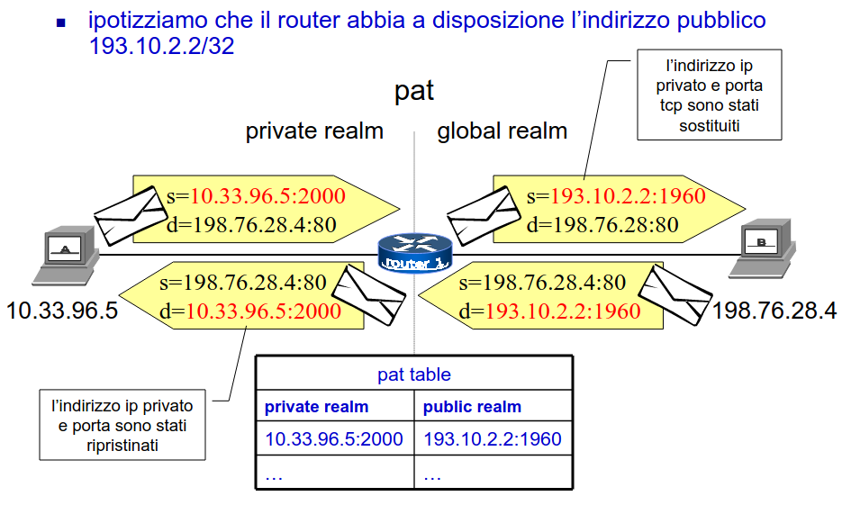
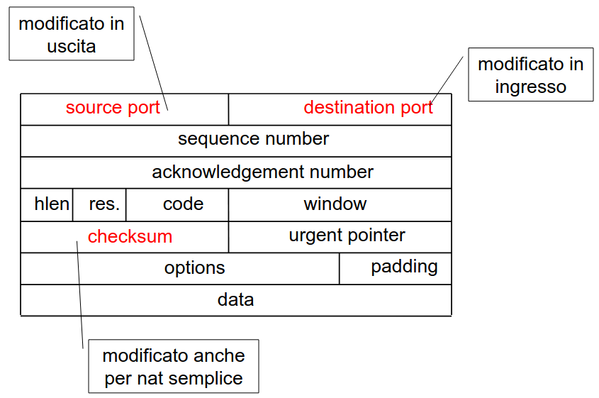

# 17 Gennaio

Argomenti: Classificazione di meccanismi, Host dual stack, Private address allocation, Rete dual stack, Transizione IPv4-IPv6, end-to-end principle, nat, pat, problemi del nat e pat
.: Yes

## Transizione IPv4-IPv6

- Il problema è che i protocolli `IPv4` e `IPv6` sono di livello 3 e sono incompatibili. Affinchè `IPv6` abbia lo stesso successo di `IPv4` bisogna trovare un modo per garantire la compatibilità con dispositivi `IPv4`.
- Il processo di transizione è diviso in 3 fasi:
    - `fase iniziale`: la rete IPv6 si appoggia a quella IPv4
    - `fase intermedia`: i 2 protocolli coesistono con diffusione paragonabile
    - `fase finale`: la rete IPv4 si appoggia all’infrastruttura IPv6

## Classificazione dei meccanismi

Ci sono diversi tipi di meccanismi classificati nel modo seguente:

- basati su `dual-stack`: ci sono host dual stack e rete dual stack
- basati su `tunnel`: sempre meno utilizzati
- basati su `traduttori di protocollo`: per esempio `SIIT` e `NAT64`

## Host dual stack

Questo è il meccanismo più semplice; implementa entrambi i protocolli anche sulla stessa interfaccia.

Le applicazioni `IPv4-only` usano `IPv4`.

Per le applicazioni che supportano `IPv6`, il `DNS` risolve sia indirizzi `IPv4` sia `IPv6` e si decide quale protocollo utilizzare in base all’indirizzo di destinazione, se possibile si utilizza IPv6 in caso contrario IPv4.

Il problema è che non fa nulla per integrare la rete `IPv6` con quella `IPv4`, perchè dal punto di vista di un nodo dual stack le 2 reti sono completamente separate.

Questo è più un meccanismo di compatibilità che di transizione.

## Rete dual stack

La rete dual stack è stata introdotta come soluzione temporanea per permettere una transizione graduale e senza intoppi. In un ambiente dual stack, sia IPv4 che IPv6 sono implementati simultaneamente sulla stessa infrastruttura di rete, consentendo ai dispositivi e ai servizi di comunicare utilizzando entrambi i protocolli.

## Meccanismi basati su traduzioni di protocollo

Questi traduttori di protocollo sono l’unico modo per far comunicare nodi `IPv4` con `IPv6` e viceversa; potrebbe essere un’alternativa ai nodi dual stack perchè quest’ultimi richiedono che ci sia un indirizzo `IPv4` per ogni nodo

Tutto il traffico tradotto passa per il nodo traduttore ma questo può causare problemi di robustezza, sicurezza accountability o traffico

Possono essere implementati in vari modi; a livello di inirizzo IP si usano `SIIT` o `NAT64`. In molti di questi meccanismi gli indirizzi `IPv4` sono rappresentati come particolari indirizzi `IPv6` e vengono instradati verso il traduttore

## Private address allocation

Gli indirizzi privati sono una parte dell’indirizzamento IP che è prevista per reti che non devono collegare internet. Queste reti possono essere configurate come reti IP pur essendo fisicamente non connesse a internet, quindi ciascun indirizzo deve essere univoco solo all’interno della rete privata.

I vantaggi di questa configurazione sono la sicurezza l’ampia disponibilità di indirizzi e risparmio di indirizzi globalmente unici, lo svantaggio però è che si ha un totale isolamento.

Gli indirizzi privati sono i seguenti:

- $10.0.0.0/8$: da $10.0.0.0$ a $10.255.255.255$
- $172.16.0.0/12$: da $172.16.0.0$ a $172.31.255.255$
- $192.168.0.0/16$: da $192.168.0.0$ a $192.168.255.255$s

## Network address translation (nat)

Prima del parlare nel NAT si devono introdurre alcune terminologie:

- `stub domain`: una rete in cui viaggiano pacchetti provenienti o destinati alla rete stessa ma nessun pacchetto in transito
- `address realm`: una rete in cui gli indirizzi identificano univocamente gli host all’interno di essa
- `public address`: indirizzo ottenuto dallo IANA cioè indirizzo del ream internet
- `private address`: indirizzo non ottenuto dallo IANA il cui uso privato è consentito

Il `NAT` è una funzionalità attivabile su un router che ha 2 interfaccie su 2 realm diversi, in pratica ha il compito di tradurre gli indirizzi IP tra i 2 realm modificando il numero IP del pacchetto in transito con un altro numero ip opportuno del realm destinazione. Mittente e ricevente non sono consapevoli di questa traduzione intermedia

Ipotizzando che il router abbia a disposizione i global address $193.10.2.0/24$, nell’immagine viene mostrato il funzionamento di `NAT` modificando i pacchetti in transito tramite la tabella `NAT-table`.

Il vantaggio dell’uso del `NAT` è quello di avere molte macchine che afferiscono ad internet con pochi indirizzi globalmente unici, consente anche una facile migrazione da un provider ad un altro provider.

## Binding degli indirizzi

Il router gestice un `binding` tra gli indirizzi dei 2 realm tramite una tabella di traduzione e ce ne sono di 2 tipi:

- `binding statico`: la tabella viene configurata manualmente
- `binding dinamico`: la tabella viene calcolata dinamicamente e cambia nel tempo a seconda del traffico. Gli indirizzi pubblici vengono assegnati alle macchine che ne hanno bisogno

All’interno di una rete con indirizzamento privato gli apparecchi sono classificati in base a diverse esigenze di connettività:

- `nessun accesso`: apparecchi che non necessitano di essere connessi in internet
- `accesso parziale`: apparecchi che afferiscono ad internet esclusivamente come client
- `accesso completo`: apparecchi che ospitano servizi pubblici

Qui viene mostrato come vengono modificati i campi del pacchetto quando è in transito a un router tra 2 realm

## Port address translation (pat)

Sarebbe una variante di `nat` e consente a molte macchiine con indirizzamento privato di utilizzare lo stesso indirizzo pubblico, per riconoscere le macchine interne vengono usati i numeri delle porte TCP e UDP.  Quando gli indirizzi IP pubblici sono più di uno vieen chiamato anche `multi-pat`.

In questa immagine viene mostrato il funzionamento di `pat` mostrando che sia l’indirizzo che la porta sono sostituiti attraverso i valori del `pat-table`.

Oltre agli indirizzi ip mittente e destinatario vengono modificati anche i campi mostrati in immagine.

## end-to-end principle

I protocolli `NAT` e `PAT` violano l’`end-to-end principle`, secondo tale principio lo stato della connessione tra 2 host deve essere conservato e gestito solamente nei 2 end systems. Questa circorstanza ha effetti sulla connettività `end-to-end` perchè una macchina in una rete privata non può scambiare messaggi con un’altra macchina in una seconda rete privata e per esempio le applicazioni `peer-to-peer` sono ostacolate

## Problemi del nat e del pat

- `protocolli di livello di applicazione`: è compromesso il funzionamento dei protocolli di livello di applicazione che menzionano gli indirizzi ip
- `frammentazione`: la sostituzione degli indirizzi deve essere coerente in ogni frammento
- `dns`: per le macchine interne i nomi interni corrispondono solo agli indirizzi del private realm mentre per i nomi esterni devono corrispondere solo agli indirizzi del public realm. Per le macchine esterne tutti i nomi devono corrispondere ad indirizzi del public realm
- `prestazioni degli apparati di rete`: le prestazioni dei router si deteriorano notevolmente quando le funzionalità di nat o pat sono attive.