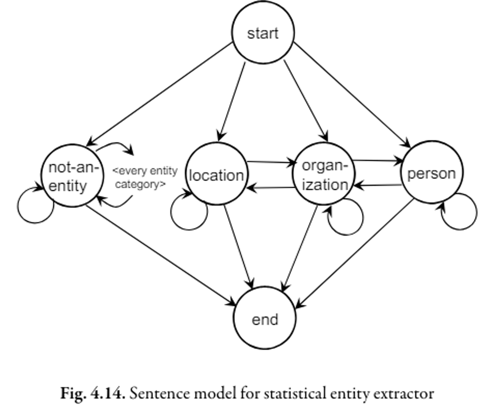

# 18 Aprile

Argomenti: Hidden Markov Model, I18N, Information Extraction, Named Entity Recognition
.: Yes
Description: indexing

## Information Extraction

Gli algoritmi di `information-extraction` permettono di estrarre in maniera automatica strutture dal testo, queste tecniche vengono impiegate per estrarre dal testo alcune entita che concorrono a migliorare il ranking delle pagine

## Named Entity Recognition

Fra questi algoritmi di information extraction, c’è una categoria chiamata `named-entity-recognition`, quello che fa è identificare entità significative per una specifica applicazione.

Durante il funzionamento aggiunge ulteriori tag alle già presenti etichette HTML, un motore di ricerca riconosce i `named-entity` e li utilizza nell’indicizzazione dando un ranking maggiore ai documenti in cui compaiono tali entità. Esistono 2 approcci principali per la realizzazione di `named-entity-recognizer`:

- `NER rule-based`: usano più elenchi di parole e frasi che categorizzano i nomi. Le regole che incorporano modelli possono essere sviluppate manualmente da un esperto di dominio oppure usando un insieme di regole come seed in un processo di machine learning.
- `NER statistici`: usano un modello probabilistico della frequenza delle parole in e intorno a una entity. La probabilità è stimata usando un insieme di dati di training etichettati manualmente. `Hidden-Mark-Model` è un possibile approccio.

## Hidden Markov Model - HMM

Una delle maggiori difficoltà dell’entity extraction è che le parole possono avere molti significati diversi, i modelli che utilizzano il contesto fanno leva sulle caratteristiche generative delle sequenze di parole.

Il modello `HMM` è un modello che studia le probabilità e fa un’analisi in sequenza dei singoli token con un livello di probabilità che li fa spostare da un evento all’altro. In maniera più formale, un modello di `markov` descrive un processo come un insieme di stati con transizioni fra di essi; ogni stato rappresenta un `entity-category` e quando ci si trova in uno specifico stato è possibile generare un output con una certa probabilità

Qui è mostrato un diagramma di stato che rappresenta un modello molto semplice per la generazione di frasi. Ogni categoria di entità è rappresentata da uno stato, e dopo ogni parola il sistema può rimanere in quello stato. A ogni stato che rappresenta una entity category è associata una distribuzione di probabilità delle sequenze di parole per quella categoria, dopodichè si passa a un nuovo stato (con una distribuzione di probabilità di transizione) e si genera un nuovo output.

## Internalizzazione - I18N

I 2/3 del web è in inglese ma questa percentuale continua a diminuire. I motori di ricerca devono affrontare il problema delle lingue multiple come per esempio:

- `monolingual-search`: ricerca su una singola lingua
- `cross-language-search`: esecizione di query su più lingue allo stesso tempo

Ma molti aspetti del motore di ricerca sono indipendenti dalla lingua, come ad esempio la componente di indicizzazione dei modelli di retrieval. Le differenze principali sono:

- `codifica del testo`: conversione a unicode
- `tokenizzazione`: molte lingue non hanno separatori tra parole
- `stemming`: ogni linguaggio richiede uno stemmer specifico
