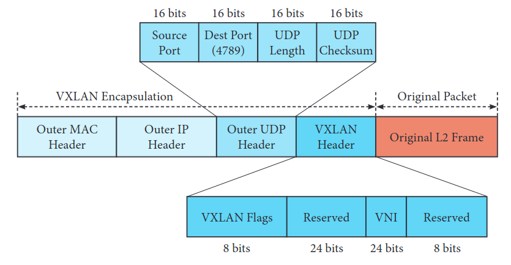
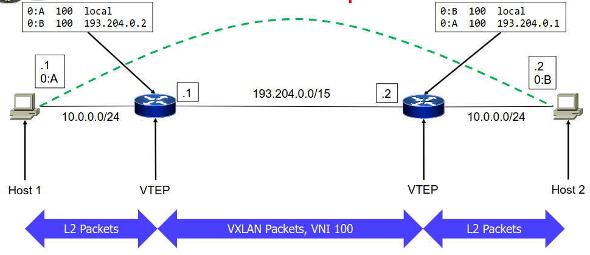
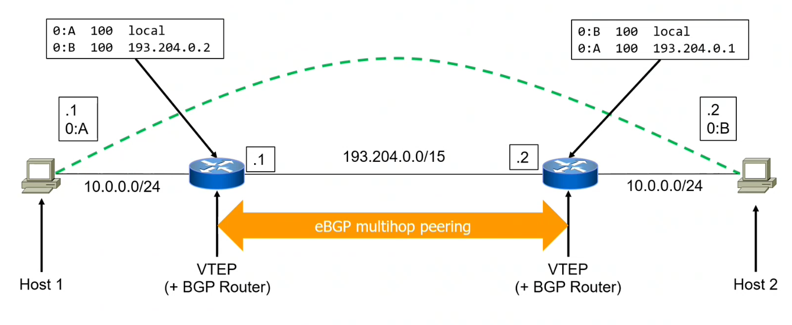

# 18 Dicembre

Argomenti: EVPN-BGP, MAC-to-VTEP table, VXLAN
.: Yes

## Requisiti dell’architettura lato server

Tipicamente i servizi non si mettono direttamente nelle macchine perchè si avrebbe bisogno di un numero di server eccessivo rispetto al numero di servizi, e un altro motivo è che se arrivassero nuovi servizi da realizzare, allora scalare risulterebbe difficile, e se si mettono diversi servizi sullo stesso server non si hanno modi per isolare i flussi di traffico che sono relativi ai diversi servizi.

Quindi l’idea universalmente adottata in questo momento è quella di avere una virtualizzazione che possa consentire di mettere all’interno dei server delle macchine virtuali o dei container per avere un ottimo utilizzo delle risorse; visto che i container e le macchine virtuali sono ragionevolmente isolati all’interno di questi server si ha un livello di isolamento fra servizi che si possono considerare accettabili. A questo punto si ha che per un certo `tenant` diverse macchine virtuali o container allocati nei diversi server in maniera libera e che può cambiare durante il tempo.

## Requisiti dell’orchestrazione

Gli `orchestrator` gestiscono tutto il ciclo di vita di un container o di una macchina virtuale. Grazie a questi software è possibile “spostare” container o VM senza modificare le configurazioni di rete mantenendo la coppia `<MAC,IP>`.

## Requisiti dei tenant

I `tenant` vogliono gestire indipendentemente i propri spazi di indirizzamento, cioè il traffico dei container o VM deve essere isolato tra i `tenant` e tra il traffico del data centers

## Conseguenza di questi 3 requisiti

Dati questi 3 requisiti si capisce che per soddisfare tutti e 3 bisogna usare i `tunnel`, in modo tale che i tenant abbiano la loro rete virtuale chiusa.

---

## VXLAN

L’acronimo `VXLAN` sta per Virtual eXtensible Local Area Network, consente di fare delle reti di overlay all’interno di un datacenter. Incapsula frame di livello 2 all’interno di pacchetti `UDP`. Si usa UDP perchè quando si fa multi-path si fa l’hash del pacchetto, quindi serve almeno usare un protocollo di livello 4.

- `VNI`: (VXLAN Network Identifier) identificatore di uno specifico tunnel VXLAN.
- `VTEP`: (VXLAN Tunnel End Point) concettualmente sarebbe `PE` per `MPLS`, sarebbe un elemento che incapsula e decapsula pacchetti `VXLAN`.

In `VXLAN` si ha un overhead di 50 bytes

Si nota che il source port è random sfruttando appieno la multi-path

## Tabella MAC-to-VTEP

Si sa che il pacchetto arriva dal server alla VTEP, dove viene incapsulato e mandato all’altra VTEP. Non si sà però chi è l’altra `VTEP`, per questo motivo si ha una tabella `MAC-to-VTEP` che unisce 3 cose:

- per prima cosa unisce la `VNI`, quindi il numero che identifica il tenant ma in generale il tunnel specifico in cui va instradato il pacchetto
- come seconda cosa si hanno degli indirizzi `MAC`
- come terza cosa si hanno degli indirizzi `IP`, questi indirizzi IP sono gli indirizzi dei `VTEP`

Per ciascun `VNI` , il `VTEP` mantiene una tabella di coppie `<MAC, IP>`, che associa gli indirizzi MAC e gli IP di destinazione dei VTEP. Esiste la variante nel caso `local` che al posto degli IP sono scritti i local.

Quando una `VTEP` riceve un frame destinato a un indirizzo `MAC` $m$ da una interfaccia locale appartenente a una certa `VNI`, questo controlla se esiste una coppia $<m,i>$ contenente $m$:

- se la coppia esiste il frame viene incapsulato da `VTEP` e manda il pacchetto alla destinazione `VTEP` con indirizzo IP $i$
- se la coppia non esiste allora il frame incapsulato viene mandato agli altri `VTEP` e alle altre porte locali della stessa `VNI`.

In questa immagine viene mostrato il trasporto nella `VXLAN` usando una `VNI` con numero 100

Il problema di questa rappresentazione è il traffico broadcast

Ci sono 2 tipi di broadcast che devono essere gestiti:

- il primo è il traffico diretto agli indirizzi MAC di broadcast
- il secondo è il traffico diretto agli indirizzi MAC che non sono ancora stati conosciuti

In `VXLAN` si usano di base gli `IP-multicast-groups`, in pratica ciascun `VNI` è assegnato a un gruppo multicast IP della rete sottostante e ogni `VTEP` si iscrive a ciascun gruppo dei suoi `VNI`. Lo svantaggio di questa soluzione è che ha una configurazione molto complessa per un data centers; per mitigare il problema si usano tecniche proxy ARP

## EVPN-BGP

Quello che si fa nella realtà è usare `EVPN-BGP` (Ethernet VPN BGP), che utilizza BGP multi-protocol per annunciare gli indirizzi `MAC` dei `VNI` utilizzando i BGP updates.

Una `VTEP` impara automaticamente gli indirizzi `MAC` locali e le annuncia alle altre `VTEP` dello stesso `VNI`.

In questa immagine viene mostrato l’utilizzo di EVPN-BGP per il learning degli indirizzi MAC