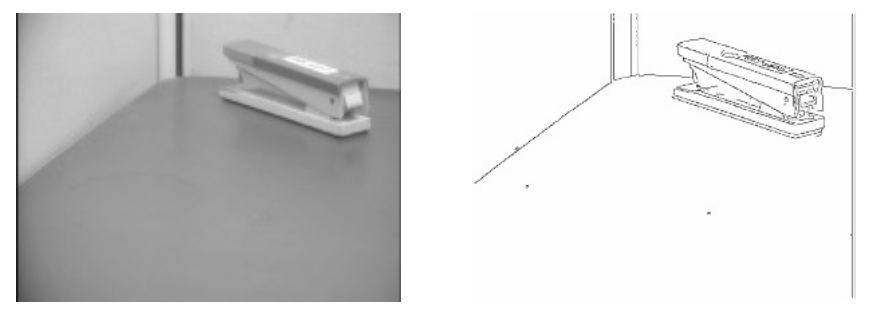
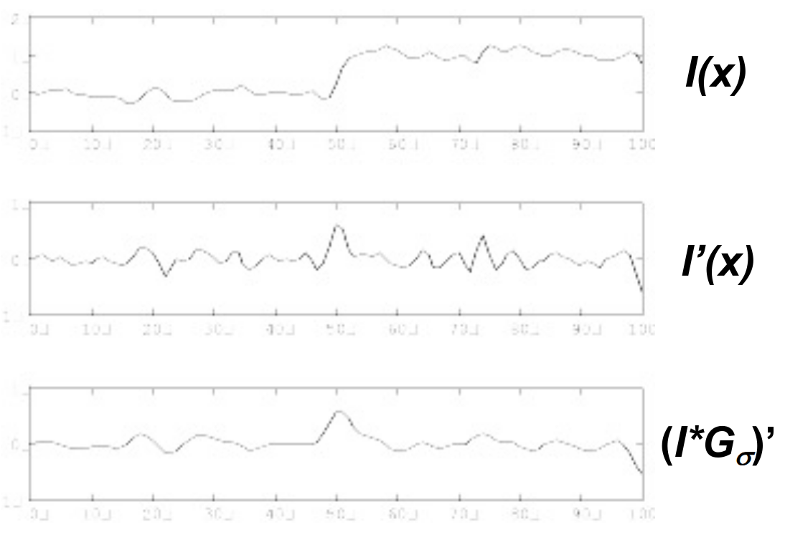
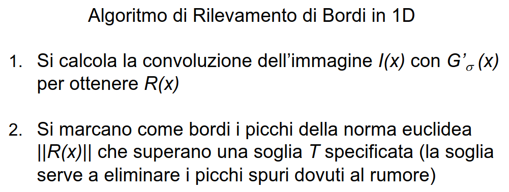
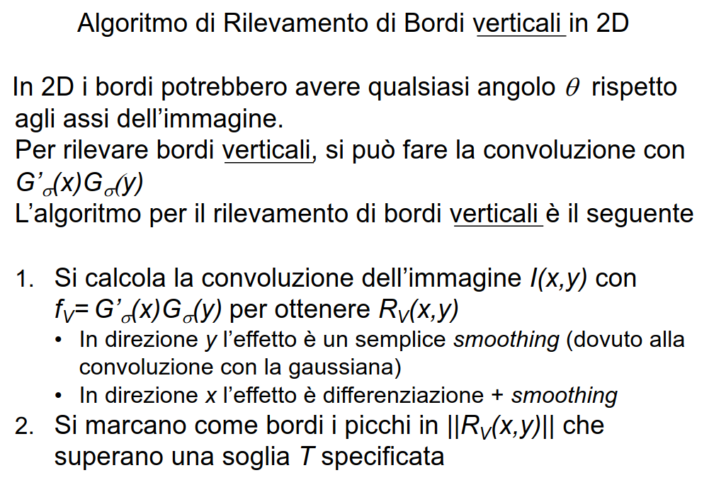

# 18 Gennaio

Argomenti: Edge Detection, Elaborazione delle immagini a basso livello, Formazione delle immagini, Percezione, Smoothing
.: Yes

## Percezione

L’obiettivo della `percezione` è quello di acquisire informazioni rispetto all’ambiente che circonda l’agente, i `sensori` registrano alcuni aspetti dell’ambiente e li danno in input al programma agente

Gli stimoli percettivi possono essere impiegati dall’agente secondo due differenti approcci:

- `basato sul modello`: l’agente ricostruisce un modello del mondo a partire dagli stimoli percettivi
    - dati $S$ che rappresenta lo stimolo,$W$ che rappresenta lo stato del mondo e $f$ è una funzione che ricostruisce lo stato del mondo tramite lo stimolo $W$ come input.
    - Questa funzione $f$ non ha una vera e propria funzione inversa rendendolo un problema complesso, in pratica non è possibile riconoscere tutti gli aspetti del mondo da $S$ perché servono informazioni aggiuntive. Una possibile soluzione è quella di costruire una distribuzione di probabilità sui mondi $P(W)={P(W/S)}\space{P(S)}$. Tuttavia questo approccio resta comunque un problema troppo oneroso dal punto di vista computazionale.
- `estrazione di caratteristiche`: l’agente rileva e impiega poche caratteristiche presenti nell’input percettivo

## Formazione delle immagini

Si devono tenere conto dei seguenti punti:

- `Principio della visione`: gli oggetti che compongono una scena 3D riflettono una luce, creando una immagine 2D
- `Definizione della funzione` $f(W)$: occorre studiare come la luce riflette sugli oggetti (geometria) e come la luce presente nella scena determina la luminosità dei punti sull’immagine (fotometria).
    - Parlando di fotometria si distinguono 2 casi di riflessione della luce:
        - riflessione `speculare`: la luce è riflessa dalla superficie esterna di un oggetto di un angolo di riflessione
        - riflessione `diffusa`: la luce penetra nella superficie di un oggetto è assorbita e riemessa

## Elaborazione delle immagini a basso livello

Visto che nelle immagini a basso livello c’è la presenza di rumore e una grande quantità di dati, esistono alcune  operazioni per risolvere questo problema e sono lo `smoothing` e il `rilevamento dei bordi`.

## Smoothing

Si cerca di predire il valore di un pixel dati quelli che lo circondano. La necessità nasce dal fatto che il valore osservato è diverso da quello reale. Per cancellare il rumore gaussiano si calcola una media pesata per mezzo di un filtro gaussiano.

$$
G_{\sigma}(x,y)=\dfrac{1}{\sqrt{2\pi\sigma^2}}\cdot e^{-\dfrac{(x^2 + y^2)}{2\sigma^2}}
$$

Applicare un filtro gaussiano significa sostituire l’intensità nel punto ($x_0,y_0$) con la somma su tutti i pixel di $I(x,y)\cdot G_{\sigma}(d)$ dove $d$ è la distanza tra $(x_0,y_0)$ e $(x,y)$

## Rilevamento dei bordi

I bordi sono linee dritte o curve che marcano una significativa variazione nella luminosità dell’immagine, in pratica lo scopo è eseguire un’astrazione dell’immagine originale verso una rappresentazione più compatta e astratta. I bordi dell’immagine possono corrispondere a importanti separazioni tra oggetti nella scena.

Per affrontare il problema di `edge detection` si prende per esempio il profilo luminoso in corrispondenza tra il muro e il tavolo e lo si rappresenta come mostrato in $I(x)$, per individuare le variazioni nette all’interno di una funzione è la derivata, ottenendo $I'(x)$ dove in corrispondenza dei picchi si avranno dei bordi. Non tutti i picchi però corrispondono a un bordo, per risolvere si fa smoothing facendo: $(I(x)* G_\sigma)
'$

Oppure sfruttando una delle proprietà della convoluzione $(f*g)'=f*(g)'$, si fa smoothing facendo la convoluzione dell’immagine con la derivata della convoluzione ottimizzando l’operazione

Qui è spiegato l’algoritmo di rilevamento di bordi in una dimensione

Qui è spiegato l’algoritmo di rilevamento di bordi in 2 dimensioni