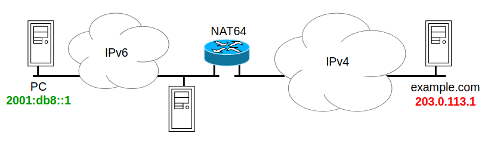
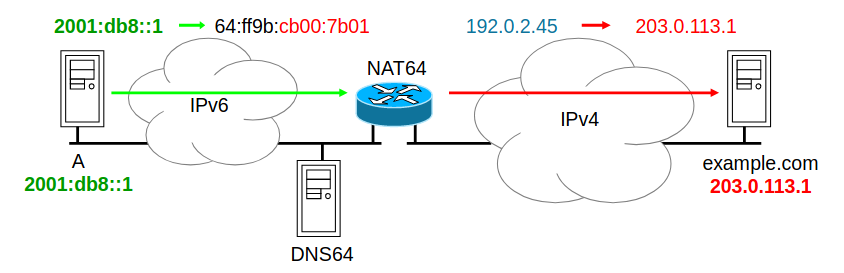
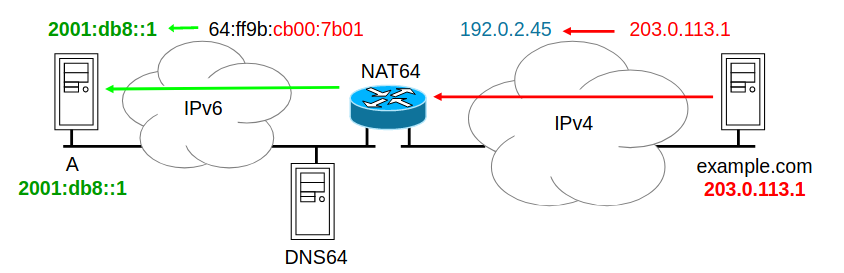

# 18 Gennaio

Argomenti: NAT64, SIIT
.: Yes

## Stateless IP/ICMP translation (SIIT)

Sarebbe un meccanismo generale che permette a nodi `IPv6` di comunicare con nodi `IPv4` attraverso un traduttore. Il funzionamento è elencato nei prossimi 3 punti:

- gli indirizzi IPv4 sono mappati su indirizzi IPv6, cioè le destinazioni IPv4 sono indicate con indirizzi IPv6 attraverso la modalità IPv4-mapped
- il traduttore traduce i pacchetti in transito
- la traduzione effettuata dal traduttore è stateless quindi gli indirizzi sono ricavati direttamente dagli indirizzi IPv6

I vantaggi di usare `SIIT` è che il nodo traduttore non deve mantenere informazioni sullo stato delle connessioni. Si ha la scalabilità perché è possibile utilizzare più nodi traduttori e si ha robustezza cioè in caso di guasto di un traduttore la connessione non viene interrotta

Gli svantaggi nell’usare `SIIT` sono le modifiche richieste nelle implementazioni `IPv6` e richiede di gestire il routing per indirizzi `IPv4 translated` all’interno del site in pratica è difficile gestire la distribuzione in subnet degli indirizzi `IPv4`

## NAT64

Combina le tecniche di `NAT` con `SIIT`. Il protocollo è simile al `NAT-IPv4`:

- il nodo traduttore dispone di un pool di indirizzi `IPv4` che vengono assegnati ai nodi che lo utilizzano
- viene mantenuto lo stato delle associazioni tra gli indirizzi IPv6 e gli indirizzi IPv4 assegnati, garantendo una corretta traduzione delle comunicazioni
- gli indirizzi IPv4 sono rappresentati mediante indirizzi IPv6 aggiungendo ai primi 32 bit dell’indirizzo a un prefisso di 96 bit e viene instradato verso il traduttore, consentendo la corretta traduzione tra i due formati di indirizzi.
- la traduzione dei pacchetti avviene come in SIIT
- per garantire una corretta traduzione è necessario un name server `DNS64` dedicato che svolge un ruolo importante nel processo di risoluzione dei nomi di dominio
- il sistema è progettato per consentire la comunicazione dai client `IPv6` ai server `IPv4` agevolando cosi la transizione tra i 2 standard di indirizzamento.

Il prefisso associato al NAT64 è 64:ff9b::/96 sulla rete IPv6, il pool di indirizzi IPv4 è 192.0.2.0/24. PC è un nodo IPv6-only e vuole connettersi al Web che ha solo un indirizzo IPv4

PC fa una query AAAA al suo name server di default sull’indirizzo IPv6 di example.com. Il ns di default è un ns DNS64; DNS64 riceve un indirizzo IPv4 e restituisce a PC l’indirizzo IPv6 corrispondente

PC si connette a 64:ff9b:cb00:7b01, i pacchetti vengono instradati verso il NAT64 che associa a PC un indirizzo IPv4 temporaneo dal pool (192.0.2.45) e mantiene traccia dell’associazione in una tabella di stato. I pacchetti sono inoltrati verso 203.0.113.1

I pacchetti di risposta verso PC vengono instradati, nella rete IPv4, verso il NAT64, tradotti in IPv6 ed inoltrati a PC.

- PC ha la percezione di essere connesso all’host IPv6 64:ff9b:cb00:7b01 (`mappatura statica`)
- il WS ha la percezione di essere connesso all’host IPv4 192.0.2.0.45 (`mappatura dinamica`)

I vantaggi del NAT64 sono la trasparenza ai nodi che lo utilizzano e la possibilità di accoppiarlo con PAT, usando un solo indirizzo IPv4 per molti client

Gli svantaggi sono gli stessi problemi del NAT IPv4 cioè la fragilità e la incapacità di connessione da estremo a estremo ma questi svantaggi non hanno impedito la diffusione di NAT IPv4 perché molte applicazioni già supportano NAT